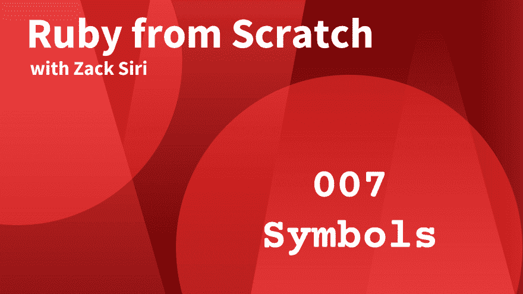

# 红宝石符号

> 原文：<https://dev.to/codemy/ruby-symbols-5e62>

在 ruby 中，符号是不可变的数据结构，在很多情况下它会派上用场。在这一集中，我们也探索了 ruby 的弦和符号[之间的区别。](https://www.codemy.net/posts/rfs-symbols-007/sets/ruby-from-scratch)

这个视频是 Codemy.net[Ruby 从零开始](https://www.codemy.net/sets/ruby-from-scratch)系列的一部分