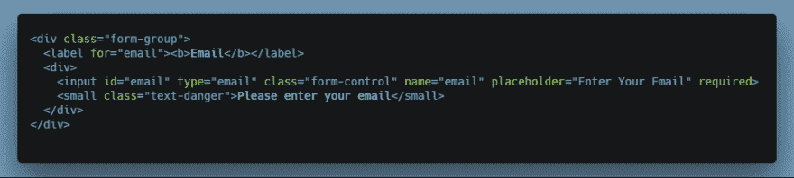
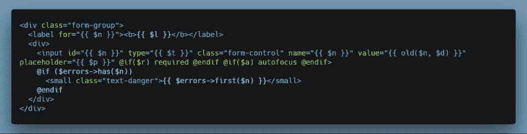
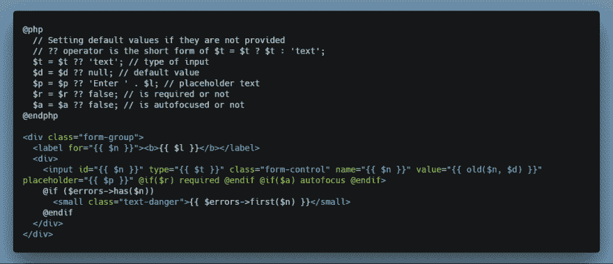
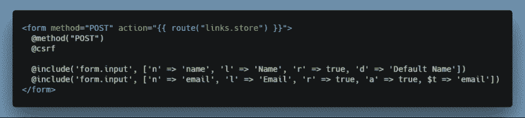

# 在 Laravel 中生成表单的简单解决方案

> 原文：<https://dev.to/adi/simple-solution-for-generating-forms-in-laravel-58f0>

你好。我想和你分享我在 Laravel 中快速生成表单元素的解决方案。不使用任何外部库或包，只使用简单的刀片指令。

我并不热衷于使用 html 表单，它们是混乱而复杂的东西。所以我通常会使用像`laravelcollective/html`这样的包来生成表单。因为我的需求很基本，我想要一个基本的解决方案，所以我做了自己的表单包，算是吧。我会一路上解释。我们走吧。

> 查看我的副业项目[LaravelCollections.com](https://laravelcollections.com/?utm_campaign=form-article)——这是一个面向 Laravel 开发者的不断增长的优秀资源集合。

### 解

你可能知道你可以在你的刀片布局文件中`include`部分。所以，我做了一堆表单组件，可以定制(在一定程度上)并包含在你的 Laravel 应用程序的任何地方。让我们回顾一下我做了什么。

首先，这是一个默认的引导表单元素。
[T3】](https://res.cloudinary.com/practicaldev/image/fetch/s--RqoymZf8--/c_limit%2Cf_auto%2Cfl_progressive%2Cq_auto%2Cw_880/https://imgur.com/K0MYH6Z.png)

我将这段代码复制到文件夹`resources/views/form`下名为`input.blade.php`的文件中。现在，我可以使用`@include('form.input')`将这个输入文件包含在我的表单中，但是如果我们不能定制一些属性，它将没有任何用处。因此，为了允许修改属性，我在文件中引入了变量。

 
如你所见，我利用变量来填充各种属性。所以，如果我设置`$l`，它将是我输入的标签。我们可以使用`@include('form.input', ['$l' => 'Email', $n => 'email', $p => 'Enter you email' ....])`将额外的数据传递给这个部分。在 partial 中使用变量时有一个问题，它们都必须被设置，否则 Laravel 会抛出一个错误。

我们需要能够设置默认值，以防它们不是从父视图中设置的。所以为了做到这一点，我在 Blade 中使用了`@php`指令，这样我们就可以检查变量值，并在它们为空时设置它们。

你可能已经注意到我省略了`$n`和`$l`，因为它们很重要，我们需要知道如果它们没有被设置，表单不会在没有设置的情况下提交。

下面是一个我如何在表单中使用这个组件的例子。
[T3】](https://res.cloudinary.com/practicaldev/image/fetch/s--xehi909T--/c_limit%2Cf_auto%2Cfl_progressive%2Cq_auto%2Cw_880/https://imgur.com/nF0lW3R.png)

使用相同的技术，我创建了多种类型的输入元素，如`select`、`textarea`、`checkbox`、`submit`，甚至为 jQuery Select2 插件创建了一个。

### 结论

我希望这个解决方案对您的开发有所帮助。我用我使用的不同组件创建了一个 [Github Gist](https://gist.github.com/skadimoolam/f2afa4a2a036ce62e0280be056d164de) ,如果你感兴趣，可以看看。

如果您有任何疑问或问题，或者有任何改进，请告诉我。谢谢你。

Adi - [最简单的网络](https://simplestweb.in/?utm_campaign=form-article)