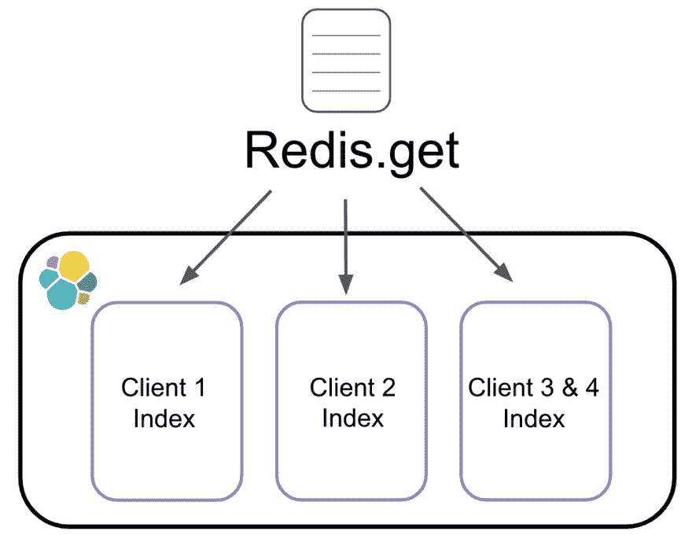
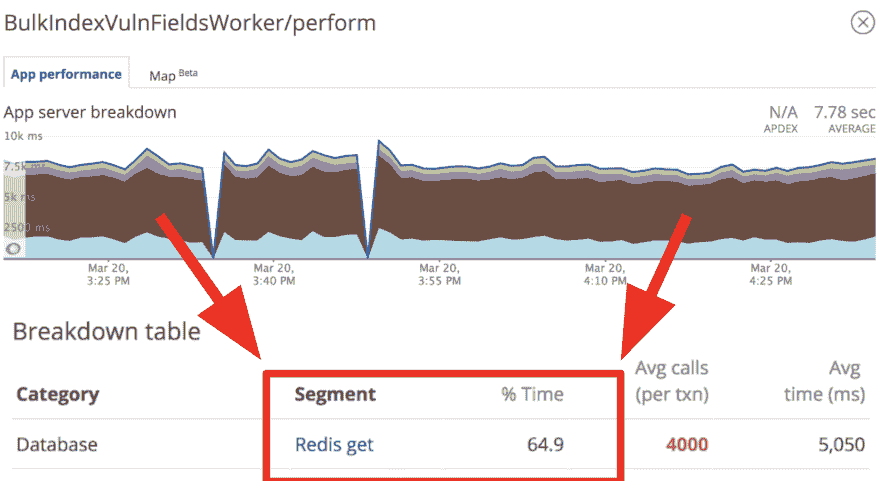
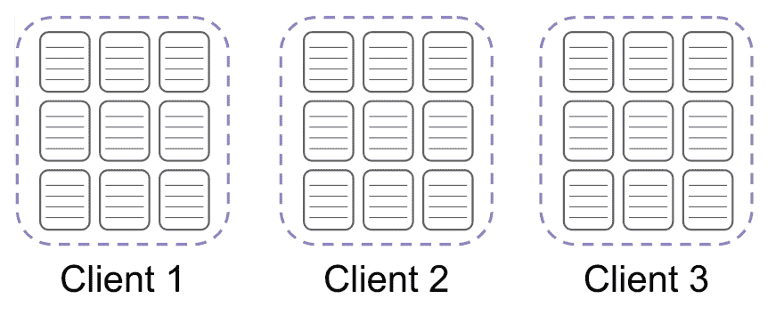

# 请负责任地转发

> 原文 https://dev.to/molly/please-redis-responsibly-3gn

Redis 是关于速度的。但是仅仅因为 Redis 很快，并不意味着当你向它发出请求时，它仍然不占用时间和资源。如果不负责地提出这些请求，它们会累积起来并影响应用程序的性能。这是一个关于肯纳如何艰难地吸取教训的故事。

## 隐藏在显眼的地方

Kenna 的数据库中最大的表格之一是漏洞。我们目前有将近 40 亿人。一个[漏洞](https://en.wikipedia.org/wiki/Vulnerability_(computing))是一个弱点，攻击者可以利用它来获得对计算机系统的未授权访问。基本上，它们是公司被黑的途径。

我们最初将所有这些漏洞存储在 MySQL 中，这是我们的事实来源。从那里，我们将漏洞数据索引到 [Elasticsearch](https://www.elastic.co/products/elasticsearch) 中。

[](https://res.cloudinary.com/practicaldev/image/fetch/s--MVeoIeaA--/c_limit%2Cf_auto%2Cfl_progressive%2Cq_auto%2Cw_880/https://thepracticaldev.s3.amazonaws.com/i/9xmvs6beft38mb4z6pik.png)

当我们在 Elasticsearch 中索引所有这些漏洞时，我们必须向 Redis 发出请求，以便知道将它们放在哪里。在 Elasticsearch 中，漏洞是由客户端组织的。为了找出漏洞属于哪里，我们必须向 Redis 发出 GET 请求，以获取该漏洞的索引名。

[](https://res.cloudinary.com/practicaldev/image/fetch/s--Syg1J1T9--/c_limit%2Cf_auto%2Cfl_progressive%2Cq_auto%2Cw_880/https://thepracticaldev.s3.amazonaws.com/i/2m45dko1x98am61ujaja.png)

当准备索引漏洞时，我们收集所有漏洞散列。然后，在将它们发送到 Elasticsearch 之前，我们要做的最后一件事是让 Redis GET 请求检索每个漏洞基于其客户端的索引名称。

```
indexing_hashes = vulnerability_hashes.map do |hash|
   {
      :_index => Redis.get("elasticsearch_index_#{hash[:client_id]}")
      :_type => hash[:doc_type],
      :_id => hash[:id],
      :data => hash[:data]
   }
end 
```

Enter fullscreen mode Exit fullscreen mode

这些漏洞散列按客户端分组，因此 GET 请求

```
Redis.get("elasticsearch_index_#{hash[:client_id]}") 
```

Enter fullscreen mode Exit fullscreen mode

经常一遍又一遍地返回相同的信息。所有这些简单的 GET 请求都是盲目的快。它们运行大约需要一毫秒。

```
(pry)> index_name = Redis.get("elasticsearch_index_#{client_id}")
DEBUG -- : [Redis] command=GET args="elasticsearch_index_1234"
DEBUG -- : [Redis] call_time=1.07 ms 
```

Enter fullscreen mode Exit fullscreen mode

但是不管你的外部请求有多快，如果你做了大量的请求，那将会花费你很长的时间。因为我们发出了如此多的简单 GET 请求，所以它们负责了我们索引作业大约 65%的运行时间。您可以在下表中看到这一统计数据，它在图表中用棕色表示。

[](https://res.cloudinary.com/practicaldev/image/fetch/s--o6I8feOU--/c_limit%2Cf_auto%2Cfl_progressive%2Cq_auto%2Cw_880/https://thepracticaldev.s3.amazonaws.com/i/0f5yykg5ni6kdgyd0pxy.png)

消除这些请求的解决方案是本地 Ruby 缓存！我们最终使用 Ruby hash 来缓存每个客户端的 Elasticsearch 索引名。

```
client_indexes = Hash.new do |h, client_id| 
   h[client_id] = Redis.get("elasticsearch_index_#{client_id}")
end 
```

Enter fullscreen mode Exit fullscreen mode

然后，当遍历所有要发送给 Elasticsearch 的漏洞散列时，我们将简单地引用这个客户机索引散列，而不是点击 Redis 来查找每个漏洞。

```
indexing_hashes = vuln_hashes.map do |hash|
   {
      :_index => client_indexes[hash[:client_id]]
      :_type => hash[:doc_type],
      :_id => hash[:id],
      :data => hash[:data]
   }
end 
```

Enter fullscreen mode Exit fullscreen mode

这意味着我们只需对每个客户端访问 Redis 一次，而不是对每个漏洞访问一次。

## 胜负

假设我们有 3 批需要索引的漏洞。

[](https://res.cloudinary.com/practicaldev/image/fetch/s--OdLrpv94--/c_limit%2Cf_auto%2Cfl_progressive%2Cq_auto%2Cw_880/https://thepracticaldev.s3.amazonaws.com/i/1rqvxrrd4mgk2al7zc21.png)

在这三个批次的情况下，无论我们在每个批次中有多少漏洞，我们将只需要向 Redis 发出总共 3 个请求。这些批次通常每个包含 1k 个漏洞，因此这个变化**将我们对 Redis 的命中减少了 1000 倍，这导致作业速度提高了 65%。**

即使 Redis 很快，使用本地缓存总是会更快！从你的角度来看，从本地缓存中获取一条信息就像从芝加哥市区开车到奥黑尔机场去获取它一样。

[](https://res.cloudinary.com/practicaldev/image/fetch/s--TG5zXTEr--/c_limit%2Cf_auto%2Cfl_progressive%2Cq_auto%2Cw_880/https://thepracticaldev.s3.amazonaws.com/i/2wnnvjg5a7gxygfazuzp.png)

从 Redis 得到同样的信息，就像从芝加哥乘飞机一路飞到波士顿去得到它。

[](https://res.cloudinary.com/practicaldev/image/fetch/s--fbp7WVxW--/c_limit%2Cf_auto%2Cfl_progressive%2Cq_auto%2Cw_880/https://thepracticaldev.s3.amazonaws.com/i/qehjpbw2y99vevp3wwe5.png)

Redis 速度如此之快，以至于当你和它对话时，很容易忘记你实际上是在发出一个外部请求。这些外部请求累积起来会影响应用程序的性能。不要把 Redis 想当然。确保你对它提出的每一个要求都是绝对必要的。

*如果你对使用 Ruby checkout 防止数据库命中的其他方法感兴趣，我的[缓存为王](http://confreaks.tv/videos/rubyconf2018-cache-is-king-get-the-most-bang-for-your-buck-from-ruby)来自 RubyConf 的演讲启发了这篇文章。*