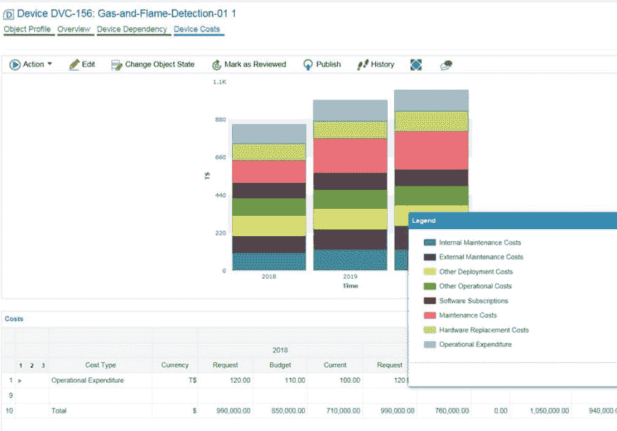
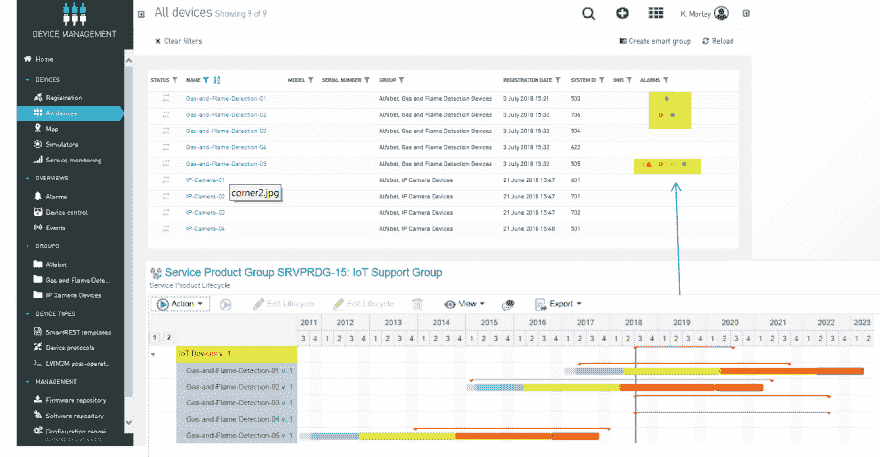

# 物联网产品组合生命周期管理

> 原文：<https://dev.to/techcommunity/iot-portfolio-lifecycle-management-1goc>

# 如何在运营中实现端到端的可见性&信息技术环境

**您如何适应部署后设备的变化，例如连接修改、功能增强和技术升级？如何通知您设备过时、定期维护和必要的维修？物联网产品组合生命周期管理提供跨运营技术&信息技术环境的完整端到端可见性，以更好地了解完整的端到端物联网环境。**

*首席架构师 Karl Morley 和软件公司顾问 Bob Hall*

## **物联网连接设备比人还多！**

Gartner 估计，到 2020 年，物联网设备将从 2016 年的 64 亿台增长到 208 亿台。随着物联网在不久的将来不断扩大，这一趋势有望进一步发展*。在大多数现有设备资产中，很难适应部署后设备的变化，例如连接修改、功能增强、技术升级等。

## **物联网组合生命周期管理**

想象一下，你是一家零售商，已经在你的所有地点为灭火器和烟雾传感器等设备建立了物联网解决方案。被告知设备过时、定期维护和必要的维修不是很好吗？您如何可视化物联网设备的软件依赖性，例如，应用程序“SmokerWatcher”部署在哪些设备上，它们在哪里？如果应用程序被弃用，设备会怎么样？您如何知道设备需要更新应用程序的新版本？

物联网产品组合生命周期管理解决方案的想法诞生于 Software AG 的 WIRED 2018 创新竞赛期间。这一独特的解决方案结合了 Cumulocity 和 Alfabet 的优势，提供了跨 OT 和 IT 环境的完整可见性。Cumulocity 提供物联网设备的操作视图，而 Alfabet 添加了连接的应用程序、项目、设备服务合同、设备供应商和建筑位置等数据(Cumulocity 中仅提供 GPS 坐标)。借助 Alfabet，您将能够为您的每台物联网设备创建一个包含丰富信息的**数字双胞胎**。Alfabet 功能还使您能够运行成本分析报告，例如维护成本、软件订阅、折旧等。

_ **图 1:** 成本分析 _

Alfabet 还可让您对设备进行分组(按组织/工厂)并运行层级报告，例如按服务/供应商联系人。

至于 Cumulocity: REST 集成将为定制的选项卡(在我们的示例服务合同中，是供应商联系和建筑位置)提供来自 Alfabet 的信息，并为各个设备显示警报。

 

_ **图 2:** 基于设备的 Alfabet 生命周期管理在 Cumulocity 中引发的警报 _

_ **图 3:**Cumulocity 中新的自定义选项卡和警报 _

## **将 IT 治理添加到物联网解决方案中**

物联网产品组合生命周期管理结合了物联网设备的运营管理和生命周期管理。它通过管理这些状态之间的转换，让您更好地了解现有和未来的设备基础架构。通过 Alfabet 将时间维度引入到 Cumulocity 中，将有助于设备过时管理、部署后的定期维护和维修。

Software AG 可以为您提供具有预定义结果的配置/加速器包。要了解更多信息，请发送电子邮件至[consulting-sales@softwareag.com](//mailto:consulting-sales@softwareag.com)