# 智能裁剪如何帮助您在每台设备上提供完美的响应图像

> 原文：<https://dev.to/rnanwani/how-smart-crop-can-help-you-deliver-perfect-responsive-images-on-each-device-25p4>

图片是所有网站和应用程序的重要组成部分。无论是电子商务商店、旅游网站还是内容网站，典型的网站都会有数十万张图片。如果你的网站上有用户生成的内容，这个数字会高得多。网站上有如此大量的图像，为了在每个用户的设备上获得[完美的响应图像体验](http://imagekit.io/blog/how-to-deliver-responsive-images-across-multiple-devices/)，图像也应该根据请求它们的设备而改变。这意味着不是使用 CSS 调整图像的大小，而是加载到移动设备上的图像实际上应该比加载到桌面设备上的图像尺寸小。

## 为什么常规裁剪会失败？

在这种情况下，必须为不同的设备和不同的占位符调整各种图像的大小，图像中的裁剪是不可避免的。图像采用的默认裁剪策略是中心裁剪——保留图像的中心，从边缘裁剪掉。虽然这种策略在很多情况下都很有效，但当主体不在图像的中心时，它可能会失败。以下是一些由于中心裁剪导致缩略图质量差的例子——

| 原始图像(缩小) | 图像缩略图 150 像素 x 200px 像素 |
| --- | --- |
| 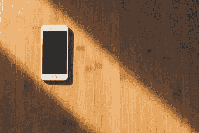 | 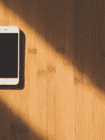 |
|  |  |
| 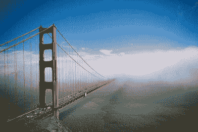 | 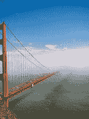 |
| 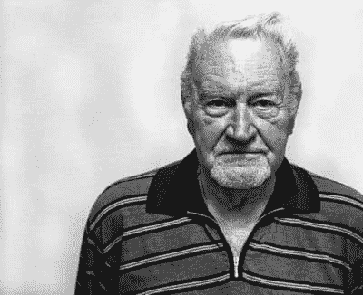 | 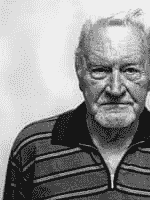 |

在你的网站上，这样的缩略图可能不会引起注意，但并不是所有的用户都关心它。但是，如果你是那些希望向你的用户提供完美体验的公司之一，即使它是一个产品的缩略图，你也不会希望向你的用户显示这种未经适当裁剪的缩略图。

那有什么解决办法呢？我们如何确保在创建缩略图时正确地裁剪图像？

## 进入 ImageKit 的智能裁剪

智能裁剪是一种所有 ImageKit 用户都可以使用的内容感知裁剪方法，它分析图像内容，并试图确保图像最重要的部分始终位于最终缩略图的中心。

让我们看看它是如何工作的图像中心作物失败。

| 原始图像(缩小) | 中间裁剪的图像缩略图 150 像素 x 200px 像素 | 智能裁剪的图像缩略图 150 像素 x 200px 像素 |
| --- | --- | --- |
|  |  | 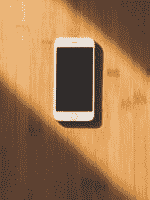 |
|  |  |  |
|  |  | 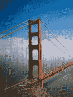 |
|  |  | 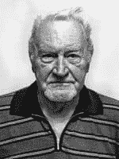 |

在每一种情况下，聪明的作物都能得到图像中心最重要的部分。

## 如何在图片网址中启用智能裁剪？

嗯，真的很简单。除了高度和宽度，您还需要指定用于裁剪的`focus`模式，并将其设置为`auto`。这是通过在 URL 的转换字符串中使用`fo-auto`参数来完成的。例如，

```
https://ik.imagekit.io/demo/img/tr:w-150,h-200,fo-auto/test_image.jpg 
```

您可以[点击](https://help.imagekit.io/start-delivering-resized-and-optimized-images/resize-crop-and-responsive-images/crop-crop-modes-and-focus)在 ImageKit 中了解更多关于此对焦参数的信息。

## 智能作物的实际应用

现在我们已经看到了 ImageKit 是如何工作的，让我们看看如何在您的网站上使用它。

**1。为电子商务网站**

*创建完美的产品缩略图*

一个产品需要显示在你的网站或应用程序的多个页面上——列表页面、产品详情页面、图片转盘中的小缩略图等。使用 smart crop，您可以确保每个产品缩略图都是完美的，并以应有的方式展示您的产品。

以下是 it smart crop 如何帮助您的电子商务商店。我们在这里使用缩小版的图像进行展示，但它确实展示了智能作物的强大功能。

| 原象 |
| --- |
| 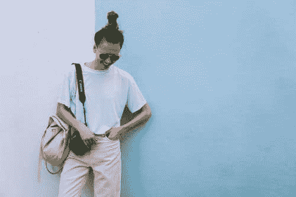 |

| **无智能裁剪** |
| --- |

| **手机缩略图**200 像素 x 200px 像素 | **桌面列表页面** 350px x 300px | **桌面产品传送带**400 像素 x 600px 像素(缩放至 60%) |
| --- | --- | --- |
| 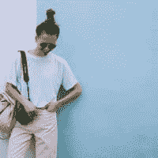 | 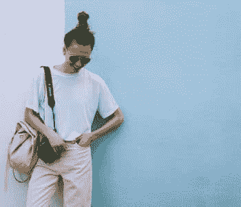 |  |

| **使用智能裁剪** |
| --- |

| **手机缩略图**200 像素 x 200px 像素 | **桌面列表页面** 350px x 300px | **桌面产品传送带**400 像素 x 600px 像素(缩放至 60%) |
| --- | --- | --- |
| 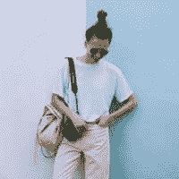 | 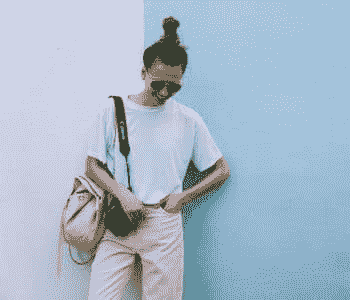 | 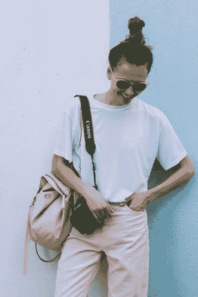 |

**2。旅游&内容网站和用户生成的图片**

*获取缩略图中最重要的区域*

ImageKit 的智能裁剪可以自动确定一幅图像中最重要的部分，无论是纪念碑还是风景还是汽车，并将其保存在最终的缩略图中。

以下是智能裁剪在不同类型图像中的应用示例——

| 原象 |
| --- |

|  |  |
| --- | --- |

| **无智能裁剪** |
| --- |

| **手机缩略图**200 像素 x 200px 像素 | **桌面封面图像**800 像素 x 300px 像素(缩放至 60%) |
| --- | --- |
|  |  |

| **使用智能裁剪** |
| --- |

| **手机缩略图**200 像素 x 200px 像素 | **桌面封面图像**800 像素 x 300px 像素(缩放至 60%) |
| --- | --- |
|  |  |

## 使用智能裁剪的人脸缩略图

到目前为止，我们已经看到了智能裁剪如何将主体带到图像的中心。但是还有更多。

智能裁剪有另一种**人脸裁剪模式**，它从图像中找出人脸并提取出来创建缩略图。这将有助于您根据用户的照片创建个人资料图片。

这里有几个面部裁剪模式的例子

| 原象 | 常规智能裁剪图像 | 人脸裁剪图像 |
| --- | --- | --- |
| 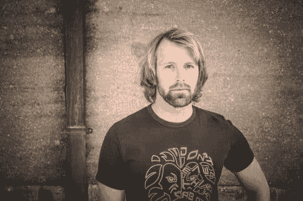 | 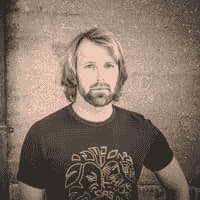 | 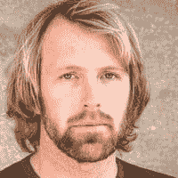 |
|  | 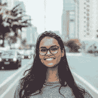 | 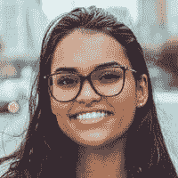 |
| 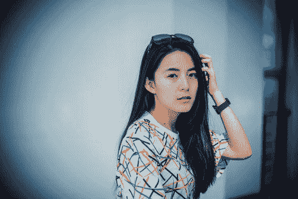 |  |  |

## 如何为你的图片获取人脸裁剪模式？

同样，像 ImageKit 中的其他转换一样，这个转换也非常简单。您需要在图像 URL 中将参数`focus`的值设置为`face`。这是通过在 URL 的转换字符串中使用`fo-face`参数来完成的。例如

```
https://ik.imagekit.io/demo/img/tr:w-200,h-200,fo-face/test_image.jpg 
```

## 把这一切与其他变换放在一起

除了上面演示的例子之外，您可以将智能裁剪与 ImageKit 中的其他转换结合起来，以创建真正酷的用户界面。

比方说，就像脸书一样，你想创建一个用户的个人资料页面，包含一张用户个人资料图片和一张封面照片。让我们把这两幅图像看成是一样的。

|  |  |
| --- | --- |

随着智能裁剪设置为面裁剪模式和半径转换，我们可以得到一个用户的圆形轮廓图片。

[T4】](https://res.cloudinary.com/practicaldev/image/fetch/s--y8-A1qJl--/c_limit%2Cf_auto%2Cfl_progressive%2Cq_auto%2Cw_880/https://ik.imagekit.io/demo/img/smart_crop_blog/test_image_9_By_lQN-WE.jpeg%3Ftr%3Dw-200%2Ch-200%2Cfo-face:r-max)

然后，我们可以使用常规的智能裁剪和模糊转换，根据桌面和移动设备所需的大小来调整封面照片的大小。

[T4】](https://res.cloudinary.com/practicaldev/image/fetch/s--xOgLizsw--/c_limit%2Cf_auto%2Cfl_progressive%2Cq_auto%2Cw_880/https://ik.imagekit.io/demo/img/smart_crop_blog/test_image_7_Hyi1-V-b4.jpeg%3Ftr%3Dw-400%2Ch-150%2Cfo-auto%2Cbl-5)

使用 HTML 和 CSS(或在应用程序中)结合这两张图片，这是最终结果在不同设备上的样子

|  |  |
| --- | --- |

## 结论

对您的图像使用智能裁剪只需要对您的图像 URL 进行很小的更改，但它可以帮助您在各种设备上实现完美的图像体验。只需为一般智能裁剪添加 fo-auto，为智能裁剪的面裁剪模式添加 fo-face 即可。如果你有很多用户生成的内容，或者照片中的主体偏离中心，这就特别有用。

那么，你还在等什么？尝试一下您的图像，开始为您的用户提供更好的体验。