# 2019 年 15 个被低估的 VSCode 主题🤷🏻‍♀️

> 原文：<https://dev.to/xenoxdev/15-underrated-vscode-themes-for-a-change-in-2019---122e>

我们都尝试过一些著名的 VSCode 主题，但是下面列出的又是什么呢？今年，让我们也尝试一下。

那我们走吧🏃🏻‍♂️

### 1。松弛主题

[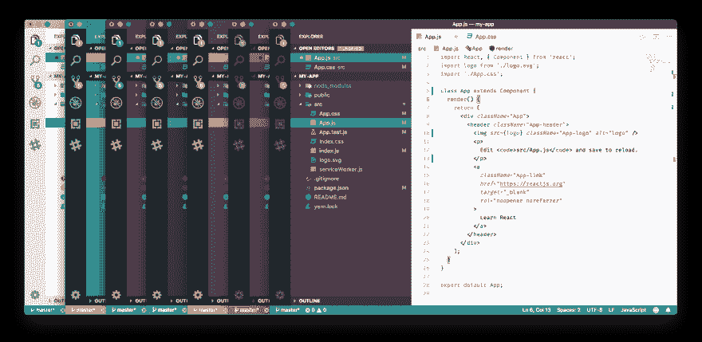](https://res.cloudinary.com/practicaldev/image/fetch/s--9ZkWOWR4--/c_limit%2Cf_auto%2Cfl_progressive%2Cq_auto%2Cw_880/https://raw.githubusercontent.com/slack-theme/visual-studio-code/master/assets/screenshot.png)

👍🏻**装:***9190*
🔗**链接:** *[松弛主题](https://marketplace.visualstudio.com/items?itemName=felipe-mendes.slack-theme)*
👨🏻‍💻**作者**:*[feli pemendes](https://github.com/felipemendes)*

### 2。地平线主题

[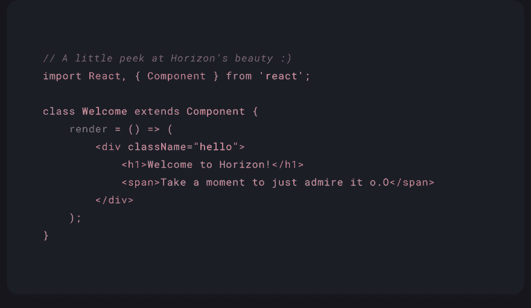](https://res.cloudinary.com/practicaldev/image/fetch/s--COqvddyO--/c_limit%2Cf_auto%2Cfl_progressive%2Cq_auto%2Cw_880/https://i.imgur.com/y0gi1ez.png)

👍🏻**安装:***19731*
🔗**链接:** *[地平线主题](https://marketplace.visualstudio.com/items?itemName=jolaleye.horizon-theme-vscode)*
👨🏻‍💻**作者**:*[jola leye](https://github.com/jolaleye)*

### 3。仙女座主题

👍🏻**装:** *20，160*
🔗**链接:** *[仙女座主题](https://marketplace.visualstudio.com/items?itemName=EliverLara.andromeda)*
👨🏻‍💻**作者**:*[EliverLara](https://github.com/EliverLara)*

### 4。升级主题

[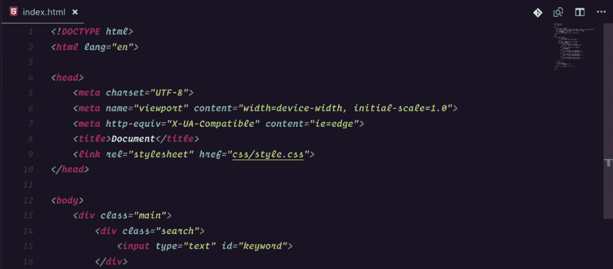](https://res.cloudinary.com/practicaldev/image/fetch/s--pnlBY1XW--/c_limit%2Cf_auto%2Cfl_progressive%2Cq_auto%2Cw_880/https://i.imgur.com/5ykeamw.png)

👍🏻**安装:***6922*
🔗**链接:** *[升一级](https://marketplace.visualstudio.com/items?itemName=leveluptutorials.theme-levelup)*
👨🏻‍💻**作者** : *[级别上升者](https://github.com/leveluptutorials)*

### 5。赛博朋克主题

[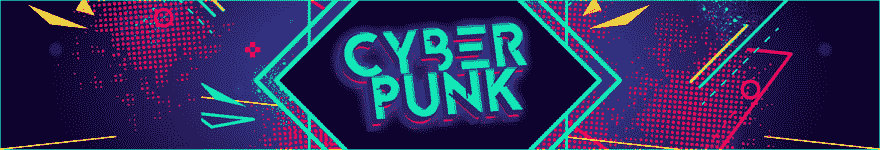](https://res.cloudinary.com/practicaldev/image/fetch/s--exsdlwR9--/c_limit%2Cf_auto%2Cfl_progressive%2Cq_auto%2Cw_880/https://github.com/max-SS/cyberpunk/raw/master/assets/banner.png%3Fraw%3Dtrue)
[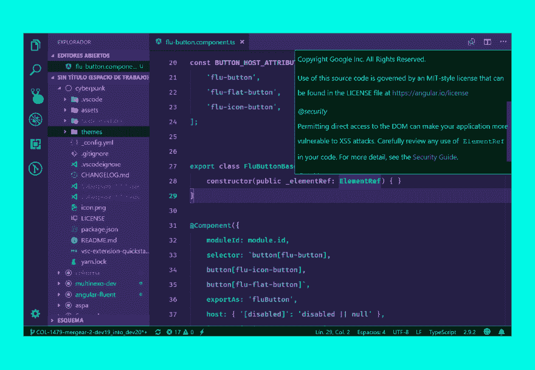T6】](https://res.cloudinary.com/practicaldev/image/fetch/s--uVCy97GE--/c_limit%2Cf_auto%2Cfl_progressive%2Cq_auto%2Cw_880/https://github.com/max-SS/cyberpunk/raw/master/assets/preview.png%3Fraw%3Dtrue)

👍🏻**安装:***5423*
🔗**链接:** *[赛博朋克](https://marketplace.visualstudio.com/items?itemName=max-SS.cyberpunk)*
👨🏻‍💻**作者** : *[max-SS](https://marketplace.visualstudio.com/publishers/max-SS)*

### 6。场灯主题

[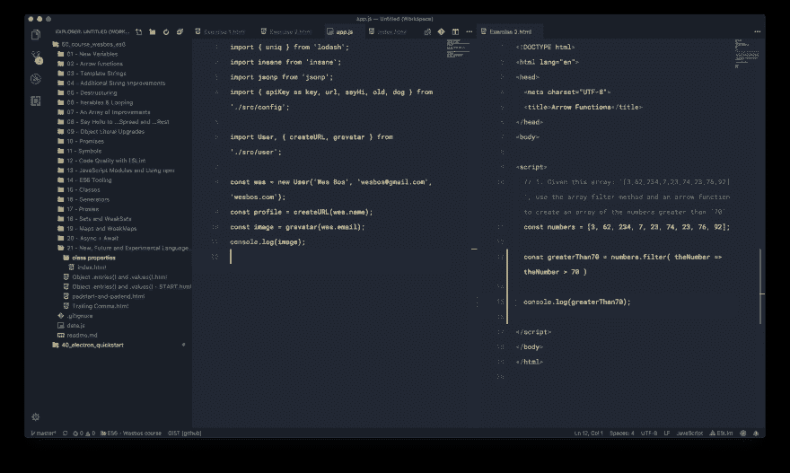](https://res.cloudinary.com/practicaldev/image/fetch/s--5rZ2tFT_--/c_limit%2Cf_auto%2Cfl_progressive%2Cq_auto%2Cw_880/https://github.com/sveggiani/vscode-field-lights/raw/master/assets/screenshot.png)
[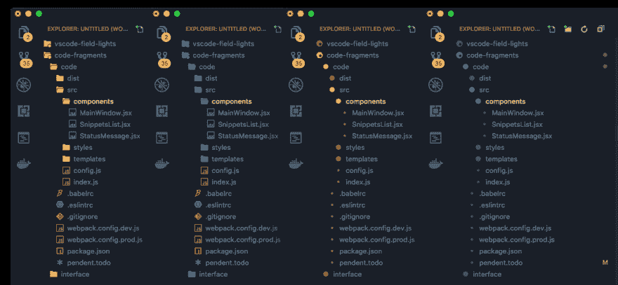T6】](https://res.cloudinary.com/practicaldev/image/fetch/s--V7F5zuCd--/c_limit%2Cf_auto%2Cfl_progressive%2Cq_auto%2Cw_880/https://github.com/sveggiani/vscode-field-lights/raw/master/assets/screenshot_3.png)

👍🏻**安装:***5424*
🔗**链接:** *[场灯](https://marketplace.visualstudio.com/items?itemName=sveggiani.vscode-field-lights)*
👨🏻‍💻**作者** : *[斯维贾尼](https://github.com/sveggiani)*

### 7。macOS 经典

[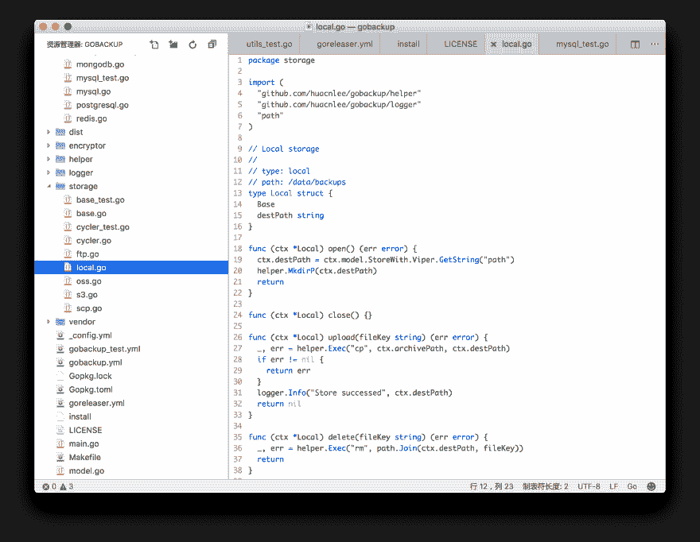](https://res.cloudinary.com/practicaldev/image/fetch/s--WjfOlTts--/c_limit%2Cf_auto%2Cfl_progressive%2Cq_auto%2Cw_880/https://user-images.githubusercontent.com/5518/32710127-cc6a7450-c870-11e7-8020-98a772ac71e1.png)

👍🏻**安装:***5088*
🔗**链接:** *[macOS 经典](https://marketplace.visualstudio.com/items?itemName=huacnlee.theme-macos-classic)*
👨🏻‍💻**作者**:*[huacnlee](https://github.com/huacnlee)*

### 8。恩奇主题

👍🏻**安装:***5136*
🔗**链接:** *[伊奇主题](https://marketplace.visualstudio.com/items?itemName=dorelljames.enki-theme-vscode)*
👨🏻‍💻**作者**:*[dorell James](https://github.com/dorelljames)*

### 9。rocket-ui 主题

[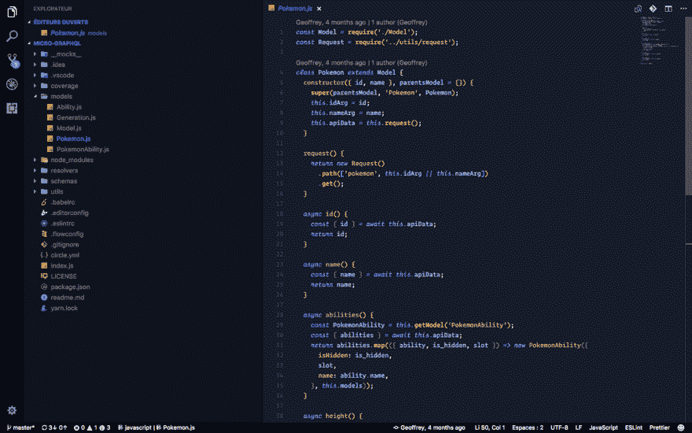](https://res.cloudinary.com/practicaldev/image/fetch/s--tejdka3i--/c_limit%2Cf_auto%2Cfl_progressive%2Cq_auto%2Cw_880/https://github.com/g3offrey/rocket-ui/blob/master/screenshot.png%3Fraw%3Dtrue)

👍🏻**安装:***3029*
🔗**链接:** *[火箭-ui](https://marketplace.visualstudio.com/items?itemName=legfrey.rocket-ui)*
👨🏻‍💻**作者**:*[g3off Rey](https://github.com/g3offrey)*

### 10。轻松的主题

[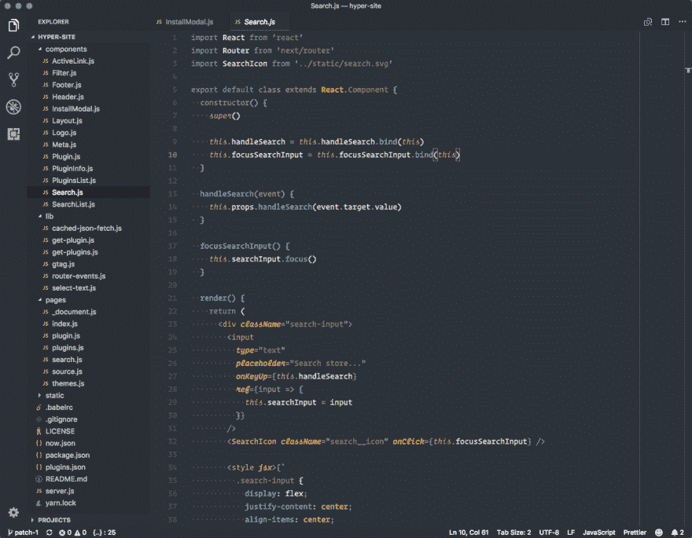](https://res.cloudinary.com/practicaldev/image/fetch/s--cHkSM1_I--/c_limit%2Cf_auto%2Cfl_progressive%2Cq_auto%2Cw_880/https://gitcdn.xyz/repo/Relaxed-Theme/vscode-theme-relaxed/mastimg/screenshot-jsx.png)

👍🏻**安装:***2355*
🔗**链接:** *[轻松](https://marketplace.visualstudio.com/items?itemName=mischah.relaxed-theme)*
👨🏻‍💻**作者** : *[轻松-主题](https://github.com/Relaxed-Theme)*

### 11。灾难主题

[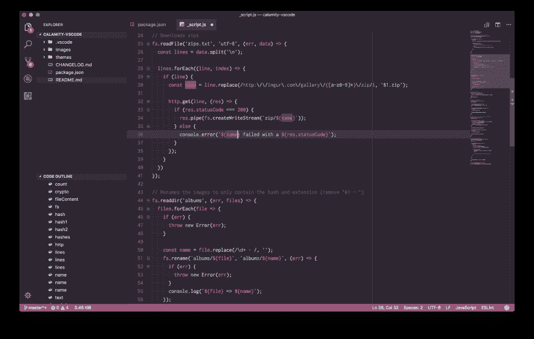](https://res.cloudinary.com/practicaldev/image/fetch/s--SrflVg3h--/c_limit%2Cf_auto%2Cfl_progressive%2Cq_auto%2Cw_880/https://github.com/Pustur/calamity-vscode/raw/mastimg/screenshot.png)

👍🏻**安装:***2641*
🔗**链接:** *[灾](https://marketplace.visualstudio.com/items?itemName=Pustur.calamity-vscode)*
👨🏻‍💻**作者** : *[Pustur](https://github.com/Pustur/)*

### 12。突出主题

[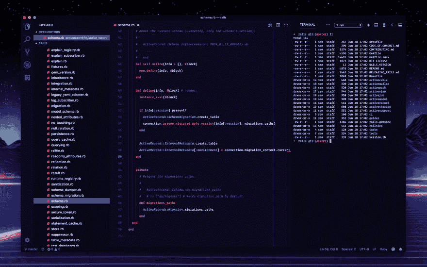](https://res.cloudinary.com/practicaldev/image/fetch/s--9HX5L-DA--/c_limit%2Cf_auto%2Cfl_progressive%2Cq_auto%2Cw_880/https://raw.githubusercontent.com/samrap/outrun-theme-vscode/master/screenshots/ruby-full.png)

👍🏻**安装:***2162*
🔗**链接:** *[逃脱](https://marketplace.visualstudio.com/items?itemName=samrapdev.outrun)*
👨🏻‍💻**作者** : *[samrap](https://github.com/samrap/)*

### 13。GitHub 锐主题

[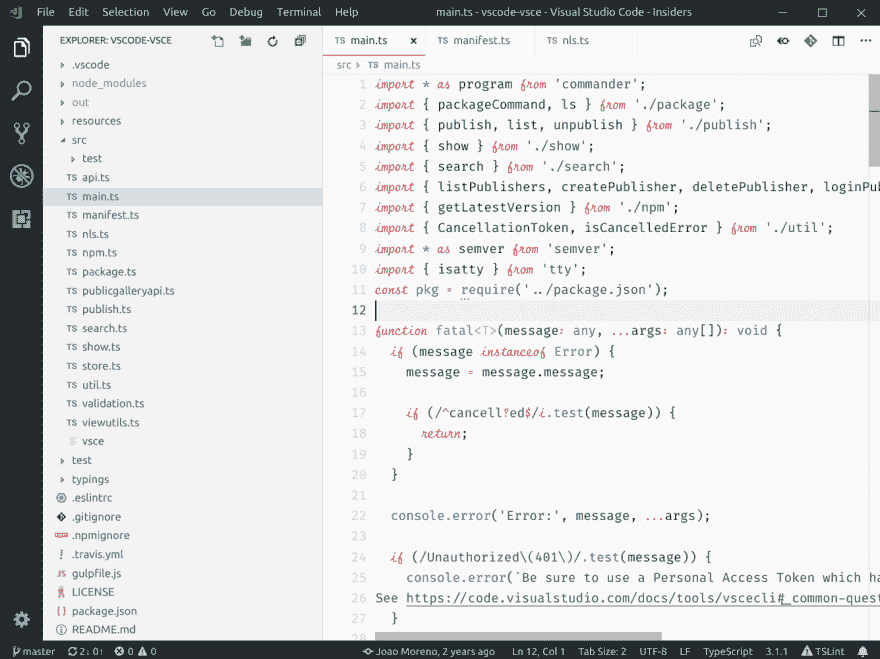](https://res.cloudinary.com/practicaldev/image/fetch/s--HzakM7Kf--/c_limit%2Cf_auto%2Cfl_progressive%2Cq_auto%2Cw_880/https://github.com/joaomoreno/github-sharp-theme/raw/mastimg/light.png)
[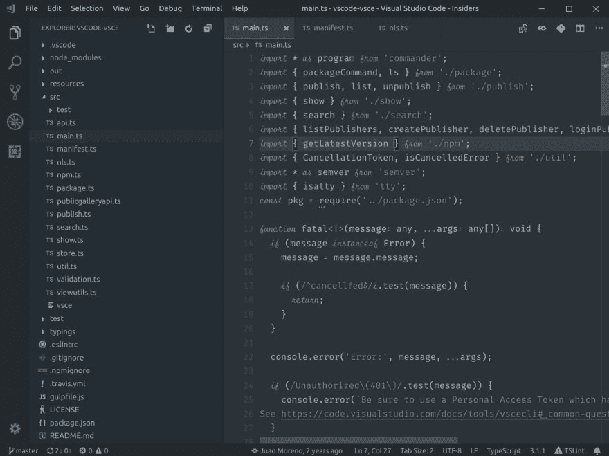T6】](https://res.cloudinary.com/practicaldev/image/fetch/s--bvTCyPOL--/c_limit%2Cf_auto%2Cfl_progressive%2Cq_auto%2Cw_880/https://github.com/joaomoreno/github-sharp-theme/raw/mastimg/dark.png)

👍🏻**安装:** *一千四百八十*
🔗**链接:** *[GitHub 锐](https://marketplace.visualstudio.com/items?itemName=joaomoreno.github-sharp-theme)*
👨🏻‍💻**作者**:*[joaomoreno](https://github.com/joaomoreno/)*

### 14。月光主题

[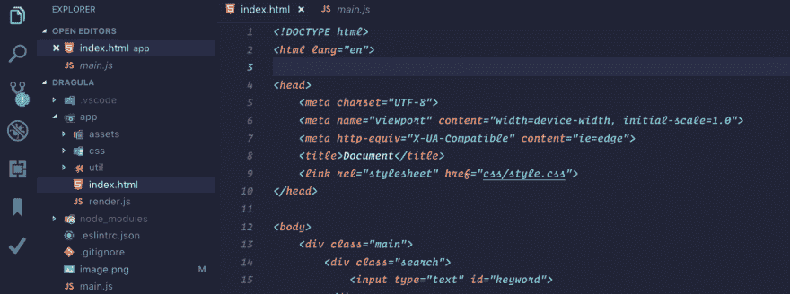](https://res.cloudinary.com/practicaldev/image/fetch/s--OlpuF0bv--/c_limit%2Cf_auto%2Cfl_progressive%2Cq_auto%2Cw_880/https://i.imgur.com/jSo89dg.png)

👍🏻**安装:***1255*
🔗**链接:** *[月光](https://marketplace.visualstudio.com/items?itemName=atomiks.moonlight)*
👨🏻‍💻**作者** : *[原子](https://github.com/atomiks)*

### 15。巫毒主题

[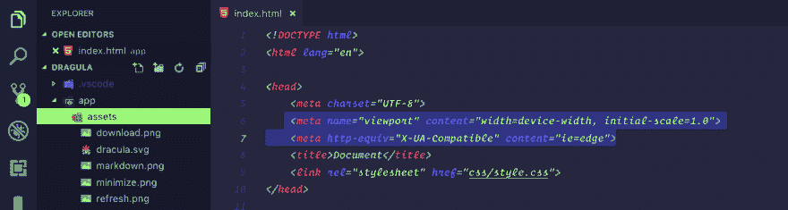](https://res.cloudinary.com/practicaldev/image/fetch/s--GwMe7tro--/c_limit%2Cf_auto%2Cfl_progressive%2Cq_auto%2Cw_880/https://thepracticaldev.s3.amazonaws.com/i/8njgubzk5zqdmki7h7yh.png)

👍🏻**安装:***1353*
🔗**链接:** *[巫毒](https://marketplace.visualstudio.com/items?itemName=liamsheppard.voodoo)*
👨🏻‍💻**作者** : *[利亚姆谢泼德](https://github.com/liamsheppard)*

* * *

好吧，伙计们，在下面的评论区让我知道你最喜欢的被低估的主题。

