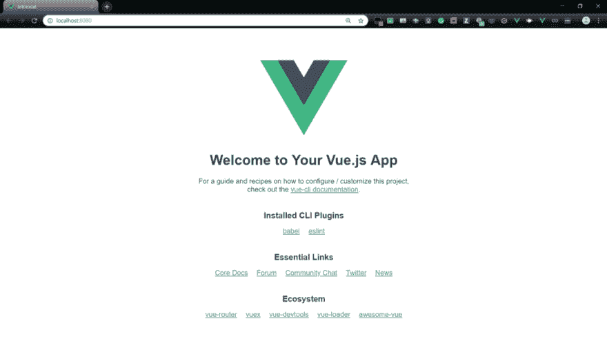
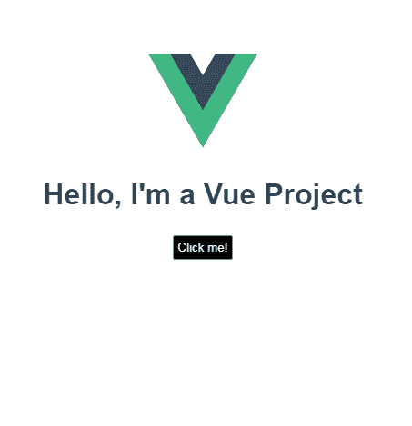

# 从头开始制作一个简单的 Vue 模态组件

> 原文：<https://dev.to/kris/make-a-simple-vue-modal-component-from-scratch-dh6>

[](https://res.cloudinary.com/practicaldev/image/fetch/s--oBRn8nSA--/c_limit%2Cf_auto%2Cfl_progressive%2Cq_auto%2Cw_880/https://cdn-images-1.medium.com/max/1024/1%2A6nkvufwRBEtQedF6QCpiKw.png)

#### 特色 Vue 课程

### [建筑应用，包括 vuej、Vuex、vueror 和 Nuxt](https://click.linksynergy.com/link?id=qt/jYwyHv8A&offerid=507388.1917274&type=2&murl=https%3A%2F%2Fwww.udemy.com%2Fbuilding-applications-with-vuejs%2F)

### [使用 Vuejs 2 创建一个漂亮的 SEO-Ready 网站](https://click.linksynergy.com/link?id=qt/jYwyHv8A&offerid=507388.1591824&type=2&murl=https%3A%2F%2Fwww.udemy.com%2Fvuejs-seo-website-course%2F)

模态是一种脚本效果，它允许你在网站上显示一个小元素，可以是图像、表单输入或文本信息，这取决于用例——我们稍后会讨论这些。重点是情态动词很棒！模态的最大好处是它们避免了使用传统的弹出窗口。简而言之，模态对话窗口是一种在用户正在处理的同一页面上快速向用户显示信息的方式，为任何访问你的网站的人创造了更好的用户体验，并减少了烦人的不必要的页面重载。

当面临以下一种或多种情况时，我们通常必须在网页上放置情态动词:

*   警告(Warnings)——当我们必须警告用户一些可能对他们有害的事情时。
*   **错误—** 当我们想提醒用户一个错误时。
*   **信息—** 当我们想向用户突出显示非常重要的信息时。
*   **决策** —当我们希望用户确认一个决策时，即确认或拒绝。
*   **数据收集—** 当我们通常希望借助表单从用户那里收集数据时。

这个列表并不详尽，因为情态动词还有很多其他的用法。

今天我们将使用 Vue.js，一个越来越流行的 JavaScript 框架来创建一个简单的数据收集模型。然后，我们将使用一个名为 Bit 的产品来使组件易于重用，并帮助我们与他人共享这个组件。

开始之前，请确保您的设备上安装了以下软件:

*   [Node.js 和 npm](https://nodejs.org/en/)
*   [Visual Studio 代码](https://code.visualstudio.com/)

一旦你检查完列表，我们需要在我们的设备上安装 Vue。我们使用这个命令 npm install -g @vue/cli 来完成。安装完成后，我们需要用下面的命令 vue create bitmodal 初始化一个新的 Vue 项目——我们将把我们的项目命名为 **bitmodal。**然后我们让 key incd bitmodal 到终端来改变目录。你的 VS 代码现在应该有一些新的文件创建，在 yarn serve 键，你应该看到通常的 Vue 锅炉板。

[](https://res.cloudinary.com/practicaldev/image/fetch/s--xP9X7Zjj--/c_limit%2Cf_auto%2Cfl_progressive%2Cq_auto%2Cw_880/https://cdn-images-1.medium.com/max/1024/1%2AMjcbG98VFyGfZ4io0BpEpg.png)

我们将看到标准的 Vue 项目布局。接下来，我们编辑 **App.vue** 文件，使其具有我们稍后将添加的模态组件。你的 **App.vue** 文件应该是这样的。

```
<script>
export default {
  name: "Modal",
  data: () => ({
    author: "",
    name: ""
  }),
  methods: {
    close() {
      this.$emit("close");
    }
  }
};
</script>

<template>
  <transition name="modal-fade">
    <div class="modal-backdrop">
      <div class="modal">
        <h1>Hello! I'm a Modal</h1>
        <footer class="modal-footer">
          <slot name="footer">
            <button type="button" class="btn-green" @click="close">
              Close me
            </button>
          </slot>
        </footer>
      </div>
    </div>
  </transition>
</template>

<style>
.modal-fade-enter,
.modal-fade-leave-active {
  opacity: 0;
}
.modal-fade-enter-active,
.modal-fade-leave-active {
  transition: opacity 0.5s ease;
}
.modal-backdrop {
  position: fixed;
  top: 0;
  bottom: 0;
  left: 0;
  right: 0;
  background-color: rgba(0, 0, 0, 0.3);
  display: flex;
  justify-content: center;
  align-items: center;
}
.modal {
  background: #ffffff;
  box-shadow: 2px 2px 20px 1px;
  overflow-x: auto;
  display: flex;
  flex-direction: column;
}
.modal-header,
.modal-footer {
  padding: 5px;
  text-align: center;
}
.modal-footer {
  border-top: 1px solid #eeeeee;
  justify-content: flex-end;
}
.btn-close {
  border: none;
  font-size: 20px;
  padding: 20px;
  cursor: pointer;
  font-weight: bold;
  color: #000;
  background: transparent;
  text-align: right;
}
.btn-green {
  color: white;
  background: #828282;
  border: 1px solid #828282;
  border-radius: 2px;
  margin: 5px;
}
.input {
  margin-top: 5px;
}
.added-text {
  margin-block-end: -10px;
  margin-block-start: 0.5rem;
}
</style> 
```

我们所做的是向主 Vue 应用程序添加一个模态组件。这个组件的内容可以在我们接下来创建的 **Modal.vue** 文件中编辑。为了触发模态，我们使用了 **"@click"** vue 特性，每当单击按钮并且模态打开时，该特性调用函数 showModal()。

[](https://res.cloudinary.com/practicaldev/image/fetch/s--x5A2ttwU--/c_limit%2Cf_auto%2Cfl_progressive%2Cq_66%2Cw_880/https://cdn-images-1.medium.com/max/453/1%2AlCYYaLHoWOgyH2sPE-ATdA.gif)

现在我们必须实际创建模态组件，在 **src/components

，* *你需要创建一个名为** Modal.vue **的文件，并将下面的代码粘贴到其中。这段代码只显示了一条消息和一个关闭模式的按钮。你可以在下面项目的 CodeSandbox 中找到** Modal.vue**文件以及整个项目的代码。

[https://medium . com/media/8e 3a 6747 a 8 AFE b01 e 36 f 0750 fc 4 fa 9b 7/href](https://medium.com/media/8e3a6747a8afeb01e36f0750fc4fa9b7/href)

### 回顾

如果您正在关注，我们已经完成了以下工作:

*   在 CodeSandbox 中创建了一个 Vue 应用程序。
*   向我们的 Vue 应用程序添加并构建了一个新的模态组件。

现在，您可以轻松构建和共享应用程序组件✨

快乐编程👋

[](https://medium.com/swlh)

#### 这个故事发表在[的《创业](https://medium.com/swlh)，传媒最大的创业刊物，拥有+412，714 人关注。

#### 订阅接收[我们这里的头条](http://growthsupply.com/the-startup-newsletter/)。

[](https://medium.com/swlh)

* * *