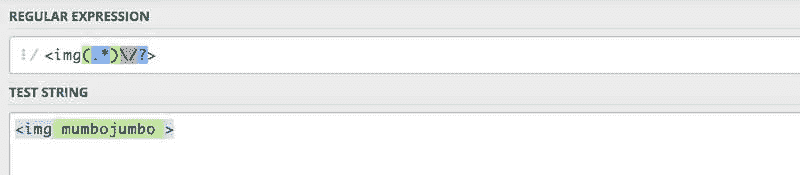

# 在没有类的情况下为目标图像编写正则表达式

> 原文：<https://dev.to/alexmacarthur/writing-a-regular-expression-to-target-images-without-a-class-31m4>

不久前，[我写了关于](https://macarthur.me/posts/build-your-own-simple-lazy-loading-functionality-in-wordpress)在 WordPress 中构建你自己的惰性加载功能。在那篇文章中，我使用了一个正则表达式来给还没有任何*类的图像标签添加一个`lazy-load`类。*

失败了。它不是添加到没有预先存在的类的图像中，而是添加到每个图像的*中，导致一些图像有两个类属性:* 

```
<!--- This is bad. --->
 
```

Enter fullscreen mode Exit fullscreen mode

值得庆幸的是，一些读者抓住了这个问题，把我送回了 regex 绘图板，并让我为盲目借用互联网深处的最初表达感到一丝应得的羞愧。

#### 哪里出了问题

这是我开始的地方。我*认为*我有一个表达式可以匹配没有单词“class”的`img`标签，但是相反，我有一个太急切地寻找匹配的表达式。

```
$content = preg_replace(
  '//i', 
  '', 
  $content
); 
```

Enter fullscreen mode Exit fullscreen mode

如果你还不熟悉`preg_replace()`方法，[在这里读一下](http://php.net/manual/en/function.preg-replace.php)。简而言之，它用于在字符串中查找匹配的正则表达式模式，然后构造一个新的字符串，该字符串可能包含也可能不包含已被捕获的匹配组(用`$[number]`表示)。

让我们玩玩我最初的表达。记下第一个匹配组:`(.*?)`。这个组匹配任何一串字符(包括长度小至零个字符的字符串)，这些字符是*而不是*紧接着单词“class”，如`(?!\bclass\b)`所示。这一切*听起来*像是应该完成工作，但实际上却过早地匹配了许多我们不想要的东西。

这是我的字符串:

```
 
```

Enter fullscreen mode Exit fullscreen mode

首先，模式匹配任何图像标签中紧跟在`


<!-- After: TWO class attributes!= -->
 
```

Enter fullscreen mode Exit fullscreen mode

交换属性没有什么区别——在`


<!-- After -->
 
```

Enter fullscreen mode Exit fullscreen mode

不幸的是，在我们的模式中在`/i', 
  '', 
  $content
);

<!-- Before: -->


<!-- After: FAIL -->
 
```

Enter fullscreen mode Exit fullscreen mode

或者，属性颠倒:

```
<!-- Before: -->


<!-- After: FAIL -->
 
```

Enter fullscreen mode Exit fullscreen mode

这就是试验`+`量词的意义所在，与`*`量词不同，它要求*至少匹配一个字符*。但是，这并没有帮助我们太多，因为当遍历字符串的每个字符时，几乎可以保证找到匹配。

```
$content = preg_replace(
  '//i',
  '',
  $content
); 
```

Enter fullscreen mode Exit fullscreen mode

相似的标记，但是改变了属性:

```
<!-- Before: -->


<!-- After: FAIL -->
<imgs sclass="lazy-load"rc="/img/path.jpg" class="my-class"> 
```

Enter fullscreen mode Exit fullscreen mode

#### 什么奏效了

显然，我的表达式的主要错误是它倾向于太快地找到匹配，而没有搜索整个`img`字符串来知道它是否有`class=`。所以，在我用头撞了屏幕几个小时后，我得到了这个。

```
// 
```

Enter fullscreen mode Exit fullscreen mode

我们慢慢来，从头开始拼凑。

首先，我知道我想要目标是`img`标签，它有一个开始`` | 右括号 |

```
// 
```

Enter fullscreen mode Exit fullscreen mode

按照预期，这将匹配几乎任何具有包含任何字符的`img`标签外壳的东西，任何次数——由`(.*)`表示。

[](https://res.cloudinary.com/practicaldev/image/fetch/s--SjPHAMql--/c_limit%2Cf_auto%2Cfl_progressive%2Cq_auto%2Cw_880/https://macarthur.me/static/79d87ff7af7404c1344dee729cdf2de9/a296c/screen3.jpg)

我知道在这个外壳中，我可以匹配任何东西——除非它是一个类属性。所以，让我们修改一下内部组。不要匹配任何字符，让我们替换那个字符来定位任何后面跟有一个类属性的*而不是*的字符。

```
// 
```

Enter fullscreen mode Exit fullscreen mode

以下是我们更新的组件:

| 部分 | 它匹配什么 |
| --- | --- |
| `` | 右括号 |

下面是我们对字符串运行匹配时得到的结果:

[](https://res.cloudinary.com/practicaldev/image/fetch/s--PE1TB9Zh--/c_limit%2Cf_auto%2Cfl_progressive%2Cq_auto%2Cw_880/https://macarthur.me/static/76a395780fae30fd586df62d5a0ea5e8/a296c/screen4.jpg)

如果我们要删除类属性:

[](https://res.cloudinary.com/practicaldev/image/fetch/s--_lYbI-m4--/c_limit%2Cf_auto%2Cfl_progressive%2Cq_auto%2Cw_880/https://macarthur.me/static/1116c20543f589ca61808a974953b3c8/a296c/screen5.jpg)

搞定了。这个*应该*覆盖我们的大多数场景，允许我们准确地添加一个新的`class`属性到没有任何属性的图像。据我所知，我们唯一能得到匹配的时候是当`class`正对着`/i',
  '', 
  $content
); 
```

Enter fullscreen mode Exit fullscreen mode

## 外卖

首先，学习分解&理解正则表达式的基础并不需要*可怕，特别是如果你有耐心并且愿意慢慢开始的话。这是迄今为止，我从这个过程中带走的最有意义的东西。*

第二，要有耐心和意愿去理解为什么正则表达式会有这样的行为，不要相信你在街上找到的任何给定的表达式。有了解决这类问题的新信心，我将来被烧伤的可能性就小多了。

最后，当你把这些东西拆开的时候，找一个你愿意使用的好工具。我花了很多时间在 regex101 上。对你来说，可能会有所不同。这很酷，只要知道它是什么，这样你就可以在需要的时候跳到它。

谢谢你和我一起踏上这段旅程！