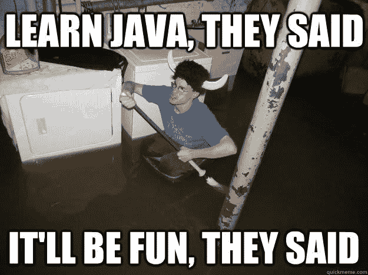
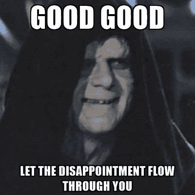

# 好的软件工程师的定义是什么？

> 原文：<https://dev.to/luminousmen/what-is-the-definition-of-good-software-engineer-4a76>

“好的软件工程师的定义是什么”——我喜欢问每个与软件开发有关的人这个问题。我总是得到不同的答案。这取决于人和他们的职位:经理认为好的软件工程师对任务有很好的理解，尊重期限和软技能。中高级软件工程师总是以激情、好工具、硬技能等词语开头。QA 工程师将他们视为编程大师，可以产生可测试的、无错误的代码。团队领导以软硬技能的混合开始他们的描述，他们理想的软件工程师应该及时做好每件事，并报告他们面临的任何问题。

有人(甚至是成熟的工程师或建筑师)以这样的话开始:“哦，这是一个非常广泛的问题……”。不，不是的。这个问题的目的是针对个人的，它关注的是你问这个问题的人的想法。

我会在这篇文章中告诉你我的想法。

## 他们确实真的认为(“量两次，切一次”)

> “展示计算思维或分解大型复杂问题的能力，与工作所需的基本技能一样重要(如果不是更重要的话)。”-黑客银行

编程就是解决问题，软件工程师应该具备解决问题的技能。起初，我认为“解决问题的技能”可能是优秀软件工程师的第一个特征，但它有不同的含义。我写道-“他们真的思考”，我在这里不仅包括他们解决问题的事实，还包括他们如何解决问题，以及他们是否解决了正确的问题。正是逻辑思考、问题分解、文档挖掘和解决方案的最终架构的顺序显示了它们有多好。

> 轻重缓急([https://t.co/g3PVqokNIV](https://t.co/g3PVqokNIV))[pic.twitter.com/h2noouHFOp](https://t.co/h2noouHFOp)
> 
> — monkeyuser (@ismonkeyuser) [October 17, 2018](https://twitter.com/ismonkeyuser/status/1052438663550898176?ref_src=twsrc%5Etfw)

关于“正确的问题”的最后一句话。我共事过的最高效的工程师不是那些通宵工作或每周工作 80 小时的工程师。他们也不是那些能够毫不费力地设计出优雅的五行 x86 汇编来简洁高效地解决问题的工程师。他们是似乎总是在第一时间解决正确问题的工程师。借用泰勒·特里克、[菲尔·哈克](https://twitter.com/haacked/status/22118616918)以及其他许多人的观点，软件工程师并不仅仅是生产代码行。如果我们后退一步，我们真的会得到报酬来构建功能，使事情更有效，使它们越来越大，并修复问题或防止停机。代码是解决这些问题的副产品，但是我们需要解决的问题是主要的。

## 他们有学习的意愿

是的，对我来说，这是伟大软件工程师的第二个特征。技术总是在发展，软件工程师今天拥有的技能和能力在几年后可能会过时，工程师必须面对的问题也是如此。一个好的软件工程师有寻求知识的本能，他意识到他的[领域总是在变化](https://en.wikipedia.org/wiki/Red_Queen's_race)。罗伯特·c·马丁在《干净的编码者》一书中写道，你应该每周为你的雇主工作 40 小时，花 20 小时阅读、学习和实践。

此外，当我意识到[天才仍然有挣扎](https://twitter.com/gvanrossum/status/1072535194131984386)，感到沮丧，感到不足，忘记，学习和犯错误时，这让我在自己的程序员皮肤里感觉更舒服。不同的是，天才不断前进，不断学习，承认错误，并从错误中学习。失败是一个可以利用的机会，不需要害怕。

## 他们去了源头

文档、测试、人:这些东西都是谎言。不是有意的，但是如果你想确切地知道一些东西是如何工作的，那么你必须自己查看源代码。如果这不是你非常熟悉的语言，不要害怕——如果你主要是一个 Python 工程师，并且你怀疑 Python 的一个 C 库中有错误，去打开它看看。是的，你可能不明白。但是谁知道呢？你可能会去尝试，而且你比根本不去尝试有更好的机会！不幸的是，如果你在一个封闭源代码的环境中，这将变得更加困难，但是这个原则仍然适用。差劲的工程师对查看源代码没什么兴趣，因此，问题困扰他们的时间比那些愿意做一些研究的人要长得多。

## 他们想成为优秀的工程师...

**...让公司变得更好。**

在这里，我想告诉大家，他们追求卓越，永远不是为了自己，而是为了他们的团队和公司。尽管电视和好莱坞电影赞美孤独的黑客，但现实是所有公司的所有开发都发生在团队中。

你越早开始与他人一起编写代码，你就会变得越好。你可以从开源项目上的 GitHub 中提取代码开始，贡献并从社区中获得反馈。在培训中，参加团队挑战和代码评审是获得一些经验的好方法。

**...让别人变得更好。**

所以优秀的软件工程师不会在真空中工作，他们会尝试与他人交流以获得新知识或分享他们的经验。如果他们认为自己能提供帮助，他们会尝试指导和教导他人。此外，他们希望了解产品、商业计划、产品发展的方向，以便提供帮助。

**...并把产品做得更好。**

在软件工程师中，我看到了一种常见的疾病，一种“不是我的问题”的疾病，工程师从这里到那里完成他的任务，然后他就完成了。对于他来说，这是一个糟糕的界面或者这显然是一个糟糕的设计，或者函数的参数被搞乱了，这些都无关紧要。这不是他的问题。但是它是，有一些质量门，一些完成的定义，一些开发指南等。一个好的工程师明白我们产品的任何问题都是我们要解决的问题。

## 结论

以上所有技能都是通用的——没有一个是特定于任何一种语言、框架、技术甚至级别的。如果你拥有它们，你可以快速学习一门新的语言或工具，并在那种环境下写出好的软件。此外，因为它们在本质上是通用的，它们在几年内不会过时。这些是我对如何成为一名优秀程序员的回答。你认为怎样才能成为一名优秀的程序员？请在评论中告诉我。

* * *

**感谢您的阅读！**

有什么问题吗？请在下面留下您的评论，开始精彩的讨论！

查看我的博客或来打个招呼👋在[推特](https://twitter.com/luminousmen)或订阅[我的电报频道](https://t.me/iamluminousmen)。
做好你的计划！