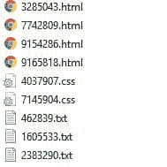
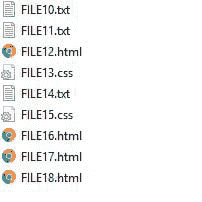
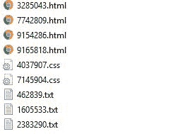
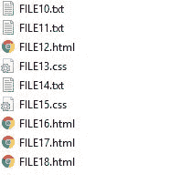

# 重命名您的文件取决于。延伸！

> 原文：<https://dev.to/eshleron/rename-your-files-depending-on-extension-2fkl>

# 有用的工具

如果你想把你的**数据集样本重命名为 ML** ，你可能有很多这样的样本(你应该顺便提一下)，或者你可能需要为每个样本设置不同的**枚举。你有分机**或者你只是想**重命名一些私人物品**我很高兴你在这里。

这是重命名文件的方法:

*   对于每一个。目标文件夹中的扩展名重命名设置唯一枚举。

*   随便地

*   用你的一套参数。例如，名称=文件，从=10 开始计数，步骤=1

### 终于

这是一个简单的应用程序，但我希望它能像对我一样对别人有用！

#### 如果你愿意。exe？

[下载](https://mega.nz/#!35UGwCCD!zUn_Jg8pvimJgFV0DbgBzGpbPXRasqBTCGHnCjYgan8)

##  [埃斯勒朗](https://github.com/Eshleron) / [雷纳默](https://github.com/Eshleron/reNamer)

### 根据扩展名重命名文件

<article class="markdown-body entry-content container-lg" itemprop="text">

# 雷纳默

重命名器允许您根据文件扩展名重命名文件。

## 它是如何工作的

重命名器允许您通过以下方式重命名文件:

*   对于每一个。目标文件夹中的扩展名重命名设置唯一枚举。

*   随便地

*   用你的一套参数。例如，名称=文件，从=10 开始计数，步骤=1

## 哪里可以用？

您可以使用它作为工具来重命名您的训练数据集文件。简单地说，你有许多文件，你需要相同的模式来重命名它们。

## 如果你愿意。exe 只是为了用？

[https://mega.nz/#!35UGwCCD！zUn _ jg 8 pvimjgfv 0 dbgbzgpbpxrasqbtcghncjygan 8](https://mega.nz/#!35UGwCCD!zUn_Jg8pvimJgFV0DbgBzGpbPXRasqBTCGHnCjYgan8)

### 先决条件:

运行它唯一需要安装的依赖项是与 Python 3.5.4 兼容的 PyQt5。本项目中使用的所有其他库都预装在 Python 中。

</article>

[View on GitHub](https://github.com/Eshleron/reNamer)