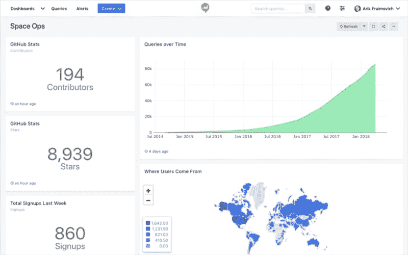

# Redash 在 2019 年的前景如何🤩

> 原文：<https://dev.to/redash/whats-ahead-for-redash-in-2019--2998>

当我写下宣布 Redash 公司成立的博文时，我天真地认为我会定期更新 Redash 作为一个产品和公司的建设过程。我真傻。事实证明，这是一份全职工作，还有一些是为了开发产品、启动公司和壮大团队。有些东西必须放弃；其中之一就是定期更新流程。到目前为止发生了如此多的事情，一篇文章很难涵盖所有的内容。但随着 2018 年最近结束，我试图总结过去的 12 个月，并展望未来。

从表面上看，Redash 在 2018 年的轨迹与前几年一样:我们增加了用户和客户，增加了收入，并使产品比以往任何时候都更好。但当我们进入 2018 年时，有一个很大的不同:Redash 成为了一个团队的努力。

直到 2017 年末，Redash 都是一个人的行动。2018 年初变成了三人组。现在 2019 年我们有六个人。促成这一团队成长的是我们的客户。和以前一样，我们没有接受任何外部资助。感谢我们过去和现在的所有顾客🙏

> *虽然我们在 2018 年以 3 人团队开始，但我们在 2019 年以 6 人团队开始。促成这一团队成长的是我们的客户。*

随着 Redash 作为一家公司的成熟，该产品也在 2018 年大幅成熟。我们有三个主要版本( [v4](https://medium.com/r/?url=https%3A%2F%2Fblog.redash.io%2Fredash-v4-is-out-36c11fe0c682) 、 [v5](https://medium.com/r/?url=https%3A%2F%2Fblog.redash.io%2Fredash-v5-is-out-1d9a3d93c20a) 和 [v6](https://medium.com/r/?url=https%3A%2F%2Fblog.redash.io%2Fjust-in-time-for-christmas-redash-v6-70cb23dfbbf3) )，包括:

*   新的用户界面和更好的 UX
*   动态仪表板布局
*   标签和收藏夹
*   参数 UI 改进
*   更多可视化
*   更多数据源

<figure>

<figcaption>V4 中引入的新 UI 一瞥。</figcaption>

</figure>

# **2019 年计划**

## **团队努力**

随着团队的成长，我们正在建立程序，让 Redash 成为一个有趣且高效的工作场所，并且(重要的是)让 **me** 成为公司日常运营的多余部分。这将提高团队的速度，为我们的客户促进更大的稳定性，并使我有时间专注于更具战略性的项目。

## **甚至更多的交互式仪表盘和查询**

在我们 2018 年发布的版本中，我们显著改进了参数的 UI。在 2019 年，我们将通过向参数添加更多所需的功能(可选参数、多选、仪表板中的更好支持)以及通过使参数随处可用(只读用户、共享仪表板、嵌入)来完成这项工作。

## **更好的权限模式**

一旦我们有能力安全地运行参数化查询，我们就可以最终升级 Redash 权限模型，使其对用户更加友好。我们的目标是用一个类似 Google Drive 的模型来扩充当前的模型(如果您可以访问数据源，就可以访问查询/仪表板)，在这个模型中，您可以在内容级别上为单个用户或组分配权限。

加上上面提到的改进的参数支持，2019 年的 Redash 将进一步触及并赋能您组织内的更多人。

## **技术进步**

今年，我们计划完成从 2018 年开始的迁移。这将使添加特性和与我们开源社区的接口变得更加容易。我们也将继续改进围绕 Redash 的测试故事(感谢 Cypress 和 Percy！).所有这些都会让我们更加自信地更频繁地发布。

## **社区**

我们最近邀请了用户社区的九名成员成为 Redash 的维护者。2019 年，我们希望改善与维护者的协调，清理我们积压的拉取请求。

## **更多指南和资源**

我们在 2018 年忽略的一件事是制作最新的文档和使用示例。我们希望在 2019 年改变这一点，但我们也非常感谢您的反馈！如果你对 Redash 有什么有趣的用途，我们强烈建议你分享一下。[论坛](https://medium.com/r/?url=http%3A%2F%2Fdiscuss.redash.io)是一个很好的场所。

* * *

这些是我们目前的计划。众所周知，没有计划能在第一次接触后存活下来，所以我们仍然希望给你(和我们自己)一个惊喜😅)以及我们将在 2019 年实现的一些目标。🍾