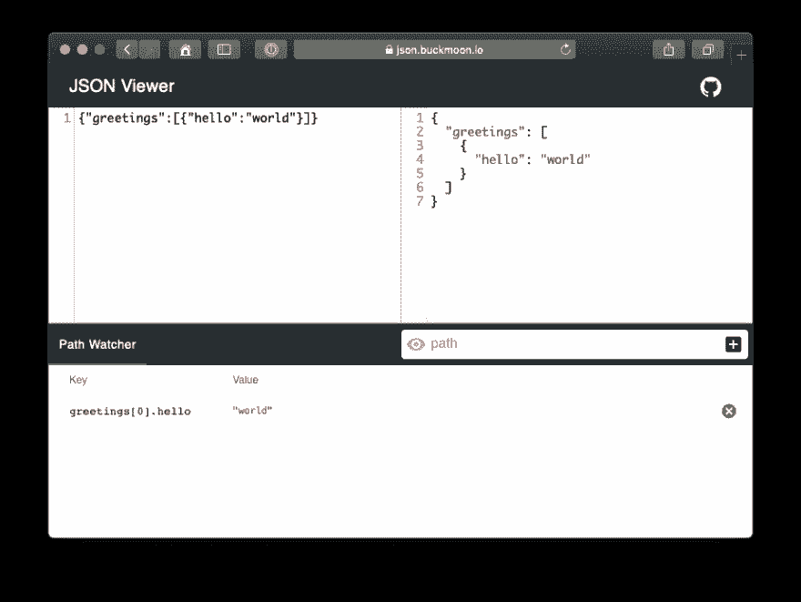

# 宣布 JSON 查看器:在线 JSON 格式化程序和检查器

> 原文：<https://dev.to/tdkn/announcing-json-viewer-online-json-formatter--inspector-99f>

[**JSON Viewer**](https://json.buckmoon.io) 是一款免费的&开源 JSON 格式器/检查器。JSON Viewer 允许您使用点符号检查属性的特定路径。

尝试一下吧！