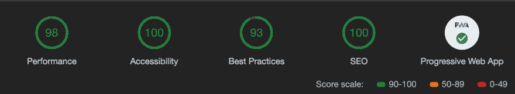

# 宣布阿波罗元素

> 原文：<https://dev.to/bennypowers/announcing-apollo-elements-5777>

<sup><abbr title="בסייעתא דשמייא">בס״ד</abbr></sup>

今天我发布了 0.0.1 版本的`apollo-elements`，这是一个软件包的集合，它使得创建连接到 Apollo GraphQL <sup>[1](#note-1)</sup> 的 web 组件变得容易。

##  [阿波罗——元素](https://github.com/apollo-elements) / [阿波罗——元素](https://github.com/apollo-elements/apollo-elements)

### 🚀🌛使用发射平台👩‍🚀👨‍🚀

<article class="markdown-body entry-content container-lg" itemprop="text">[](https://github.com/apollo-elements/apollo-elements./docs/logo.svg)

# <g-emoji class="g-emoji" alias="rocket" fallback-src="https://github.githubassets.cimg/icons/emoji/unicode/1f680.png">🚀</g-emoji>阿波罗元素<g-emoji class="g-emoji" alias="woman_astronaut" fallback-src="https://github.githubassets.cimg/icons/emoji/unicode/1f469-1f680.png">👩‍🚀</g-emoji>

**<g-emoji class="g-emoji" alias="new_moon" fallback-src="https://github.githubassets.cimg/icons/emoji/unicode/1f311.png">🌑</g-emoji>自定义元素符合阿波罗 GraphQL <g-emoji class="g-emoji" alias="last_quarter_moon_with_face" fallback-src="https://github.githubassets.cimg/icons/emoji/unicode/1f31c.png">🌜</g-emoji>**

**<g-emoji class="g-emoji" alias="woman_astronaut" fallback-src="https://github.githubassets.cimg/icons/emoji/unicode/1f469-1f680.png">👩‍🚀</g-emoji>这是开发者的一小步，网络平台的一大步！<g-emoji class="g-emoji" alias="man_astronaut" fallback-src="https://github.githubassets.cimg/icons/emoji/unicode/1f468-1f680.png">👨‍🚀</g-emoji>**

[](https://open-wc.org)[](https://github.com/apollo-elements/apollo-elements/issues)[](https://github.com/apollo-elements/apollo-elements/blob/master/LICENCE.md)[](https://codeclimate.com/github/apollo-elements/apollo-elements/maintainability)[](https://codeclimate.com/github/apollo-elements/apollo-elements/test_coverage)[](https://github.com/apollo-elements/apollo-elements/actions)

Apollo Elements 提供了基于各种底层 web 组件创作库的包。你可以选择一个适合你的项目，以保持你的应用程序小。

```
npm init @apollo-elements
```

Enter fullscreen mode Exit fullscreen mode

## <g-emoji class="g-emoji" alias="robot" fallback-src="https://github.githubassets.cimg/icons/emoji/unicode/1f916.png">🤖</g-emoji>演示

*   [`#leeway`](https://leeway.apolloelements.dev) 是一个聊天 PWA 的例子，它使用`lit-apollo`使你更容易避免做实际工作。[源库](https://github.com/apollo-elements/leeway)
*   [`LaunchCTL`](https://launchctl.apolloelements.dev) 是一个简单的 PWA，显示关于 [SpaceX](https://spacex.com) 发射的信息。它使用非官方的 [spacex.land](https://spacex.land) GraphQL API。[源库](https://github.com/apollo-elements/launchctl)

## <g-emoji class="g-emoji" alias="world_map" fallback-src="https://github.githubassets.cimg/icons/emoji/unicode/1f5fa.png">🗺</g-emoji>指南和文档

如果你只是想看 API 文档，可以在 [apolloelements.dev](https://apolloelements.dev) 查看我们所有的包

*   [<g-emoji class="g-emoji" alias="avocado" fallback-src="https://github.githubassets.cimg/icons/emoji/unicode/1f951.png">🥑</g-emoji>核心](https://apolloelements.dev/api/core/)
*   [<g-emoji class="g-emoji" alias="bricks" fallback-src="https://github.githubassets.cimg/icons/emoji/unicode/1f9f1.png">🧱</g-emoji> 组件](https://apolloelements.dev/api/components/)
*   [<g-emoji class="g-emoji" alias="cocktail" fallback-src="https://github.githubassets.cimg/icons/emoji/unicode/1f378.png">🍸</g-emoji>混血儿](https://apolloelements.dev/api/libraries/mixins/)
*   [<g-emoji class="g-emoji" alias="fire" fallback-src="https://github.githubassets.cimg/icons/emoji/unicode/1f525.png">🔥</g-emoji>点燃](https://apolloelements.dev/api/libraries/lit-apollo/)
*   [<g-emoji class="g-emoji" alias="checkered_flag" fallback-src="https://github.githubassets.cimg/icons/emoji/unicode/1f3c1.png">🏁</g-emoji>快](https://apolloelements.dev/api/libraries/fast/)
*   [<g-emoji class="g-emoji" alias="ghost" fallback-src="https://github.githubassets.cimg/icons/emoji/unicode/1f47b.png">👻</g-emoji>闹鬼](https://apolloelements.dev/api/libraries/haunted/)
*   [<g-emoji class="g-emoji" alias="atom_symbol" fallback-src="https://github.githubassets.cimg/icons/emoji/unicode/269b.png">原子</g-emoji>](https://apolloelements.dev/api/libraries/atomico/)
*   [<g-emoji class="g-emoji" alias="unicorn" fallback-src="https://github.githubassets.cimg/icons/emoji/unicode/1f984.png">🦄</g-emoji>混血儿](https://apolloelements.dev/api/libraries/hybrids/)
*   [<g-emoji class="g-emoji" alias="microscope" fallback-src="https://github.githubassets.cimg/icons/emoji/unicode/1f52c.png">🔬</g-emoji>胶子](https://apolloelements.dev/api/libraries/gluon/)
*   [<g-emoji class="g-emoji" alias="dna" fallback-src="https://github.githubassets.cimg/icons/emoji/unicode/1f9ec.png">🧬</g-emoji> 聚合物](https://apolloelements.dev/api/libraries/polymer/)

## 用于任何

…</article>

[View on GitHub](https://github.com/apollo-elements/apollo-elements)

Apollo Elements 处理 web 组件库(如`lit-element`或`hybrids`)和 Apollo 客户端之间的管道，因此您可以专注于构建您的应用程序。

如果您不熟悉 web 组件，请参加<abbr title="peek">👀</abbr>在我的“让我们构建 Web 组件”系列文章中，您将了解到:

[](/bennypowers) [## 让我们构建 Web 组件！第 1 部分:标准

### 本尼为🇮🇱🇨🇦供电 9 月 18 日 1810 分钟阅读

#webcomponents #customelements #javascript #html](/bennypowers/lets-build-web-components-part-1-the-standards-3e85)

## 连接组件

在基于组件的应用程序中，每个组件都可以从一些单独的状态存储中获得它的状态。例如，您可以创建连接到 Redux 或 MobX 存储的组件，并订阅对其状态拼图的更改。

GraphQL 灵活且可扩展的语法非常适合基于组件的设计，而 Apollo 强大的实现让我们可以轻松地在 GraphQL 数据和组件之间建立联系。使用`apollo-link-state`，你甚至可以完全摆脱像 redux 这样的客户端状态容器，并且*从 apollo 缓存*中查询你的整个组件状态。

```
query  UserProfilePage($userId:  ID)  {  session  @client  {  token  expiresAt  id  }  user(id:  $id)  {  name  avatar  friends  {  name  id  }  }  } 
```

Enter fullscreen mode Exit fullscreen mode

## 显示代码

现在，有了 Apollo Elements，就可以很容易地建立和运行连接组件。您提供了一个 GraphQL 文档和一个处理模板的定制元素类 [<sup>2</sup>](#note-2) ，一切就绪。

```
import { ApolloQuery, html } from '@apollo-elements/lit-apollo';

// A component that uses ApolloSubscription to update
// when users go on or offline.
import './user-online-status.js';
import './loading-spinner.js';

/**
 * `<user-profile-page>` Shows a user's profile, as well as a list
 * of their friends which display's each one's online status via a
 * GraphQL subscription.
 * @extends ApolloQuery
 */
class UserProfilePage extends ApolloQuery {
  render() {
    const { loading, data } = this;
    return (
      (loading || !data) ? html`<loading-spinner></loading-spinner>`
      !data.user ? : html`<login-form></login-form>`
    : html`
        <h1>Hello, ${data.user.name}</h1>
        <profile-image src="${data.user.avatar}"></profile-image>
        <h2>Who's Online?</h2>
        <dl>${data.user.friends.map(({id, name}) => html`
          <dt>${name}</dt>
          <dd><user-online-status id="${id}"></user-online-status></dd>
        `)}</dl>
      `
    );
  }

  updated() {
    // get the currently logged-in user's id from the `@client` query.
    const { id } = this.id;
    // setting variables updates the query.
    if (id) this.variables = { id };
  }
}

customElements.define('user-profile-page', UserProfilePage); 
```

Enter fullscreen mode Exit fullscreen mode

一旦将元素添加到页面中，只需将它们的`query`属性设置为 GraphQL 文档，就大功告成了。

### 内嵌图形 SQL 脚本

您甚至可以使用内联 GraphQL:
在 HTML 中以声明方式定义您的查询

```
<user-profile-page>
  <script type="application/graphql">
    query UserProfilePage($userId: ID) {
      session @client {
        token
        expiresAt
        id
      }

      user(id: $id) {
        name
        avatar
        friends {
          name
          id
        }
      }
    }
  </script>
</user-profile-page> 
```

Enter fullscreen mode Exit fullscreen mode

很可爱，对吧？

## 支持多个 Web 组件库

Apollo Elements 源于`lit-apollo`，但是我不满足于支持单一的组件类。版本 0 发货，改名换姓，支持[`lit-element`](https://dev.to/bennypowers/lets-build-web-components-part-5-litelement-906)[`GluonElement`](https://dev.to/bennypowers/lets-build-web-components-part-6-gluon-27ll)[`hybrids`](https://dev.to/bennypowers/lets-build-web-components-part-7-hybrids-187l)。它也有一些[聚合物](https://dev.to/bennypowers/lets-build-web-components-part-4-polymer-library-4dk2)风格的双向绑定元素，所以你可以用`{{data}}`语法在你的模板中公开阿波罗状态。

但是这里的目标是给你，开发者，更多的选择。如果以上都不是你要找的，Apollo Elements 还提供了[类混合](http://justinfagnani.com/2015/12/21/real-mixins-with-javascript-classes/)，让你可以使用任何类似香草的组件类，甚至是老式的`HTMLElement`，如果你真的想要的话。

```
import { ApolloMutationMixin } from '@apollo-elements/mixins';
import gql from 'graphql-tag';

const mutation = gql`
  mutation SendMessage($message: String!) {
    sendMessage(message: $message) {
      message
      date
    }
  }
`;

const template = document.createElement('template');
template.innerHTML = `
  <style>
    :host([error]) #input {
      border: 1px solid red;
    }

    details {
      display: none;
    }

    :host([error]) details {
      display: block;
    }
  </style>
  <label>Message<input id="input"/></label>
  <details>
    <summary>Error!</summary>
    <span id="error"></span>
  </details>
`;

class ChatInput extends ApolloMutationMixin(HTMLElement) {
  get input() {
    return this.shadowRoot && this.shadowRoot.getElementById('input');
  }

  constructor() {
    super();
    this.mutation = mutation;
    this.onKeyup = this.onKeyup.bind(this);
    this.attachShadow({ mode: 'open' })
    this.shadowRoot.appendChild(template.content.cloneNode(true))
    this.input.addEventListener('keyup', this.onKeyup)
  }

  onKeyup({ key, target: { value: message } }) {
    if (key !== 'Enter') return;
    this.variables = { message };
    this.mutate();
  }

  // Override implementation of `onCompleted` if desired.
  // Alternatively, use a setter.
  onCompleted({ message, date }) {
    this.input.value = '';
  }

  // Override implementation of `onError` if desired.
  // Alternatively, use a setter.
  onError(error) {
    this.setAttribute('error', error);
    this.shadowRoot.getElementById('error').textContent =
      `Error when sending message: ${ error }`;
  }
} 
```

Enter fullscreen mode Exit fullscreen mode

未来支持更多 web 组件库和框架的计划正在进行中，所以请关注版本回购。

所以继续吧——安装最适合您的项目的软件包:

*   [`@apollo-elements/mixins`](https://npmjs.org/package/@apollo-elements/mixins) 为杂色类
*   [`@apollo-elements/lit-apollo`](https://npmjs.org/package/@apollo-elements/lit-apollo) 为 lit-element
*   [`@apollo-elements/hybrids`](https://npmjs.org/package/@apollo-elements/hybrids) 为杂种
*   [`@apollo-elements/gluon`](https://npmjs.org/package/@apollo-elements/gluon) 为胶子
*   [`@apollo-elements/polymer`](https://npmjs.org/package/@apollo-elements/polymer) 为高分子型通知元素

## 演示

想看看实际情况吗？我构建了一个简单的聊天应用程序演示，它使用 GraphQL 订阅，并使用 lit-element 呈现其组件。

[`#leeway`](https://lit-apollo-subscriptions.herokuapp.com) 是一个渐进式的网络应用，它使用`lit-apollo`让你更容易避免做实际的工作。查看[源代码报告](https://gitlab.com/bennyp/demo-lit-apollo-subscriptions)，了解如何使用 Apollo 元素构建应用的示例。演示包括:

*   <abbr title="server side rendering">SSR</abbr>
*   代码分割
*   激进的缩小，包括`lit-html`模板文字
*   CSS 中的 CSS(例如`import shared from '../shared-styles.css';`)
*   GQL-in-GQL(例如`import query from './my-component-query.graphql';`)
*   websocket 上的 GraphQL 订阅

[](https://github.com/apollo-elements/apollo-elements/files/2825459/lit-apollo-subscriptions.herokuapp.com-20190203T132249.zip)

所以今天就来试试`apollo-elements`吧！

##### 脚注

*   <small>阿波罗元素是我自己维护的一个社区项目，它不隶属于流星。</small>
*   <small>或者在混血儿的情况下，你需要的只是一个渲染函数。</small>