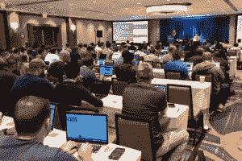

# "风格是一种不用说话就能说出你是谁的方式."—瑞秋·佐伊

> 原文：<https://dev.to/wiredferret/style-is-a-way-to-say-who-you-are-without-having-to-speak-rachel-zoe-4796>

> 有色头发也从未影响过我从事高曝光度公共工作的能力。
> 
> 几乎所有你能想到的着装规范都与不对称的尊重有关——权力较小的人被迫遵守权力的发型/服装/表情标准。[https://t.co/yB5RGz9JpD](https://t.co/yB5RGz9JpD)
> 
> —来自 LaunchDarkly 的 Heidi(@ wired ferret)[2019 年 1 月 15 日](https://twitter.com/wiredferret/status/1085021191402868737?ref_src=twsrc%5Etfw)

我长这样:

除非我要做一个演讲或者刚刚做了一个，在这种情况下，我看起来更像这样:

正如你从上面的推文中看到的，很多人同意我的观点，着装规范经常是为了提醒人们他们没有权力，或者他们的权力较小。对性别歧视的学校着装规范的抵制是其中的一个方面——也许我们不应该因为女生的穿着而对她们进行监督，也许我们应该教育男生，他们应该保留自己对自己有权拥有什么的假设。同样，在科技领域工作，尤其是在初创公司，有一点很好，那就是他们很少有非常严格的代码。这也是为什么在科技行业有大量性别同性恋者的统计数据，因为没有真正的理由因为违反着装规定而把某人拖到人力资源部面前……如果有着装规定的话。或者 HR。

有些着装规范很实用。如果你和食物一起工作，用网盖住你的头发和胡子。不要在旋转的机器周围穿宽松的衣服。

有些是武断的。我不认为打底裤是裤子，但我是一个老人，并将拥有它。你头发的颜色不会影响你执行紧急离机程序的能力。你的面部穿孔实际上不会让你成为一个糟糕的托儿服务提供商。

但是最难的，难处理的着装规范，是关于职业素养的。你知道女人染发是为了不让自己看起来“不专业的老”。你知道有些人因为胖而在某些方面受到歧视。你知道有些人很难支付工作服的费用，但是因为他们是销售人员，他们的“工作服”就是 Brooks Brothers。

我现在正在工作中讨论服装，因为它们很重要。我不认为对不见客的人强加武断的规则是可以的，但我确实认为，任何办公室的职业精神都意味着你身上没有臭味，我看不到你的任何泳装部分，你的任何服装都不会对其他人类构成威胁。我*认为，如果你和顾客交谈，穿得让别人认真对待你是可以的，甚至是重要的。*

例如，我的公司位于奥克兰。这就像是以旧金山为基地，但小气候更少。穿着公司的连帽衫、牛仔裤、上一家公司的 t 恤和一双 Tevas 鞋去上班是可以的。但是你越往东走，每个人的职业装就越正式。在密西西比河的某个地方，牛仔裤变成了斜纹棉布裤，然后又变成了休闲裤。t 恤变成了有纽扣的格子，然后是带领带的长袖。从帽衫到毛衣再到运动夹克。我用男式服装作为例子，因为它们远没有女装复杂。然后，然后*然后*，你跳过池塘。我去了法国的一个现场，几乎每个男性开发人员——*开发人员*,都穿着熨烫过的衬衫和细号羊毛或羊绒长袖毛衣。

因为我经常旅行，我一遍又一遍地看到这种情况，我对它特别敏感。还有，这是班级的事情。永远不要让任何人告诉你美国没有阶级问题。是的，我们只是不太擅长谈论或命名它们。因此，举例来说，在东海岸的中上阶层长大的人永远不会想到这样一个事实:他们去纽约旅行时会带着有纽扣的衬衫，因为那是他们的母语。他们在初中学会了打领带。

不是在这种环境下长大的人很可能会带着他们在西海岸参加会议时穿的同样的东西，而这最终会成为错误的正式登记。问题是，人们不会说任何事实，对他们来说，你看起来像一个邋遢的书呆子，不能从纸袋中走出自己的路。他们甚至可能没有意识到他们正在这么想。但他们会微妙地感觉到，你的公司可能还没有为大联盟做好准备。

那么我们能做些什么呢？嗯，我正在推动所有从事面向客户工作的员工拥有几个不同的品牌选项，比如一件毛衣。那会让我回欧洲的时候感觉更开心，可以把帽衫留在旅行包里。

# 参加会议的着装

给你的？如果你要去参加一个会议，找一张去年参加那个会议的人的集体照，然后穿上适合的衣服。这里有一个小问题，因为每种会议/编程语言都有其独特的风格，但你会非常接近。例如，这里是奥赖利软件架构和奥赖利速度的人群镜头。两人都在纽约市。如果你仔细观察，你会发现 Velocity 的人穿得更随便一点，因为这更多是为了 DevOps 的人，而软件架构更多是为了他们的老板。这是一个微妙的差别，但它是存在的。

 

为了比较，这里有来自伦敦版本和圣何塞版本的图片

 

更复杂的是，在会议上，女性通常会比男性和男性化的人穿得正式一点，但并不总是这样。所以你最终会得到这样的扬声器图片:

他们看起来都很适合舞台，但女人们把手机放在舞台下的某个地方(除非 Ines 的裙子比我想象的更神奇)，而他把手机放在他的前口袋里。我对性别化着装有一整套看法，但我不会深入探讨，因为这篇文章足够长，但当你决定穿什么时，你应该意识到这一点。

我不是在挑剔奥赖利，他们只是把所有的照片都放在一个容易找到的地方。

# 总之

如果有人告诉你，你的头发、身体或风格对他们来说是个问题，那是他们的问题。如果他们说这是你工作的公司的问题，试着弄清楚这是健康和安全问题，面对客户的问题，还是权力游戏。

就我个人而言，我不久前决定，如果有人因为我的粉红色头发而不想雇用我，他们也不会喜欢我的脏话、我在公共场合的古怪行为或我的 twitter 帖子，如果我不在那里工作，我们都会更开心。但那是一个拥有巨大特权的职位，我知道。

如果你觉得你需要对一位同事说些什么，关于他们的衣服、风格或者上帝禁止的发型，在你开口之前，问问你自己这是关于你的不适还是一个实际的商业问题。**

*在文化的这一点上，航空公司的乘务人员陷入了阶级管制和试图在需要权威的时候凌驾于恐慌的人们之上的可怕的交叉路口，这很复杂，但大量的乘务人员羡慕我的头发，并为能够选择“非自然的颜色”而伤感地叹息。

**如果你正在指导某个进入这个行业的人，如果你是他们的导师，你会有更多的余地来指出你所在的特定办公室的规范。必须有人告诉实习生，Teva 凉鞋可能可以，但如果它们很臭就不行了。