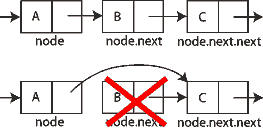

# JavaScript 2019 中的计算机科学:链表

> 原文：<https://dev.to/nzakas/computer-science-in-javascript-2019-linked-list-43n2>

回到 2009 年，我挑战自己全年每周写一篇博文。我曾经读到过，获得更多博客流量的最好方法是坚持发表文章。由于我所有的文章想法，每周一个帖子似乎是一个现实的目标，但事实证明我还缺少 52 个想法。我翻阅了一些写了一半的章节，这些章节最终成为了专业 JavaScript，并找到了许多经典计算机科学主题的材料，包括数据结构和算法。我把这些材料变成了 2009 年和 2012 年[的几个帖子](https://humanwhocodes.com/blog/tag/computer-science/)，并得到了很多积极的反馈。

现在，在这些帖子发表十周年之际，我决定在 2019 年使用 JavaScript 更新、重新发布和扩展它们。看到什么变了，什么没变，这很有趣，我希望你喜欢它们。

## 什么是链表？

一个*链表*是一个以线性方式存储多个值的数据结构。链表中的每个值都包含在它自己的*节点*中，该节点是一个包含数据以及到列表中下一个节点的链接的对象。该链接是一个指向另一个节点对象的指针，如果没有下一个节点，则为`null`。如果每个节点只有一个指向另一个节点的指针(最常被称为`next`)，那么这个链表被认为是一个*单链表*(或者仅仅是链表)，而如果每个节点有两个链接(通常是`previous`和`next`)，那么它被认为是一个*双链表*。在这篇文章中，我主要关注单链表。

## 为什么要用链表？

链表的主要好处是它们可以包含任意数量的值，而只使用这些值所需的内存量。在内存不足的老式计算机上，保留内存非常重要。当时，C 语言中的一个内置数组要求你指定数组可以包含多少项，程序将保留该数量的内存。保留该内存意味着它不能用于程序的其余部分或同时运行的任何其他程序，即使该内存从未被填满。在内存不足的机器上，使用数组很容易耗尽可用内存。创建链表就是为了解决这个问题。

虽然最初是为了更好的内存管理，但当开发人员不知道一个数组最终将包含多少项时，链表也变得流行起来。使用链表并根据需要添加值要比准确猜测一个数组可能包含的最大值数量容易得多。因此，在各种编程语言中，链表经常被用作内置数据结构的基础。

内置的 JavaScript `Array`类型不是作为链表实现的，尽管它的大小是动态的，并且总是开始时的最佳选择。你可能整个职业生涯都不需要使用 JavaScript 中的链表，但是链表仍然是学习创建你自己的数据结构的好方法。

## 链表的设计

链表最重要的部分是它的节点结构。每个节点必须包含一些数据和一个指向列表中下一个节点的指针。下面是一个简单的 JavaScript 表示:

```
class LinkedListNode {
    constructor(data) {
        this.data = data;
        this.next = null;
    }
} 
```

在`LinkedListNode`类中，`data`属性包含链表项应该存储的值，`next`属性是指向列表中下一个项的指针。`next`属性以`null`开始，因为您还不知道下一个节点。然后可以使用`LinkedListNode`类创建一个链表，如下所示:

```
// create the first node
const head = new LinkedListNode(12);

// add a second node
head.next = new LinkedListNode(99);

// add a third node
head.next.next = new LinkedListNode(37); 
```

链表中的第一个节点通常被称为*头*，因此本例中的`head`标识符表示第一个节点。第二个节点被创建并分配给`head.next`来创建一个包含两个条目的列表。通过将第三个节点分配给`head.next.next`来添加它，这是列表中第二个节点的`next`指针。列表中第三个节点的`next`指针保持`null`。下图显示了生成的数据结构。

[](http://en.wikipedia.org/wiki/File:Singly-linked-list.svg)

链表的结构允许你通过跟随每个节点上的`next`指针来遍历所有的数据。下面是一个简单的例子，说明如何遍历一个链表并将每个值打印到控制台:

```
let current = head;

while (current !== null) {
    console.log(current.data);
    current = current.next;
} 
```

这段代码使用变量`current`作为在链表中移动的指针。变量`current`被初始化到列表的头部，并且`while`循环继续，直到`current`为`null`。在循环内部，存储在`current`节点上的值被打印出来，然后`next`指针指向下一个节点。

大多数链表操作都使用这种遍历算法或类似的算法，所以理解这种算法对于理解链表是很重要的。

## [T2`LinkedList`阶级](#the-raw-linkedlist-endraw-class)

如果你正在用 C 语言编写一个链表，你可能会在这一点上停下来，认为你的任务完成了(尽管你会用一个结构而不是一个类来表示每个节点)。然而，在像 JavaScript 这样的面向对象语言中，更习惯的做法是创建一个类来封装这个功能。这里有一个简单的例子:

```
const head = Symbol("head");

class LinkedList {
    constructor() {
        this[head] = null;
    }
} 
```

`LinkedList`类代表一个链表，将包含与它所包含的数据交互的方法。唯一的属性是一个名为`head`的符号属性，它将包含一个指向列表中第一个节点的指针。使用符号属性而不是字符串属性，以清楚地表明此属性不能在类之外修改。

### 向列表中添加新数据

将项目添加到链表中需要遍历结构以找到正确的位置，创建一个新的节点，并将其插入到适当的位置。一种特殊情况是当列表为空时，在这种情况下，您只需创建一个新节点并将其分配给`head`:

```
const head = Symbol("head");

class LinkedList {
    constructor() {
        this[head] = null;
    }

    add(data) {

        // create a new node
        const newNode = new LinkedListNode(data);

        //special case: no items in the list yet
        if (this[head] === null) {

            // just set the head to the new node
            this[head] = newNode;
        } else {

            // start out by looking at the first node
            let current = this[head];

            // follow `next` links until you reach the end
            while (current.next !== null) {
                current = current.next;
            }

            // assign the node into the `next` pointer
            current.next = newNode;            
        }
    }
} 
```

`add()`方法接受单个参数，任何一段数据，并将其添加到列表的末尾。如果列表是空的(`this[head]`是`null`)，那么你分配`this[head]`等于新的节点。如果列表不为空，那么您需要遍历已经存在的列表来找到最后一个节点。遍历发生在从`this[head]`开始的`while`循环中，沿着每个节点的`next`链接，直到找到最后一个节点。最后一个节点有一个等于`null`的`next`属性，因此重要的是在该点停止遍历，而不是在`current`为`null`时停止遍历(如前一节)。然后，您可以将新节点分配给那个`next`属性，以便将数据添加到列表中。

<aside class="note">Traditional algorithms use two pointers, a `current` that points to the item being inspected and a `previous` that points to the node before `current`. When `current` is `null`, that means `previous` is pointing to the last item in the list. I don't find that approach very logical when you can just check the value of `current.next` and exit the loop at that point.</aside>

`add()`方法的复杂度是 O(n ),因为您必须遍历整个列表来找到插入新节点的位置。除了头部之外，您还可以通过跟踪列表的尾部(通常称为*尾部*)来将复杂度降低到 O(1)，从而允许您立即在正确的位置插入一个新节点。

### 从列表中检索数据

链表不允许对其内容进行随机访问，但是您仍然可以通过遍历链表并返回数据来检索任意给定位置的数据。为此，您将添加一个`get()`方法，该方法接受要检索的数据的从零开始的索引，如下所示:

```
class LinkedList {

    // other methods hidden for clarity

    get(index) {

        // ensure `index` is a positive value
        if (index > -1) {

            // the pointer to use for traversal
            let current = this[head];

            // used to keep track of where in the list you are
            let i = 0;

            // traverse the list until you reach either the end or the index
            while ((current !== null) && (i < index)) {
                current = current.next;
                i++;          
            }

            // return the data if `current` isn't null
            return current !== null ? current.data : undefined;
        } else {
            return undefined;
        }
    }

} 
```

`get()`方法首先检查以确保`index`是一个正值，否则返回`undefined`。`i`变量用于跟踪遍历列表的深度。该循环本身是您之前看到的相同的基本遍历，只是增加了一个条件，即当`i`等于`index`时，该循环应该退出。这意味着在两种情况下循环可以退出:

1.  `current`是`null`，表示列表比`index`短。
2.  `i`等于`index`，表示`current`是处于`index`位置的节点。

如果`current`为`null`，则返回`undefined`，否则返回`current.data`。这项检查确保了`get()`永远不会为列表中没有的`index`抛出错误(尽管您可以决定抛出错误而不是返回`undefined`)。

`get()`方法的复杂度从移除第一个节点(不需要遍历)时的 O(1)到移除最后一个节点(需要遍历整个列表)时的 O(n)不等。很难降低复杂性，因为总是需要搜索来识别要返回的正确值。

### 从链表中删除数据

从链表中移除数据有点棘手，因为您需要确保所有的`next`指针在一个节点被移除后仍然有效。例如，如果您想删除三节点列表中的第二个节点，您需要确保第一个节点的`next`属性现在指向第三个节点，而不是第二个节点。以这种方式跳过第二个节点实际上会将其从列表中删除。

[](http://en.wikipedia.org/wiki/File:Singly_linked_list_delete_after.png)

移除操作实际上是两个操作:

1.  找到指定的索引(与`get()`中的算法相同)
2.  移除该索引处的节点

查找指定的索引与在`get()`方法中相同，但是在这个循环中，您还需要跟踪在`current`之前的节点，因为您需要修改前一个节点的`next`指针。

还有四种特殊情况需要考虑:

1.  列表为空(不可能遍历)
2.  该指数小于零
3.  索引大于列表中的项目数
4.  索引为零(移除磁头)

在前三种情况下，移除操作无法完成，因此抛出一个错误是有意义的；第四种特殊情况需要重写`this[head]`属性。下面是一个`remove()`方法的实现:

```
class LinkedList {

    // other methods hidden for clarity

    remove(index) {

        // special cases: empty list or invalid `index`
        if ((this[head] === null) || (index < 0)) {
            throw new RangeError(`Index ${index} does not exist in the list.`);
        }

        // special case: removing the first node
        if (index === 0) {

            // temporary store the data from the node
            const data = this[head].data;

            // just replace the head with the next node in the list
            this[head] = this[head].next;

            // return the data at the previous head of the list
            return data;
        }

        // pointer use to traverse the list
        let current = this[head];

        // keeps track of the node before current in the loop
        let previous = null;

        // used to track how deep into the list you are
        let i = 0;

        // same loops as in `get()`
        while ((current !== null) && (i < index)) {

            // save the value of current
            previous = current;

            // traverse to the next node
            current = current.next;

            // increment the count
            i++;
        }

        // if node was found, remove it
        if (current !== null) {

            // skip over the node to remove
            previous.next = current.next;

            // return the value that was just removed from the list
            return current.data;
        }

        // if node wasn't found, throw an error
        throw new RangeError(`Index ${index} does not exist in the list.`);
    }

} 
```

`remove()`方法首先检查两种特殊情况，一个空列表(`this[head]`是`null`)和一个小于零的`index`。这两种情况下都会引发错误。

下一个特例是当`index`为`0`时，意味着您正在删除列表头。新的列表头应该是列表中的第二个节点，因此可以将`this[head]`设置为等于`this[head].next`。如果列表中只有一个节点也没关系，因为`this[head]`最终等于`null`，这意味着移除后列表为空。惟一的问题是将原始头中的数据存储在一个本地变量`data`中，以便可以返回。

考虑了四种特殊情况中的三种，现在可以继续进行类似于在`get()`方法中发现的遍历。如前所述，这个循环略有不同，因为变量`previous`用于跟踪出现在`current`之前的节点，因为该信息是推动删除节点所必需的。与`get()`类似，循环退出时`current`可能是`null`，表示索引没有找到。如果发生这种情况，则抛出一个错误，否则，`previous.next`被设置为`current.next`，有效地从列表中删除`current`。存储在`current`上的数据作为最后一步返回。

`remove()`方法的复杂度与`get()`相同，从移除第一个节点时的 O(1)到移除最后一个节点时的 O(n)不等。

### 使列表可迭代

为了与 JavaScript `for-of`循环和数组析构一起使用，数据集合必须是可迭代的。默认情况下，`Array`和`Set`等内置 JavaScript 集合是可迭代的，您可以通过在类上指定一个`Symbol.iterator`生成器方法来使自己的类可迭代。我更喜欢先实现一个`values()`生成器方法(以匹配内置集合类中的方法)，然后让`Symbol.iterator`直接调用`values()`。

`values()`方法只需要对列表进行基本遍历，而`yield`每个节点包含的数据:

```
class LinkedList {

    // other methods hidden for clarity

    *values(){

        let current = this[head];

        while (current !== null) {
            yield current.data;
            current = current.next;
        }
    }

    [Symbol.iterator]() {
        return this.values();
    }    

} 
```

`values()`方法标有星号(`*`，表示它是一个生成器方法。该方法遍历列表，使用`yield`返回它遇到的每条数据。(注意，`Symbol.iterator`方法没有被标记为生成器，因为它从`values()`生成器方法返回迭代器。)

### 使用类

完成后，您可以像这样使用链表实现:

```
const list = new LinkedList();
list.add("red");
list.add("orange");
list.add("yellow");

// get the second item in the list
console.log(list.get(1));       // "orange"

// print out all items
for (const color of list) {
    console.log(color);
}

// remove the second item in the list 
console.log(list.remove(1));    // "orange"

// get the new first item in the list
console.log(list.get(1));       // "yellow"

// convert to an array
const array1 = [...list.values()];
const array2 = [...list]; 
```

这个链表的基本实现可以用一个`size`属性来完成，以计算列表中节点的数量，还可以使用其他类似的方法，比如`indexOf()`。完整的源代码可以在我的[计算机科学 JavaScript](https://github.com/humanwhocodes/computer-science-in-javascript) 项目的 GitHub 上获得。

## 结论

链表不是你每天都可能用到的东西，但它是计算机科学中的一个基本数据结构。使用指向另一个节点的节点的概念在许多其他数据结构中被使用，并被构建到许多高级编程语言中。充分理解链表的工作原理对于全面理解如何创建和使用其他数据结构非常重要。

对于 JavaScript 编程，使用内置的集合类(如`Array`)比创建自己的集合类更好。内置的集合类已经针对生产应用进行了优化，并且在各种执行环境中都得到了很好的支持。

*本文原载于[人类编码博客](https://humanwhocodes.com)2019 年[1 月 8 日](https://humanwhocodes.com/blog/2019/01/computer-science-in-javascript-linked-list/)。*