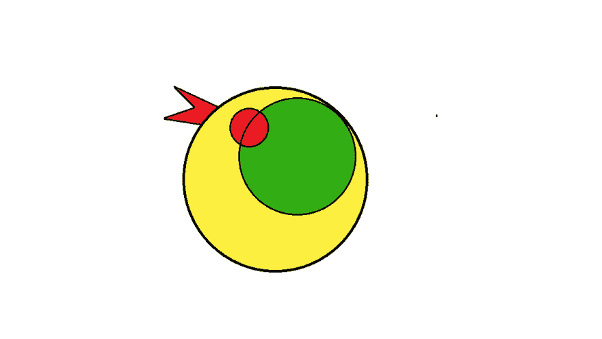

# 带有 Tomtit 的便携式配置文件

> 原文：<https://dev.to/melezhik/portable-profiles-with-tomtit-298e>

[](https://res.cloudinary.com/practicaldev/image/fetch/s--ZfMjxIkT--/c_limit%2Cf_auto%2Cfl_progressive%2Cq_auto%2Cw_880/https://raw.githubusercontent.com/melezhik/tomtit/master/tt-base.png)

* * *

Tomtit 的一个很好的特性是用户可以使用 Sparrowdo DSL 创建脚本，然后将这些脚本打包成常规的 Perl6 模块。

让我来演示一下怎么做。

# Tomtit 简介

Tomtit profile 是一组预定义的脚本，比如说，我想自动化一些从一个项目到另一个项目的*例程*操作。与其复制/粘贴 git/clone 它们，为什么*不把那些定义为 Perl6 模块并重用它？！*

让我来介绍一下 Tomtit 的简介。

# Profile 是 Perl6 模块

假设我们有 3 个简单的操作，我们在所有项目中反复重复:

*   狗-像狗一样说话
*   像猫一样说话
*   像鱼一样说话

考虑创建 Tomtit 配置文件，其中包含代表我们运营的所有 3 个脚本:

`Tomtit::Profile::Pets` :

```
#!perl6

use v6;

unit module Tomtit::Profile::Pets:ver<0.0.1>;

our sub profile-data () {

  my %a is Map  = (
    cat   => (slurp %?RESOURCES<cat.pl6>.Str),
    dog   => (slurp %?RESOURCES<dog.pl6>.Str),
    fish  => (slurp %?RESOURCES<fish.pl6>.Str)
  );

} 
```

Enter fullscreen mode Exit fullscreen mode

每个动物的脚本只是一个 Perl6 模块资源:

```
resources/
  cat.pl6
  dog.pl6
  fish.pl6 
```

Enter fullscreen mode Exit fullscreen mode

# Sparrowdo DSL 及其扩展

我们在编写 Tomtit 脚本时是免费的 Sparrowdo DSL，例如:

`cat.pl6` :

```
#!perl6

group "cats";

user "cat", %( group => 'cats' );

package-install "cats";

bash "echo 'cats say miu miu'"; 
```

Enter fullscreen mode Exit fullscreen mode

*通常* [Sparrowdo DSL](https://github.com/melezhik/sparrowdo/blob/master/core-dsl.md) 足以编写你的脚本，它有很多电池内含定义。但是您总是可以通过编写特定的 sparrow 插件来扩展 DSL，并通过`task-run`方法调用它:

`cat.pl6` :

```
#!perl6

task-run "feed my cat", "cat-feed", %(
    food  => "Friskies",
    drink => "Water"
); 
```

Enter fullscreen mode Exit fullscreen mode

# 占位符和配置

正如我所说的，这些脚本可以在各种项目中使用。然而，一个脚本的某些部分可能是所有项目共有的，反之亦然，也可能是每个项目特有的。处理这种通用性/唯一性问题的最简单方法是添加占位符，而不是特定于项目的实际值:

`cat.pl6` :

```
#!perl6

# This should be cat's group and it's specific to every project
# Change it appropriately 
# Once you install the script

my $group = "ChangeMe";

group $group;

user "cat", %( group => $group ); 
```

Enter fullscreen mode Exit fullscreen mode

或者，您甚至可以使用 [Tomtit 环境](https://github.com/melezhik/tomtit#environments)数据在您的脚本中填充特定于项目的数据，这样更易于维护:

`cat.pl6` :

```
#!perl6

# This should be cat's group and it's specific to every project
# Change it appropriately 
# Once you install the script

my $group = config<cats><group>;

group $group;

user "cat", %( group => $group ); 
```

Enter fullscreen mode Exit fullscreen mode

要创建 Tomtit 环境配置，请这样说:

`tom --env-edit default`

```
#!perl6

{
   cats => %(
       group => "bobtail"     
   ) 
} 
```

Enter fullscreen mode Exit fullscreen mode

无论如何，一旦脚本被安装，你要么在填充占位符的地方修改它，要么设置环境数据，所以一切都正常工作。

让我们来看看如何通过 Tomtit 配置文件分发我们的脚本。

# 通过 Tomtit 使用 profile

一旦我们的`Tomtit::Profile::Pets`配置文件准备好了，我们就可以通过 Tomtit:
开始使用它

```
zef install Tomtit::Profile::Pets 
```

Enter fullscreen mode Exit fullscreen mode

我们将概要文件添加到配置文件中，这样就可以通过 Bash 完成看到它:

`~/tom.yaml`

```
 profiles:

  - Tomtit-Profile-Pets 
```

Enter fullscreen mode Exit fullscreen mode

现在让我们安装配置文件:

```
tom --profile <TAB><TAB>

ado                           hello                         perl6                         Tomtit-Profile-Pets
git                           perl                          ruby

tom --profile Tomtit-Profile-Pets

install Tomtit::Profile::Pets@cat ...
install Tomtit::Profile::Pets@dog ...
install Tomtit::Profile::Pets@fish ... 
```

Enter fullscreen mode Exit fullscreen mode

简介最酷的一点是我可以和别人分享我的脚本。单点知识只是 tomtit cli 配置文件，包括所有必要的配置文件参考，下面是 Per6l 模块。因此，要将我的脚本带给其他人，只需要在存储库中有这个配置文件并安装相关的 Perl6 模块:

`~/tom.yaml` :

```
profiles:

  Tomtit-Profile-Pets
  Tomtit-Profile-Birds
  Tomtit-Profile-Humans 
```

Enter fullscreen mode Exit fullscreen mode

安装配置文件模块:

```
zef install Tomtit::Profile::Pets Tomtit::Birds Tomtit-Humans 
```

Enter fullscreen mode Exit fullscreen mode

安装配置文件脚本:

```
tom --profile Tomtit-Profile-Birds # so on 
```

Enter fullscreen mode Exit fullscreen mode

* * *

当您需要将现有的线束逻辑复制到新项目中时，安装的脚本在项目初始化阶段非常有用。然而，这些脚本并不被认为是“静态的”，有一天我可以更新现有的配置文件来添加更多的脚本或修复旧脚本中的错误，最终用户只需更新相关的 Perl6 模块并从配置文件重新安装脚本:

```
 zef upgrade Tomtit::Profile::Pets
tom --profile Tomtit-Profile-Pets 
```

Enter fullscreen mode Exit fullscreen mode

你甚至可以采取更细粒度的方式，只更新/安装特定的脚本:

```
tom --profile Tomtit-Profile-Pets@fish 
```

Enter fullscreen mode Exit fullscreen mode

要列出配置文件中可用的脚本，只需说:

`tom --list --profile $profile` :

```
tom --list --profile Tomtit-Profile-Pets

load portable profile Tomtit::Profile::Pets as Perl6 module ...
[profile scenarios]
Tomtit::Profile::Pets@cat       installed: False
Tomtit::Profile::Pets@dog       installed: False
Tomtit::Profile::Pets@fish      installed: False 
```

Enter fullscreen mode Exit fullscreen mode

# 结论

Tomtit profile 是跨项目分发脚本的好方法，它们易于维护，易于编写，依赖于强大而简单的 Sparrowdo DSL，并且可以通过其他语言编写的插件进行扩展。

为什么不试一试？

* * *

感谢您的阅读。