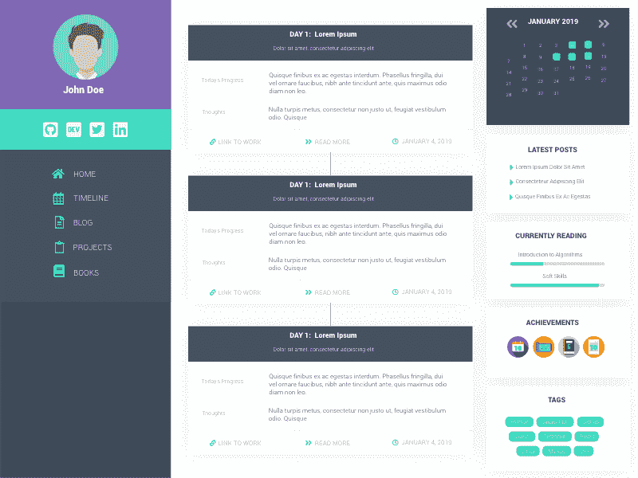

# 记录 100 天代码的另一种方法

> 原文：<https://dev.to/fabiorosado/an-alternative-way-to-log-your-100daysofcode-21b4>

这个项目旨在成为跟踪你的 100 天挑战的另一种方式。它可以让你拥有你的第一个投资组合——如果你愿意的话，或者是一个你可以跟踪自己进展的地方。

**GitHub:**[https://github.com/FabioRosado/100daysof](https://github.com/FabioRosado/100daysof)
T5】Demo:[https://100daysof.netlify.com](https://100daysof.netlify.com)

* * *

当我接受挑战的时候，我试着去想我想要的东西，并且想出了一些在项目中实现的东西。

*   查看所有进度的完整时间表
*   一种像 GitHub 图形一样保持轨道条纹的方法
*   一种扩展日志的方法，让它包含更多的东西，而不仅仅是*想法*和*进展*
*   一个跟踪挑战中阅读的书籍的地方
*   将挑战中完成的项目分开的地方
*   一个写博客的地方，记录学到的东西或想法
*   挑战中保持动力的方法

# 项目创建的原因

去年，我参加了#100DaysOfCode，并能够完成它，但未能保持连续 100 天。当我在挑战中工作时，我对我们记录进展的方式感到不满意，主要是因为我使用了一个单一的 markdown 文件。

慢慢地，一颗种子在我的脑海中成长，我能够为一个项目提出一个具体的想法，这个项目可以提供一种更好的方法来跟踪你的进展。我也想帮助那些以前从未编码过的人，并决定通过挑战进入编码领域。

# 诞生 100 天

看着我想要实现的东西，很明显，一个单独的 markdown 文件是不够的。所以我想到了为这个项目创建一个网站的想法。

此外，有很多人通过参加 100DaysOfCode 挑战开始编码，所以我想给他们提供建立和拥有自己的网站版本的可能性，以展示他们的进步，并成为他们的第一个作品集。

我想在 1 月 1 日发布这个项目，主要是因为很多人都在这一天接受挑战。所以我实现了我自己版本的 scrum 板，用我需要做的事情填满了积压的工作，开始了我的冲刺。

这个项目在 1.5 周后发布了——这有助于我休息并有足够的时间。但是很多事情需要改进，我也想在网站上添加一些成就，只是为了给挑战增加一点游戏化。

许多流动的标签——if/elif 语句——我创建了成就的基本逻辑，之后需要做的就是创建徽章。Adobe XD 是设计徽章和网站整体布局的好工具。

# 接下来是什么

目前，我对布局和实施的一切都很满意。该网站在 ipads 上看起来不太好，但在移动设备上看起来还可以，尽管还可以改进一些，所以任何反馈都是有价值的！

我希望有人使用这个项目，但是目前没有人使用它。希望这在未来会有所改变。最后，我想再补充几个成果，也许有些与所用的编码语言有关。