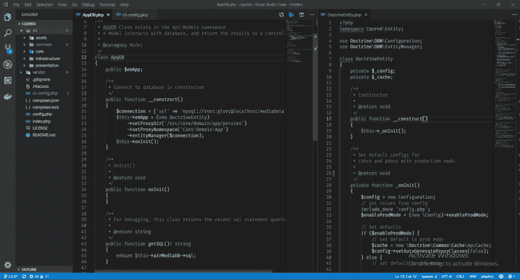

# CQured PHP 2019

> 原文：<https://dev.to/projectair/cqured-php-2019-4lpb>

# 适用于多 api 框架的 3.0alpha - >洋葱架构

[https://github.com/air-Design/cqured/tree/3.0.0](https://github.com/air-Design/cqured/tree/3.0.0)@ cquered we b-Api for presentation(Api)
@ doctrine for DB
@ lcobucci JWT for Auth。
@GuzzlePSR7
因为是第一次，所以#Doctrine 配置有些问题。但是看起来不错