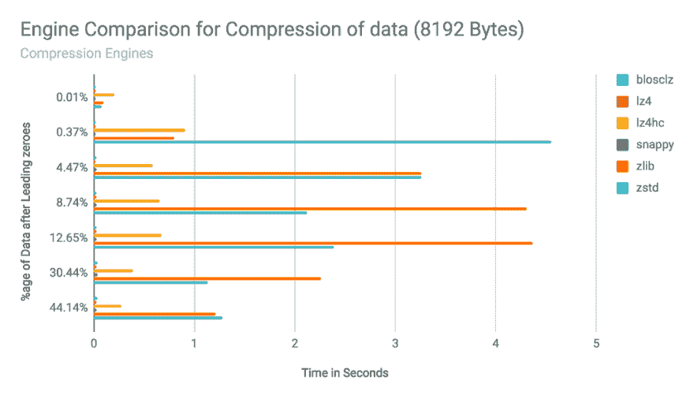
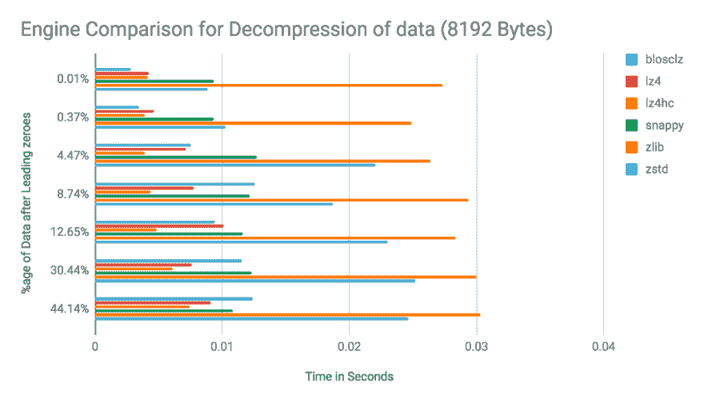
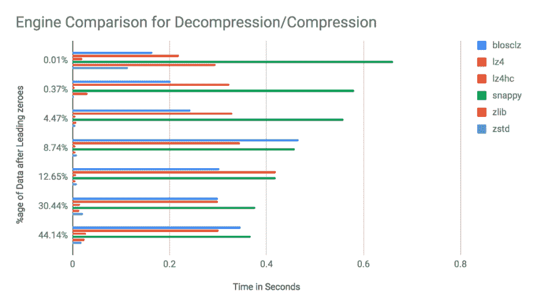
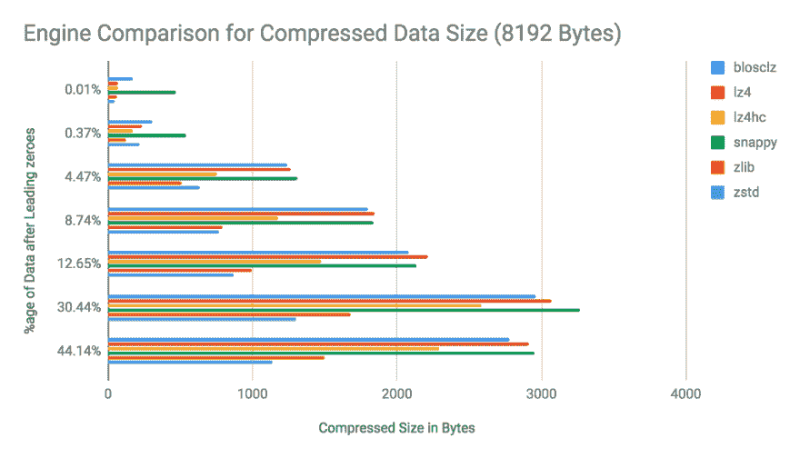

# 优化基于文档的存储-了解您的数据(KYD)

> 原文：<https://dev.to/sumitkumar1209/optimising-document-based-storage---know-your-data-kyd-1hp8>

### **优化基于文档的存储—** 了解数据(KYD)

正如介绍文章中的[所提到的，这篇博客详细介绍了我们如何找到存储序列化 HyperLogLog (HLL)注册问题的解决方案，并能够将我们的存储成本降低 7 倍。](https://dev.to/sumitkumar1209/optimising-e-commerce-data-17af-temp-slug-4168828)

[](https://res.cloudinary.com/practicaldev/image/fetch/s--R7U-H53Q--/c_limit%2Cf_auto%2Cfl_progressive%2Cq_66%2Cw_880/https://cdn-images-1.medium.com/max/636/1%2Ax9DD7BVlvFmlS6vW4nU7xA.gif) 

<figcaption>图片来源[小发明](https://www.gizmodo.com.au/2015/02/mits-well-on-its-way-to-perfecting-auto-zipping-zippers/)</figcaption>

#### 背故事:

HLL 寄存器的单个字符串转换给我们 8192 字符长的字符串，它与它所代表的值无关。要阅读一篇关于 HLL 的详细而有趣的文章，请点击此[链接](http://bit.ly/bloom-filters-medium)。这篇文章谈到了 Bloom filters。HLL 基于类似的基本实现。稍后我可能会尝试发布一个较短的版本。

因此，我们面临的问题是，无论 HLL 字符串表示值 1 或值 22k 或更大的值，它总是占用相同的存储空间。这种方法让我们为每个商店存储相同数量的数据，而不考虑它们的流量和目录大小，这归结为小流量客户的低 ROI，因为他们处于较低的价格计划中。

由于有大量小流量商店注册，因此我们的存储成本不断增加，因此迫切需要对此存储进行优化。

#### 想法:

关于如何优化的想法是在看了 HLL 字符串中的内容之后产生的，它只是大量的填充 0，而当它表示像 1 这样的较小值时，像 1 或 2 这样的其他数字很少出现。类似这样的事情

```
'000000000000000000000000000.....0000000001000000000........0000000' 
```

其中 1 第一次出现在第 5029 位，前面只有 0。

现在你可能已经猜到这是一个完美的压缩数据，有许多重复的字符，或者如果你还没有，这里有一个有趣的链接来阅读更多关于 [Zip Bomb](https://en.wikipedia.org/wiki/Zip_bomb) 如何将数 Pb 的数据压缩成 42Kbs 的 Zip 文件。

为了分析哪种压缩引擎适合我们的用例，在大量可用的压缩引擎和大量可供参考的博客之间展开了一场战争。但是它们中的每一个都有自己的优势和自己的使用案例。

我们需要的是哪个引擎最适合我们的用例，最好的方法是通过对我们的数据字符串进行不同引擎的基准测试。

#### 目标:

人们可以决定压缩发动机的要点是

1.  压缩速度
2.  减压速度
3.  压缩系数

现在，在最好的情况下，我希望在一个压缩引擎中包含所有这些内容，但大多数情况下，您不会得到您想要的。所以我们需要的是

1.  最高优先级的解压缩速度最快，因为解压缩的数据是实时提供的
2.  高于平均水平的压缩系数，可节省存储成本
3.  最后但并非最不重要的是一个良好的压缩速度来处理规模

#### 基准:

因此，我运行了一组脚本，并整理了一堆图表，以帮助我选择最适合我的存储之战的对手。在每个图表中，垂直 Y 轴代表字符串中前导零之后剩余数据的百分比，这意味着百分比越低，它所代表的值就越低。

例如，0.01%表示基数为 1 的 HLL 字符串。右边的图例代表了我测试过的不同压缩引擎。总的来说，我做了 4 次比较，以确定哪种引擎适合我们的需要。

**一、压缩速度比较**

在该图中，水平 X 轴表示通过每个压缩引擎压缩 8192 字节数据所用的时间，单位为秒。不需要高水平的数据分析能力来导出最快的压缩引擎是`blosclz`、`lz4`和`snappy`。`Lz4hc`在这次比较中排名第四，这是`lz4`的高压缩配置。

[](https://res.cloudinary.com/practicaldev/image/fetch/s--3MeiwlN4--/c_limit%2Cf_auto%2Cfl_progressive%2Cq_auto%2Cw_880/https://cdn-images-1.medium.com/max/1024/0%2A2OnhImCRu3AS3bL6)

**二。解压速度比较**

第二张图是以秒为单位的所有引擎的解压缩速度的可视化，如果你记得上面段落中我们的优先级，我们的主要需求是最快的解压缩速度，我们可以看到平均来说`lz4hc`排在第一位，即使在代表字符串的较小值中`blosclz`是最快的。

[](https://res.cloudinary.com/practicaldev/image/fetch/s--uwRVq0TM--/c_limit%2Cf_auto%2Cfl_progressive%2Cq_auto%2Cw_880/https://cdn-images-1.medium.com/max/1024/0%2A3Zi6Ut3Xek9DBru9)

**三世。解压缩与压缩速度比较**

增加了另一个有利于`lz4hc`的点是这个图表，在这里我比较了相同引擎的解压时间与压缩时间的比率，越小越好，这意味着与其他引擎相比，该引擎花费的解压时间相对较少。

[](https://res.cloudinary.com/practicaldev/image/fetch/s--ElPOJa9f--/c_limit%2Cf_auto%2Cfl_progressive%2Cq_auto%2Cw_880/https://cdn-images-1.medium.com/max/1024/0%2A97Nf4MB3pTM77xiE)

**四。压缩尺寸比较**

从以上几点可以清楚地看出，我在决定这场比较的最终赢家时进退两难，而这张图表让一切都变得清晰了。在这里，我们比较的是 8192 字节的 HLL 字符串的压缩大小。我们可以看到，`zlib`和`zstd`是明显的赢家，它们的最小尺寸一致，`lz4hc`排在第三位。

[](https://res.cloudinary.com/practicaldev/image/fetch/s--79uHpZy4--/c_limit%2Cf_auto%2Cfl_progressive%2Cq_auto%2Cw_880/https://cdn-images-1.medium.com/max/1024/0%2AwZ9IhOfqmP_rOXWM)

#### 结论:

做决定很容易，难的是承担它可能带来的后果。

> "没有什么比做出决定更困难，因此也更珍贵."
> 
> 拿破仑波拿巴

当所有数据都在你身边时，做决定并不困难。即使“blosclz”是压缩速度最快的，“zstd”的大小最小，“lz4hc”是唯一一个检查了我们所有优先级的框的，在大多数情况下，它的解压缩速度最快，压缩文件大小相对较小，压缩时间相对较快，我对 50%的引擎进行了基准测试。

我继续使用`lz4hc`作为我们的用例，它帮助我们将 MongoDB 存储减少到压缩前的 7 倍。

我们支持 MongoDB 二进制数据类型来存储压缩的二进制数据，这进一步帮助了不同语言库之间的压缩字符串的互操作性。我们主要使用节点。JS 用于服务 app 用户，Python 用于后台进程。

**附言**

如果您在同一个实例上进行优化，您可能看不到 MongoDB 声称的磁盘空间减少，因为 [MongoDB 不会释放磁盘空间回来](https://cyantificmusings.wordpress.com/2016/04/17/reclaiming-disk-space-from-mongodb/)。似乎他们受到了海盗的启发

[](https://res.cloudinary.com/practicaldev/image/fetch/s--xZl0CBm1--/c_limit%2Cf_auto%2Cfl_progressive%2Cq_66%2Cw_880/https://cdn-images-1.medium.com/max/720/1%2Az-n0jQdbYbF_XP3YCpmiCA.gif) 

<figcaption>来源[吉菲](https://giphy.com/gifs/reactionseditor-3o7btQtMuwv4FtXu0M)</figcaption>

图书馆链接:

*   [Python-Python-LZ4 2 . 1 . 0 文档的 LZ4 压缩库绑定](http://python-lz4.readthedocs.io/en/stable/)
*   欢迎阅读 python-blosc 的文档！- python-blosc 1.5.0 文档

***系列其他帖子***

*   [了解你的数据(KYD) - Sumit Kumar - Medium](https://dev.to/sumitkumar1209/know-your-data-kyd-45e6-temp-slug-3424402)
*   [优化电子商务数据- Sumit Kumar - Medium](https://dev.to/sumitkumar1209/optimising-e-commerce-data-17af-temp-slug-4168828)
*   [优化高索引文档存储-了解您的数据(KYD)](https://medium.com/real-spark/optimising-highly-indexed-document-storage-know-your-data-kyd-c5c11deaa736)

* * *