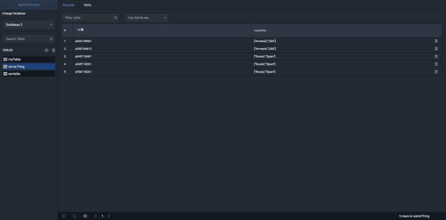

# DynamoDb 的跨平台 GUI(electron+vue . js =❤)

> 原文:# t0]https://dev . to/arattian/electron-vuej-dynamodb-4j85

AWS DynamoDb 的跨平台图形用户界面

#### [Github 资源库](https://github.com/Arattian/DynamoDb-GUI-Client)

特征

*   远程访问 AWS DynamoDB 服务*
*   本地发电机 b
*   支持多个数据库
*   视角
    *   表格视图
    *   记录视图
    *   表模式视图
*   操作
    *   记录
    *   添加记录
    *   编辑记录
    *   删除记录
    *   桌子
    *   添加表格
    *   编辑表格
    *   删除表格
    *   按属性值过滤
    *   按属性名过滤用于远程访问，需要提供访问和密钥。存储在 localstorage 中的所有密钥。

