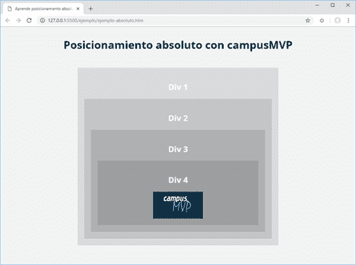
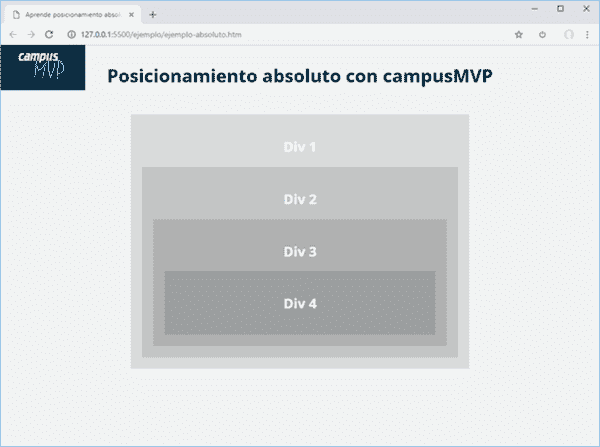
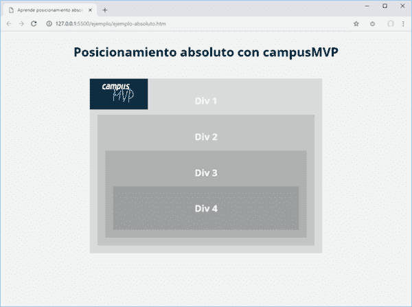
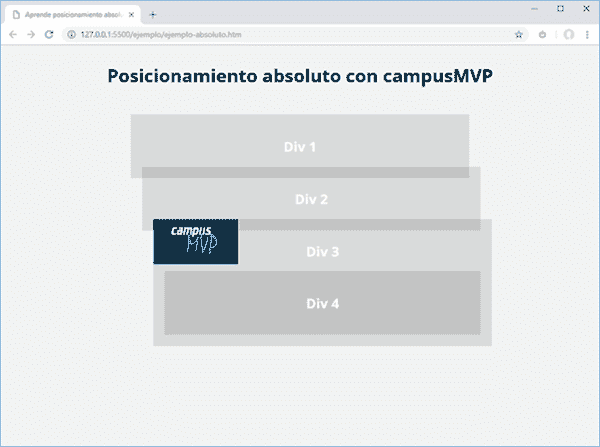
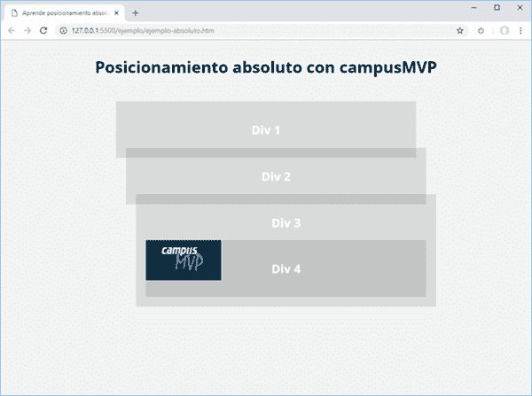

# 了解 html 元素的绝对定位

> [https://dev . to/campus MVP/了解-El-元素绝对定位-html-con-css-2la2](https://dev.to/campusmvp/entendiendo-el-posicionamiento-absoluto-de-elementos-html-con-css-2la2)

> 本文由 [Pablo Iglesias](https://twitter.com/piglesias) 在[校园 MVP 博客](https://www.campusmvp.es/recursos/post/entendiendo-el-posicionamiento-absoluto-html-css.aspx)上撰写

使用“`position:absolute;`”的元素的行为在输入时可能会显得不准确，尤其是如果您没有足够的 CSS 合成经验，并且不知道我将在此帖子中告诉您的基本细节。因此，如果尝试绝对定位某个项目时曾绝望过，最好继续阅读。

但让我们从头开始。`position`属性，如其名称所示，定义元素的放置方式。

默认情况下，其值为“`static`”，并遵循文档的正常流程，也就是说，它是从上到下、从左到右放置的，具体取决于它是直线元素还是块元素，以及它之前的空间和元素。

但也可以取其他值，可能是:`absolute`、`fixed`或`sticky.`

一旦定义了它们的位置，就可以使用属性`top`、`bottom`、`left`和`right`修改它们的确切位置，从而使它们像在坐标系中一样移动。

## 一个测试`position`的例子

现在，我们将看到一个实际的例子，我们将在其中更好地理解这一点:

我们有四个 divs，而在最后一个，则是一个链接到承载着校园 MVP 标识的图片的“`.logo`”类。具有“`position:static;`”的四个，这是浏览器默认应用于任何项目的值:

```
\<div class="div1"\> \<h2\>Div 1\</h2\> \<div class="div2"\> \<h2\>Div 2\</h2\> \<div class="div3"\> \<h2\>Div 3\</h2\> \<div class="div4"\> \<h2\>Div 4\</h2\> \<a class="logo" href="https://www.campusmvp.es"\> \ \</a\> \</div\> \</div\> \</div\> \</div\> 
```

[](https://res.cloudinary.com/practicaldev/image/fetch/s--equtMN5f--/c_limit%2Cf_auto%2Cfl_progressive%2Cq_auto%2Cw_880/https://www.campusmvp.es/recursos/image.axd%3Fpicture%3D/2018/4T/position-absolute-css/posicionamiento-css.png)

现在我将徽标链接定位为绝对坐标 0，0 左上，看看发生了什么:

```
a.logo {
    position:absolute;
    top:0;
    left:0;
} 
```

请注意，它相对于浏览器窗口放置在坐标 0，0 处:

[](https://res.cloudinary.com/practicaldev/image/fetch/s--vXYy0T_5--/c_limit%2Cf_auto%2Cfl_progressive%2Cq_auto%2Cw_880/https://www.campusmvp.es/recursos/image.axd%3Fpicture%3D/2018/4T/position-absolute-css/posicionamiento-absoluto-css.png)

## 我们尝试将其应用于`div` `position:relative;`

你好，你是说乐思·庞戈？:

```
.div1 {
    position:relative;
} 
```

[](https://res.cloudinary.com/practicaldev/image/fetch/s--unuihVLO--/c_limit%2Cf_auto%2Cfl_progressive%2Cq_auto%2Cw_880/https://www.campusmvp.es/recursos/image.axd%3Fpicture%3D/2018/4T/position-absolute-css/position-relative-div1.png)

嗯，有趣。相对于它定位。

## `Position: fixed;`

y 乐思·波内莫斯 al `.div2` un `position: fixed;`？:

```
.div2 {
    position:fixed;
} 
```

[](https://res.cloudinary.com/practicaldev/image/fetch/s--FkzcR1Ai--/c_limit%2Cf_auto%2Cfl_progressive%2Cq_auto%2Cw_880/https://www.campusmvp.es/recursos/image.axd%3Fpicture%3D/2018/4T/position-absolute-css/position-fixed-div2.png)

∞天啊！这个也一样。

## `Position: absolute;`

另外，现在我们把它放在`position: absolute;`

```
.div3 {
    position:absolute;
} 
```

[](https://res.cloudinary.com/practicaldev/image/fetch/s--a7WgY8TX--/c_limit%2Cf_auto%2Cfl_progressive%2Cq_auto%2Cw_880/https://www.campusmvp.es/recursos/image.axd%3Fpicture%3D/2018/4T/position-absolute-css/position-absolute-div3.png)

徽标也相对于徽标放置。

## `Position: sticky;`

并且为了划船，我们把它放在`.div4``position: sticky;`

```
.div4 {
    position:sticky;
} 
```

[](https://res.cloudinary.com/practicaldev/image/fetch/s--5HQofXmk--/c_limit%2Cf_auto%2Cfl_progressive%2Cq_auto%2Cw_880/https://www.campusmvp.es/recursos/image.axd%3Fpicture%3D/2018/4T/position-absolute-css/position-sticky-div4.png)

同样的事情再次发生。

## 总之-我...。

好吧，看来我们已经发现，我们的‘T2’标志将根据其最近的祖先定位，其值不同于‘t1’。还是一样的，定位的**(如果不是静态的话就叫它定位)。如果找不到已放置的祖先，则将其放置在浏览器窗口中。**

 **这是一般规则。实际上，最常用的公式是把`position:relative;`放在我们根本想放置的元素的容器里，因为它是与其他元素的放置问题最少的。但是这个问题比你必须控制的更微妙(参考系统、单位、元素崩溃、浮动-我...。)并在我们的[html 5 和 CSS3](https://www.campusmvp.es/recursos/catalogo/Product-HTML5-y-CSS3-a-fondo-para-desarrolladores_185.aspx) 在线课程中详细解释。

我希望我已经给你澄清了一些情况。[在这里我给你留下](https://www.campusmvp.es/recursos/Descargas/ejemplo-posicionamiento-absoluto-CSS_campusMVP.zip)的例子，让你继续和他玩，或者更好的是，创造你自己的例子。

web 合成并不难，但里面充满了像这样微妙的陷阱。如果你想用扎实的知识来学习如何避免它们，请看前面的课程，如果你已经掌握了 HTML 和 CSS 的基础知识，你肯定会感兴趣的 [**认真学习如何用 HTML5、Flexbox、CSS Grid 和 Bootstrap** 来创作*【响应】*](https://www.campusmvp.es/recursos/catalogo/Product-Maquetaci%C3%B3n-Responsive-con-HTML5,-Flexbox,-CSS-Grid-y-Bootstrap_212.aspx)**