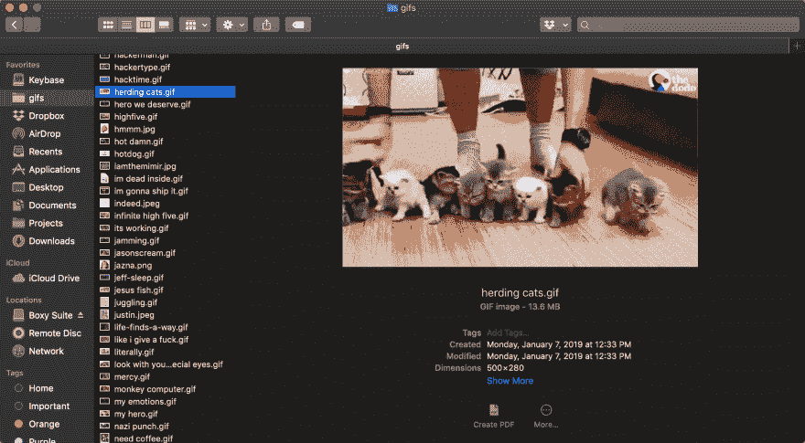
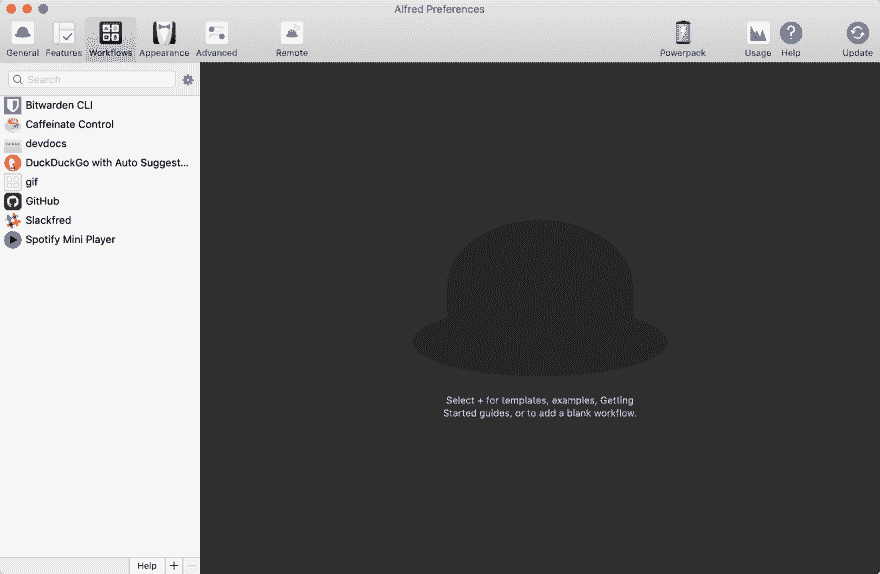
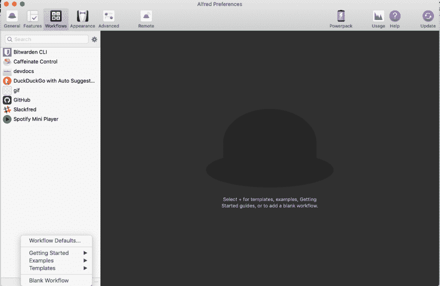
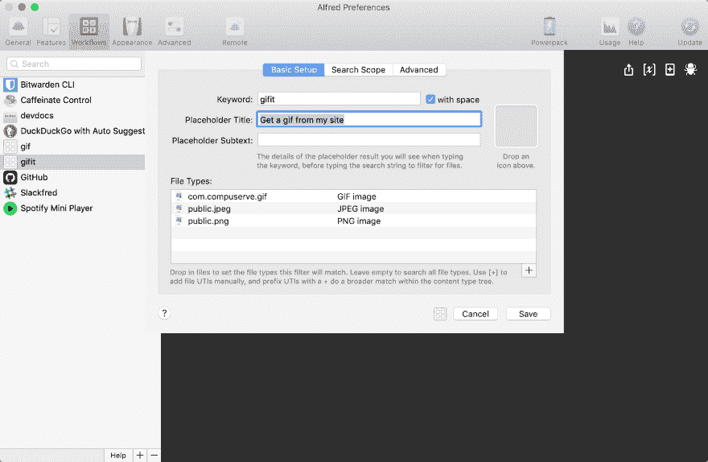
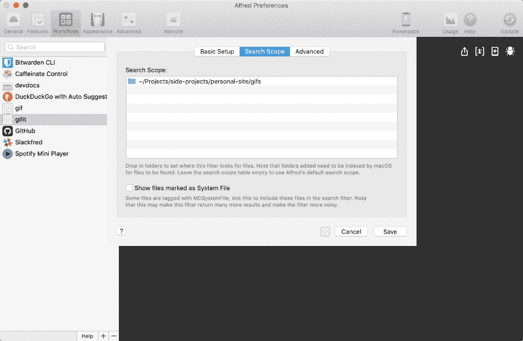

# 构建一个简单的 Alfred 工作流从我的网站上抓取 gif

> 原文：<https://dev.to/wuz/building-a-simple-alfred-workflow-to-grab-gifs-from-my-website-8i0>

我保存了很多 gif。

<figure>

[](https://res.cloudinary.com/practicaldev/image/fetch/s--7EqlKdwW--/c_limit%2Cf_auto%2Cfl_progressive%2Cq_auto%2Cw_880/https://thepracticaldev.s3.amazonaws.com/i/wyzsfhh30j2e9ujvh1cw.png)

<figcaption>I've got 169 as of this article</figcaption>

</figure>

我过去常常把它们存储在 Dropbox 中，并通过一个链接分享它们，但 Dropbox 改变了它们处理公共文件夹和链接的方式，所以把 gif 放进去很麻烦。此外，我正试图在 2019 年将我的东西从大型服务中迁移出来(更多信息将在未来的帖子中发布！)考虑到这一点，一两周前，我设置了一个不错的小 [Alfred workflow](https://www.alfredapp.com) 来获取我的 gif 链接并分享它们。

<figure>

[](https://res.cloudinary.com/practicaldev/image/fetch/s--LRKq78BW--/c_limit%2Cf_auto%2Cfl_progressive%2Cq_66%2Cw_880/https://wuz.fyi/gifs/typing.gif)

<figcaption>Actual footage of me searching and sharing gifs (not actual footage)</figcaption>

</figure>

首先，我必须设置我的 gif 托管。我用[近乎自由的言论](https://nearlyfreespeech.net)来托管[我的个人网站](https://wuz.fyi)。我把这些 gif 保存在那里的一个文件夹里，并用 [rsync](https://www.samba.org/rsync/) 来回同步它们。基本上，这一步你需要的只是一个公开托管的 gif 的基本 url 也就是我的网站的[https://wuz.fyi/gifs](https://wuz.fyi/gifs)。

[](https://res.cloudinary.com/practicaldev/image/fetch/s---YHV50c8--/c_limit%2Cf_auto%2Cfl_progressive%2Cq_66%2Cw_880/https://wuz.fyi/gifs/awesome.gif)

现在，我们来建立一个新的 alfred 工作流。打开您的 Alfred 首选项，前往**工作流程**选项卡:

[](https://res.cloudinary.com/practicaldev/image/fetch/s--X0kkyvcE--/c_limit%2Cf_auto%2Cfl_progressive%2Cq_auto%2Cw_880/https://thepracticaldev.s3.amazonaws.com/i/dpjblvxcvgyl5jqcoi4v.png)

点击侧边栏底部的小加号，然后点击**空白工作流程**:

[](https://res.cloudinary.com/practicaldev/image/fetch/s--2OH94s_w--/c_limit%2Cf_auto%2Cfl_progressive%2Cq_auto%2Cw_880/https://thepracticaldev.s3.amazonaws.com/i/9wwb6vr6hqnfx4t7fyan.png)

为您的工作流程提供名称、描述以及您想要提供的任何其他信息。

[](https://res.cloudinary.com/practicaldev/image/fetch/s--x0UCwwU1--/c_limit%2Cf_auto%2Cfl_progressive%2Cq_auto%2Cw_880/https://thepracticaldev.s3.amazonaws.com/i/xbad4jjr5i4t1te7tnem.png)

完成后，右击黑色区域添加一个工作流对象，并选择**输入** > **文件过滤器**。给你的过滤器一个关键字，一些占位符文本。然后将您想要搜索的文件类型拖放到**文件类型**部分。对我来说，那就是 gif、png 和 jpegs:

[](https://res.cloudinary.com/practicaldev/image/fetch/s--I3etLTD5--/c_limit%2Cf_auto%2Cfl_progressive%2Cq_auto%2Cw_880/https://thepracticaldev.s3.amazonaws.com/i/o0heinupqdcsf4jj5fkz.png)

现在，单击“搜索范围”选项卡，拖放 gif 文件夹:

[](https://res.cloudinary.com/practicaldev/image/fetch/s--4fKyI6hq--/c_limit%2Cf_auto%2Cfl_progressive%2Cq_auto%2Cw_880/https://thepracticaldev.s3.amazonaws.com/i/6ejkizjv9lkvyvvadp0z.png)

省省吧，让我们继续前进！再次右键选择**动作** > **运行脚本**。打开后，将“输入为 argv”改为“输入为{query}”，然后粘贴代码:

```
urlencode() {
    # urlencode <string>
    old_lc_collate=$LC_COLLATE
    LC_COLLATE=C

    local length="${#1}"
    for (( i = 0; i < length; i++ )); do local c="${1:i:1}"
        case $c in
            [a-zA-Z0-9.~_-]) printf "$c" ;;
            *) printf '%%%02X' "'$c" ;;
        esac
    done LC_COLLATE=$old_lc_collate
}
URL="https://wuz.fyi/gifs/"

echo -ne "${URL}$(urlencode "$(basename {query})")" | pbcopy 
```

Enter fullscreen mode Exit fullscreen mode

确保选中底部的每个复选框，除了“反斜杠”。你还会想把`URL`设置到你存放 gif 的地方。

[](https://res.cloudinary.com/practicaldev/image/fetch/s--4s4K2iVx--/c_limit%2Cf_auto%2Cfl_progressive%2Cq_auto%2Cw_880/https://thepracticaldev.s3.amazonaws.com/i/6lchmjp2uggf79umgbrp.png)

如果没问题的话，你应该可以打开 Alfred，键入你的关键字，后面跟着一个 gif 标题(即`gifit awesome.gif`)，然后按回车键。你的剪贴板应该有你想要的 gif！尝试粘贴，并确保所有工作！

[](https://res.cloudinary.com/practicaldev/image/fetch/s--2RjBml8N--/c_limit%2Cf_auto%2Cfl_progressive%2Cq_66%2Cw_880/https://wuz.fyi/gifs/infinite%2520high%2520five.gif)

好样的。我希望你能和我一样从中获得乐趣和用途！

[](https://res.cloudinary.com/practicaldev/image/fetch/s--UiXiTAQx--/c_limit%2Cf_auto%2Cfl_progressive%2Cq_66%2Cw_880/https://wuz.fyi/gifs/thats-our-show.gif)

帮我花太多钱在主机上！你最喜欢的 gif 是什么？下面分享！