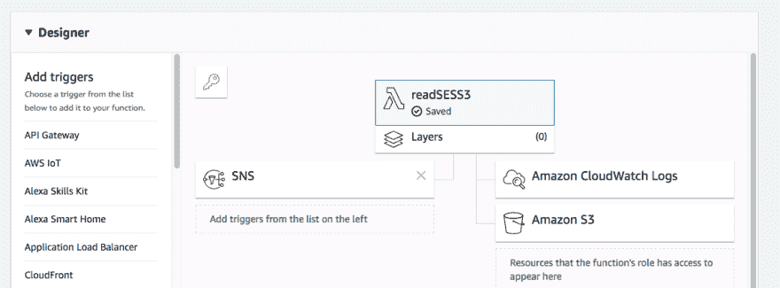

# 接收带有 SES 和 Slack 的电子邮件

> 原文：<https://dev.to/k4ml/receiving-email-with-ses-and-slack-3344>

当得到一个新的域名时，我们需要做的最重要的事情之一就是能够在这个域名上接收电子邮件。这要么是为了获得该域名的 ssl 证书，要么是为了让人们能够通过电子邮件地址联系到我们，比如 support@ourdomain.com。

有些域注册中心提供简单电子邮件重定向，您可以将收到的电子邮件转发到您提供的地址。但有时，你可能想对如何接收电子邮件有更多的控制。

在我们的例子中，我们希望将电子邮件转发到我们的 Slack 通道。亚马逊 SES(简单电子邮件服务)支持接收电子邮件。为此配置我们的域很简单，只需在域 DNS 记录(用于域验证)和 MX 记录中添加一个 TXT 记录，以提示任何想要向我们的域发送电子邮件的邮件客户端通过 SES 服务器发送邮件。

一旦电子邮件通过 SES，我们如何访问和阅读它？SES 没有提供任何类似 Gmail 或 Yahoo 的界面让我们阅读邮件。但它允许我们将电子邮件转发到 SNS(简单通知服务)主题。从这里，我们可以订阅主题，并将其发送到另一个电子邮件地址。问题是邮件是以 JSON 格式发送的，而不是普通的邮件格式。除了几封简单的邮件，阅读邮件内容几乎是不可能的。这也意味着简单地将邮件转发给 Slack 是行不通的。

所以我们需要对收到的邮件做一些预处理。幸运的是，SNS 也可以配置为在收到电子邮件时触发 Lambda 函数。这允许我们为预处理编写一些 python 代码。

但是还有一个问题。SNS 只支持接收不大于 170KB 的邮件。比这大，它会反弹。对于较大的电子邮件，AWS 建议我们先写给 S3。从那里，我们可以配置它来触发 SNS 通知，这反过来触发我们的 Lambda 函数。从那里，我们将使用 SNS 传入的对象密钥来读取来自 S3 的电子邮件。

大部分时间实际上花在弄清楚如何让我们的 Lambda 函数有权限读取 S3 桶上。界面非常混乱，但最终我设法得到了正确的设置。Lambda 设计器控制台最终应该是这样的:-

[](https://res.cloudinary.com/practicaldev/image/fetch/s--h71MSXbS--/c_limit%2Cf_auto%2Cfl_progressive%2Cq_auto%2Cw_880/https://thepracticaldev.s3.amazonaws.com/i/ltlgpv2hemv1z4741xq7.png)

下面是读取邮件并转发到 Slack 的完整代码:-

```
import os
import json
import boto3
import email
import logging
import smtplib

logger = logging.getLogger()
logger.setLevel(logging.INFO)

mailgun_host = os.environ['MAILGUN_HOST']
mailgun_user = os.environ['MAILGUN_USER']
mailgun_pass = os.environ['MAILGUN_PASS']

def lambda_handler(event, context):
    s3 = boto3.client("s3")
    logging.info("My Event is : %s", event)
    file_obj = event["Records"][0]
    data_json = json.loads(event['Records'][0]['Sns']['Message'])
    filename = data_json['receipt']['action']['objectKey']
    logging.info("filename: %s", filename)
    fileObj = s3.get_object(Bucket=os.environ['S3_BUCKET'], Key=filename)
    logging.info("file has been gotten!")
    msg = email.message_from_bytes(fileObj['Body'].read())
    domain_dest = msg['To'].split('@')[1]
    logging.info('%s %s %s domain_dest:%s', msg['From'], msg['To'], msg['Subject'], domain_dest)

    smtp_client = smtplib.SMTP(mailgun_host, 587)
    smtp_client.login(mailgun_user, mailgun_pass)
    smtp_client.sendmail(mailgun_user, [os.environ['SLACK_EMAIL']],
                         msg.as_string().encode('utf-8'))
    return 
```

Enter fullscreen mode Exit fullscreen mode

封面照片通过[好的免费照片](https://www.goodfreephotos.com/)。