# 天蓝色和地形

> 原文：<https://dev.to/tonytalkstech/azure-and-terraform-1n0l>

我一直相信交付是软件开发最重要的方面之一。我之前在博客上谈过这件事([我的核心价值观](https://dev.to/tonytalkstech/my-core-values-13go))。软件交付不仅仅是把比特放到最终的静止位置；它还必须包括基础设施供应，以明确定义位将实际到达的**。Terraform 有助于弥合这一差距，特别是考虑到像 Azure 这样的公共云产品。**

 **# 项目

我最近签约为一家金融服务初创公司实施部署管道。客户特别需要以可靠、可扩展的方式构建应用程序环境。在客户的解决方案中有两个应用程序:一个单页面应用程序和一个 web 服务层。

从非功能的角度来看，技术团队有许多需求:

*   开发团队必须能够以可靠、众所周知的方式将更新的代码资产部署到环境中，而无需人工干预
*   QA 团队必须能够将一个特性分支部署到特定的环境中，以进行特定于特性的测试
*   系统管理员必须能够快速调试和停用环境的所有方面，包括整个环境本身

# 提议

上面详述的非功能性需求给我指出了一个明显的位置:在微软 Azure 中托管应用程序，并利用尽可能多的平台服务。此外，利用 [Azure DevOps](https://azure.microsoft.com/en-us/services/devops/) 产品实现应用程序代码和应用程序环境之间的紧密集成。

## 微软 Azure

在 Azure 中， [App Services](https://azure.microsoft.com/en-us/services/app-service/) 将被用作应用程序主机，[Azure Database for PostgreSQL](https://azure.microsoft.com/en-us/services/postgresql/)将被用于数据库管理。除了核心平台服务，还将涉及一些其他产品:

*   [密钥库](https://azure.microsoft.com/en-us/services/key-vault/):用于管理应用秘密(如连接字符串、加密密钥等)。)
*   [应用洞察](https://docs.microsoft.com/en-us/azure/azure-monitor/app/app-insights-overview)用于为单页面应用和 web 服务提供应用性能监控
*   [存储](https://azure.microsoft.com/en-us/services/storage/):用作应用程序的 blob 存储位置

## 天蓝色 DevOps

Azure DevOps(以前称为 Visual Studio Team Services，以前称为 Team Foundation Server)被选为管理源代码控制以及构建和发布管道的工具集。 [Azure Repos](https://azure.microsoft.com/en-us/services/devops/repos/) 是远程源代码控制库， [Azure Pipelines](https://azure.microsoft.com/en-us/services/devops/pipelines/) 是构建和发布管道工具。

在未来的迭代中，工作项跟踪可能会从吉拉迁移到 [Azure Boards](https://azure.microsoft.com/en-us/services/devops/boards/) ，从泽法迁移到 [Azure Test Plans](https://azure.microsoft.com/en-us/services/devops/test-plans/) ，但是这并不在最初的工作集中。

## 地形

[Terraform](https://www.terraform.io/) 是 [HashiCorp](https://www.hashicorp.com/) 为实现[基础设施即代码](https://en.wikipedia.org/wiki/Infrastructure_as_code)的产品。

这听起来像很多行话，所以让我们把它归结为:基础设施即代码(IaC)允许您在源代码控制中预先定义您的基础设施实现。Terraform 是一个工具，它执行这些定义，以确保实现的基础设施与规范等效。它移动了同类最佳的软件开发实践(例如，源代码控制、代码审查、部署管道等)。)进入基础设施管理领域。

此外，由于广泛的 Terraform 社区和我个人的专业知识，Terraform 被选为 IaC 工具，而不是 [Azure 资源管理器模板(ARM 模板)](https://docs.microsoft.com/en-us/azure/azure-resource-manager/resource-group-authoring-templates)。我以前使用过 ARM 模板，但是 Terraform 提供了相同的输出，初始启动工作更少。虽然我对 YAML 恨之入骨，但它比用于 ARM 模板的 JSON 要少得多。

# 解

为每个应用程序实现解决方案通常是相同的。唯一的主要区别是 Terraform 实现和 Azure 构建管道本身的步骤，但概念是相似的。

## 天蓝色管道

Azure Pipelines 有两个概念:构建和发布管道。虽然我通常认为这应该是完美世界中的一个管道，但我可以理解为什么它们是分开的。构建管道用于生成工件，发布管道用于将这些工件移动到不同的阶段(即环境)。

最近，Azure Pipelines 在其产品中添加了源代码控制定义的构建管道。作为一个坚信源代码控制一切的人，一个`azure-pipeline.yml`文件现在同时存在于单页应用程序的存储库中和 web 服务的存储库中。这些将在下面的章节中详细介绍。

### 单页面应用程序构建管道

单页应用程序的管道可以在下面看到它的整体。从高层次来看，这是一个简单的构建:

*   运行`npm install`来获取应用程序的依赖项
*   Lint 应用程序，以确保它符合 Angular 的规范
*   构建应用程序
*   发布构建的应用程序
*   发布 Terraform 工件

构建的应用程序和 Terraform 工件都在相关的发布管道中使用。

值得注意的是，这个构建管道用于**所有分支**。这是为了确保整个存储库在任何给定的提交时都是可部署的，假设它成功地通过了构建管道。

在未来，应用程序团队计划在这个管道中实现自动化测试，以确保应用程序足够稳定，可以推进到发布管道。

```
# Single Page Application

pool:
  vmImage: 'Ubuntu-16.04'

variables:
  publishPath: 'dist/single-page-app'
  terraformPath: 'terraform'

steps:
- task: NodeTool@0
  inputs:
    versionSpec: '8.x'
  displayName: 'Install  Node.js'

- script: |
    npm install -g @angular/cli
    npm install
  displayName: 'npm  install'

- script: |
    ng lint
  displayName: 'ng  lint'

- script: |
    ng build
  displayName: 'ng  build'

- task: PublishBuildArtifacts@1
  displayName: 'Publish  Website  Artifacts'
  inputs:
    pathtoPublish: '$(publishPath)'
    artifactName: drop

- task: PublishBuildArtifacts@1
  displayName: 'Publish  Terraform'
  inputs:
    pathtoPublish: '$(terraformPath)'
    artifactName: terraform 
```

Enter fullscreen mode Exit fullscreen mode

### Web 服务构建管道

虽然 web 服务管道有更多的步骤，但它完成了与单页面应用程序大致相同的概念:

*   使用`nuget restore`恢复解决方案的依赖关系
*   构建后台数据处理器
*   构建 web 服务
*   构建数据库迁移应用程序(用于运行环境所需的 SQL 脚本(例如，模式更改、数据更改等)。))
*   构建数据库种子应用程序(用于为 SQL 数据库设置首次数据(即默认数据库用户及其角色))
*   发布每个构建的应用程序和 Terraform

和以前一样，构建的应用程序和 Terraform 将在未来的发布管道中使用。此外，这个构建是为所有分支运行的，原因和之前一样:拥有一个可部署的代码库是非常重要的。

您会注意到`dotnet publish`被用于数据库迁移器和数据库种子项目；这是有意的，因为应用程序计划向。未来的网芯。

任何自动化测试(例如，单元测试)的缺乏在这个构建管道中尤其突出。应用程序开发团队正计划在将来添加这些功能，就像单页面应用程序一样。

```
# Web Service

pool:
  vmImage: 'VS2017-Win2016'

variables:
  solution: '**/*.sln'
  buildConfiguration: 'Release'
  processorProject: 'WebService.Processor.csproj'
  webServiceProject: 'WebService.csproj'
  migratorProject: 'WebService.DbMigrator.csproj'
  seederProject: 'WebService.DbSeeder.csproj'
  webServicePublishPath: 'WebService/obj/Release/Package'
  migratorPublishPath: 'WebService.DbMigrator/bin/Debug/netcoreapp2.1/publish'
  seederPublishPath: 'WebService.DbSeeder/bin/Debug/netcoreapp2.1/publish'

steps:
- task: NuGetToolInstaller@0
  displayName: 'Install  NuGet'

- task: NuGetCommand@2
  displayName: 'Solution  NuGet  Restore'
  inputs:
    restoreSolution: '$(solution)'

- task: VSBuild@1
  displayName: 'Build  Processor'
  inputs:
    solution: '$(processorProject)'
    configuration: '$(buildConfiguration)'

- task: VSBuild@1
  displayName: 'Build  Web  Service'
  inputs:
    solution: '$(webServiceProject)'
    msbuildArgs: '/p:DeployOnBuild=true  /p:WebPublishMethod=Package  /p:PackageAsSingleFile=true  /p:SkipInvalidConfigurations=true'
    configuration: '$(buildConfiguration)'

- script: dotnet publish $(migratorProject)
  displayName: 'Build  and  Package  Database  Migrator'

- script: dotnet publish $(seederProject)
  displayName: 'Build  and  Package  Database  Seeder'

- task: PublishBuildArtifacts@1
  displayName: 'Publish  Web  Service  Artifacts'
  inputs:
    pathtoPublish: '$(webServicePublishPath)'
    artifactName: drop

- task: PublishBuildArtifacts@1
  displayName: 'Publish  Terraform  Artifacts'
  inputs:
    pathtoPublish: 'terraform'
    artifactName: terraform

- task: PublishBuildArtifacts@1
  displayName: 'Publish  Database  Migrator  Artifacts'
  inputs:
    pathtoPublish: '$(migratorPublishPath)'
    artifactName: migrator

- task: PublishBuildArtifacts@1
  displayName: 'Publish  Database  Seeder  Artifacts'
  inputs:
    pathtoPublish: '$(seederPublishPath)'
    artifactName: seeder 
```

Enter fullscreen mode Exit fullscreen mode

## 地形配置

对于每个应用程序，我定义了基础设施和平台服务以及应用程序的源代码，通常在一个`terraform`文件夹中。每个`terraform`文件夹都是这样组织的:

```
terraform
  env-dev
    destroy.bat
    main.tf
    setup.bat
    variables.tf
  env-production
    destroy.bat
    main.tf
    setup.bat
    variables.tf
  env-staging
    destroy.bat
    main.tf
    setup.bat
    variables.tf
  env-test-1
    destroy.bat
    main.tf
    setup.bat
    variables.tf
  env-test-2
    destroy.bat
    main.tf
    setup.bat
    variables.tf
  env-test-3
    destroy.bat
    main.tf
    setup.bat
    variables.tf
  modules
    ... some number of modules ... 
```

Enter fullscreen mode Exit fullscreen mode

### 模块

我使用 Terraform 模块来封装基础设施的特定部分。下面详细介绍了我在这两个应用程序中使用的模块。

| 名字 | 简称 | 描述 | 蔚蓝资源 |
| 应用程序接口 | 美国石油学会(American Petroleum Institute) | 定义 Web 服务托管服务。 | 

*   App service plan
*   Applied insight
*   App service

 |
| 数据库ˌ资料库 |  | 定义 PostgreSQL 服务器和数据库。 | 

*   一种数据库系统服务器

 |
| 钥匙库 | 千伏 | 定义机密存储和默认机密。 | 

*   Key bank
*   Keystore access strategy
*   Keystore secret

 |
| 资源组 | 錀 | 为包含所有 Azure 资源的给定环境定义资源组。 | 

*   Resource group

 |
| 储存；储备 | 储存；储备 | 定义应用程序使用的存储帐户。 | 

*   Storage account

 |
| 网 | 网 | 定义单页应用程序托管服务。 | 

*   App service plan
*   Applied insight
*   App service

 |

更明确地说，下面是我在每个模块中使用的确切文件。

#### API

##### 文件夹结构

```
modules
  api
    main.tf
    variables.tf 
```

Enter fullscreen mode Exit fullscreen mode

##### 文件

```
# main.tf

resource "azurerm_app_service_plan" "default" {
  name                = "${var.environment_prefix}-ws-plan"
  location            = "${var.location}"
  resource_group_name = "${var.resource_group_name}"
  tags                = "${var.tags}"

  sku {
    tier = "${var.app_service_plan_sku_tier}"
    size = "${var.app_service_plan_sku_size}"
  }
}

resource "azurerm_application_insights" "default" {
  name                = "${var.environment_prefix}-ws-ai"
  location            = "${var.location}"
  resource_group_name = "${var.resource_group_name}"
  application_type    = "Web"
  tags                = "${var.tags}"
}

resource "azurerm_app_service" "api" {
  name                = "${var.environment_prefix}-ws"
  location            = "${var.location}"
  resource_group_name = "${var.resource_group_name}"
  app_service_plan_id = "${azurerm_app_service_plan.default.id}"
  tags                = "${var.tags}"

  app_settings {
    "APPINSIGHTS_INSTRUMENTATIONKEY"                  = "${azurerm_application_insights.default.instrumentation_key}"
    "APPINSIGHTS_PROFILERFEATURE_VERSION"             = "1.0.0"
    "APPINSIGHTS_SNAPSHOTFEATURE_VERSION"             = "1.0.0"
    "ApplicationInsightsAgent_EXTENSION_VERSION"      = "~2"
    "DiagnosticServices_EXTENSION_VERSION"            = "~3"
    "InstrumentationEngine_EXTENSION_VERSION"         = "~1"
    "SnapshotDebugger_EXTENSION_VERSION"              = "~1"
    "XDT_MicrosoftApplicationInsights_BaseExtensions" = "~1"
    "XDT_MicrosoftApplicationInsights_Mode"           = "recommended"
  }
} 
```

Enter fullscreen mode Exit fullscreen mode

```
# variables.tf

variable "environment_prefix" {}
variable "location" {}

variable "tags" {
  type = "map"
}

variable "resource_group_name" {}
variable "app_service_plan_sku_tier" {}
variable "app_service_plan_sku_size" {} 
```

Enter fullscreen mode Exit fullscreen mode

#### 数据库

##### 文件夹结构

```
modules
  db
    main.tf
    variables.tf 
```

Enter fullscreen mode Exit fullscreen mode

##### 文件

```
# main.tf

resource "azurerm_postgresql_server" "default" {
  name                = "${var.environment_prefix}-app-db"
  location            = "${var.location}"
  resource_group_name = "${var.resource_group_name}"
  tags                = "${var.tags}"

  sku {
    name     = "${var.db_sku}"
    capacity = "${var.db_capacity}"
    tier     = "${var.db_tier}"
    family   = "${var.db_family}"
  }

  storage_profile {
    storage_mb            = "${var.db_storage_mb}"
    backup_retention_days = "${var.db_backup_retention_days}"
    geo_redundant_backup  = "${var.db_geo_redundant_backup}"
  }

  administrator_login          = "${var.db_administrator_login}"
  administrator_login_password = "${var.db_administrator_login_password}"
  version                      = "${var.db_version}"
  ssl_enforcement              = "${var.db_ssl_enforcement}"
}

resource "azurerm_postgresql_firewall_rule" "azure" {
  name                = "azure"
  resource_group_name = "${var.resource_group_name}"
  server_name         = "${azurerm_postgresql_server.default.name}"
  start_ip_address    = "0.0.0.0"
  end_ip_address      = "0.0.0.0"
}

resource "azurerm_postgresql_firewall_rule" "userhome" {
  name                = "user-home"
  resource_group_name = "${var.resource_group_name}"
  server_name         = "${azurerm_postgresql_server.default.name}"
  start_ip_address    = "xx.xx.xxx.xxx"
  end_ip_address      = "xx.xx.xxx.xxx"
}

resource "azurerm_postgresql_database" "app" {
  name                = "app"
  resource_group_name = "${var.resource_group_name}"
  server_name         = "${azurerm_postgresql_server.default.name}"
  charset             = "UTF8"
  collation           = "English_United States.1252"
} 
```

Enter fullscreen mode Exit fullscreen mode

```
# variables.tf

variable "environment_prefix" {}
variable "location" {}

variable "tags" {
  type = "map"
}

variable "resource_group_name" {}
variable "db_sku" {}
variable "db_capacity" {}
variable "db_tier" {}
variable "db_family" {}
variable "db_storage_mb" {}
variable "db_backup_retention_days" {}
variable "db_geo_redundant_backup" {}
variable "db_administrator_login" {}
variable "db_administrator_login_password" {}
variable "db_version" {}
variable "db_ssl_enforcement" {} 
```

Enter fullscreen mode Exit fullscreen mode

#### 钥匙保险库

##### 文件夹结构

```
modules
  kv
    main.tf
    variables.tf 
```

Enter fullscreen mode Exit fullscreen mode

##### 文件

```
# main.tf

data "azurerm_client_config" "current" {}

resource "azurerm_key_vault" "default" {
  name                            = "${var.environment_prefix}-app-kv"
  location                        = "${var.location}"
  resource_group_name             = "${var.resource_group_name}"
  tags                            = "${var.tags}"
  enabled_for_template_deployment = true
  tenant_id                       = "${var.tenant_id}"

  sku {
    name = "standard"
  }
}

resource "azurerm_key_vault_access_policy" "azuredevops" {
  vault_name          = "${azurerm_key_vault.default.name}"
  resource_group_name = "${var.resource_group_name}"
  tenant_id           = "${var.tenant_id}"
  object_id           = "${var.azuredevops_object_id}"

  secret_permissions = [
    "get",
    "list",
    "set",
    "delete",
  ]
}

resource "azurerm_key_vault_access_policy" "current" {
  vault_name          = "${azurerm_key_vault.default.name}"
  resource_group_name = "${var.resource_group_name}"
  tenant_id           = "${data.azurerm_client_config.current.tenant_id}"
  object_id           = "${data.azurerm_client_config.current.service_principal_object_id}"

  secret_permissions = [
    "get",
    "list",
    "set",
    "delete",
  ]
}

resource "azurerm_key_vault_access_policy" "adminuser" {
  vault_name          = "${azurerm_key_vault.default.name}"
  resource_group_name = "${var.resource_group_name}"
  tenant_id           = "${var.tenant_id}"
  object_id           = "${var.adminuser_object_id}"

  secret_permissions = [
    "get",
    "list",
    "set",
    "delete",
    "recover",
    "backup",
    "restore",
  ]

  certificate_permissions = [
    "create",
    "delete",
    "deleteissuers",
    "get",
    "getissuers",
    "import",
    "list",
    "listissuers",
    "managecontacts",
    "manageissuers",
    "purge",
    "recover",
    "setissuers",
    "update",
    "backup",
    "restore",
  ]

  key_permissions = [
    "get",
    "list",
    "update",
    "create",
    "import",
    "delete",
    "recover",
    "backup",
    "restore",
  ]
}

resource "azurerm_key_vault_secret" "secret_1" {
  name      = "secret_1"
  value     = "${var.key_vault_secret_1}"
  vault_uri = "${azurerm_key_vault.default.vault_uri}"
  tags      = "${var.tags}"
}

resource "azurerm_key_vault_secret" "secret_2" {
  name      = "secret_2"
  value     = "${var.key_vault_secret_2}"
  vault_uri = "${azurerm_key_vault.default.vault_uri}"
  tags      = "${var.tags}"
} 
```

Enter fullscreen mode Exit fullscreen mode

```
# variables.tf

variable "environment_prefix" {}
variable "location" {}

variable "tags" {
  type = "map"
}

variable "resource_group_name" {}

variable "tenant_id" {
  type        = "string"
  description = "The Azure Active Directory tenant ID that should be used for authenticating requests to the key vault."
  default     = "xxxxxxxx-xxxx-xxxx-xxxx-xxxxxxxxxxxx"
}

variable "azuredevops_object_id" {
  default     = "xxxxxxxx-xxxx-xxxx-xxxx-xxxxxxxxxxxx"
}

variable "adminuser_object_id" {
  default     = "xxxxxxxx-xxxx-xxxx-xxxx-xxxxxxxxxxxx"
}

variable "key_vault_secret_1" {}
variable "key_vault_secret_2" {} 
```

Enter fullscreen mode Exit fullscreen mode

#### 资源组

##### 文件夹结构

```
modules
  rg
    main.tf
    output.tf
    variables.tf 
```

Enter fullscreen mode Exit fullscreen mode

##### 文件

```
# main.tf

resource "azurerm_resource_group" "default" {
  name     = "${var.environment_prefix}-app-rg"
  location = "${var.location}"
  tags     = "${var.tags}"
} 
```

Enter fullscreen mode Exit fullscreen mode

```
# output.tf

output "name" {
  value = "${azurerm_resource_group.default.name}"
}

output "location" {
  value = "${azurerm_resource_group.default.location}"
} 
```

Enter fullscreen mode Exit fullscreen mode

```
# variables.tf

variable "environment_prefix" {}
variable "location" {}

variable "tags" {
  type = "map"
} 
```

Enter fullscreen mode Exit fullscreen mode

#### 储存

##### 文件夹结构

```
modules
  storage
    main.tf
    variables.tf 
```

Enter fullscreen mode Exit fullscreen mode

##### 文件

```
# main.tf

resource "azurerm_storage_account" "default" {
  name                     = "${var.environment_prefix}appstorage"
  location                 = "${var.location}"
  resource_group_name      = "${var.resource_group_name}"
  tags                     = "${var.tags}"
  account_tier             = "Standard"
  account_replication_type = "LRS"
} 
```

Enter fullscreen mode Exit fullscreen mode

```
# variables.tf

variable "environment_prefix" {}
variable "location" {}

variable "tags" {
  type = "map"
}

variable "resource_group_name" {} 
```

Enter fullscreen mode Exit fullscreen mode

#### 网页

##### 文件夹结构

```
modules
  web
    main.tf
    variables.tf 
```

Enter fullscreen mode Exit fullscreen mode

##### 文件

```
# main.tf

resource "azurerm_app_service_plan" "default" {
  name                = "${var.environment_prefix}-web-plan"
  location            = "${var.location}"
  resource_group_name = "${var.resource_group_name}"

  sku {
    tier = "${var.app_service_plan_sku_tier}"
    size = "${var.app_service_plan_sku_size}"
  }
}

resource "azurerm_application_insights" "default" {
  name                = "${var.environment_prefix}-web-ai"
  location            = "${var.location}"
  resource_group_name = "${var.resource_group_name}"
  application_type    = "Web"
}

resource "azurerm_app_service" "web" {
  name                = "${var.environment_prefix}-web"
  location            = "${var.location}"
  resource_group_name = "${var.resource_group_name}"
  app_service_plan_id = "${azurerm_app_service_plan.default.id}"

  app_settings {
    "APPINSIGHTS_INSTRUMENTATIONKEY"                  = "${azurerm_application_insights.default.instrumentation_key}"
    "APPINSIGHTS_PROFILERFEATURE_VERSION"             = "1.0.0"
    "APPINSIGHTS_SNAPSHOTFEATURE_VERSION"             = "1.0.0"
    "ApplicationInsightsAgent_EXTENSION_VERSION"      = "~2"
    "DiagnosticServices_EXTENSION_VERSION"            = "~3"
    "InstrumentationEngine_EXTENSION_VERSION"         = "~1"
    "SnapshotDebugger_EXTENSION_VERSION"              = "~1"
    "XDT_MicrosoftApplicationInsights_BaseExtensions" = "~1"
    "XDT_MicrosoftApplicationInsights_Mode"           = "recommended"
  }
} 
```

Enter fullscreen mode Exit fullscreen mode

```
# variables.tf

variable "environment_prefix" {}
variable "location" {}

variable "tags" {
  type = "map"
}

variable "resource_group_name" {}
variable "app_service_plan_sku_tier" {}
variable "app_service_plan_sku_size" {} 
```

Enter fullscreen mode Exit fullscreen mode

### 环境

通常，每个环境都有相同的外观和感觉。拥有这些单独的环境文件夹(例如，`env-dev`、`env-production`等)的意义在于。)的目的是让 Terraform 轻松运行其正常脚本，而无需在发布管道中进行更多配置。例如，如果我们将应用程序部署到开发环境中，我们将当前的工作目录更改为`env-dev`，并执行我们在其他地方会执行的相同脚本。

下面可以看到这些文件的更详细的信息。

#### 单页面应用环境

这个单页应用程序只包含几个 Terraform 模块，因为它的实现要简单得多。

```
# main.tf

terraform {
  backend "azurerm" {
    container_name = "terraform"
    key            = "tfbackend-web.tfstate"
  }
}

provider "azurerm" {
  version = "=1.20.0"
}

module "rg" {
  source = "../modules/rg"

  environment_prefix = "${var.environment_prefix}"
  location           = "${var.location}"
  tags               = "${var.tags}"
}

module "web" {
  source = "../modules/web"

  environment_prefix        = "${var.environment_prefix}"
  resource_group_name       = "${module.rg.name}"
  location                  = "${module.rg.location}"
  tags                      = "${var.tags}"
  app_service_plan_sku_tier = "${var.app_service_plan_sku_tier}"
  app_service_plan_sku_size = "${var.app_service_plan_sku_size}"
} 
```

Enter fullscreen mode Exit fullscreen mode

```
# variables.tf

variable "environment_prefix" {
  description = "The prefix for the environment."
  type        = "string"
  default     = "d"
}

variable "location" {
  description = "Specifies the supported Azure location where the resource exists. Changing this forces a new resource to be created."
  type        = "string"
  default     = "eastus"
}

variable "tags" {
  description = "The tags to associate with the resources."
  type        = "map"

  default = {
    "terraform" = "true"
  }
}

variable "app_service_plan_sku_tier" {
  type        = "string"
  description = "Specifies the plan's pricing tier."
  default     = "Shared"                             # Shared | Basic | Standard | ...
}

variable "app_service_plan_sku_size" {
  type        = "string"
  description = "Specifies the plan's instance size."
  default     = "D1"                                  # D1 | B1 | S1 | ...
} 
```

Enter fullscreen mode Exit fullscreen mode

#### Web 服务环境

Web 服务比单页面应用程序包含更多的基础设施。这主要是为了容纳应用程序所需的数据库和一些配置机密。

```
# main.tf

terraform {
  backend "azurerm" {
    container_name = "terraform"
    key            = "tfbackend"
  }
}

provider "azurerm" {
  version = "=1.20.0"
}

module "rg" {
  source = "../modules/rg"

  environment_prefix = "${var.environment_prefix}"
  location           = "${var.location}"
  tags               = "${var.tags}"
}

module "db" {
  source = "../modules/db"

  environment_prefix              = "${var.environment_prefix}"
  location                        = "${module.rg.location}"
  tags                            = "${var.tags}"
  resource_group_name             = "${module.rg.name}"
  db_sku                          = "${var.db_sku}"
  db_capacity                     = "${var.db_capacity}"
  db_tier                         = "${var.db_tier}"
  db_family                       = "${var.db_family}"
  db_storage_mb                   = "${var.db_storage_mb}"
  db_backup_retention_days        = "${var.db_backup_retention_days}"
  db_geo_redundant_backup         = "${var.db_geo_redundant_backup}"
  db_administrator_login          = "${var.db_administrator_login}"
  db_administrator_login_password = "${var.db_administrator_login_password}"
  db_version                      = "${var.db_version}"
  db_ssl_enforcement              = "${var.db_ssl_enforcement}"
}

module "api" {
  source = "../modules/api"

  environment_prefix        = "${var.environment_prefix}"
  resource_group_name       = "${module.rg.name}"
  location                  = "${module.rg.location}"
  tags                      = "${var.tags}"
  app_service_plan_sku_tier = "${var.app_service_plan_sku_tier}"
  app_service_plan_sku_size = "${var.app_service_plan_sku_size}"
}

module "kv" {
  source = "../modules/kv"

  environment_prefix               = "${var.environment_prefix}"
  location                         = "${var.location}"
  tags                             = "${var.tags}"
  resource_group_name              = "${module.rg.name}"
  tenant_id                        = "${var.tenant_id}"
  azuredevops_object_id            = "${var.azuredevops_object_id}"
  key_vault_secret_1               = "${var.key_vault_secret_1}"
  key_vault_secret_2               = "${var.key_vault_secret_2}"
}

module "storage" {
  source = "../modules/storage"

  environment_prefix  = "${var.environment_prefix}"
  location            = "${var.location}"
  tags                = "${var.tags}"
  resource_group_name = "${module.rg.name}"
} 
```

Enter fullscreen mode Exit fullscreen mode

```
# variables.tf

variable "environment_prefix" {
  description = "The prefix for the environment."
  type        = "string"
  default     = "d"          # this is different for each environment
}

variable "location" {
  description = "Specifies the supported Azure location where the resource exists. Changing this forces a new resource to be created."
  type        = "string"
  default     = "eastus"
}

variable "tags" {
  description = "The tags to associate with the resources."
  type        = "map"

  default = {
    "terraform" = "true"
  }
}

variable "tenant_id" {
  type        = "string"
  description = "The Azure Active Directory tenant ID that should be used for authenticating requests to the key vault."
  default     = "xxxxxxxx-xxxx-xxxx-xxxx-xxxxxxxxxxxx"
}

variable "azuredevops_object_id" {
  default     = "xxxxxxxx-xxxx-xxxx-xxxx-xxxxxxxxxxxx"
}

variable "adminuser_object_id" {
  default     = "xxxxxxxx-xxxx-xxxx-xxxx-xxxxxxxxxxxx"
}

variable "app_service_plan_sku_tier" {
  type        = "string"
  description = "Specifies the plan's pricing tier."
  default     = "Shared"                             # Shared | Basic | Standard | ...
}

variable "app_service_plan_sku_size" {
  type        = "string"
  description = "Specifies the plan's instance size."
  default     = "D1"                                  # D1 | B1 | S1 | ...
}

variable "db_sku" {
  type        = "string"
  description = "Specifies the SKU Name for this PostgreSQL Server. The name of the SKU, follows the tier + family + cores pattern (e.g. B_Gen4_1, GP_Gen5_8)."
  default     = "B_Gen5_1"
}

variable "db_capacity" {
  type        = "string"
  description = "The scale up/out capacity, representing server's compute units."
  default     = 1
}

variable "db_tier" {
  type        = "string"
  description = "The tier of the particular SKU. Possible values are Basic, GeneralPurpose, and MemoryOptimized. "
  default     = "Basic"
}

variable "db_family" {
  type        = "string"
  description = "The family of hardware Gen4 or Gen5, before selecting your family check the product documentation for availability in your region."
  default     = "Gen5"
}

variable "db_storage_mb" {
  type        = "string"
  description = "Max storage allowed for a server. Possible values are between 5120 MB(5GB) and 1048576 MB(1TB) for the Basic SKU and between 5120 MB(5GB) and 4194304 MB(4TB) for General Purpose/Memory Optimized SKUs."
  default     = 51200
}

variable "db_backup_retention_days" {
  type        = "string"
  description = "Backup retention days for the server, supported values are between 7 and 35 days."
  default     = 7
}

variable "db_geo_redundant_backup" {
  type        = "string"
  description = "Enable Geo-redundant or not for server backup. Valid values for this property are Enabled or Disabled, not supported for the basic tier."
  default     = "Disabled"
}

variable "db_administrator_login" {
  type        = "string"
  description = "The Administrator Login for the PostgreSQL Server. Changing this forces a new resource to be created."
  default     = "adminuser"
}

variable "db_administrator_login_password" {
  type        = "string"
  description = "The Administrator Login's password for the PostgreSQL Server. Required to be passed in."
}

variable "db_version" {
  type        = "string"
  description = "Specifies the version of PostgreSQL to use. Valid values are 9.5, 9.6, and 10.0\. Changing this forces a new resource to be created."
  default     = "10.0"
}

variable "db_ssl_enforcement" {
  type        = "string"
  description = "Specifies if SSL should be enforced on connections. Possible values are Enabled and Disabled."
  default     = "Enabled"
}

variable "key_vault_secret_1" {
  type        = "string"
  description = "The first secret"
}

variable "key_vault_secret_2" {
  type        = "string"
  description = "The second secret"
} 
```

Enter fullscreen mode Exit fullscreen mode

#### 设置和销毁脚本

对于那些关注我的人，你会注意到我在每个环境文件夹中都有两个脚本:`setup.bat`和`destroy.bat`。这些文件中的每一个都被**忽略了`.gitignore`文件中的**，因为它们包含 Azure 秘密，但是它们在我开发解决方案的时候很有用。下面可以看到里面的内容。

```
rem setup.bat

@ECHO OFF

set ARM_ACCESS_KEY=xxxxx

terraform init -backend-config="storage_account_name=dterraformstorage"
terraform fmt
terraform validate 
```

Enter fullscreen mode Exit fullscreen mode

```
rem destroy.bat

@ECHO OFF

set ARM_ACCESS_KEY=xxxxx

terraform init -backend-config="storage_account_name=dterraformstorage"
terraform destroy 
```

Enter fullscreen mode Exit fullscreen mode

## 天蓝色释放管道

我在上面详细描述了源代码控制的构建管道，但是我在对话中明确地省略了发布管道。Azure Pipelines 目前还不支持发布管道的代码配置。虽然这对于整个产品来说是一个损害，但是发布管道的 web UI 通常是一个好的 UI。

### 单页应用发布管道

整个单页应用程序只有一个发布管道，每个管道都定义了许多阶段。在这些阶段中的每一个阶段，都会运行许多任务。

#### SPA 发布管道阶段

一个给定的阶段可以被看作是一个环境的功能等价物。

[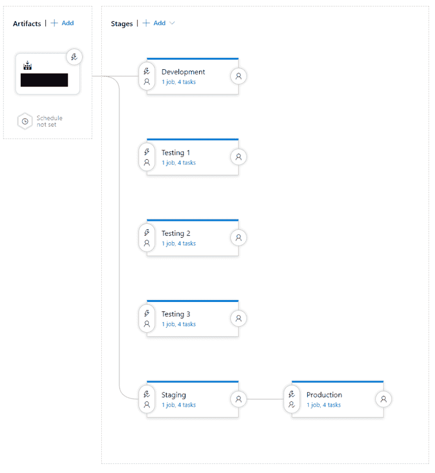](https://res.cloudinary.com/practicaldev/image/fetch/s--1_IQJ-Vx--/c_limit%2Cf_auto%2Cfl_progressive%2Cq_auto%2Cw_880/https://blog.tonymorris.io/img/single-page-application-release-pipeline-stages.png)

该图像定义了来自构建管道的一组给定工件可以采用的一些路径:

*   如果它来自`develop`分支，则自动部署到开发阶段
*   手动部署到三个测试环境中的任何一个
*   如果它来自`master`分支，则自动部署到暂存阶段。如果团队成员批准发布，那么它可以被手动提升到生产阶段。

#### SPA 发布管道阶段任务

您会注意到每个阶段都有四个任务:除了一些环境变量之外，每个任务通常都是相同的。

[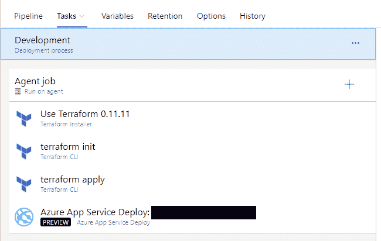](https://res.cloudinary.com/practicaldev/image/fetch/s--xfrm0TP6--/c_limit%2Cf_auto%2Cfl_progressive%2Cq_auto%2Cw_880/https://blog.tonymorris.io/img/single-page-application-release-pipeline-tasks.png)

这些任务相对简单。请注意，Terraform 任务是从[市场](https://marketplace.visualstudio.com/items?itemName=charleszipp.azure-pipelines-tasks-terraform)添加的。

*   下载 Terraform 二进制文件

[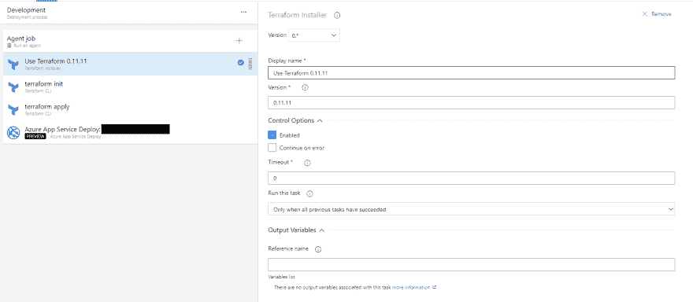](https://res.cloudinary.com/practicaldev/image/fetch/s--hz1fxWY3--/c_limit%2Cf_auto%2Cfl_progressive%2Cq_auto%2Cw_880/https://blog.tonymorris.io/img/single-page-application-release-pipeline-install-terraform.png)

*   初始化 Terraform 后端(在本例中使用`azurerm`)

[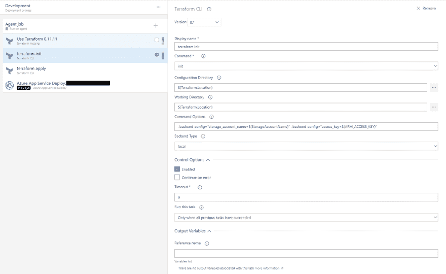](https://res.cloudinary.com/practicaldev/image/fetch/s--NFKebMTP--/c_limit%2Cf_auto%2Cfl_progressive%2Cq_auto%2Cw_880/https://blog.tonymorris.io/img/single-page-application-release-pipeline-init-terraform.png)

*   将地形配置应用于指定的环境

[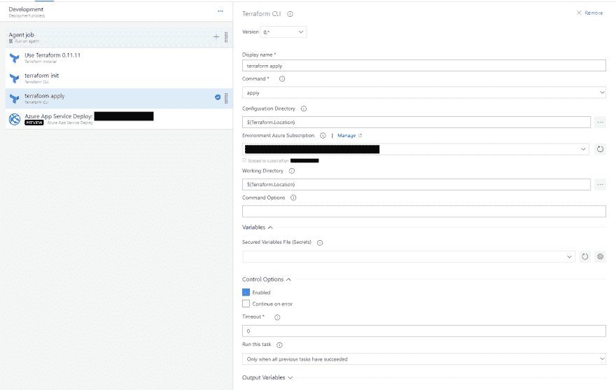](https://res.cloudinary.com/practicaldev/image/fetch/s--Aafk8EV4--/c_limit%2Cf_auto%2Cfl_progressive%2Cq_auto%2Cw_880/https://blog.tonymorris.io/img/single-page-application-release-pipeline-apply-terraform.png)

*   将`dist`目录(构建的应用程序)部署到之前创建的应用程序服务中

[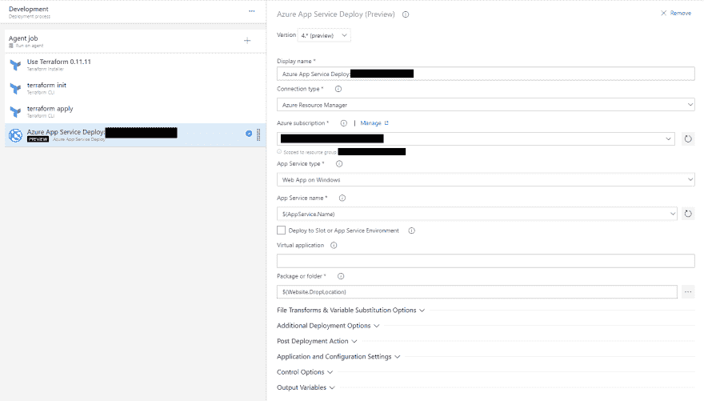](https://res.cloudinary.com/practicaldev/image/fetch/s--jlQvtjq9--/c_limit%2Cf_auto%2Cfl_progressive%2Cq_auto%2Cw_880/https://blog.tonymorris.io/img/single-page-application-release-pipeline-deploy.png)

### Web 服务发布管道

web 服务发布管道在概念上与单页面应用程序的发布管道非常相似。恰好还有几个步骤，特别是与数据库自动化相关的步骤。

#### WS 发布管道阶段

就像前面的发布管道一样，下面的每个阶段都类似于应用程序的给定环境。

[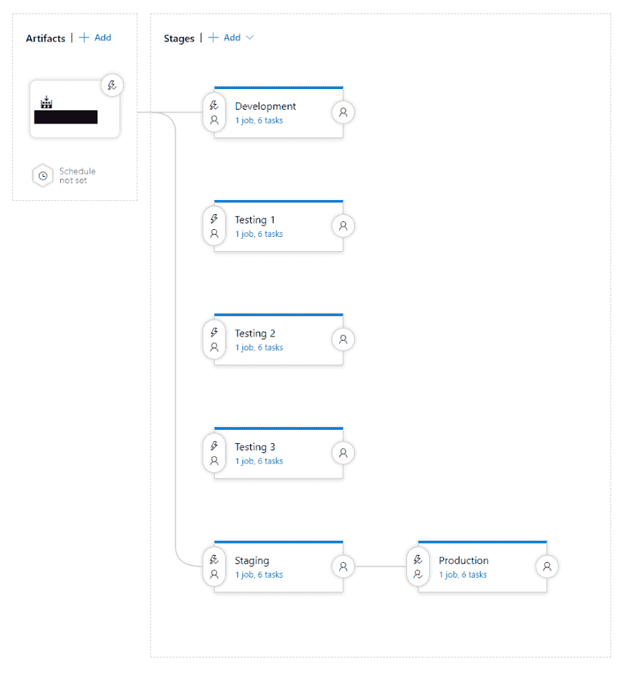](https://res.cloudinary.com/practicaldev/image/fetch/s--AuEz8Qv3--/c_limit%2Cf_auto%2Cfl_progressive%2Cq_auto%2Cw_880/https://blog.tonymorris.io/img/web-services-release-pipeline-stages.png)

工件可以采用的路径与单页面应用程序相同:

*   如果它来自`develop`分支，则自动部署到开发阶段
*   手动部署到三个测试环境中的任何一个
*   如果它来自`master`分支，则自动部署到暂存阶段。如果团队成员批准发布，那么它可以被手动提升到生产阶段。

#### WS 发布管道阶段任务

这个发布管道的每个阶段都有六个任务。每个阶段都是相同的六个步骤，只是环境变量有所不同。

[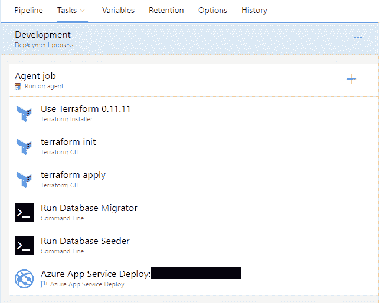](https://res.cloudinary.com/practicaldev/image/fetch/s--TmhCCW2T--/c_limit%2Cf_auto%2Cfl_progressive%2Cq_auto%2Cw_880/https://blog.tonymorris.io/img/web-services-release-pipeline-tasks.png)

此应用程序发布管道的任务如下所示。

*   下载 Terraform 二进制文件

[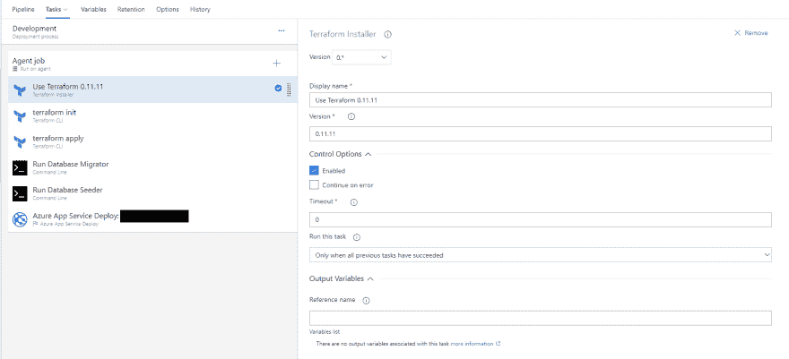](https://res.cloudinary.com/practicaldev/image/fetch/s--aK89TG7e--/c_limit%2Cf_auto%2Cfl_progressive%2Cq_auto%2Cw_880/https://blog.tonymorris.io/img/web-services-release-pipeline-install-terraform.png)

*   初始化 Terraform 后端(在本例中使用`azurerm`)

[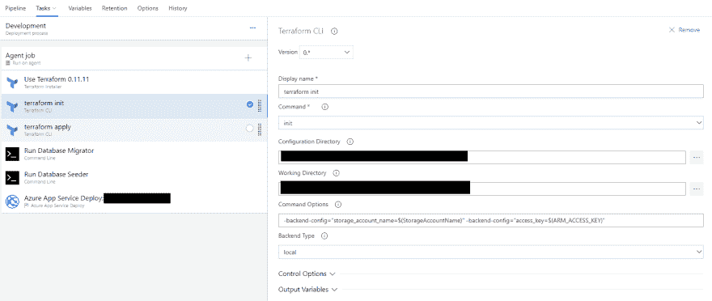](https://res.cloudinary.com/practicaldev/image/fetch/s--SkO-ZbbF--/c_limit%2Cf_auto%2Cfl_progressive%2Cq_auto%2Cw_880/https://blog.tonymorris.io/img/web-services-release-pipeline-init-terraform.png)

*   将地形配置应用于指定的环境

[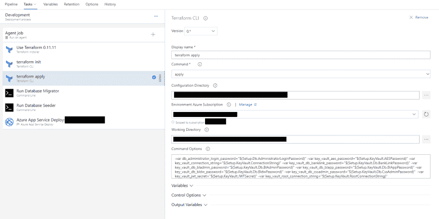](https://res.cloudinary.com/practicaldev/image/fetch/s--crF8AfGT--/c_limit%2Cf_auto%2Cfl_progressive%2Cq_auto%2Cw_880/https://blog.tonymorris.io/img/web-services-release-pipeline-apply-terraform.png)

*   运行数据库迁移应用程序

[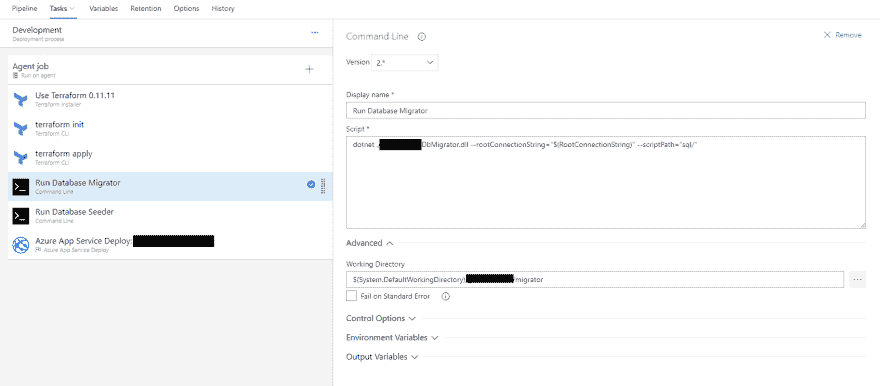](https://res.cloudinary.com/practicaldev/image/fetch/s--ceFdIznF--/c_limit%2Cf_auto%2Cfl_progressive%2Cq_auto%2Cw_880/https://blog.tonymorris.io/img/web-services-release-pipeline-run-migrator.png)

*   运行数据库播种应用程序

[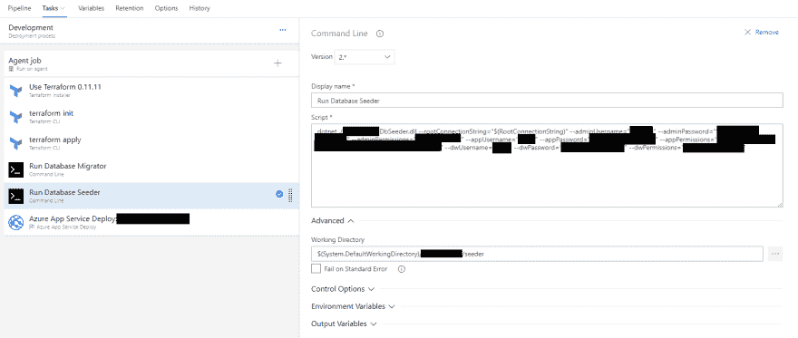](https://res.cloudinary.com/practicaldev/image/fetch/s--vdD7H939--/c_limit%2Cf_auto%2Cfl_progressive%2Cq_auto%2Cw_880/https://blog.tonymorris.io/img/web-services-release-pipeline-run-seeder.png)

*   将打包的 web 应用程序部署到之前创建的应用程序服务中

[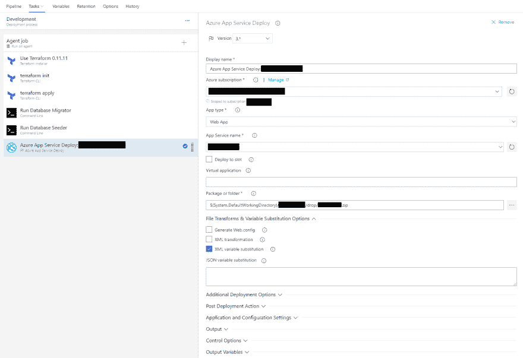](https://res.cloudinary.com/practicaldev/image/fetch/s--eli7JDhG--/c_limit%2Cf_auto%2Cfl_progressive%2Cq_auto%2Cw_880/https://blog.tonymorris.io/img/web-services-release-pipeline-deploy.png)

# 下一步

抱歉，时间太长了。

正如前面几节所述，应用程序开发团队在自动化测试方面还有一些工作要做。上面详细描述的管道可以很容易地利用任何需要的测试框架。

有许多小的改进或重构可以跨应用程序层完成，但这些将在项目生命周期的后期进行。**