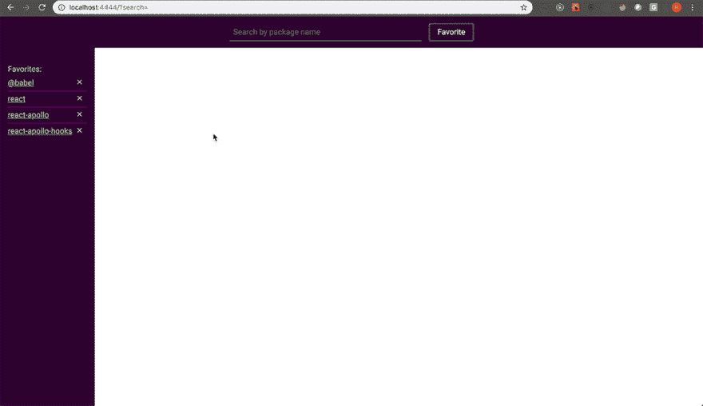

# 利用节点模块提供离线文档

> 原文：<https://dev.to/ramsay/leveraging-node-modules-to-provide-offline-documentation-lg4>

[https://codesandbox.io/embed/555wy183l](https://codesandbox.io/embed/555wy183l)

你是一个年轻、时尚、忙碌的开发人员吗？我也不是，但我确实倾向于在无法访问互联网的情况下做一些应用程序开发。我也不时髦。而青春稍纵即逝。

总之。

有很好的解决方案来获取离线文档。我想到了 DevDocs，因为它为许多常用软件提供了很好的离线文档存储，并且它有大量的特性。事实上，你应该用这个。然而，你不能为任何你想要的包添加离线文档。发生了一些守门。

如果像 DevDocs 这样的现有解决方案不能满足您的需求，您可以利用应用程序中安装的软件包附带的文档。没错，我说的是`README.md`文件。

在™️的那个周末，我有了构建一个小型 CLI 工具的想法，这个工具可以创建一个 express 服务器来寻找`node_modules`目录并提供每个包的`README.md`文件的内容。该工具还会提供一个网络界面，让你在`node_modules`中搜索包裹。它还可以使用 IndexedDB 来离线存储收藏夹。

所以我做了。结果是 [Module Docs](https://www.npmjs.com/package/module-docs) ，您可以将其作为节点包安装。

[](https://res.cloudinary.com/practicaldev/image/fetch/s--G-oGBld---/c_limit%2Cf_auto%2Cfl_progressive%2Cq_66%2Cw_880/https://thepracticaldev.s3.amazonaws.com/i/zt54iqt5leqh9q9mzni2.gif)

您可以全局安装，也可以按项目安装。安装后，通过运行:
启动 cli

```
$ module-docs start 
```

您可以创建一个 npm 脚本，作为开发过程的一部分自动启动 module-docs。下面是我的使用方法:

```
{  "scripts:"  {  "start":  "npm run start:docs && webpack-dev-server",  "start:docs":  "module-docs start"  }  } 
```

您可以通过在项目目录的根目录下创建一个`module-docs.config.js`文件来为您想要使用的每个项目配置`module-docs`。目前，您可以提供一组包名作为收藏夹，比如:

```
// module-docs.config.js
module.exports = {
   favorites: ["react", "react-apollo", "react-apollo-hooks"]
} 
```

如果你只是想用它，你可以停止在这里阅读，去过你最好的生活。如果你想继续了解它是如何建成的，那就祈祷吧，继续读下去。

## 创建 CLI

为了创建 cli，我将使用 [commander.js](https://www.npmjs.com/package/commander) ，这是一个非常流行的 CLI 构建工具。

```
const program = require("commander")
const makeServer = require("./server/serve")
const path = require("path")

// gets the config file from the working directory of the application 
const getConfig = () => {
  const configPath = path.join(process.cwd(), "./module-docs.config.js")
  const config = require(configPath)
  return config ? config || null
}

// using commander, execute the start command which spins up the express server
program.command("start").action(() => {
  const modulePath = path.join(process.cwd(), "./node_modules")
  const config = getConfig()
  makeServer(modulePath, config)
})

program.parse(process.argv) 
```

这是整个`module_docs`包的起点。它允许您运行`module-docs start`来启动 express 服务器。让我们来看看服务器。

## 构建服务器

服务器是使用 Express 构建的非常基本的节点服务器。它使用`webpack-dev-middleware`来创建一个开发服务器，该服务器将为 web UI 提供一个 React 应用程序。

```
const express = require("express")
const webpack = require("webpack")
const config = require("../webpack.config")
const devMiddleware = require("webpack-dev-middleware")
const compiler = webpack(config)
const bodyParser = require("body-parser")

// controller to handle API requests
const FileController = require("./controllers")

// Probably should make this configurable 
const PORT = 4444

module.exports = (modulePath, config) => {
  const app = express()

  app.use(bodyParser.json())

  // start webpack dev server
  app.use(
    devMiddleware(compiler, {
      open: true,
      stats: "errors-only"
    })
  )

  // handles getting package names from node_modules
  app.post("/modules", FileController.getFiles(modulePath, config))

  // handles getting the package info and README from a package
  app.post("/module/:name", FileController.getPackage(modulePath))

  app.get("*", function response(req, res) {
    res.sendFile("./client/template.html", { root: __dirname })
  })

  app.listen(PORT, () => {
    console.log(`Module Docs is running at http://localhost:${PORT}`)
  })
} 
```

如您所见，有两个 API 端点。第一个端点处理从`node_modules`获取目录名。第二个端点获取`README`内容，并解析`package.json`以获得关于包的信息。目前，UI 只显示软件包版本和到软件包主页的链接，如果有的话。

为了处理 POST 请求，我创建了一个`FileController`。这是所有繁重工作的地方。

## 文件控制器

这个文件肯定需要一些重构。也就是说，我将把这个文件分成几个部分。一、效用函数及导入:

```
const fs = require("fs")
const pipe = require("lodash/fp/pipe")
const some = require("lodash/some")
const promisify = require("util").promisify
const readdir = promisify(fs.readdir)
const readFile = promisify(fs.readFile)

// directories to exclude from the search
const blacklist = [".bin", ".cache", ".yarn-integrity"]

const filterThroughBlacklist = files =>
  files.filter(f => !blacklist.includes(f))

// check to see if the list of files includes the filename
const checkFilesForFile = files => fileName =>
  some(files, f => f.name === fileName)

// Get all the files in the package that are directories. This is used
// for mono-repos are scoped packages that don't contain README files directly. 
// I could probably refactor this and the blackListFilter into one util function
const getDirectories = files =>
  files.filter(f => f.isDirectory() && f.name !== "node_modules")

// checks a package directory to see if it contains a README or a package.json file
const checkPackage = files => {
  const checkFilesFor = checkFilesForFile(files)
  return {
    hasReadme: checkFilesFor("README.md"),
    hasPackageInfo: checkFilesFor("package.json")
  }
}

// gets the content of the README and the package.json file, if they exist
const getDirectoryContent = async directory => {
  const files = await readdir(directory, { withFileTypes: true })
  const { hasReadme, hasPackageInfo } = checkPackage(files)
  const readmeContent =
    hasReadme && (await readFile(`${directory}/README.md`, "utf8"))

  const packageInfo =
    hasPackageInfo && (await readFile(`${directory}/package.json`, "utf8"))

  return {
    files,
    readmeContent,
    packageInfo
  }
}

// If a package has sub-directories, check each directory for a README and package.json
// If they exists, get contents of each and return
const getPackagesFromChildren = parentDir => children => {
  const readmes = children.map(async child => {
    const childDir = `${parentDir}/${child.name}`
    const { readmeContent, packageInfo } = await getDirectoryContent(childDir)
    return readmeContent || packageInfo
      ? {
          name: child.name,
          path: `${childDir}/README.md`,
          content: readmeContent,
          info: packageInfo
        }
      : {}
  })

  return Promise.all(readmes)
} 
```

值得注意的是，我已经创建了一个*黑名单*，将文件从搜索中排除，因为它们在`node_modules`中，但对我们的目的没有用。我相信这个列表并不全面。

此外，我们应该提供一个包含`README`和`package.json`文件的子目录(子目录)列表，以防所讨论的包是一个 mono-repo 包，或者是一个像 babel 这样的作用域包。这就是`getPackagesFromChildren`所做的。

上述 util 函数将在`FileController`处理程序中使用。让我们来看看它们。

```
// gets directory names from a path, excluding blacklisted names. Returns an array of strings.
exports.getFiles = (path, config) => async (req, res) => {
  const files = await readdir(path)
  const filteredFiles = filterThroughBlacklist(files)
  res.send({ files: filteredFiles, config })
}

// Gets README content for package and all first-level children.
exports.getPackage = path => async (req, res) => {
  const name = req.params.name
  const dir = `${path}/${name}`

  try {
    const { files, readmeContent, packageInfo } = await getDirectoryContent(dir)
    const children = await pipe(
      getDirectories,
      getPackagesFromChildren(dir)
    )(files)

    const pkg = {
      path: dir,
      content: readmeContent,
      info: packageInfo,
      children: children
    }

    res.send({ pkg })
  } catch (err) {
    console.log("Unable to scan directory: " + err)
    res.send({ pkg: "No Readme Found" })
  }
} 
```

对于服务器端的事情来说，这就差不多了。

至于前端，它是使用 React 构建的(在编写 16.8-alpha 时，所以我可以使用那些甜蜜的钩子)。你最好的选择是使用下面的代码沙箱。

[https://codesandbox.io/embed/555wy183l](https://codesandbox.io/embed/555wy183l)

## 总结起来

对一个周末来说还不错。我将继续开发一些我个人喜欢使用的其他功能，比如能够为每个包添加自定义注释，能够链接和获取文档，以及离线保存文档。让我知道你的想法！