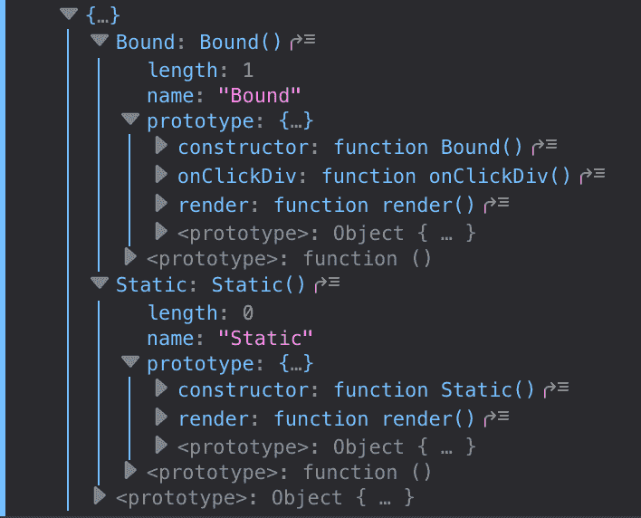

# 静态方法和绑定方法的区别

> 原文：<https://dev.to/staydecent/the-difference-between-static-and-bound-methods-28bk>

最近，在[工作](http://inputlogic.ca)时，我们拿出了我们的[反应风格指南](https://github.com/inputlogic/styleguides/blob/master/react.md)(基于 [AirBnBs](https://github.com/airbnb/javascript/tree/master/react) )。“规则”之一是避免在 render 方法中绑定方法(因为这在每次渲染时都会创建一个新的函数)，一位队友提到，“为什么不直接使用静态箭头函数呢？”

虽然两种解决方案实际上是相同的，但我担心技术上的差异。静态方法是在每个原型实例的类*而不是*上定义的。

## 等等，那么箭头函数是如何将正确的`this`绑定到静态的呢？！

这个魔法让我很担心。于是我拉了个[巴别塔 REPL](https://babeljs.io/repl) 写了两个类:

```
class Static extends React.Component {
  onClickDiv = () => {
    // do stuff
  }

  render () {
    return <div onClick={this.onClickDiv} />
  }
}

class Bound extends React.Component {
  constructor (props) {
  super(props)
    this.onClickDiv = this.onClickDiv.bind(this)
  }

  onClickDiv () {
    // do stuff
  }

  render () {
    return <div onClick={this.onClickDiv} />
  }
} 
```

transpiled 绑定类如您所料，但是静态类导致:

```
class Static extends React.Component {
  constructor(...args) {
    var _temp;

    return _temp = super(...args), this.onClickDiv = () => {
      // do stuff
    }, _temp;
  }

  render() {
    return React.createElement("div", { onClick: this.onClickDiv });
  }
} 
```

哦！所以也许这些在技术上是等价的！但是定义一个类方法仍然是一种不同于在`this`引用上定义一个函数的语法。所以我把编译好的代码放进了一个 [FireFox 便签本](https://developer.mozilla.org/en-US/docs/Tools/Scratchpad)。

[](https://res.cloudinary.com/practicaldev/image/fetch/s--beRIusyk--/c_limit%2Cf_auto%2Cfl_progressive%2Cq_auto%2Cw_880/http://staydecent.ca/assets/media/class-prototypes.png)

唯一的区别似乎是原型上存在绑定类方法，而静态 arrow 函数没有。

但是，这有什么关系呢？根据我的经验，通常不会，除非你想在测试中模仿一个类方法(通过覆盖原型上的定义)，或者——但愿不会！ —你计划扩展这个类。

最后，由于技术上的差异，在我们的风格指南中，我们没有在绑定方法上强制使用静态方法，而是两者都可以，只要你意识到其中的含义。

我是否忽略了这两者之间的其他差异？我很想知道是否还有其他细节需要考虑。