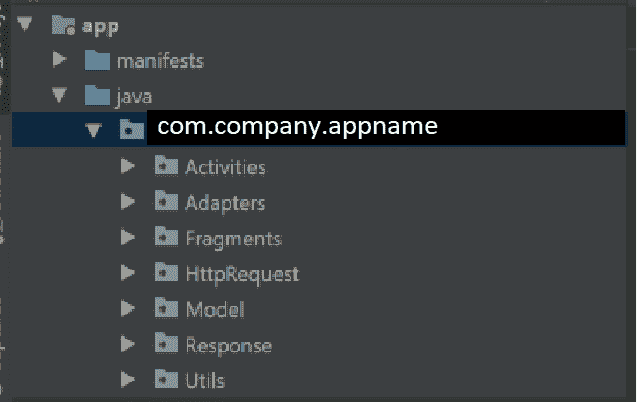
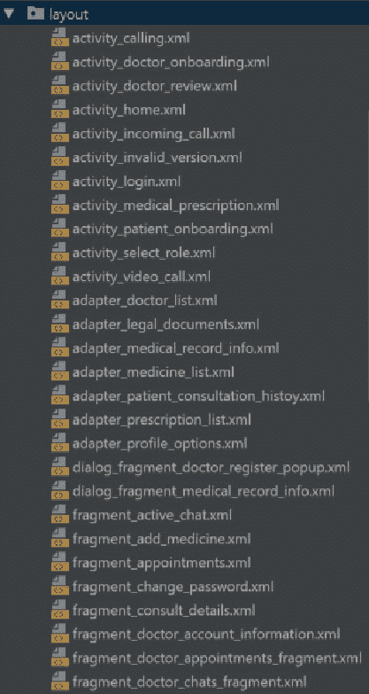

# 让你的 Android 应用项目有条理的小贴士

> 原文：<https://dev.to/miguelrodoma95/tips-to-keep-your-android-app-project-organized-361n>

## 一个有组织的代码结构的重要性

都是关于*可读性*的。由于使用了大量的类、资源文件和库，大型项目可能难以组织。拥有一个有组织的代码结构包括根据它们的目的将类分成不同的包，并为资源文件取合适的名字。

如果你使用 **AndroidStudio** 或 **IntelliJ** 开发 Android 应用程序，这篇文章会很有用。

## Android 应用项目的包名

快速注意，当您刚刚创建一个新项目时，您将被要求为您的项目选择包名。正如 [Android 文档](https://developer.android.com/studio/build/application-id)所述，正确的项目命名方式是 **com.company.appname** ，这遵循了普通的 Java 包命名惯例。

## 文件类型

我们在 Android 中使用的一些文件类型包括*类*(ClassName.java 或。kt)和*资源文件* (activity_main.xml)如 drawables、layouts、values 等。

默认情况下，类和资源文件由 AndroidStudio(或 IntelliJ)分隔。你可以在 app/java/com.company.myapp/中找到类，在 app/res 中找到资源文件，但是我之前提到过，大项目可以有很多不同用途的类，还有很多布局资源文件。保持他们的组织化对于一个可维护的项目是很重要的。

## 类

### 组织和命名提示

在一个项目中，你可以有很多不同目的的类。当然，你会有活动、片段、对象模型、适配器，以及取决于你的应用范围的网络请求、服务、包装器(我称之为*响应*)等等。

至于类名，我喜欢按照[这个指南](https://github.com/ribot/android-guidelines/blob/master/project_and_code_guidelines.md)，以*组件*(活动、片段等)的名称结束名称。).

Android Studio 允许你在 app/java/com.company.myapp/之后创建包，这样你就可以根据它的用途使用它们来保持类的分离。这将帮助您和您的同事浏览您的项目。要创建包，只需右键单击包名->新建->包。

*   **活动:**包含 yout 项目*活动*类。活动名称示例可以是 LoginActivity。

*   **片段**:包含你的项目*片段*类。片段名称示例可以是 UserRegisterFragment

*   **Adapters** :包含你的 ListViews(或者 RecyclerViews)的*适配器*类。应该尽可能重用适配器，以防止代码重复。(DRY:)适配器名称示例可以是 SongsAdapter。

*   **网络调用**:这取决于你的偏好，我个人将这个包命名为 *HttpRequest* ，包含与 *Retrofit2* 相关的类来执行 REST 调用，以及我定义端点的 API 接口。类的名字可以不同，在我的例子中，我通常有 RetrofitServer.java，MyAppAPI.java 和 APIUtils.java 类。

*   **Models**:*Model*包通常用于存储从网络请求映射对象的类，或者简单地在其他类中创建对象。因为将一个对象初始化为‘house model House = new House model()’看起来很奇怪，所以我从中取出了*组件*的名称，并将其保留为 House。

*   **包装器或响应**:这个包包含了在执行网络调用时作为*包装器*的类，通常只包含一个指向模型类的对象。与适配器一样，尽可能多地重用它们。我通常用与它将包装的模型类相同的名字来命名这个类，但是在末尾加上' Response ',例如，HouseResponse。

*   Utils :你定义的任何其他不需要自己的包的类，从简单的为你的文本视图创建一些特殊边界的类，到管理用户会话的*服务*或*单例类*。

这里有一个我的包看起来怎么样的快速例子。

## 资源文件

### 资源文件的类型

资源文件可以在 *res* 文件夹中找到。有几个包含资源文件的包，其中一些是:drawables(用于图标，图像和背景)，字体，布局(用于我们的活动和片段布局)，菜单(用于诸如 NavigationDrawers，BottomNavigationBar 等菜单)。)、值(可能包含字符串、颜色、尺寸、样式以及其他资源。

我将把重点放在布局资源文件的命名约定上。遗憾的是，您不能像我们处理类那样创建包或文件夹来保存布局文件，所有的布局都保存在布局文件夹中。这就是为什么选择正确的命名约定很重要。

### 资源文件命名提示

对我有用的一点是将我的布局资源文件命名为:“component_description”。例如，您的登录活动的布局将被命名为 **activity_login** 。用户注册片段布局将被命名为**片段 _ 用户注册 _ 活动**。对于适配器、对话框片段，甚至*菜单*资源文件也是如此(例如对于一个 bottomnavigationmenu:bottom _ nav _ main _ menu)。这样你只需要寻找组件，然后寻找布局的描述。把它想象成排序。

这里有一个例子:

即使我没有为我的布局文件选择最好的名字(仍然需要重构)，我知道在哪里寻找片段布局，我的对话片段，以及活动和适配器。

## 结论

这个帖子到此为止！我们已经讨论了保持和组织项目的重要性，以及如何通过简单的日常实践做到这一点。如果你认为有一些惯例或实践对我或任何阅读这篇文章的人的代码组织有用，请分享！

推特:[https://twitter.com/MiguelDev_95](https://twitter.com/MiguelDev_95)

### 有些引用

[https://blog . smart logic . io/2013-07-09-organizing-your-Android-development-code-structure/](https://blog.smartlogic.io/2013-07-09-organizing-your-android-development-code-structure/)

[https://guides . code path . com/Android/Organizing-your-Source-Files](https://guides.codepath.com/android/Organizing-your-Source-Files)

[https://github . com/ribot/Android-guidelines/blob/master/project _ and _ code _ guidelines . MD](https://github.com/ribot/android-guidelines/blob/master/project_and_code_guidelines.md)