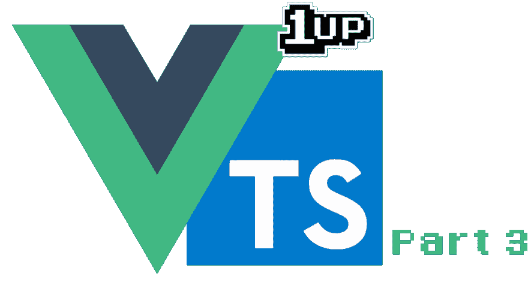

# 用 Typescript(第 3 部分):Vuex 升级您的 VueJS 项目

> 原文：<https://dev.to/fernalvarez590/level-up-your-vuejs-project-with-typescript-part-3-vuex-2nba>

[](https://res.cloudinary.com/practicaldev/image/fetch/s--bn_RKY7Z--/c_limit%2Cf_auto%2Cfl_progressive%2Cq_auto%2Cw_880/https://cdn-images-1.medium.com/max/1024/1%2Aq6_LObOAS5FVdt8TXGLIOQ.png)

#### 如果您错过了第 2 部分，请访问以下帖子:

[用 Typescript 升级你的 VueJS 项目(第 2 部分):将组件翻译成 Typescript](https://medium.com/@fernalvarez/level-up-your-vuejs-project-with-typescript-part-2-translating-components-to-typescript-3719092c7b5f)

对于本部分的完整版本，使用项目回购的以下分支:

[jefer590/upgrade-vuejs-ts 系列](https://github.com/jefer590/upgrade-vuejs-ts-series/tree/05/vuex-ts-usage)

在第 3 部分中，我们使用 vue-property-decorator 将大部分组件翻译成使用 Typescript，只有使用 **Vuex** 的视图除外。在这一部分，我们将翻译我们的 Vuex 模块和使用该模块的 Store.vue。我们开始吧！

### Foo Vuex 模块

如果您注意到了，该项目在路径~/src/store/foo.ts 中已经有一个名为 Foo 的 Vuex 模块。

让我们来看看这个简单模块的里面有什么*。该模块包含一个名为 text 的状态，它初始化一个简单的文本字符串；包含在该状态中设置新文本的突变；一个获取文本字符串的 getter，但是在大写字母和最后一个字母中，模块是命名空间的，所以，要访问它，我们需要使用 Foo/textUpper，如果我们需要 getter 的话。*

考虑到所有这些，让我们删除该文件的所有内容，因为我们将在 Typescript 中重写整个文件，但执行相同的操作并保留相同的状态。为此，我们将使用库(安装在第 1 部分中):

[冠军 swimmer/vuex 模块-装饰器](https://github.com/championswimmer/vuex-module-decorators)

### 将 Foo Vuex 模块翻译成类型脚本

我们将从导入必要的装饰器和类开始，我们将在* *Foo ** 模块中使用它们:

```
import { VuexModule, Module, Mutation } from 'vuex-module-decorators' 
```

在“传统”方式中，我们返回一个包含所有状态、突变等的对象文字；来满足我们的要求。对于这种方法，我们需要返回一个扩展 VuexModule 的类，该类的名称需要是模块的名称，在本例中是 Foo