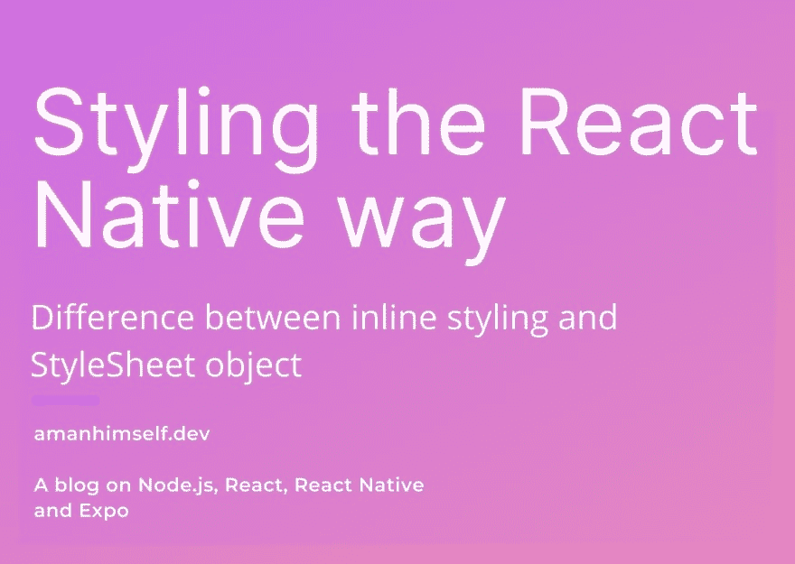
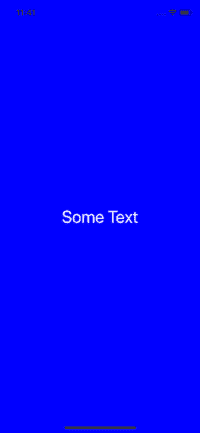
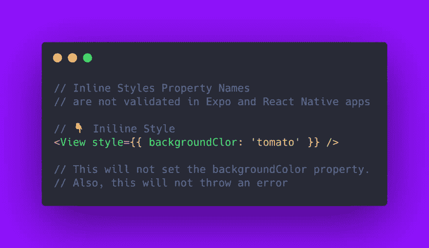
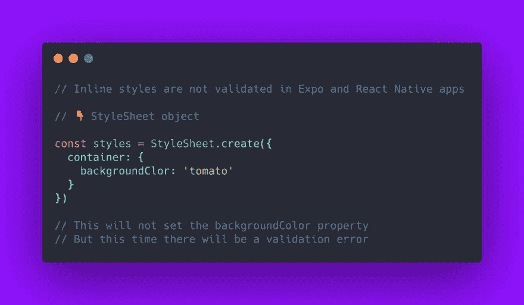
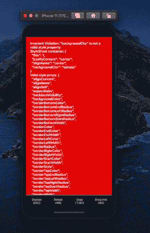
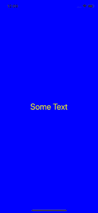
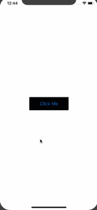

# 以本机方式设计 React

> 原文：<https://dev.to/amanhimself/styling-the-react-native-way-4j7l>

[](https://res.cloudinary.com/practicaldev/image/fetch/s--xScY077i--/c_limit%2Cf_auto%2Cfl_progressive%2Cq_auto%2Cw_880/https://i.imgur.com/Ut2rtdF.jpg)

React Native 附带了许多内置组件，您可以使用它们来设计跨平台应用程序。设计移动应用程序的样式是必不可少的。对于一个手机应用程序来说，拥有令人愉悦的设计和良好的颜色使用可以提供更好的用户体验，这一点我怎么强调都不为过。如果没有一个完美的用户界面，潜在用户会因为手机应用缺乏设计而反感。

React Native 使用普通 JavaScript 来样式化。在本教程中，您将通过获得一些实践经验和学习技巧来探索不同的 React 本机应用程序风格化方法。

## 简介

React Native 使用 JavaScript 来进行样式化，如果你对 web 的 CSS 有一些经验，你就会知道对一个组件进行样式化只不过是通过使用适当的样式化语法来编写代码。如果你不知道 CSS 是什么，就此打住，因为阅读这篇教程对你没有任何好处。你需要了解一点 CSS 来继续阅读下面的教程。如果你明白`backgroundColor: 'blue’`的意思，那么你就可以开始了。

React Native 带有许多内置组件。每一种都有自己特定的风格。这些特定的样式可能适用于其他组件，也可能不适用。

例如，`Text`组件支持`fontWeight`，而`View`组件不支持。但是，有些风格是相似的，但不完全相同。`View`支撑`shadowColor`，而`Text`支撑`textShadowColor`。最后，你必须注意到有一些特定于平台的风格，比如`shadowPropTypesIOS`。

## React 原生应用的不同风格

向 React 本机组件添加样式有多种方式。第一个是**直列造型**。请参见下面的示例。

```
// inline example
import React from 'react';
import { View, Text } from 'react-native';

export default function App() {
  return (
    <View
      style={{
        flex: 1,
        justifyContent: 'center',
        alignItems: 'center',
        backgroundColor: 'blue'
      }}
    >
      <Text style={{ color: 'white', fontSize: 32 }}>Some Text</Text>
    </View>
  );
} 
```

Enter fullscreen mode Exit fullscreen mode

上述代码片段的结果如下。

[](https://res.cloudinary.com/practicaldev/image/fetch/s--3ki_MAOr--/c_limit%2Cf_auto%2Cfl_progressive%2Cq_auto%2Cw_880/https://cdn-images-1.medium.com/max/200/1%2AMC9_WOIQrWsi8VEmHxQOOw.png)

在[**2019 年 React Native 入门**](https://amanhimself.dev/getting-started-with-react-native-in-2019-build-your-first-app/) 的帖子里，我已经描述过关于`StyleSheet`对象。这是第二条路。

可从 React Native API 获得，通过导入和使用`StyleSheet`，您可以创建一个对象并单独引用每个样式。这将样式从 render 方法中分离出来，并帮助您组织代码。此外，它促进了跨组件重用样式。

```
// StyleSheet Example
import React from 'react';
import { View, Text, StyleSheet } from 'react-native';

export default function App() {
  return (
    <View style={styles.container}>
      <Text style={styles.bigText}>Some Text</Text>
    </View>
  );
}

const styles = StyleSheet.create({
  container: {
    flex: 1,
    justifyContent: 'center',
    alignItems: 'center',
    backgroundColor: 'blue'
  },
  bigText: {
    color: 'white',
    fontSize: 32
  }
}); 
```

Enter fullscreen mode Exit fullscreen mode

这段代码在移动设备上呈现时会有相同的效果。这里唯一改变的是用`StyleSheet`对象分离组件`App`内部的样式。它像上面一样接受一个 JavaScript 对象，并从中返回一个新的`Stylesheet`对象。像 web 开发一样，React Native 中没有类或 id。

**创建一个新的样式对象你使用** `StyleSheet.create()` **方法。这种样式化 React 本地组件**的另一个优点是，每次创建新的样式对象时，`StyleSheet`有助于创建带有 ID 的样式对象，该 ID 进一步用于引用，而不是再次呈现整个组件。

另一个不同来自于**内联**样式，内联样式属性名如果拼写错误，将不起作用，并且不会因为拼写错误而抛出错误。

[](https://res.cloudinary.com/practicaldev/image/fetch/s--ACmBY0d2--/c_limit%2Cf_auto%2Cfl_progressive%2Cq_auto%2Cw_880/https://i.imgur.com/065jq9Y.png)

然而，当使用`StyleSheet.create()`定义样式时，有一个有效的样式属性检查。

[](https://res.cloudinary.com/practicaldev/image/fetch/s--f6gcByXL--/c_limit%2Cf_auto%2Cfl_progressive%2Cq_auto%2Cw_880/https://i.imgur.com/pM0LktI.png)

[](https://res.cloudinary.com/practicaldev/image/fetch/s--_NTgKz1N--/c_limit%2Cf_auto%2Cfl_progressive%2Cq_auto%2Cw_880/https://i.imgur.com/0iAFAvZ.png)

## 封装的样式

在 React Native 中，样式的范围是组件，而不是整个应用程序。您已经看到了一种定义 React 本地社区常用的样式的首选方法。

定义样式的另一种方法是组织应用程序代码，以便在重构时或应用程序开始扩展时更容易跟踪它们。在第二种方法中，您在一个单独的文件中声明与组件相关的所有样式。然后将样式文件导入组件文件中。这里给你举个例子。在`App.js`旁边创建一个名为`AppStyles.js`的新文件。

```
// AppStyles.js
import { StyleSheet } from 'react-native';

export default StyleSheet.create({
  container: {
    flex: 1,
    justifyContent: 'center',
    alignItems: 'center',
    backgroundColor: 'blue'
  },
  bigText: {
    color: 'white',
    fontSize: 32
  }
}); 
```

Enter fullscreen mode Exit fullscreen mode

下一步是将这个文件导入到`App.js`中。

```
//App.js
import React from 'react';
import { View, Text } from 'react-native';

import styles from './AppStyles';

export default function App() {
  return (
    <View style={styles.container}>
      <Text style={styles.bigText}>Some Text</Text>
    </View>
  );
} 
```

Enter fullscreen mode Exit fullscreen mode

演示运行并产生与之前相同的结果。这种在组件文件之外的文件中分离样式的做法有其自身的优势。它增加了其他样式对象的可重用性。

## 使用数组传递样式

在内联样式中，您一定已经注意到它只不过是一个以`style` prop 开始的对象，并且一个对象通过键值对传递。类似地，您可以使用一个包含多个键值对的数组作为`style`属性的值。

```
import React, { Component } from 'react';
import { View, Text, StyleSheet } from 'react-native';

export default function App() {
  return (
    <View style={styles.container}>
      <Text style={[styles.bigText, styles.textYellow]}>Some Text</Text>
    </View>
  );
}

const styles = StyleSheet.create({
  container: {
    flex: 1,
    justifyContent: 'center',
    alignItems: 'center',
    backgroundColor: 'blue'
  },
  bigText: {
    color: 'white',
    fontSize: 32
  },
  textYellow: {
    color: 'yellow'
  }
}); 
```

Enter fullscreen mode Exit fullscreen mode

以下是上述代码片段的结果。

[](https://res.cloudinary.com/practicaldev/image/fetch/s--ybiqwfiK--/c_limit%2Cf_auto%2Cfl_progressive%2Cq_auto%2Cw_880/https://cdn-images-1.medium.com/max/200/1%2AK46jXY4aP6YfStmwRLN1Wg.png)

请注意，当有重复的`color`属性时，传入的最后一个样式会覆盖前面的样式。

## 构建应用程序:暗/亮主题

在本节中，您将构建一个名为**亮/暗模式**切换的简单应用程序。它包含一个按钮，按钮上有一些文本，它自己有一个深色背景和一个浅色背景。当用户点击按钮时，应用程序的背景会变为深色模式，按钮上的文本会变为浅色模式。

首先，让我们为它定义样式。打开`AppStyles.js`外部造型文件。

```
import { StyleSheet } from 'react-native';

const Colors = {
  light: 'white',
  dark: 'black'
};

const baseContainer = {
  flex: 1,
  justifyContent: 'center',
  alignItems: 'center'
};

const buttonBorderContainer = {
  justifyContent: 'center',
  alignItems: 'center',
  borderWidth: 3,
  height: 50,
  width: 150
};

const lightStyles = StyleSheet.create({
  container: {
    ...baseContainer,
    backgroundColor: Colors.light
  },
  button: {
    ...buttonBorderContainer,
    backgroundColor: Colors.dark
  }
});

const darkStyles = StyleSheet.create({
  container: {
    ...baseContainer,
    backgroundColor: Colors.dark
  },
  button: {
    ...buttonBorderContainer,
    backgroundColor: Colors.light
  }
});

export default function useTheme(darkTheme) {
  return darkTheme ? darkStyles : lightStyles;
} 
```

Enter fullscreen mode Exit fullscreen mode

这里发生了很多事情。首先，两个不同的颜色变量被定义在一个单独的`Colors`对象中。然后，有两个不同的容器对象，一个用于背景，一个用于按钮。

然后在样式表对象`lightStyles`和`darkStyles`中重用这两个容器对象。类似地，为了定义背景颜色，我们重用了 color 对象，这样我们就不必将每种颜色的值写两次。

最后，有一个基于布尔值返回主题的导出函数。如果黑暗主题的值`darkStyles`为真，则返回黑暗主题的值，否则返回光明主题。

文件`AppStyles.js`是 React 原生应用中结构化样式的清晰表示。然后，这个文件被导入到具有以下内容的`App.js`中。

```
import React, { useState } from 'react';
import { View, Button } from 'react-native';

import useTheme from './AppStyles';

export default function App() {
  const [darkTheme, setDarkTheme] = useState(false);
  const styles = useTheme(darkTheme);

  const toggleTheme = () => {
    setDarkTheme(!darkTheme);
  };

  return (
    <View style={styles.container}>
      <View style={styles.button}>
        <Button title={'Click Me'} onPress={toggleTheme} />
      </View>
    </View>
  );
} 
```

Enter fullscreen mode Exit fullscreen mode

通过定义状态，你可以声明暗主题的默认值为假，比如它允许亮主题作为默认值。`toggleTheme`是相应地反转黑暗主题的布尔值的方法。接下来，在`render()`中，您将从状态中传递黑暗主题的当前值。然后，这个函数用于根据布尔值应用正确的主题或样式集。

您可以在下面的操作中看到这一点。

[](https://res.cloudinary.com/practicaldev/image/fetch/s--iXa0wGx1--/c_limit%2Cf_auto%2Cfl_progressive%2Cq_66%2Cw_880/https://cdn-images-1.medium.com/max/200/1%2AlG6ap43gDnoPulgdUiSwPA.gif)

* * *

*   你可以在[这个世博会小吃](https://snack.expo.io/@amanhimself/38e20d)中找到例子的完整代码。
*   非常感谢 [Catalin Miron](https://twitter.com/mironcatalin) 的校对🤗