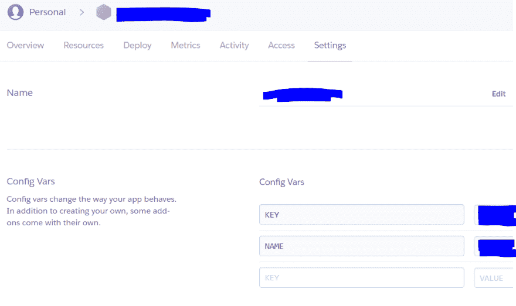

# 我如何将 Node.js 机器人部署到 Heroku

> 原文：<https://dev.to/codingdefined/how-i-deployed-my-nodejs-bot-to-heroku-18fc>

众所周知，Heroku 是一个平台即服务，帮助开发人员完全在云中构建、运行和操作应用程序。我从免费的 dyno 开始，这是为了实验，只有 512 兆内存。

我使用的是 Windows，所以步骤将是 Windows 机器。

首先，我需要从 https://devcenter.heroku.com/articles/heroku-cli 下载 Heroku CLI。它说它更新了路径，但您需要仔细检查，对于我的情况，我需要手动更新路径。在安装之前，请检查您的系统中是否安装了节点和 npm。

然后我使用 heroku login 命令登录 Heroku，询问我的电子邮件和密码。通过认证后，我使用 heroku create 命令创建了我的第一个应用程序，它为我创建了一个应用程序。

由于我的应用不在 GitHub 中，我需要使用 git init 创建它，然后使用命令 git remote add heroku[https://git.heroku.com/my-app-name.git](https://git.heroku.com/my-app-name.git)添加 heroku 作为我的远程。然后我们需要使用命令 git commit -am“初始提交”来提交代码。一旦完成，就把它推给 heroku git 推 heroku master。

由于我的应用程序是一个 bot，我需要在目录的根目录下创建一个 ProcFile，ProcFile 的内容如下所示

`worker: node index.js`

我用同样的命令 git push heroku master 再次推送代码。然后打开工作器并关闭 web，如下所示。

此外，由于我在我的 bot 中使用了一些机密信息，如 bot key，我在 settings 选项卡中创建了一个 config vars，如下所示，然后在 bot 中使用 process.env.KEY 和 process.env.NAME 来使用它。

这样你就可以用 Heroku 部署你的机器人了。快乐编码:)

来源:CodingDefined.com