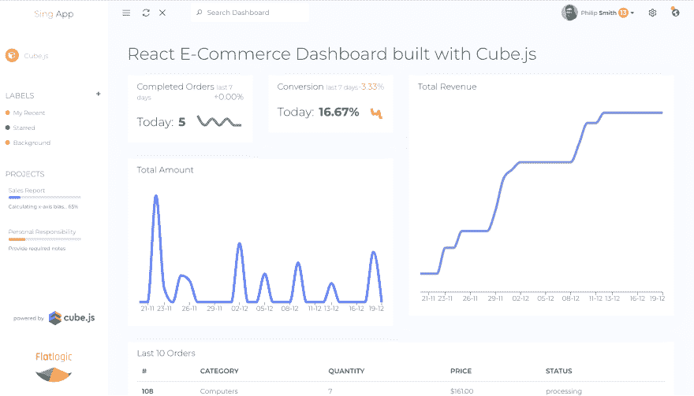

# 使用 Cube.js 构建分析反应仪表板

> 原文：<https://dev.to/flatlogic/building-analytics-react-dashboard-with-cubejs-5d4>

[](https://res.cloudinary.com/practicaldev/image/fetch/s--qAHgtZLA--/c_limit%2Cf_auto%2Cfl_progressive%2Cq_auto%2Cw_880/https://thepracticaldev.s3.amazonaws.com/i/j0886pb9mwz0qgw52fd3.png)

Flatlogic 开发了自己的管理仪表板，以节省网络和移动开发的时间和金钱。该公司经常从事定制开发、咨询和集成自己的产品(管理模板)。

假设您需要从头开始开发一个 web 应用程序来监控和分析原始数据。例如，你拥有一个中等规模的网上商店。您对现有的数据分析解决方案不满意，希望自己管理管理面板中的组件。你自己处理原始数据和构建分析图表也是非常重要的。

通常，您必须使用庞大的库并编写自己的 web 应用程序，这需要花费大量的时间。解决方案来自 Cube.js + Flatlogic dashboards。

最好的开始方式是使用 Flatlogic [React 仪表板模板](https://flatlogic.com/admin-dashboards/react)和 Cube.js 中的一个。

你可以在这里查看最终的[反应管理仪表板](https://demo.flatlogic.com/cubejs-dashboard/#/app/cubejs)。

源代码可以在 Github [这里](https://github.com/flatlogic/ecommerce-dashboard-react)获得。

## 让我们构建仪表板

在本例中，我们将使用 Sing App[React admin template](https://flatlogic.com/admin-dashboards/sing-app-react)来消除从头设置 React 环境的步骤，并从一开始就拥有一个仪表板界面。

第一步是用 Cube.js 连接你的数据库，首先你需要安装`@cubejs-client/core`、`@cubejs-client/react`，以及作为图表库的 recharts。然后，您需要在项目设置中找到 API 令牌。在获得并安装了所有需要的“设备”之后，您必须将它们导入 react 组件并应用 API 令牌。

```
1 import { LineChart, Line, XAxis, YAxis } from 'recharts';
2 import cubejs from '@cubejs-client/core';
3 import { QueryRenderer } from '@cubejs-client/react';
4
5 const cubejsApi = cubejs(`api-token`); 
```

Enter fullscreen mode Exit fullscreen mode

现在，您已经准备好获取您喜欢的任何数据。根据文档，这是你的带有图表的组件的样子:

```
1 <QueryRenderer 
2   query={{
3     measures: ['Stories.count'],
4     dimensions: ['Stories.time.month']
5   }} 
6   cubejsApi={cubejsApi} 
7   render={({ resultSet }) => {
8     if (!resultSet) {
9       return 'Loading...';
10     }
11 
12    return (
13       <LineChart data={resultSet.rawData()}>
14         <XAxis dataKey="Stories.time"/>
15         <YAxis/>
16         <Line type="monotone" dataKey="Stories.count" stroke="#8884d8"/>
17       </LineChart>
18     );
19   }}
20 /> 
```

Enter fullscreen mode Exit fullscreen mode

`QueryRender`是 Cube.js 库中的组件。让我们在道具上分开它。

主要属性是`query`。在那里，您可以定义从 Cube.js 中获取什么数据。

您不需要知道所有的 Cube.js 概念来实现`query`，因为您可以轻松地在 Cube.js 中配置任何查询，然后将其导出为 JSON 格式并粘贴到您的`QueryRender`组件中。

`QueryRender`的 render 属性得到一个函数，返回你想要的任何东西。在我们的例子中，我们希望返回已经收到数据的图表。最好的特性是您可以在接收数据的同时返回加载器。另一个可爱的特性是能够从 Cube.js 仪表板中导出不同格式的查询数据，比如 CSV 或 xlsx。

优势

*   实施速度和易于理解的 API
*   Cube.js 是可视化不可知的。这意味着你可以使用你最喜欢的图表库，比如 Chart.js、Recharts、C3.js 或任何其他的。
*   Cube.js 数据模式可以作为分析的 ORM。它允许您对从简单计数到群组保持和漏斗分析的一切进行建模。
*   它被设计为在你的数据库之上工作，所以你所有的数据都和你在一起。支持所有主要的 SQL 数据库。

## 最终结果

现在，借助 Cube.js 和 Flatlogic 仪表盘，您可以轻松启动自己的 web 应用程序，使用自定义图形和连接任何数据库来可视化原始数据。这里有一个使用电子商务数据的例子。[你可以在这里玩](https://demo.flatlogic.com/cubejs-dashboard)。

[](https://res.cloudinary.com/practicaldev/image/fetch/s--cxI877O3--/c_limit%2Cf_auto%2Cfl_progressive%2Cq_auto%2Cw_880/https://thepracticaldev.s3.amazonaws.com/i/407q9yupfrehv91wyvn3.png)