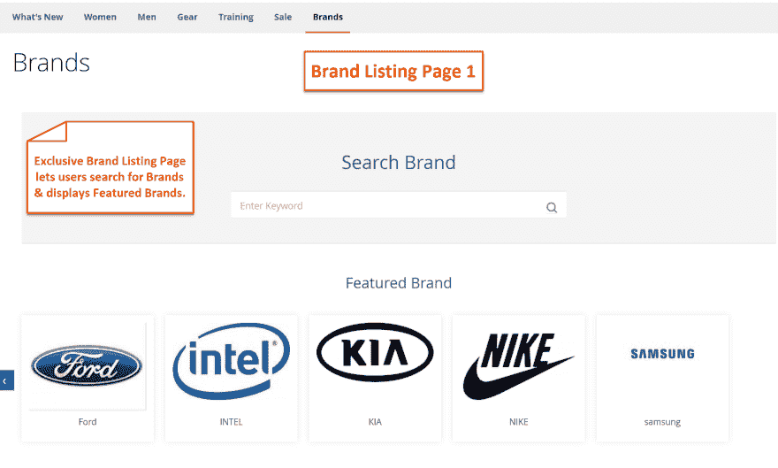
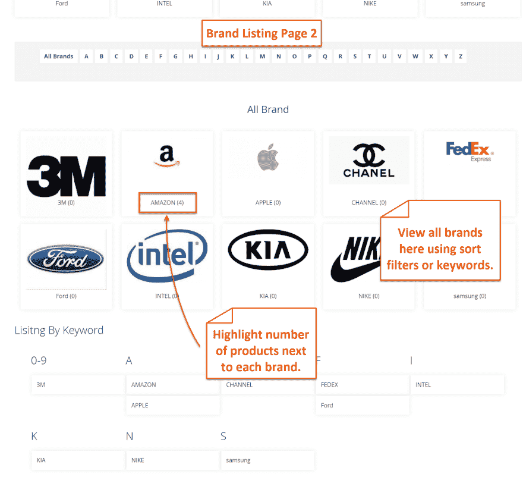
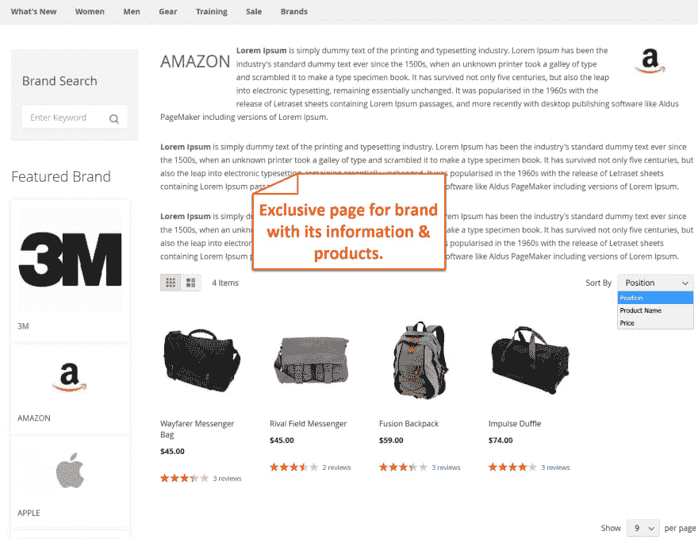
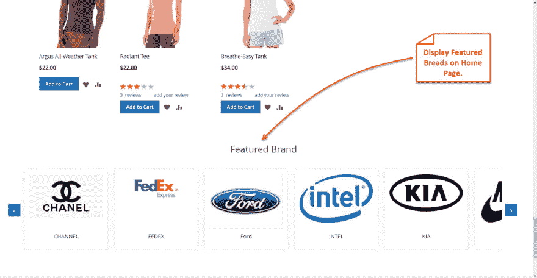
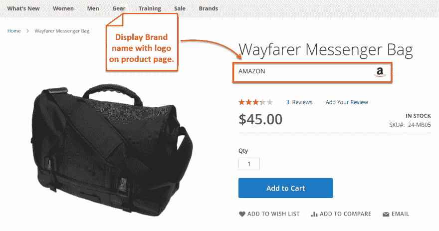
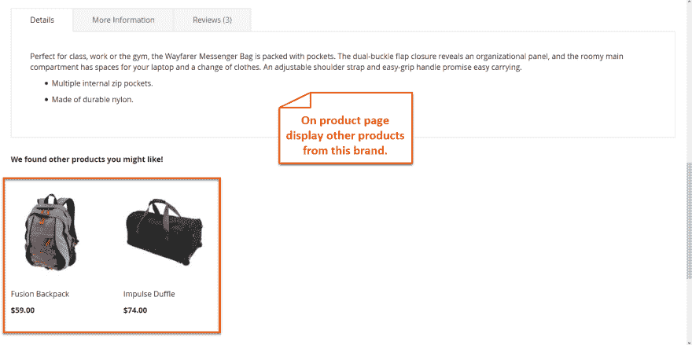

# Magento 2 按品牌扩展购物|定制品牌页面

> 原文：<https://dev.to/simonwalkerfme/magento-2-shop-by-brand-extension--customize-brand-pages-10i6>

# Magento 2 店铺品牌:

Magento 2 shop by brand extension 允许您创建一个品牌登录页面，让客户轻松定位特定品牌的产品。您可以在登录页面上显示所有品牌，也可以为每个品牌创建单独的页面，以便在单个页面上展示同一品牌的产品。有了 Magento 2 shop by brand extension，你就可以轻松服务于品牌上瘾的顾客。

有了这个扩展，你可以在功能滑块中突出显示顶级品牌。显示搜索栏，按字母过滤品牌，并在每个品牌名称旁边显示产品数量。在品牌登录页面上，显示一个品牌搜索栏，按字母顺序过滤，并在每个品牌名称旁边显示产品数量。添加品牌商店链接到页眉和页脚。

## 关键特性:

*   专门的品牌列表页面
*   定制的品牌详情页面，展示每个制造商的产品
*   在品牌页面的特色滑块中展示顶级品牌
*   在主页上显示特色滑块
*   启用搜索框，字母过滤器
*   将品牌商店链接添加到页眉和页脚
*   将品牌限制在选定的商店视图中
*   在产品页面上显示品牌标志
*   配置品牌页面搜索引擎优化

更多详情和演示- [Magento 2 品牌商店](https://www.fmeextensions.com/shop-by-brands-manufacturer-magento-2-extension.html)

**品牌列表页面**

[T6】](https://res.cloudinary.com/practicaldev/image/fetch/s--AdA6Hwdu--/c_limit%2Cf_auto%2Cfl_progressive%2Cq_auto%2Cw_880/https://www.fmeextensions.com/media/catalog/product/cache/1/thumbnail/9df78eab33525d08d6e5fb8d27136e95/3/_/3_shop_by_brands_manufacturers_plugin.png)

**品牌详情页面**

**首页特色滑块**

**在产品页面显示品牌标志**

**在产品页面显示更多品牌产品**

