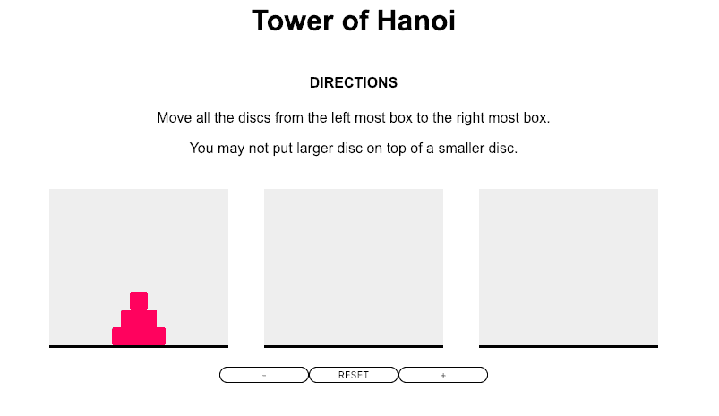
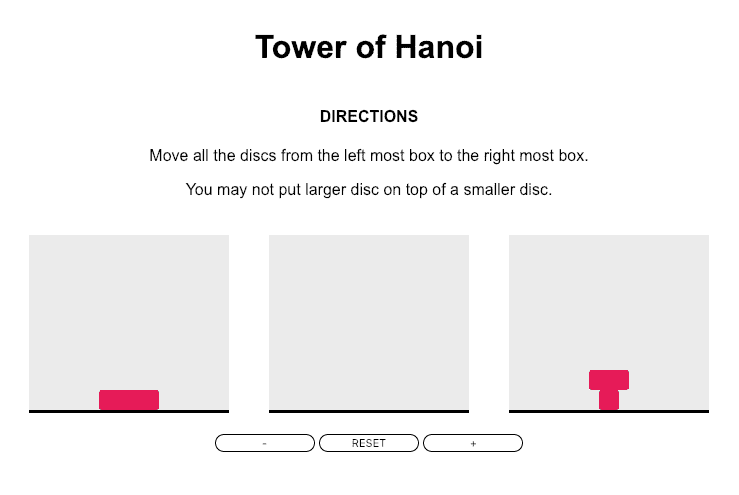

# 我的第一个训练营项目:河内塔

> 原文：<https://dev.to/nikacodes/my-first-bootcamp-project-tower-of-hanoi-3kob>

<center></center>

## 背景

一个多月前，我放弃了自己的生活，在大会上开始了 web 开发。这是一次情感和感觉的大起大落，也是一次“我能在多少的睡眠下生存并保持机能的实验”。每隔一天，我都会庆祝或者想抓狂，我听说这就像是在现实生活中做一名开发人员，所以我想我做对了一些事情。

在过去的一周里，我和我的开发伙伴们开始着手我们的第一个项目:用我们在三周内学到的 HTML、CSS 和 Javascript 技巧制作一个游戏。给了我们一份五个游戏的清单供我们选择(或者可以提出我们自己的想法，让我们的导师批准)。我选择了河内的[塔](https://en.wikipedia.org/wiki/Tower_of_Hanoi)，因为它看起来很简单识别`div`的简单案例，并且在一次点击事件中，操纵三个`div`中的两个成为我的塔。

然而，和往常一样，在找到这段代码之后，我决定增加使用 jQuery 的额外挑战:

```
tower.prepend($('<li class="disc disc-' + i + '" data-value="' + i + '"></li>')); 
```

Enter fullscreen mode Exit fullscreen mode

与此代码串联的 SASS:

```
@for $i from 1 through # {
    .disc-#{$i} {
        width: #px * $i;
    }
} 
```

Enter fullscreen mode Exit fullscreen mode

理论上，我可以创建一个游戏，玩家可以通过增加和减少游戏中的圆盘数量来选择难度级别。在这一点上我不得不提到这根本不是一个需求。

但乍一看，这似乎不是一个额外的障碍，我已经知道如何用两个额外的按钮来增加和减少光盘来建造我的塔

```
 function buildTower(tower) {
    $tower.html("");
    for (i = 1; i <= discNum; i++) {
      tower.prepend(
        $('<li class="disc disc-' + i + '" data-value="' + i + '"></li>')
      );
    } 
```

Enter fullscreen mode Exit fullscreen mode

我使用上面的代码来生成大小不断增加的列表项。我与 bootstrap 已建立的 CSS 代码进行了斗争，但能够找出如何覆盖它。然而，当我建起我的第一座塔时，斗争开始了。

## 构建游戏

真正的挑战是如何从原始列表中删除顶部列表项，然后在另一个列表中重新创建它。有几次我成功地在每个盒子里克隆了我的完整的塔，但是后来有了三个塔并且不能删除它们。

诀窍是创建一个变量`deck = []`并将其分配给第一个列表项。一旦我将第一个列表项分配给空数组，我就可以在新塔中删除然后创建一个相同的列表项。

然后，我能够重新创建正确的光盘，只是把它放在更大的光盘下面。这使得不可能正确地玩游戏。

<center></center>

在阅读了更多关于 jQuery 和 jQuery 方法的内容后，我发现了`.append`方法，它在开头而不是结尾添加了一个新的列表项。

现在，我已经满足了一个工作游戏的要求，我想再增加一个功能:两个按钮，可以增加和减少光盘，以增加或降低难度。

逻辑很简单:

```
 // Increase/Decrease discNum (not working?)

  $(".ad").click(function() {
    if (discNum < 7) {
      discNum++;
      return DiscNum;
    }
  });

  $(".sub").click(function() {
    if (discNum > 3) {
      discNum--;
      return DiscNum;
    }
  }); 
```

Enter fullscreen mode Exit fullscreen mode

另一个学习曲线和我的导师交谈，我意识到我犯了一个相当初级的错误。

```
 // Increase/Decrease discNum

  $(".ad").click(function() {
    if (discNum < 7) {
      discNum++;
      buildTower($tower.eq(0));
    }
  });

  $(".sub").click(function() {
    if (discNum > 3) {
      discNum--;
      buildTower($tower.eq(0));
    }
  }); 
```

Enter fullscreen mode Exit fullscreen mode

## 为未来

我当然想继续做这个游戏。既然我是用 jQuery 做的，我认为将会有很大的学习潜力转化为 Javascript。

我还想添加一个计时器元素，从第一步开始，到玩家完成时结束；一个获胜的场景要么点亮整个塔，要么出现某种信息告诉玩家一；添加一个移动计数器，看看玩家是否能击败他们的个人最好成绩；并使其具有移动响应能力。

总的来说，这是一个非常有趣的挑战，肯定有让我不得不离开电脑的时刻，但这很容易(有时只需一点指导)我就可以找到它并克服障碍。

我迫不及待地回头看这个，看到我作为一个 web 开发人员的成长，并将其与未来的项目进行比较。

如果你想玩这个游戏，你可以在这里玩。

谢谢你。