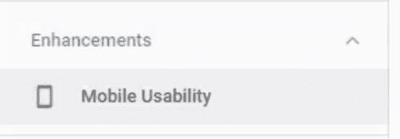
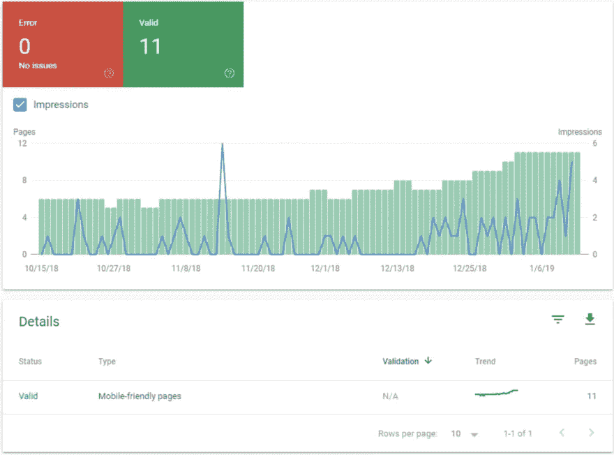
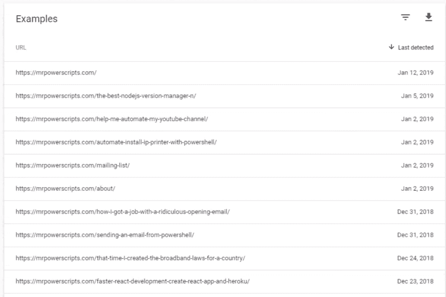
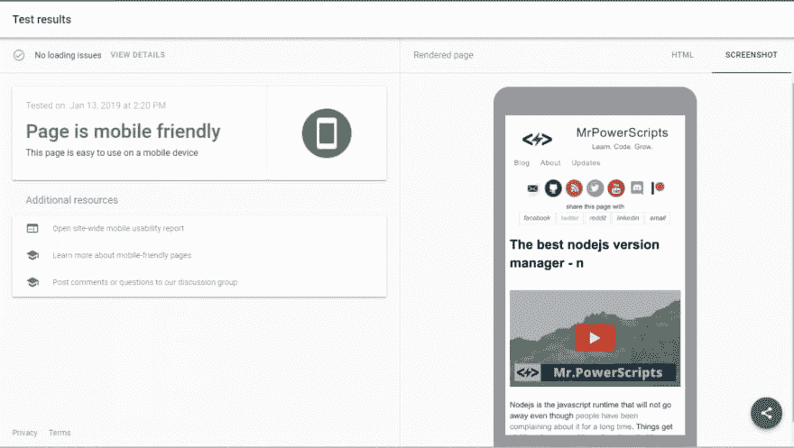

# 谷歌将首先进军移动领域——你的网站准备好了吗？

> 原文：<https://dev.to/mrpowerscripts/google-is-going-mobile-first-is-your-website-ready-3ccf>

如果你使用谷歌搜索控制台，你可能已经开始收到类似这样的电子邮件:

> 主题:启用移动优先索引
> 
> 亲爱的搜索控制台用户:
> 
> 作为移动优先计划的一部分，我们正在更新您的一处或多处房产。这意味着你可能会在你的日志中看到更多来自 Googlebot Smartphone 的流量。你可能还会看到，谷歌搜索结果中的片段现在是从你的内容的移动版本中生成的。
> 
> 正在更新以下属性(列表限于 20 个属性):

谷歌于 2018 年 3 月 26 日宣布的[移动优先计划](https://webmasters.googleblog.com/2018/03/rolling-out-mobile-first-indexing.html)在他们的博客文章结尾总结了几个关键计划:

> 概括一下:
> 
> 移动索引正在更广泛地推出。以这种方式被索引没有排名优势，并且独立于我们的移动->友好评估。
> 
> 对于那些想在移动搜索结果中表现更好的人来说，拥有移动友好的内容仍然是有帮助的。
> 
> 拥有快速加载的内容仍然有助于那些想方设法为移动和桌面用户提供更好性能的人。
> 
> 和往常一样，排名使用了很多因素。如果我们的许多其他信号>确定它是要显示的最相关的内容，我们可能会向用户显示>不适合移动设备或加载缓慢的内容。

当你看到电子邮件主题到达你的收件箱时，听起来像是谷歌抛弃了桌面，如果你没有移动网站，你的搜索引擎优化就完了。现在还不是这样。但是谷歌在整篇文章中暗示了一个许多人可能没有意识到的现实。大多数人首先通过手机找到他们需要的东西。这是关键的一句话:

> 移动优先索引意味着我们将使用移动版本的页面>进行索引和排名，以更好地帮助我们的用户(主要是移动用户)找到>他们想要的内容。

让我们**增强**

> 主要是移动

虽然他们在博文中表示，将你的网站索引为移动视图不会影响其页面排名，但他们明确表示，在移动搜索方面，移动友好型网站确实有页面排名偏好，自 2015 年以来一直如此。

谷歌的搜索用户群主要是移动用户，移动友好网站在移动搜索结果中更受青睐。你也许应该考虑让你的网站对移动设备友好——就像三年前一样。什么时候开始都不晚！

谢天谢地，谷歌还提供了许多工具，让你看看谷歌认为你的网站有多适合移动设备。如果你熟悉谷歌搜索控制台，这对你来说并不新鲜。如果没有，你有一个网站，你希望人们在未来找到它，现在是时候了解它了。

在访问你的搜索控制台资料的整个歌舞之后，你可以在左边的“增强”下拉菜单中找到一个“移动可用性”按钮。

这是你了解更多关于谷歌如何从移动用户的角度“看”你的网站的门户。被认为有太多错误或者不够移动友好的页面将会毫无歉意地被丢进巨大的网络深渊，在那里没有人会再看到你的链接。

列表中的移动友好页面越多，你在这个移动优先的新未来中就越有利。这不是因为谷歌做出了重大改变，而是因为人们的习惯正在改变。你可以在下面的图表中看到，随着我的网站增加了手机友好页面，印象数开始增加。我希望继续这一趋势，所以我的网站大部分是围绕移动用户的体验来设计的。

单击任何详细项目都会显示有效链接、包含错误的链接或任何其他链接状态类型的列表。

点击你的任何一个链接，你都可以看到一份移动测试报告，甚至可以预览你的网站在谷歌移动索引机器人面前的样子。

虽然谷歌的“移动优先倡议”乍一看似乎很可怕，但它并不涉及搜索索引排名的任何重大变化。只是谷歌如何“阅读”你的网站页面的索引。但是这些变化表明了人们是如何使用手机作为寻找他们需要的东西的主要方式的。如果他们在手机上看不到你，那么你可能永远也不会被看到！令人欣慰的是，用来确定你是否准备好的工具是免费提供的。用你自己的网站查看谷歌搜索控制台。