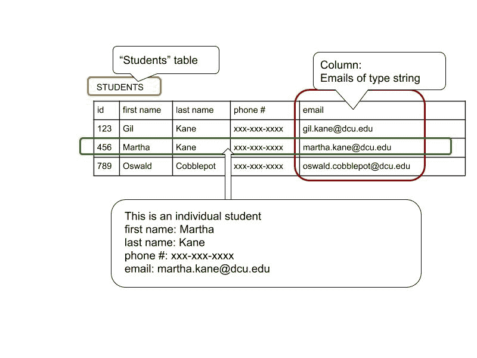

# 数据库模型和实体关系图第一部分

> 原文：<https://dev.to/kevindsteeleii/database-models-and-erds-for-newbs-part-1-1g69>

## 那么为什么另一个数据库发布呢？

大家好，我想介绍一些非常基础的东西给新手或从后端开发开始的人。这篇文章将充满图表，因为我们都有不同的学习风格，视觉辅助总是分解文本的好方法。顺便说一句，我不是数据库专家或 DBA，我欢迎并感谢所有代码的反馈、评论或更正。

所以让我们从一些工作定义开始。数据库模型的 wiki 定义非常好，所以我们从这里开始:

> **数据库模型**是一种数据模型，它决定了数据库的逻辑结构，并从根本上决定了数据存储、组织和操作的方式。数据库模型最流行的例子是关系模型，它使用基于表的格式。

数据模型用于表示或模拟实体。实体基本上是一个名词。有些像数学一样抽象，有些像鞋子一样具体(有物理形式)。让我们来看看一个学生表。

这个数据库模型采用表格的形式，行代表不同的学生，而列代表学生具有的属性或品质。每一列都有特定的数据类型，这有助于学生数据的标准化操作和读取。如果列的所有条目都是不同的类型，那么编写查询将是一件痛苦的事情。我现在要介绍几个更重要的术语，**规范化**和**基数**。**规范化**是一个过程，有时通过将一个数据库分成两个或更多的表来减少数据的冗余。如果在同一个列中很少有重复的数据位，那么基数就被认为是高的，低基数的表有很多重复。
**实体关系图**或模型用于映射数据模型之间的潜在关系。潜在的，我的意思是这些关系中的一些是严格可选的。例如，一个大学教授可以教一些课程，但这并不意味着他们会这样做。然而，要有一个班级，你需要一个教授和至少一个学生。

那么这对我们(开发者)来说到底意味着什么呢？

作为开发人员，我们使用数据库模型和实体关系图来绘制模型及其关系，以便我们可以操作和读取存储在数据库中的内容。他们的设计决定了功能的水平，所以请记住这一点。函数决定了这种情况下的形式。

请继续关注下一次，我们将探索如何使用乌鸦符号绘制这些图表。