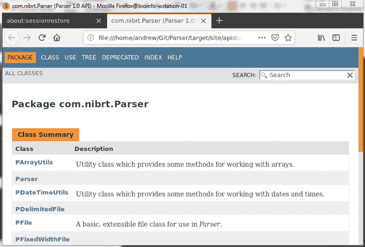

# Linux Bash 命令 101 从初学者到专家的 Bash 命令和技巧

> 原文：<https://dev.to/awwsmm/101-bash-commands-and-tips-for-beginners-to-experts-30je>

> 【2019 年 9 月 25 日更新:由于 [ラナ・クアール](https://twitter.com/rana_kualu) 的辛勤工作，这篇文章现在有了日文版本。请点击下面的链接查看他们的作品。如果你知道这篇文章被翻译成其他语言，请告诉我，我会把它们贴在这里。

[用日语阅读](https://qiita.com/rana_kualu/items/7b62898d373901466f5c)

> 【2019 年 7 月 8 日更新:我最近发现[大约两年前在法语留言板上发布的这篇非常相似的文章](https://bookmarks.ecyseo.net/?EAWvDw)。如果你对学习一些 shell 命令感兴趣，并且你*会说法语*，这是对我文章的一个很好的补充。

直到大约一年前，我几乎只在 macOS 和 Ubuntu 操作系统中工作。在这两个操作系统中，`bash`是我的默认 shell。在过去的六七年里，我已经对`bash`的工作方式有了一个大致的了解，我想为那些刚刚入门的人提供一些更常见/有用的命令的概述。如果你认为你对`bash`了如指掌，还是看看下面吧——我提供了一些你可能已经忘记的提示和提醒，这会让你的工作变得更容易。

下面的命令以或多或少的叙述风格来编排，所以如果你刚刚开始使用`bash`，你可以从头到尾一遍。事情通常会越来越少见，越来越难。

## 目录

*   [基础知识](#the-basics)
    *   [第一个命令，导航文件系统](#first-commands)
        *   [T2`pwd / ls / cd`](#pwd-ls-cd)
        *   [T2`; / && / &`](#semicolon-andand-and)
    *   [获得帮助](#getting-help)
        *   [T2`-h`](#minus-h)
        *   [T2`man`](#man)
    *   [查看和编辑文件](#viewing-and-editing-files)
        *   [T2`head / tail / cat / less`](#head-tail-cat-less)
        *   [T2`nano / nedit`](#nano-nedit)
    *   [创建和删除文件和目录](#creating-and-deleting-files)
        *   [T2`touch`](#touch)
        *   [T2`mkdir / rm / rmdir`](#mkdir-rm-rmdir)
    *   [移动和复制文件、制作链接、命令历史记录](#moving-and-copying-files)
        *   [T2`mv / cp / ln`](#mv-cp-ln)
        *   [命令历史](#command-history)
    *   [目录树、磁盘使用和进程](#directory-trees-disk-usage-processes)
        *   [T2`mkdir –p / tree`](#mkdir--p-tree)
        *   [T2`df / du / ps`](#df-du-ps)
    *   [杂项](#basic-misc)
        *   [T2`passwd / logout / exit`](#passwd-logout-exit)
        *   [T2`clear / *`](#clear-glob)
*   [中级](#intermediate)
    *   [磁盘、内存和处理器使用情况](#disk-memory-processor)
        *   [T2`ncdu`](#ncdu)
        *   [T2`top / htop`](#top-htop)
    *   [副本和软件版本](#REPLs-software-versions)
        *   [回复](#REPLs)
        *   [T2`-version / --version / -v`](#version)
    *   [环境变量和别名](#env-vars-aliases)
        *   [环境变量](#env-vars)
        *   [别名](#aliases)
    *   [基础`bash`脚本](#basic-bash-scripting)
        *   [`bash`剧本](#bash-scripts)
        *   [自定义提示和`ls`](#custom-prompt-ls)
    *   [配置文件](#config-files)
        *   [配置文件/ `.bashrc`](#config-bashrc)
        *   [炮弹的种类](#types-of-shells)
    *   [找东西](#finding-things)
        *   [T2`whereis / which / whatis`](#whereis-which-whatis)
        *   [T2`locate / find`](#locate-find)
    *   [下载东西](#downloading-things)
        *   [T2`ping / wget / curl`](#ping-wget-curl)
        *   [T2`apt / gunzip / tar / gzip`](#apt-gunzip-tar-gzip)
    *   [重定向输入和输出](#redirecting-io)
        *   [T2`| / > / < / echo / printf`](#pipe-gt-lt-echo-printf)
        *   [T2`0 / 1 / 2 / tee`](#std-tee)
*   [高级](#advanced)
    *   超级用户
        *   [T2`sudo / su`](#sudo-su)
        *   [T2`!!`](#click-click)
    *   [文件权限](#file-permissions)
        *   [文件权限](#file-permissions-sub)
        *   [T2`chmod / chown`](#chmod-chown)
    *   [用户和群组管理](#users-groups)
        *   [用户](#users)
        *   [组](#groups)
    *   [文本处理](#text-processing)
        *   [T2`uniq / sort / diff / cmp`](#uniq-sort-diff-cmp)
        *   [T2`cut / sed`](#cut-sed)
    *   [模式匹配](#pattern-matching)
        *   [T2`grep`](#grep)
        *   [T2`awk`](#awk)
    *   [复制文件超过`ssh`](#ssh)
        *   [T2`ssh / scp`](#ssh-scp)
        *   [T2`rsync`](#rsync)
    *   [长时间运行的流程](#long-running-processes)
        *   [T2`yes / nohup / ps / kill`](#yes-nohup-ps-kill)
        *   [T2`cron / crontab / >>`](#cron)
    *   [杂项](#advanced-misc)
        *   [T2`pushd / popd`](#pushd-popd)
        *   [T2`xdg-open`](#xdg-open)
        *   [T2`xargs`](#xargs)
*   [奖励:有趣但大多没用的东西](#bonus)
    *   [T2`w / write / wall / lynx`](#w-write-wall-lynx)
    *   [T2`nautilus / date / cal / bc`](#nautilus-date-cal-bc)

* * *

# 基础知识

## 第一个命令，导航文件系统

现代文件系统有目录(文件夹)树，其中一个目录要么是一个*根目录*(没有父目录)，要么是一个*子目录*(包含在一个单独的其他目录中，我们称之为“父目录”)。向后遍历文件树(从子目录到父目录)总是会找到根目录。一些文件系统有多个根目录(比如 Windows 的驱动器:`C:\`、`A:\`等)。)，但是 Unix 和类 Unix 系统只有一个名为`\`的根目录。

### `pwd / ls / cd`

[【返回目录】](#toc)

当在文件系统中工作时，用户总是在某个目录中工作*，我们称之为当前目录或*工作目录*。用`pwd` :
打印用户的工作目录*

```
[ andrew@pc01 ~ ]$ pwd
/home/andrew 
```

Enter fullscreen mode Exit fullscreen mode

列出这个目录的内容(文件和/或子目录等。)与`ls` :

```
[ andrew@pc01 ~ ]$ ls Git  TEST  jdoc  test test.file 
```

Enter fullscreen mode Exit fullscreen mode

> **奖金:**
> 
> 用`ls -a`显示隐藏(“点”)文件
> 
> 用`ls -l`显示文件细节
> 
> 组合多个标志，如`ls -l -a`
> 
> 有时你可以用像`ls -la`这样的标志代替`ls -l -a`

用`cd`切换到不同的目录(切换目录):

```
[ andrew@pc01 ~ ]$ cd TEST/

[ andrew@pc01 TEST ]$ pwd
/home/andrew/TEST

[ andrew@pc01 TEST ]$ cd A

[ andrew@pc01 A ]$ pwd
/home/andrew/TEST/A 
```

Enter fullscreen mode Exit fullscreen mode

`cd ..`是“`cd`到父目录”的简写:

```
[ andrew@pc01 A ]$ cd ..

[ andrew@pc01 TEST ]$ pwd
/home/andrew/TEST 
```

Enter fullscreen mode Exit fullscreen mode

`cd ~`或者仅仅是`cd`是“`cd`到我的主目录”(通常是`/home/username`或者类似的东西):
的简写

```
[ andrew@pc01 TEST ]$ cd

[ andrew@pc01 ~ ]$ pwd
/home/andrew 
```

Enter fullscreen mode Exit fullscreen mode

> **奖金:**
> 
> `cd ~user`表示`cd`到`user`的主目录
> 
> 可以用`cd ../..`等跳转多个目录级。
> 
> 用`cd -`返回到最近的目录
> 
> `.`是“这个目录”的简写，所以`cd .`不会做太多事情

### `; / && / &`

[【返回目录】](#toc)

我们在命令行中输入的东西被称为*命令*，它们总是执行一些存储在你电脑某处的机器码。有时候这个机器码是一个内置的 Linux 命令，有时候是一个 app，有时候是你自己写的一些代码。有时候，我们会希望一个命令接一个命令地运行。为此，我们可以使用`;`(分号):

```
[ andrew@pc01 ~ ]$ ls; pwd Git  TEST  jdoc  test test.file
/home/andrew 
```

Enter fullscreen mode Exit fullscreen mode

上面，分号的意思是我先(`ls`)列出工作目录的内容，然后我(`pwd`)打印它的位置。另一个链接命令的有用工具是`&&`。使用`&&`，如果左边的命令失败，右边的命令将不会运行。`;`和`&&`可以在同一行多次使用:

```
# whoops! I made a typo here!
[ andrew@pc01 ~ ]$ cd /Giit/Parser && pwd && ls && cd
-bash: cd: /Giit/Parser: No such file or directory

# the first command passes now, so the following commands are run
[ andrew@pc01 ~ ]$ cd Git/Parser/ && pwd && ls && cd
/home/andrew/Git/Parser
README.md  doc.sh  pom.xml  resource  run.sh  shell.sh  source src  target 
```

Enter fullscreen mode Exit fullscreen mode

...但是有了`;`，即使第一个命令失败，第二个命令也会运行:

```
# pwd and ls still run, even though the cd command failed
[ andrew@pc01 ~ ]$ cd /Giit/Parser ; pwd ; ls
-bash: cd: /Giit/Parser: No such file or directory
/home/andrew
Git  TEST  jdoc  test test.file 
```

Enter fullscreen mode Exit fullscreen mode

`&`看起来与`&&`相似，但实际上完成了完全不同的功能。通常，当您执行一个长时间运行的命令时，命令行会等待该命令完成，然后才允许您输入另一个命令。将`&`放在一个命令之后可以防止这种情况发生，并让您在旧命令仍在运行时执行新命令:

```
[ andrew@pc01 ~ ]$ cd Git/Parser && mvn package & cd
[1] 9263 
```

Enter fullscreen mode Exit fullscreen mode

> **额外收获:**当我们在一个命令后使用`&`来“隐藏”它时，我们称之为作业(或“进程”；这些术语或多或少是可互换的)是“背景的”。要查看当前正在运行的后台作业，请使用`jobs`命令:
> 
> ```
> [ andrew@pc01 ~ ]$ jobs
> [1]+ Running cd Git/Parser/ && mvn package & 
> ```

## 寻求帮助

### `-h`

[【返回目录】](#toc)

在几乎所有命令后输入`-h`或`--help`来打开该命令的帮助菜单:

```
[ andrew@pc01 ~ ]$ du --help
Usage: du [OPTION]... [FILE]...
  or:  du [OPTION]... --files0-from=F
Summarize disk usage of the set of FILEs, recursively for directories.

Mandatory arguments to long options are mandatory for short options too.
  -0, --null            end each output line with NUL, not newline
  -a, --all             write counts for all files, not just directories
      --apparent-size   print apparent sizes, rather than disk usage; although
                          the apparent size is usually smaller, it may be
                          larger due to holes in ('sparse') files, internal
                          fragmentation, indirect blocks, and the like
  -B, --block-size=SIZE  scale sizes by SIZE before printing them; e.g.,
                           '-BM' prints sizes in units of 1,048,576 bytes;
                           see SIZE format below
... 
```

Enter fullscreen mode Exit fullscreen mode

### `man`

[【返回目录】](#toc)

在几乎任何命令前输入`man`，调出该命令的手册(用`q`退出`man`):

```
LS(1)                            User Commands                           LS(1)

NAME
       ls - list directory contents

SYNOPSIS
       ls [OPTION]... [FILE]...

DESCRIPTION
       List  information  about  the FILEs (the current directory by default).
       Sort entries alphabetically if none of -cftuvSUX nor --sort  is  speci-
       fied.

       Mandatory  arguments  to  long  options are mandatory for short options
       too.
... 
```

Enter fullscreen mode Exit fullscreen mode

## 查看和编辑文件

### `head / tail / cat / less`

[【返回目录】](#toc)

`head`输出文件的前几行。`-n`标志指定要显示的行数(默认为 10):

```
# prints the first three lines
[ andrew@pc01 ~ ]$ head -n 3 c
this
file
has 
```

Enter fullscreen mode Exit fullscreen mode

`tail`输出文件的最后几行。你可以得到最后的`n`行(如上)，或者你可以用`tail -n +N` :
得到从第`N`行开始的文件结尾

```
# prints the end of the file, beginning with the 4th line
[ andrew@pc01 ~ ]$ tail -n +4 c
exactly
six
lines 
```

Enter fullscreen mode Exit fullscreen mode

将一系列文件连接起来，并将它们发送到标准输出流(通常是终端)。`cat`可用于单个文件，或多个文件，并常用于快速查看它们。(**被警告**:如果你这样用`cat`，可能会被指责为一个 [*没用的猫* (UUOC)](http://bit.ly/2SPHE4V) ，不过没什么大不了的，不用太在意。)

```
[ andrew@pc01 ~ ]$ cat a
file a

[ andrew@pc01 ~ ]$ cat a b
file a
file b 
```

Enter fullscreen mode Exit fullscreen mode

`less`是另一个快速查看文件的工具——它打开一个类似于`vim`的只读窗口。(是的，有一个命令叫做`more`，但是`less`——不直观地——提供了`more`功能的超集，推荐使用它。)多学(还是少学？)关于[少](http://man7.org/linux/man-pages/man1/less.1.html)和[多](http://man7.org/linux/man-pages/man1/more.1.html)在其`man`页面。

### `nano / nedit`

[【返回目录】](#toc)

是一个极简的命令行文本编辑器。对于初学者或者不想学习一百万个快捷键的人来说，这是一个很棒的编辑器。对于我最初几年的编码生涯来说，这已经足够了(我现在才开始研究更强大的编辑器，主要是因为在`nano`中定义自己的语法高亮可能有点痛苦。)

是一个小的图形编辑器，它打开一个 X 窗口，允许点击编辑，拖放，语法高亮等等。当我想对一个脚本做一些小的修改并一遍又一遍地重新运行它时，我有时会使用`nedit`。

其他常见的 CLI(命令行界面)/ GUI(图形用户界面)编辑器包括`emacs`、`vi`、`vim`、`gedit`、Notepad++和 Atom 等等。我玩过的一些很酷的工具包括 Micro、Light Table 和 VS Code。

所有现代编辑器都提供了基本的便利，比如搜索和替换、语法高亮等等。`vi(m)`和`emacs`比`nano`和`nedit`拥有更多的功能，但它们的学习曲线要陡峭得多。尝试几个不同的编辑器，找到一个适合你的！

## 创建和删除文件和目录

### `touch`

[【返回目录】](#toc)

`touch`被创建用来修改文件的时间戳，但它也可以用来快速创建一个空文件。你可以用文本编辑器打开一个新文件，比如`nano` :

```
[ andrew@pc01 ex ]$ ls

[ andrew@pc01 ex ]$ nano a 
```

Enter fullscreen mode Exit fullscreen mode

*...编辑文件...*

```
[ andrew@pc01 ex ]$ ls a 
```

Enter fullscreen mode Exit fullscreen mode

...或者简单地使用`touch` :

```
[ andrew@pc01 ex ]$ touch b && ls a  b 
```

Enter fullscreen mode Exit fullscreen mode

> **奖金**:
> 
> 用^z (Ctrl+z)创建一个进程的背景
> 
> ```
> [ andrew@pc01 ex ]$ nano a 
> ```
> 
> *...编辑文件，然后点击^z...*
> 
> ```
> Use fg to return to nano
> 
> [1]+ Stopped nano a
> [ andrew@pc01 ex ]$ fg 
> ```
> 
> *...再次编辑文件...*

* * *

> **双倍奖金:**
> 
> 在当前(前台)进程运行时按下^c (Ctrl+c)来终止它
> 
> 用`kill %N`终止一个后台进程，其中`N`是由`jobs`命令显示的作业索引

### `mkdir / rm / rmdir`

[【返回目录】](#toc)

`mkdir`用于创建新的空目录:

```
[ andrew@pc01 ex ]$ ls && mkdir c && ls a  b
a  b  c 
```

Enter fullscreen mode Exit fullscreen mode

你可以用`rm`删除任何文件——但是要小心，这是不可恢复的！

```
[ andrew@pc01 ex ]$ rm a && ls b  c 
```

Enter fullscreen mode Exit fullscreen mode

可以加个*“你确定？”*用`-i`标志提示:

```
[ andrew@pc01 ex ]$ rm -i b
rm: remove regular empty file 'b'? y 
```

Enter fullscreen mode Exit fullscreen mode

用`rmdir`删除一个空目录。如果您在一个空目录中`ls -a`，您应该只看到一个对目录本身的引用(`.`)和一个对其父目录的引用(`..` ):

```
[ andrew@pc01 ex ]$ rmdir c && ls -a
.  .. 
```

Enter fullscreen mode Exit fullscreen mode

`rmdir`仅删除空目录:

```
[ andrew@pc01 ex ]$ cd .. && ls test/
*.txt  0.txt  1.txt  a  a.txt  b  c

[ andrew@pc01 ~ ]$ rmdir test/
rmdir: failed to remove 'test/': Directory not empty 
```

Enter fullscreen mode Exit fullscreen mode

...但是你可以用`rm -rf` ( `-r` =递归，`-f` =强制)删除一个目录及其所有内容

```
[ andrew@pc01 ~ ]$ rm –rf test 
```

Enter fullscreen mode Exit fullscreen mode

## 移动和复制文件，制作链接，命令历史

### `mv / cp / ln`

[【返回目录】](#toc)

移动/重命名文件。您可以`mv`将一个文件保存到一个新目录并保持相同的文件名，或者`mv`将一个文件保存到一个“新文件”(重命名):

```
[ andrew@pc01 ex ]$ ls && mv a e && ls a  b  c  d
b  c  d  e 
```

Enter fullscreen mode Exit fullscreen mode

`cp`复制文件:

```
[ andrew@pc01 ex ]$ cp e e2 && ls b  c  d  e  e2 
```

Enter fullscreen mode Exit fullscreen mode

`ln`创建指向文件的硬链接:

```
# first argument to ln is TARGET, second is NEW LINK
[ andrew@pc01 ex ]$ ln b f && ls b  c  d  e  e2  f 
```

Enter fullscreen mode Exit fullscreen mode

`ln -s`创建到文件的软链接:

```
[ andrew@pc01 ex ]$ ln -s b g && ls b  c  d  e  e2  f  g 
```

Enter fullscreen mode Exit fullscreen mode

硬链接引用内存中包含文件的相同实际字节，而软链接引用原始文件名，它本身指向这些字节。你可以在这里阅读更多关于软链接和硬链接的内容。

### 命令历史

[【返回目录】](#toc)

`bash`有两大功能帮助你完成和重新运行命令，第一个是*标签完成*。只需输入命令的第一部分，按下<键>键，让终端猜测你在做什么:

```
[ andrew@pc01 dir ]$ ls <ENTER>
anotherlongfilename  thisisalongfilename  anewfilename

[ andrew@pc01 dir ]$ ls t <TAB> 
```

Enter fullscreen mode Exit fullscreen mode

*...键入`ls t`后，按 TAB 键，命令完成...*T3】

```
[ andrew@pc01 dir ]$ ls thisisalongfilename <ENTER>
thisisalongfilename 
```

Enter fullscreen mode Exit fullscreen mode

如果有歧义，您可能需要多次点击<tab>:</tab> 

```
[ andrew@pc01 dir ]$ ls a <TAB>

[ andrew@pc01 dir ]$ ls an <TAB>
anewfilename  anotherlongfilename 
```

Enter fullscreen mode Exit fullscreen mode

`bash`保存您之前键入的命令的简短历史记录，并让您通过键入^r (Ctrl+r)来搜索这些命令:

```
[ andrew@pc01 dir ] 
```

Enter fullscreen mode Exit fullscreen mode

*...点击^r (Ctrl+r)搜索命令历史...*

```
(reverse-i-search)`': 
```

Enter fullscreen mode Exit fullscreen mode

*...键入“anew ”,将找到包含此内容的最后一个命令...*

```
(reverse-i-search)`anew': touch anewfilename 
```

Enter fullscreen mode Exit fullscreen mode

## 目录树、磁盘使用情况和进程

### `mkdir –p / tree`

[【返回目录】](#toc)

默认情况下，`mkdir`只创建一个目录。这意味着，举例来说，如果目录`d/e`不存在，那么`d/e/f`不能由`mkdir`单独生成:

```
[ andrew@pc01 ex ]$ ls && mkdir d/e/f
a  b  c
mkdir: cannot create directory 'd/e/f': No such file or directory 
```

Enter fullscreen mode Exit fullscreen mode

但是，如果我们将`-p`标志传递给`mkdir`，它将创建路径中所有不存在的目录:

```
[ andrew@pc01 ex ]$ mkdir -p d/e/f && ls a  b  c  d 
```

Enter fullscreen mode Exit fullscreen mode

通过打印一个格式良好的目录树，可以帮助你更好地可视化一个目录的结构。默认情况下，它打印整个树结构(从指定的目录开始)，但是您可以使用`-L`标志:
将其限制在一定的级别

```
[ andrew@pc01 ex ]$ tree -L 2
.
|-- a
|-- b
|-- c
`-- d
    `--e

3 directories, 2 files 
```

Enter fullscreen mode Exit fullscreen mode

你可以用`--prune`隐藏`tree`输出中的空目录。注意，这也删除了“递归空”目录，或者本身不为空的目录*，但是只包含其他空目录，或者其他递归空目录:* 

```
[ andrew@pc01 ex ]$ tree --prune
.
|-- a
`-- b 
```

Enter fullscreen mode Exit fullscreen mode

### `df / du / ps`

[【返回目录】](#toc)

`df`用于显示磁盘或系统(硬盘等)中的文件占用了多少空间。).

```
[ andrew@pc01 ex ]$ df -h
Filesystem                   Size  Used Avail Use% Mounted on
udev                         126G     0  126G   0% /dev
tmpfs                         26G  2.0G   24G   8% /run
/dev/mapper/ubuntu--vg-root  1.6T  1.3T  252G  84% /
... 
```

Enter fullscreen mode Exit fullscreen mode

在上面的命令中，`-h`的意思不是“帮助”，而是“人类可读”。一些命令使用这种约定来显示文件/磁盘大小，用`K`表示千字节，`G`表示千兆字节，等等，而不是写出一个巨大的整数字节数。

`du`显示特定目录及其子目录的文件空间使用情况。如果你想知道给定硬盘上有多少空闲空间，使用`df`；如果你想知道一个目录占用了多少空间，使用`du` :

```
[ andrew@pc01 ex ]$ du 4       ./d/e/f
8       ./d/e
12      ./d
4       ./c
20      . 
```

Enter fullscreen mode Exit fullscreen mode

`du`取一个`--max-depth=N`标志，它只显示从指定目录
向下(或更少)的目录`N`

```
[ andrew@pc01 ex ]$ du -h --max-depth=1
12K     ./d
4.0K    ./c
20K     . 
```

Enter fullscreen mode Exit fullscreen mode

`ps`显示用户当前正在运行的所有进程(又名。乔布斯):

```
[ andrew@pc01 ex ]$ ps
  PID TTY          TIME CMD
16642 pts/15   00:00:00 ps
25409 pts/15   00:00:00 bash 
```

Enter fullscreen mode Exit fullscreen mode

## 杂项

### `passwd / logout / exit`

[【返回目录】](#toc)

使用`passwd`更改您的帐户密码。它会要求您输入当前密码进行验证，然后要求您输入两次新密码，这样您就不会出现任何输入错误:

```
[ andrew@pc01 dir ]$ passwd
Changing password for andrew.
(current) UNIX password:    <type current password>
Enter new UNIX password:    <type new password>
Retype new UNIX password:   <type new password again>
passwd: password updated successfully 
```

Enter fullscreen mode Exit fullscreen mode

`logout`退出您已登录的 shell(您拥有用户帐户):

```
[ andrew@pc01 dir ]$ logout

──────────────────────────────────────────────────────────────────────────────
Session stopped
    - Press <return> to exit tab
    - Press R to restart session
    - Press S to save terminal output to file 
```

Enter fullscreen mode Exit fullscreen mode

`exit`退出任何一种外壳:

```
[ andrew@pc01 ~ ]$ exit
logout

──────────────────────────────────────────────────────────────────────────────
Session stopped
    - Press <return> to exit tab
    - Press R to restart session
    - Press S to save terminal output to file 
```

Enter fullscreen mode Exit fullscreen mode

### `clear / *`

[【返回目录】](#toc)

运行`clear`将当前终端行移动到屏幕顶部。该命令只是在当前提示行下面添加空行。这对清理你的工作空间很有好处。

使用 glob ( `*`)，又名。克莱尼之星，又名。通配符)来查找文件。注意下面两个命令的区别:

```
[ andrew@pc01 ~ ]$ ls Git/Parser/source/
PArrayUtils.java     PFile.java            PSQLFile.java      PWatchman.java
PDateTimeUtils.java  PFixedWidthFile.java  PStringUtils.java  PXSVFile.java
PDelimitedFile.java  PNode.java            PTextFile.java     Parser.java

[ andrew@pc01 ~ ]$ ls Git/Parser/source/PD*
Git/Parser/source/PDateTimeUtils.java  Git/Parser/source/PDelimitedFile.java 
```

Enter fullscreen mode Exit fullscreen mode

glob 可以在一个命令中多次使用，可以匹配零个或多个字符:

```
[ andrew@pc01 ~ ]$ ls Git/Parser/source/P*D*m*
Git/Parser/source/PDateTimeUtils.java  Git/Parser/source/PDelimitedFile.java 
```

Enter fullscreen mode Exit fullscreen mode

# 中级

## 磁盘、内存和处理器使用情况

### `ncdu`

[【返回目录】](#toc)

`ncdu` (NCurses Disk Usage)提供文件空间使用的可导航概述，就像改进的`du`。它打开一个只读的类似`vim`的窗口(按`q`退出):

```
[ andrew@pc01 ~ ]$ ncdu

ncdu 1.11 ~ Use the arrow keys to navigate, press ? for help
--- /home/andrew -------------------------------------------------------------
  148.2 MiB [##########] /.m2
   91.5 MiB [######    ] /.sbt
   79.8 MiB [#####     ] /.cache
   64.9 MiB [####      ] /.ivy2
   40.6 MiB [##        ] /.sdkman
   30.2 MiB [##        ] /.local
   27.4 MiB [#         ] /.mozilla
   24.4 MiB [#         ] /.nanobackups
   10.2 MiB [          ]  .confout3.txt
    8.4 MiB [          ] /.config
    5.9 MiB [          ] /.nbi
    5.8 MiB [          ] /.oh-my-zsh
    4.3 MiB [          ] /Git
    3.7 MiB [          ] /.myshell
    1.7 MiB [          ] /jdoc
    1.5 MiB [          ]  .confout2.txt
    1.5 MiB [          ] /.netbeans
    1.1 MiB [          ] /.jenv
  564.0 KiB [          ] /.rstudio-desktop
 Total disk usage: 552.7 MiB  Apparent size: 523.6 MiB  Items: 14618 
```

Enter fullscreen mode Exit fullscreen mode

### `top / htop`

[【返回目录】](#toc)

`top`显示所有当前正在运行的进程及其所有者、内存使用情况等。`htop`是一个改进的，交互式的`top`。(注意:您可以通过`-u username`标志将显示的进程限制为只有那些由`username`拥有的进程。)

```
[ andrew@pc01 ~ ]$ htop

  1  [       0.0%]   9  [       0.0%]   17 [       0.0%]   25 [       0.0%]
  2  [       0.0%]   10 [       0.0%]   18 [       0.0%]   26 [       0.0%]
  3  [       0.0%]   11 [       0.0%]   19 [       0.0%]   27 [       0.0%]
  4  [       0.0%]   12 [       0.0%]   20 [       0.0%]   28 [       0.0%]
  5  [       0.0%]   13 [       0.0%]   21 [|      1.3%]   29 [       0.0%]
  6  [       0.0%]   14 [       0.0%]   22 [       0.0%]   30 [|      0.6%]
  7  [       0.0%]   15 [       0.0%]   23 [       0.0%]   31 [       0.0%]
  8  [       0.0%]   16 [       0.0%]   24 [       0.0%]   32 [       0.0%]
  Mem[||||||||||||||||||||1.42G/252G]   Tasks: 188, 366 thr; 1 running
  Swp[|                   2.47G/256G]   Load average: 0.00 0.00 0.00
                                        Uptime: 432 days(!), 00:03:55

   PID USER      PRI  NI  VIRT   RES   SHR S CPU% MEM%   TIME+  Command
 9389 andrew     20   0 23344  3848  2848 R  1.3  0.0  0:00.10 htop
10103 root       20   0 3216M 17896  2444 S  0.7  0.0  5h48:56 /usr/bin/dockerd
    1 root       20   0  181M  4604  2972 S  0.0  0.0 15:29.66 /lib/systemd/syst
  533 root       20   0 44676  6908  6716 S  0.0  0.0 11:19.77 /lib/systemd/syst
  546 root       20   0  244M     0     0 S  0.0  0.0  0:01.39 /sbin/lvmetad -f
 1526 root       20   0  329M  2252  1916 S  0.0  0.0  0:00.00 /usr/sbin/ModemMa
 1544 root       20   0  329M  2252  1916 S  0.0  0.0  0:00.06 /usr/sbin/ModemMa
F1Help  F2Setup F3SearchF4FilterF5Tree  F6SortByF7Nice -F8Nice +F9Kill  F10Quit 
```

Enter fullscreen mode Exit fullscreen mode

## 复制器和软件版本

### 回复

[【返回目录】](#toc)

REPL 是一个读取-评估-打印循环，类似于命令行，但通常用于特定的编程语言。

你可以用`python`命令打开 Python REPL(用`quit()`函数退出):

```
[ andrew@pc01 ~ ]$ python
Python 3.5.2 (default, Nov 12 2018, 13:43:14) ...
>>> quit() 
```

Enter fullscreen mode Exit fullscreen mode

用`R`命令打开 R REPL(用`q()`功能退出):

```
[ andrew@pc01 ~ ]$ R
R version 3.5.2 (2018-12-20) --"Eggshell Igloo" ...
> q()
Save workspace image? [y/n/c]: n 
```

Enter fullscreen mode Exit fullscreen mode

用`scala`命令打开 Scala REPL(用`:quit`命令退出):

```
[ andrew@pc01 ~ ]$ scala
Welcome to Scala 2.11.12 ...
scala> :quit 
```

Enter fullscreen mode Exit fullscreen mode

用`jshell`命令打开 Java REPL(用`/exit`命令退出):

```
[ andrew@pc01 ~ ]$ jshell
| Welcome to JShell--Version 11.0.1 ...
jshell> /exit 
```

Enter fullscreen mode Exit fullscreen mode

或者，您可以用^d (Ctrl+d)退出这些回复中的任何一个。^d 是 Unix 上的 EOF(文件结束)标记，表示输入的结束。

### `-version / --version / -v`

[【返回目录】](#toc)

大多数命令和程序都有一个`-version`或`--version`标志，给出该命令或程序的软件版本。大多数应用程序使这些信息很容易获得:

```
[ andrew@pc01 ~ ]$ ls --version
ls (GNU coreutils) 8.25 ...

[ andrew@pc01 ~ ]$ ncdu -version
ncdu 1.11

[ andrew@pc01 ~ ]$ python --version
Python 3.5.2 
```

Enter fullscreen mode Exit fullscreen mode

...但是有些不太直观:

```
[ andrew@pc01 ~ ]$ sbt scalaVersion
...
[info] 2.12.4 
```

Enter fullscreen mode Exit fullscreen mode

请注意，一些程序使用`-v`作为版本标志，而其他程序使用`-v`表示“冗长”，这将在运行应用程序的同时打印大量诊断或调试信息:

```
SCP(1)                    BSD General Commands Manual                   SCP(1)

NAME
     scp -- secure copy (remote file copy program)
...
-v      Verbose mode.  Causes scp and ssh(1) to print debugging messages
             about their progress.  This is helpful in debugging connection,
             authentication, and configuration problems.
... 
```

Enter fullscreen mode Exit fullscreen mode

## 环境变量和别名

### 环境变量

[【返回目录】](#toc)

**环境变量**(有时简称为“env vars”)是持久变量，可以在您的`bash` shell 中创建和使用。它们被定义为等号(`=`)和美元符号(`$`)。使用`printenv` :
可以看到所有当前定义的环境变量

```
[ andrew@pc01 ~ ]$ printenv SPARK_HOME=/usr/local/spark
TERM=xterm
... 
```

Enter fullscreen mode Exit fullscreen mode

用一个`=`符号设置一个新的环境变量(但是不要在`=`的前后加任何空格！):

```
[ andrew@pc01 ~ ]$ myvar=hello 
```

Enter fullscreen mode Exit fullscreen mode

用`echo`和前面的`$`符号:
打印一个特定的环境变量到终端

```
[ andrew@pc01 ~ ]$ echo $myvar
hello 
```

Enter fullscreen mode Exit fullscreen mode

包含空格或其他空白的环境变量应该用引号(`"..."`)括起来。请注意，将一个值重新分配给一个环境变量会覆盖它，而不会发出警告:

```
[ andrew@pc01 ~ ]$ myvar="hello, world!" && echo $myvar
hello, world! 
```

Enter fullscreen mode Exit fullscreen mode

也可以使用`export`命令定义环境变量。当以这种方式定义时，它们也可用于子进程(从这个 shell 调用的命令):

```
[ andrew@pc01 ~ ]$ export myvar="another one" && echo $myvar
another one 
```

Enter fullscreen mode Exit fullscreen mode

您可以通过将`=`的右侧留空或使用`unset`命令:
来取消设置环境变量

```
[ andrew@pc01 ~ ]$ unset mynewvar

[ andrew@pc01 ~ ]$ echo $mynewvar 
```

Enter fullscreen mode Exit fullscreen mode

### 别名

[【返回目录】](#toc)

**别名**类似于环境变量，但通常以不同的方式使用——用较短的命令替换较长的命令:

```
[ andrew@pc01 apidocs ]$ ls -l -a -h -t
total 220K
drwxr-xr-x 5 andrew andrew 4.0K Dec 21 12:37 .
-rw-r--r-- 1 andrew andrew 9.9K Dec 21 12:37 help-doc.html
-rw-r--r-- 1 andrew andrew 4.5K Dec 21 12:37 script.js
...

[ andrew@pc01 apidocs ]$ alias lc="ls -l -a -h -t"

[ andrew@pc01 apidocs ]$ lc
total 220K
drwxr-xr-x 5 andrew andrew 4.0K Dec 21 12:37 .
-rw-r--r-- 1 andrew andrew 9.9K Dec 21 12:37 help-doc.html
-rw-r--r-- 1 andrew andrew 4.5K Dec 21 12:37 script.js
... 
```

Enter fullscreen mode Exit fullscreen mode

您可以使用`unalias` :
删除别名

```
[ andrew@pc01 apidocs ]$ unalias lc

[ andrew@pc01 apidocs ]$ lc
The program 'lc' is currently not installed. ... 
```

Enter fullscreen mode Exit fullscreen mode

> **奖金:**
> 
> 在此阅读环境变量和别名之间的细微差别。
> 
> 有些程序，像 **git** ，允许你专门为该软件定义别名。

## 基础`bash`脚本

### `bash`脚本

[【返回目录】](#toc)

脚本(通常以`.sh`结尾)允许你自动化复杂的过程，将它们打包成可重用的功能。一个`bash`脚本可以包含任意数量的普通 shell 命令:

```
[ andrew@pc01 ~ ]$ echo "ls && touch file && ls" > ex.sh 
```

Enter fullscreen mode Exit fullscreen mode

可以使用`source`命令或`sh`命令执行 shell 脚本:

```
[ andrew@pc01 ~ ]$ source ex.sh
Desktop  Git  TEST  c  ex.sh  project  test Desktop  Git  TEST  c  ex.sh  file  project  test 
```

Enter fullscreen mode Exit fullscreen mode

可以使用`chmod`命令执行 Shell 脚本(稍后将详细介绍):

```
[ andrew@pc01 ~ ]$ echo "ls && touch file2 && ls" > ex2.sh

[ andrew@pc01 ~ ]$ chmod +x ex2.sh 
```

Enter fullscreen mode Exit fullscreen mode

可执行 shell 脚本可以通过在它前面加上`./` :
来运行

```
[ andrew@pc01 ~ ]$ ./ex2.sh
Desktop  Git  TEST  c  ex.sh  ex2.sh  file  project  test Desktop  Git  TEST  c  ex.sh  ex2.sh  file  file2  project  test 
```

Enter fullscreen mode Exit fullscreen mode

可以通过用`\` :
结束命令来拆分长代码行

```
[ andrew@pc01 ~ ]$ echo "for i in {1..3}; do echo \ > \"Welcome \$i times\"; done" > ex3.sh 
```

Enter fullscreen mode Exit fullscreen mode

Bash 脚本可以包含循环、函数等等！

```
[ andrew@pc01 ~ ]$ source ex3.sh
Welcome 1 times Welcome 2 times Welcome 3 times 
```

Enter fullscreen mode Exit fullscreen mode

### 自定义提示和`ls`

[【返回目录】](#toc)

Bash 脚本可以让您的生活更加轻松多彩。查看这个伟大的 bash 脚本备忘单。

`$PS1`(提示字符串 1)是定义您的主 shell 提示的环境变量([在这里了解其他提示](http://bit.ly/2SPgsmT) ):

```
[ andrew@pc01 ~ ]$ printf "%q" $PS1
$'\\n\\[\E[1m\\]\\[\E[30m\\]\\A'$'\\[\E[37m\\]|\\[\E[36m\\]\\u\\[\E[37m\\]@\\[\E[34m\\]\\h'$'\\[\E[32m\\]\\W\\[\E[37m\\]|'$'\\[\E(B\E[m\\]‘ 
```

Enter fullscreen mode Exit fullscreen mode

您可以使用`export`命令:
更改您的默认提示

```
[ andrew@pc01 ~ ]$ export PS1="\ncommand here> "

command here> echo $PS1
\ncommand here> 
```

Enter fullscreen mode Exit fullscreen mode

...你也可以添加颜色！ :

```
command here> export PS1="\e[1;31m\nCODE: \e[39m"

# (this should be red, but it may not show up that way in Markdown)
CODE: echo $PS1
\e[1;31m\nCODE: \e[39m 
```

Enter fullscreen mode Exit fullscreen mode

你也可以通过编辑`$LS_COLORS`环境变量:
来改变`ls`显示的颜色

```
# (again, these colours might not show up in Markdown)
CODE: ls Desktop  Git  TEST  c  ex.sh  ex2.sh  ex3.sh  file  file2  project  test CODE: export LS_COLORS='di=31:fi=0:ln=96:or=31:mi=31:ex=92‘

CODE: ls
Desktop  Git  TEST  c  ex.sh  ex2.sh  ex3.sh  file  file2  project  test 
```

Enter fullscreen mode Exit fullscreen mode

## 配置文件

### 配置文件/ `.bashrc`

[【返回目录】](#toc)

如果您尝试了上一节中的命令，注销并重新登录，您可能已经注意到您的更改消失了。 *config* (配置)文件让你在每次登录(或运行程序)时维护你的 shell 或特定程序的设置。一个`bash` shell 的主要配置文件是`~/.bashrc`文件。添加到`~/.bashrc`的别名、环境变量和函数将在您每次登录时可用。每次登录时都会运行`~/.bashrc`中的命令。

如果您编辑了您的`~/.bashrc`文件，您可以使用`source`命令:
重新加载它，而无需注销

```
[ andrew@pc01 ~ ]$ nano ~/.bashrc 
```

Enter fullscreen mode Exit fullscreen mode

*...将行`echo “~/.bashrc loaded!”`添加到文件*的顶部...

```
[ andrew@pc01 ~ ]$ source ~/.bashrc
~/.bashrc loaded! 
```

Enter fullscreen mode Exit fullscreen mode

*...注销并重新登录...*

```
Last login: Fri Jan 11 10:29:07 2019 from 111.11.11.111
~/.bashrc loaded!

[ andrew@pc01 ~ ] 
```

Enter fullscreen mode Exit fullscreen mode

### 炮弹的种类

[【返回目录】](#toc)

*登录*shell 是您登录的 shell(您有一个用户名)。*交互*外壳是接受命令的外壳。Shells 可以是登录和交互的，非登录和非交互的，或者任何其他组合。

除了`~/.bashrc`之外，还有其他一些脚本，当你登录或注销时，它们会被 shell 自动调用`sourced`。这些是:

*   `/etc/profile`
*   `~/.bash_profile`
*   `~/.bash_login`
*   `~/.profile`
*   `~/.bash_logout`
*   `/etc/bash.bash_logout`

这些脚本中的哪些是源代码，以及它们的源代码顺序取决于打开的 shell 的类型。更多信息请参见[bash 手册页](https://linux.die.net/man/1/bash)和[这些](http://bit.ly/2TGCwA8)堆栈溢出[帖子](http://bit.ly/2TFHFsf)。

注意，`bash`脚本可以`source`其他脚本。例如，在您的`~/.bashrc`中，您可以包含这样一行:

```
source ~/.bashrc_addl 
```

Enter fullscreen mode Exit fullscreen mode

...这也将`source`那个`.bashrc_addl`脚本。这个文件可以包含自己的别名、函数、环境变量等等。反过来，`source`其他剧本也是如此。(注意避免脚本源代码的无限循环！)

根据功能或机器类型(Ubuntu vs. Red Hat vs. macOS)将命令分成不同的 shell 脚本可能会有所帮助，例如:

*   `~/.bash_ubuntu` -特定于基于 Ubuntu 的机器的配置
*   `~/.bashrc_styles` -美学设置，如`PS1`和`LS_COLORS`
*   `~/.bash_java` -特定于 Java 语言的配置

我试图为美学配置和特定于操作系统或机器的代码保存单独的`bash`文件，然后我有一个包含快捷方式等的大`bash`文件。我在每台机器和每个操作系统上使用。

注意还有*不同的外壳*。`bash`只是一种外壳(即“伯恩再外壳”)。其他常见的还有`zsh`、`csh`、`fish`等等。尝试不同的 shell 并找到一个适合你的，但是请注意，本教程只包含`bash` shell 命令，并不是这里列出的所有命令(可能没有一个)都适用于除`bash`之外的 shell。

## 寻找事物

### `whereis / which / whatis`

[【返回目录】](#toc)

`whereis`搜索与特定命令相关的“可能有用”的文件。它将尝试返回该命令的二进制文件(可执行机器代码)、源代码(代码源文件)和`man`页面的位置:

```
[ andrew@pc01 ~ ]$ whereis ls
ls: /bin/ls /usr/share/man/man1/ls.1.gz 
```

Enter fullscreen mode Exit fullscreen mode

`which`只会返回二进制的位置(命令本身):

```
[ andrew@pc01 ~ ]$ which ls
/bin/ls 
```

Enter fullscreen mode Exit fullscreen mode

`whatis`从其`man`页:
打印出一行命令描述

```
[ andrew@pc01 ~ ]$ whatis whereis which whatis
whereis (1)          - locate the binary, source, and manual page files for a command which (1)            - locate a command whatis (1)           - display one-line manual page descriptions 
```

Enter fullscreen mode Exit fullscreen mode

`which`有助于找到可能被别名
隐藏的命令的“原始版本”

```
[ andrew@pc01 ~ ]$ alias ls="ls -l"

# “original” ls has been “hidden” by the alias defined above
[ andrew@pc01 ~ ]$ ls total 36
drwxr-xr-x 2 andrew andrew 4096 Jan  9 14:47 Desktop
drwxr-xr-x 4 andrew andrew 4096 Dec  6 10:43 Git
...

# but we can still call “original” ls by using the location returned by which
[ andrew@pc01 ~ ]$ /bin/ls
Desktop  Git  TEST  c  ex.sh  ex2.sh  ex3.sh  file  file2  project  test 
```

Enter fullscreen mode Exit fullscreen mode

### `locate / find`

[【返回目录】](#toc)

`locate`通过参考半定期更新的缓存文件列表，在系统的任何地方查找文件:

```
[ andrew@pc01 ~ ]$ locate README.md
/home/andrew/.config/micro/plugins/gotham-colors/README.md
/home/andrew/.jenv/README.md
/home/andrew/.myshell/README.md
... 
```

Enter fullscreen mode Exit fullscreen mode

因为只是搜索一个列表，`locate`通常比备选的`find`要快。`find`遍历文件系统，找到你要找的文件。因为它实际上是在查看*当前*在系统中存在的文件，尽管如此，它总是会返回一个最新的文件列表，这对于`locate`来说不一定是真的。

```
[ andrew@pc01 ~ ]$ find ~/ -iname "README.md"
/home/andrew/.jenv/README.md
/home/andrew/.config/micro/plugins/gotham-colors/README.md
/home/andrew/.oh-my-zsh/plugins/ant/README.md
... 
```

Enter fullscreen mode Exit fullscreen mode

`find`是在 1971 年为 Unix 的第一个版本编写的，因此比 1994 年加入 GNU 的`locate`更容易获得。

`find`比`locate`有更多的功能，可以根据文件的年龄、大小、所有权、类型、时间戳、权限、深度在文件系统中进行搜索；`find`可以使用正则表达式进行搜索，对找到的文件执行命令，等等。

当你需要一个快速的(但可能是过时的)文件列表，或者你不确定一个特定的文件在什么目录下，使用`locate`。当您需要一个准确的文件列表时，可能是基于文件名以外的东西，并且您需要对那些文件做一些事情，使用`find`。

## 下载东西

### `ping / wget / curl`

[【返回目录】](#toc)

`ping`试图打开与网络主机的通信线路。主要用于检查你的网络连接是否中断:

```
[ andrew@pc01 ~ ]$ ping google.com
PING google.com (74.125.193.100) 56(84) bytes of data.
Pinging 74.125.193.100 with 32 bytes of data:
Reply from 74.125.193.100: bytes=32 time<1ms TTL=64
... 
```

Enter fullscreen mode Exit fullscreen mode

`wget`用于从互联网上轻松下载文件:

```
[ andrew@pc01 ~ ]$ wget \
> http://releases.ubuntu.com/18.10/ubuntu-18.10-desktop-amd64.iso 
```

Enter fullscreen mode Exit fullscreen mode

`curl`可以像`wget`一样使用(别忘了`--output`旗):

```
[ andrew@pc01 ~ ]$ curl \
> http://releases.ubuntu.com/18.10/ubuntu-18.10-desktop-amd64.iso \
> --output ubuntu.iso 
```

Enter fullscreen mode Exit fullscreen mode

`curl`和`wget`各有优缺点。`curl`支持更多的协议，比`wget`更广泛可用；`curl`也可以发送数据，而`wget`只能接收数据。`wget`可以递归下载文件，而`curl`不能。

一般来说，当我需要从网上下载东西时，我会使用`wget`。我不经常需要使用`curl`发送数据，但是在极少数情况下知道这一点是有好处的。

### `apt / gunzip / tar / gzip`

[【返回目录】](#toc)

Debian 派生的 Linux 发行版有一个奇妙的包管理工具，叫做`apt`。它可用于安装、升级或删除您机器上的软件。要在`apt`中搜索特定的软件，请使用`apt search`，并使用`apt install` :
进行安装

```
[ andrew@pc01 ~ ]$ apt search bleachbit
...bleachbit/bionic,bionic 2.0-2 all
  delete unnecessary files from the system

# you need to 'sudo' to install software
[ andrew@pc01 ~ ]$ sudo apt install bleachbit 
```

Enter fullscreen mode Exit fullscreen mode

Linux 软件通常打包在`.tar.gz`(“tarball”)文件中:

```
[ andrew@pc01 ~ ]$ wget \
> https://github.com/atom/atom/releases/download/v1.35.0-beta0/atom-amd64.tar.gz 
```

Enter fullscreen mode Exit fullscreen mode

...这些类型的文件可以用`gunzip` :
解压

```
[ andrew@pc01 ~ ]$ gunzip atom-amd64.tar.gz && ls atom-amd64.tar 
```

Enter fullscreen mode Exit fullscreen mode

一个`.tar.gz`文件将被`gunzip` -ped 成一个`.tar`文件，可以使用`tar -xf` ( `-x`表示“提取”，`-f`表示将文件“解压缩”):
提取到一个文件目录中

```
[ andrew@pc01 ~ ]$ tar -xf atom-amd64.tar && mv \
atom-beta-1.35.0-beta0-amd64 atom && ls atom atom-amd64.tar 
```

Enter fullscreen mode Exit fullscreen mode

要进行相反的操作，您可以从一个目录中创建(`-c`)一个 tar 文件，并使用`-z` :
对其进行压缩(或解压缩，视情况而定)

```
[ andrew@pc01 ~ ]$ tar -zcf compressed.tar.gz atom && ls atom  atom-amd64.tar  compressed.tar.gz 
```

Enter fullscreen mode Exit fullscreen mode

`.tar`文件也可以用`gzip` :
压缩

```
[ andrew@pc01 ~ ]$ gzip atom-amd64.tar && ls atom  atom-amd64.tar.gz compressed.tar.gz 
```

Enter fullscreen mode Exit fullscreen mode

## 重定向输入输出

### `| / > / < / echo / printf`

[【返回目录】](#toc)

默认情况下，shell 命令从标准输入流(又名。stdin 或 0)并写入标准输出流(又名。stdout 或 1)，除非有一个错误，它被写入标准错误流(又名。stderr 或 2)。

`echo`默认情况下将文本写入 stdout，在大多数情况下，它会简单地将文本打印到终端:

```
[ andrew@pc01 ~ ]$ echo "hello"
hello 
```

Enter fullscreen mode Exit fullscreen mode

管道操作符`|`，将第一个命令的输出重定向到第二个命令的输入:

```
# 'wc' (word count) returns the number of lines, words, bytes in a file
[ andrew@pc01 ~ ]$ echo "example document" | wc 1       2      17 
```

Enter fullscreen mode Exit fullscreen mode

`>`将输出从标准输出重定向到特定位置

```
[ andrew@pc01 ~ ]$ echo "test" > file && head file
test 
```

Enter fullscreen mode Exit fullscreen mode

`printf`是对`echo`的改进，允许格式化和转义序列:

```
[ andrew@pc01 ~ ]$ printf "1\n3\n2"
1
3
2 
```

Enter fullscreen mode Exit fullscreen mode

`<`从特定位置获取输入，而不是 stdin:

```
# 'sort' sorts the lines of a file alphabetically / numerically
[ andrew@pc01 ~ ]$ sort <(printf "1\n3\n2")
1
2
3 
```

Enter fullscreen mode Exit fullscreen mode

推荐使用`<`而不是 [UUOC](#viewing-and-editing-files) 将文件内容发送给命令。请注意，这将导致数据在命令行上从右向左“流动”，而不是(对于说英语的人来说，这可能更自然)从左向右:

```
[ andrew@pc01 ~ ]$ printf "1\n3\n2" > file && sort < file
1
2
3 
```

Enter fullscreen mode Exit fullscreen mode

### `0 / 1 / 2 / tee`

[【返回目录】](#toc)

0、1 和 2 分别是标准的输入、输出和错误流。输入和输出流可以用前面提到的`|`、`>`和`<`操作符重定向，但是标准输入、标准输出和标准错误也可以使用它们的数字标识符直接操作:

用`>&1`或`>&2` :
写入 stdout 或 stderr

```
[ andrew@pc01 ~ ]$ cat test
echo "stdout" >&1
echo "stderr" >&2 
```

Enter fullscreen mode Exit fullscreen mode

默认情况下，stdout 和 stderr 都将输出打印到终端:

```
[ andrew@pc01 ~ ]$ ./test
stderr
stdout 
```

Enter fullscreen mode Exit fullscreen mode

将 stdout 重定向到`/dev/null`(仅打印输出发送到 stderr):

```
[ andrew@pc01 ~ ]$ ./test 1>/dev/null
stderr 
```

Enter fullscreen mode Exit fullscreen mode

将 stderr 重定向到`/dev/null`(仅打印输出发送到 stdout):

```
[ andrew@pc01 ~ ]$ ./test 2>/dev/null
stdout 
```

Enter fullscreen mode Exit fullscreen mode

将所有输出重定向到`/dev/null`(不打印任何内容):

```
[ andrew@pc01 ~ ]$ ./test &>/dev/null 
```

Enter fullscreen mode Exit fullscreen mode

使用`tee` :
将输出发送到 stdout 和任意数量的附加位置

```
[ andrew@pc01 ~ ]$ ls && echo "test" | tee file1 file2 file3 && ls file0
test file0  file1  file2  file3 
```

Enter fullscreen mode Exit fullscreen mode

# 高级

## 超级用户

### `sudo / su`

[【返回目录】](#toc)

您可以使用`whoami` :
来查看您的用户名

```
[ andrew@pc01 abc ]$ whoami andrew 
```

Enter fullscreen mode Exit fullscreen mode

...作为另一个用户使用`sudo -u username`运行命令(您需要该用户的密码):

```
[ andrew@pc01 abc ]$ sudo -u test touch def && ls -l
total 0
-rw-r--r-- 1 test test 0 Jan 11 20:05 def 
```

Enter fullscreen mode Exit fullscreen mode

如果未提供`–u`，则默认用户为超级用户(通常称为“root”)，权限无限制:

```
[ andrew@pc01 abc ]$ sudo touch ghi && ls -l
total 0
-rw-r--r-- 1 test test 0 Jan 11 20:05 def
-rw-r--r-- 1 root root 0 Jan 11 20:14 ghi 
```

Enter fullscreen mode Exit fullscreen mode

使用`su`暂时成为另一个用户(使用`exit`切换回来):

```
[ andrew@pc01 abc ]$ su test Password:
test@pc01:/home/andrew/abc$ whoami
test
test@pc01:/home/andrew/abc$ exit
exit

[ andrew@pc01 abc ]$ whoami andrew 
```

Enter fullscreen mode Exit fullscreen mode

[在此了解更多关于`sudo`和`su`的区别。](http://bit.ly/2SKQH77)

### `!!`

[【返回目录】](#toc)

超级用户(通常是“root”)是唯一可以安装软件、创建用户等等的人。有时候很容易忘记这一点，你可能会得到一个错误:

```
[ andrew@pc01 ~ ]$ apt install ruby
E: Could not open lock file /var/lib/dpkg/lock-frontend - open (13: Permission denied)
E: Unable to acquire the dpkg frontend lock (/var/lib/dpkg/lock-frontend), are you root? 
```

Enter fullscreen mode Exit fullscreen mode

您可以重新键入该命令，并在它的前面添加`sudo`(以超级用户身份运行):

```
[ andrew@pc01 ~ ]$ sudo apt install ruby
Reading package lists... 
```

Enter fullscreen mode Exit fullscreen mode

或者，您可以使用`!!`快捷键，它保留了之前的命令:

```
[ andrew@pc01 ~ ]$ apt install ruby
E: Could not open lock file /var/lib/dpkg/lock-frontend - open (13: Permission denied)
E: Unable to acquire the dpkg frontend lock (/var/lib/dpkg/lock-frontend), are you root?

[ andrew@pc01 ~ ]$ sudo !!
sudo apt install ruby
Reading package lists... 
```

Enter fullscreen mode Exit fullscreen mode

默认情况下，运行带有`sudo`的命令(并正确输入密码)允许用户在接下来的 15 分钟内运行超级用户命令。15 分钟过后，如果用户试图运行受限命令，将再次提示用户输入超级用户密码。

## 文件权限

### 文件权限

[【返回目录】](#toc)

不同的用户或用户组可以读取(`r`)、写入(`w`)和/或执行(`x`)文件，或者根本不读取。文件权限可以通过`ls -l`命令看到，由 10 个字符表示:

```
[ andrew@pc01 ~ ]$ ls -lh
total 8
drwxr-xr-x 4 andrew andrew 4.0K Jan  4 19:37 tast
-rwxr-xr-x 1 andrew andrew   40 Jan 11 16:16 test
-rw-r--r-- 1 andrew andrew    0 Jan 11 16:34 tist 
```

Enter fullscreen mode Exit fullscreen mode

每行的第一个字符代表文件的类型，(`d` =目录，`l` =链接，`-` =普通文件，以此类推)；然后有三组三个字符，分别代表拥有该文件的用户(u)所拥有的权限、拥有该文件的组(g)所拥有的权限以及任何其他(o)用户所拥有的权限。(该字符串后面的数字是文件系统中到该文件的链接数(上面的 4 或 1)。)

`r`表示这个人/那些人有读权限，`w`是写权限，`x`是执行权限。如果一个目录是“可执行的”，这意味着它可以被打开并且它的内容可以被列出。这三种权限通常用一个三位数来表示，其中，如果`x`被启用，该数字增加 1，如果`w`被启用，该数字增加 2，如果`r`被启用，该数字增加 4。注意，这些等价于二进制数字(例如`r-x`->-`101`->-`5`)。所以上面三个文件的权限分别是 755、755 和 644。

每个列表中接下来的两个字符串是所有者的名称(在本例中为`andrew`)和所有者的组(在本例中也为`andrew`)。然后是文件的大小、最近的修改时间和文件名。`–h`标志使输出可读(即打印`4.0K`而不是`4096`字节)。

### `chmod / chown`

[【返回目录】](#toc)

可以通过设置访问位
用`chmod`修改文件权限

```
[ andrew@pc01 ~ ]$ chmod 777 test && chmod 000 tist && ls -lh
total 8.0K
drwxr-xr-x 4 andrew andrew 4.0K Jan  4 19:37 tast
-rwxrwxrwx 1 andrew andrew   40 Jan 11 16:16 test
---------- 1 andrew andrew    0 Jan 11 16:34 tist 
```

Enter fullscreen mode Exit fullscreen mode

...或者通过添加(`+`)或删除(`-` ) `r`、`w`、`x`带标志的权限:

```
[ andrew@pc01 ~ ]$ chmod +rwx tist && chmod -w test && ls -lh
chmod: test: new permissions are r-xrwxrwx, not r-xr-xr-x
total 8.0K
drwxr-xr-x 4 andrew andrew 4.0K Jan  4 19:37 tast
-r-xrwxrwx 1 andrew andrew   40 Jan 11 16:16 test
-rwxr-xr-x 1 andrew andrew    0 Jan 11 16:34 tist 
```

Enter fullscreen mode Exit fullscreen mode

可以用`chown` :
改变拥有文件的用户

```
[ andrew@pc01 ~ ]$ sudo chown marina test 
```

Enter fullscreen mode Exit fullscreen mode

拥有文件的组可以用`chgrp` :
改变

```
[ andrew@pc01 ~ ]$ sudo chgrp hadoop tist && ls -lh
total 8.0K
drwxr-xr-x 4 andrew andrew 4.0K Jan  4 19:37 tast
-----w--w- 1 marina andrew   40 Jan 11 16:16 test
-rwxr-xr-x 1 andrew hadoop    0 Jan 11 16:34 tist 
```

Enter fullscreen mode Exit fullscreen mode

## 用户和组管理

### 用户

[【返回目录】](#toc)

`users`显示当前登录的所有用户。注意，如果一个用户通过多个`ssh`会话连接，那么他可以登录多次。

```
[ andrew@pc01 ~ ]$ users andrew colin colin colin colin colin krishna krishna 
```

Enter fullscreen mode Exit fullscreen mode

要查看所有用户(包括未登录的用户)，请勾选`/etc/passwd`。(**警告**:请勿修改此文件！您可以破坏您的用户帐户，使其无法登录到您的系统。)

```
[ andrew@pc01 ~ ]$ alias au="cut -d: -f1 /etc/passwd \ > | sort | uniq" && au
 _apt
anaid
andrew... 
```

Enter fullscreen mode Exit fullscreen mode

添加带有`useradd` :
的用户

```
[ andrew@pc01 ~ ]$ sudo useradd aardvark && au
_apt
aardvark
anaid... 
```

Enter fullscreen mode Exit fullscreen mode

删除带有`userdel` :
的用户

```
[ andrew@pc01 ~ ]$ sudo userdel aardvark && au
_apt
anaid
andrew... 
```

Enter fullscreen mode Exit fullscreen mode

[使用`usermod`更改用户的默认外壳、用户名、密码或组成员。](http://bit.ly/2D4upIg)

### 组

[【返回目录】](#toc)

`groups`显示当前用户所属的所有组:

```
[ andrew@pc01 ~ ]$ groups andrew adm cdrom sudo dip plugdev lpadmin sambashare hadoop 
```

Enter fullscreen mode Exit fullscreen mode

要查看系统上的所有组，请勾选`/etc/group`。(**不要修改**这个文件，除非你知道你在做什么。)

```
[ andrew@pc01 ~ ]$ alias ag=“cut -d: -f1 /etc/group \
> | sort” && ag
adm
anaid
andrew... 
```

Enter fullscreen mode Exit fullscreen mode

添加带有`groupadd` :
的组

```
[ andrew@pc01 ~ ]$ sudo groupadd aardvark && ag
aardvark
adm
anaid... 
```

Enter fullscreen mode Exit fullscreen mode

删除带有`groupdel` :
的组

```
[ andrew@pc01 ~ ]$ sudo groupdel aardvark && ag
adm
anaid
andrew... 
```

Enter fullscreen mode Exit fullscreen mode

[使用`groupmod`更改群组名称、ID 号或密码。](https://linux.die.net/man/8/groupmod)

## 文本处理

### `uniq / sort / diff / cmp`

[【返回目录】](#toc)

`uniq`可以打印唯一行(默认)或重复行:

```
[ andrew@pc01 man ]$ printf "1\n2\n2" > a && \> printf "1\n3\n2" > b

[ andrew@pc01 man ]$ uniq a
1
2 
```

Enter fullscreen mode Exit fullscreen mode

`sort`将按字母/数字顺序对行进行排序:

```
[ andrew@pc01 man ]$ sort b
1
2
3 
```

Enter fullscreen mode Exit fullscreen mode

`diff`将报告两个文件中哪些行不同:

```
[ andrew@pc01 man ]$ diff a b
2c2
< 2
---
> 3 
```

Enter fullscreen mode Exit fullscreen mode

`cmp`报告两个文件之间的不同字节:

```
[ andrew@pc01 man ]$ cmp a b
a b differ: char 3, line 2 
```

Enter fullscreen mode Exit fullscreen mode

### `cut / sed`

[【返回目录】](#toc)

`cut`通常用于在一些分隔符上把一行切成几段(有利于 CSV 处理)。`-d`指定分隔符，`-f`指定要打印的字段索引(第一个字段从 1 开始):

```
[ andrew@pc01 man ]$ printf "137.99.234.23" > c

[ andrew@pc01 man ]$ cut -d'.' c -f1
137 
```

Enter fullscreen mode Exit fullscreen mode

`sed`常用于将文件中的一个字符串替换为另一个字符串:

```
[ andrew@pc01 man ]$ echo "old" | sed s/old/new/
new 
```

Enter fullscreen mode Exit fullscreen mode

...但是`sed`是一个非常强大的工具，在这里无法恰当地概括。它实际上是图灵完全的，所以它可以做任何其他编程语言可以做的事情。`sed`可以基于正则表达式进行查找和替换，有选择地打印匹配或包含特定模式的文件行，就地、非交互式地编辑文本文件，等等。

关于`sed`的一些好的教程包括:

*   [https://www.tutorialspoint.com/sed/](https://www.tutorialspoint.com/sed/)
*   [http://www.grymoire.com/Unix/Sed.html](http://www.grymoire.com/Unix/Sed.html)
*   [https://www.computerhope.com/unix/used.htm](https://www.computerhope.com/unix/used.htm)

## 模式匹配

### `grep`

[【返回目录】](#toc)

`grep`这个名字来源于`g` / `re` / `p`(在`g`全球搜索一个`r`正则`e`表达式并`p`打印出来)；它用于在文件中查找文本。

`grep`用于查找文件中匹配某种模式的行:

```
[ andrew@pc01 ~ ]$ grep -e ".*fi.*" /etc/profile
# /etc/profile: system-wide .profile file for the Bourne shell (sh(1))
    # The file bash.bashrc already sets the default PS1.
    fi
    fi
... 
```

Enter fullscreen mode Exit fullscreen mode

...或者包含一些单词:

```
[ andrew@pc01 ~ ]$ grep "andrew" /etc/passwd
andrew:x:1000:1000:andrew,,,:/home/andrew:/bin/bash 
```

Enter fullscreen mode Exit fullscreen mode

如果您打算让其他程序来处理这些行(或者如果您只是想查看它们)，那么`grep`通常是简单地在文件中查找匹配行的首选。

`grep`允许(`-E`)使用扩展正则表达式，(`-F`)一次匹配多个字符串中的任何一个，以及(`-r`)递归搜索目录中的文件。这些标志曾经被实现为单独的命令(分别是`egrep`、`fgrep`和`rgrep`)，但是这些命令现在已经被废弃了。

> **奖金** : [看看几个著名的`bash`命令](https://kb.iu.edu/d/abnd)名字的来历

### `awk`

[【返回目录】](#toc)

`awk`是一种模式匹配语言，围绕读取和操作分隔数据文件(如 CSV 文件)而构建。

根据经验，`grep`适合在文件中查找字符串和模式，`sed`适合在文件中一对一替换字符串，`awk`适合从文件中提取字符串和模式并进行分析。

作为`awk`的一个例子，这里有一个包含两列数据的文件:

```
[ andrew@pc01 ~ ]$ printf "A 10\nB 20\nC 60" > file 
```

Enter fullscreen mode Exit fullscreen mode

循环遍历各行，将数字相加，递增计数，打印平均值:

```
[ andrew@pc01 ~ ]$ awk 'BEGIN {sum=0; count=0; OFS=" "} {sum+=$2; count++} END {print "Average:", sum/count}' file
Average: 30 
```

Enter fullscreen mode Exit fullscreen mode

`sed`和`awk`都是图灵完备语言。关于他们每个人都有很多书。它们在模式匹配和文本处理方面非常有用。我真的没有足够的空间在这里做他们两个公正。去阅读更多关于他们的内容吧！

> **奖励** : [了解一下`sed`、`grep`和`awk`、](http://bit.ly/2AI3IaN)之间的一些区别

## 复制文件结束`ssh`

### `ssh / scp`

[【返回目录】](#toc)

`ssh`是基于 Unix 的机器如何通过网络相互连接:

```
[ andrew@pc01 ~ ]$ ssh –p <port> andrew@137.xxx.xxx.89
Last login: Fri Jan 11 12:30:52 2019 from 137.xxx.xxx.199 
```

Enter fullscreen mode Exit fullscreen mode

请注意，我的提示已经改变，因为我现在在不同的机器上:

```
[ andrew@pc02 ~ ]$ exit
logout Connection to 137.xxx.xxx.89 closed. 
```

Enter fullscreen mode Exit fullscreen mode

在机器 1 上创建一个文件:

```
[ andrew@pc01 ~ ]$ echo "hello" > hello 
```

Enter fullscreen mode Exit fullscreen mode

使用`scp`将其复制到机器 2(安全复制；注意，`scp`使用`–P`作为端口号，`ssh`使用`–p` )

```
[ andrew@pc01 ~ ]$ scp –P <port> hello andrew@137.xxx.xxx.89:~
hello                                         100%    0     0.0KB/s   00:00 
```

Enter fullscreen mode Exit fullscreen mode

`ssh`进入机器 2:

```
[ andrew@pc02 ~ ]$ ssh –p <port> andrew@137.xxx.xxx.89
Last login: Fri Jan 11 22:47:37 2019 from 137.xxx.xxx.79 
```

Enter fullscreen mode Exit fullscreen mode

文件在那里！

```
[ andrew@pc02 ~ ]$ ls hello  multi  xargs

[ andrew@pc02 ~ ]$ cat hello
hello 
```

Enter fullscreen mode Exit fullscreen mode

### `rsync`

[【返回目录】](#toc)

`rsync`是一个文件复制工具，通过寻找文件之间的差异(变化)来最小化复制的数据量。

假设我们有两个目录:`d`，一个文件，和`s`，两个文件:

```
[ andrew@pc01 d ]$ ls && ls ../s
f0
f0  f1 
```

Enter fullscreen mode Exit fullscreen mode

用`rsync` :
同步目录(仅复制丢失的数据)

```
[ andrew@pc01 d ]$ rsync -av ../s/* .
sending incremental file list... 
```

Enter fullscreen mode Exit fullscreen mode

`d`现在包含了`s`包含的所有文件:

```
[ andrew@pc01 d ]$ ls f0  f1 
```

Enter fullscreen mode Exit fullscreen mode

`rsync`也可以在`ssh`上进行:

```
[ andrew@pc02 r ]$ ls

[ andrew@pc02 r ]$ rsync -avz -e "ssh -p <port>" andrew@137.xxx.xxx.79:~/s/* .
receiving incremental file list
f0
f1

sent 62 bytes  received 150 bytes  141.33 bytes/sec
total size is 0  speedup is 0.00

[ andrew@pc02 r ]$ ls f0  f1 
```

Enter fullscreen mode Exit fullscreen mode

## 长时间运行的流程

### `yes / nohup / ps / kill`

[【返回目录】](#toc)

有时，由于网络或硬件问题，连接可能会断开。通过该连接初始化的任何进程都将被“挂起”并终止。使用`nohup`运行命令可以确保如果 shell 关闭或者网络连接失败，命令不会被挂起。

用`nohup` :
运行`yes`(持续输出“y”直到被杀死)

```
[ andrew@pc01 ~ ]$ nohup yes &
[1] 13173 
```

Enter fullscreen mode Exit fullscreen mode

`ps`显示当前用户的进程列表(注意 PID 号 13173):

```
[ andrew@pc01 ~ ]$ ps | sed -n '/yes/p'
13173 pts/10   00:00:12 yes 
```

Enter fullscreen mode Exit fullscreen mode

*...注销并重新登录到这个 shell...*

进程已经从`ps`消失了！

```
[ andrew@pc01 ~ ]$ ps | sed -n '/yes/p' 
```

Enter fullscreen mode Exit fullscreen mode

但还是出现在`top`和`htop`输出:

```
[ andrew@pc01 ~ ]$ top -bn 1 | sed -n '/yes/p'
13173 andrew    20   0    4372    704    636 D  25.0  0.0   0:35.99 yes 
```

Enter fullscreen mode Exit fullscreen mode

用`-9`终止这个进程，后面跟着它的进程 ID (PID)号:

```
[ andrew@pc01 ~ ]$ kill -9 13173 
```

Enter fullscreen mode Exit fullscreen mode

它不再出现在`top`中，因为它已经被杀死:

```
[ andrew@pc01 ~ ]$ top -bn 1 | sed -n '/yes/p' 
```

Enter fullscreen mode Exit fullscreen mode

### `cron / crontab / >>`

[【返回目录】](#toc)

`cron`提供了一种简单的方法来自动执行常规的计划任务。

您可以使用`crontab –e`编辑您的`cron`作业(打开一个文本编辑器)。追加一行:

```
* * * * * date >> ~/datefile.txt 
```

Enter fullscreen mode Exit fullscreen mode

这将每分钟运行一次`date`命令，将输出(用`>>`操作符)附加到一个文件:

```
[ andrew@pc02 ~ ]$ head ~/datefile.txt
Sat Jan 12 14:37:01 GMT 2019
Sat Jan 12 14:38:01 GMT 2019
Sat Jan 12 14:39:01 GMT 2019... 
```

Enter fullscreen mode Exit fullscreen mode

只需从`crontab`文件中删除该行即可停止作业运行。`cron`可以将作业设置为在每小时的特定时间(0-59)、每天的特定时间(0-23)、每月的特定日期(1-31)、每年的特定月份(1-12)或每周的特定日期(0-6，周六)运行。这就是上面命令开头的五颗星分别代表的意思。用特定的数字替换它们，以便在特定的日子或特定的时间运行它们。

例如，如果要运行一个作业而不考虑星期几，那么代表星期几的位置(第 5 个位置)应该包含一个星号(`*`)。这就是为什么上面的命令每分钟运行一次(可用的最小时间间隔)。`cron`作业可以设置为只在系统重启时运行，用`@reboot`代替星号/数字。作业也可以每小时或每天运行特定次数，或者每小时/每天/每周/每月等运行多个特定次数。

查看本教程了解更多信息。

## 杂项

### `pushd / popd`

[【返回目录】](#toc)

使用`pushd`和`popd`来维护一个目录栈，而不是到处使用`cd`。

从`home`目录开始——这将是我们“堆栈”中的底层目录:

```
[ andrew@pc01 ~ ]$ pwd
/home/andrew 
```

Enter fullscreen mode Exit fullscreen mode

用一个长名字移动到这个目录，用`pushd` :
把它“推”到栈上

```
[ andrew@pc01 ~ ]$ pushd /etc/java/security/security.d/
/etc/java/security/security.d ~ 
```

Enter fullscreen mode Exit fullscreen mode

移动到第三个目录并将其添加到堆栈:

```
[ andrew@pc01 security.d ]$ pushd ~/test/
~/test /etc/java/security/security.d ~ 
```

Enter fullscreen mode Exit fullscreen mode

当一个新的目录被添加到堆栈中时，它被添加到由`pushd`打印的列表的左侧。要“弹出”顶层目录(返回到我们添加的最近的目录)，我们可以使用`popd`命令。

“弹出”顶层目录，使用`popd` :
移动到下一个堆栈

```
[ andrew@pc01 test ]$ popd
/etc/java/security/security.d ~

[ andrew@pc01 security.d ]$ pwd
/etc/java/security/security.d 
```

Enter fullscreen mode Exit fullscreen mode

从堆栈中弹出另一个目录，我们又回到了开始的地方:

```
[ andrew@pc01 security.d ]$ popd
~

[ andrew@pc01 ~ ]$ pwd
/home/andrew 
```

Enter fullscreen mode Exit fullscreen mode

### `xdg-open`

[【返回目录】](#toc)

用默认应用程序(可以是 GUI 程序)打开一个文件。对于从命令行打开 HTML 文档来说，这是一个非常有用的工具。它相当于 macOS 的`open`命令:

```
[ andrew@pc01 security.d ]$ xdg-open index.html 
```

Enter fullscreen mode Exit fullscreen mode

[](https://res.cloudinary.com/practicaldev/image/fetch/s--TDALl0_O--/c_limit%2Cf_auto%2Cfl_progressive%2Cq_auto%2Cw_880/https://thepracticaldev.s3.amazonaws.com/i/ftg29mpjtru1o5vs3pzv.png)

### `xargs`

[【返回目录】](#toc)

向量化命令，在循环中运行任意数量的参数。

`ls`该目录、其父目录和其祖父目录:

```
[ andrew@pc01 ~ ]$ export lv=".\n..\n../.."

[ andrew@pc01 ~ ]$ printf $lv | xargs ls
.:
multi  file

..:
anaid  andrew  colin...

../..:
bin    dev   index... 
```

Enter fullscreen mode Exit fullscreen mode

参数可以通过带有`–I`标志的命令链运行。

`pwd`这个目录，它的父目录，和它的祖父目录通过`cd`-首先进入每个目录:

```
[ andrew@pc01 ~ ]$ printf $lv | xargs -I % sh -c 'cd %; pwd %'
/home/andrew
/home
/ 
```

Enter fullscreen mode Exit fullscreen mode

这里有一个关于 xargs 的很棒的教程。

# 加成:好玩但大多没用的东西

### `w / write / wall / lynx`

[【返回目录】](#toc)

`w`是更详细的`who`，显示谁登录了，他们在做什么:

```
[ andrew@pc01 ~ ]$ w
 17:32:42 up 434 days,  3:11,  8 users,  load average: 2.32, 2.46, 2.57
USER     TTY      FROM             LOGIN@   IDLE   JCPU   PCPU WHAT
colin    pts/9    137.xx.xx.210    03Jan19  5:28m  1:12   0.00s sshd: colin [priv]
andrew   pts/10   137.xx.xx.199    11:05    1.00s  0.15s  0.04s sshd: andrew [priv]
colin    pts/12   137.xx.xx.210    03Jan19 34:32   1.59s  1.59s –bash
... 
```

Enter fullscreen mode Exit fullscreen mode

`write`向特定用户发送消息:

```
[ andrew@pc01 ~ ]$ echo "hello" | write andrew pts/10

Message from andrew@pc01 on pts/10 at 17:34 ...
hello
EOF 
```

Enter fullscreen mode Exit fullscreen mode

`wall`类似于`write`，但是它向每个登录的用户发送相同的消息。在电子邮件、推特、WhatsApp 和即时通讯出现之前，`write`和`wall`曾经更有用。

`lynx`是一款基于文本的全功能网络浏览器:

[](https://res.cloudinary.com/practicaldev/image/fetch/s--phlvU7h8--/c_limit%2Cf_auto%2Cfl_progressive%2Cq_auto%2Cw_880/https://thepracticaldev.s3.amazonaws.com/i/qgr62yiukzj0skkbe5az.png)

### `nautilus / date / cal / bc`

[【返回目录】](#toc)

`nautilus`初始化 GUI 远程桌面会话并打开文件浏览器。

`date`显示当前日期和时间:

```
[ andrew@pc01 ~ ]$ date Fri Jan 11 17:40:30 GMT 2019 
```

Enter fullscreen mode Exit fullscreen mode

`cal`显示本月的 ASCII 日历，突出显示今天的日期:

```
[ andrew@pc01 ~ ]$ cal
    January 2019
Su Mo Tu We Th Fr Sa
       1  2  3  4  5
 6  7  8  9 10 11 12
13 14 15 16 17 18 19
20 21 22 23 24 25 26
27 28 29 30 31 
```

Enter fullscreen mode Exit fullscreen mode

`bc`是一个基本的算术计算器(用 Python 代替):

```
[ andrew@pc01 ~ ]$ bc
bc 1.06.95 ...
20/4
5 
```

Enter fullscreen mode Exit fullscreen mode

* * *

暂时就这样吧！让我知道，如果你知道任何额外的功能或酷的命令，我应该添加到这个列表中。此外，请让我知道，如果你发现任何错别字或错误信息。我已经尽力检查了所有的东西，但是这里有很多！

如果你喜欢这篇文章，请考虑给我买杯咖啡来支持我的工作！*