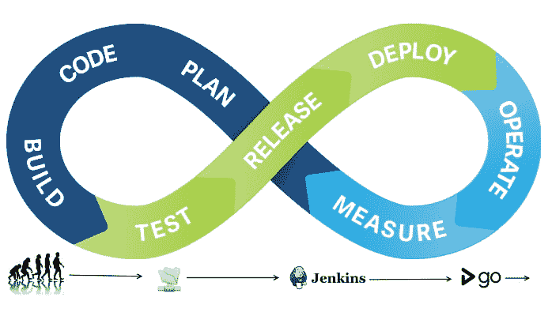
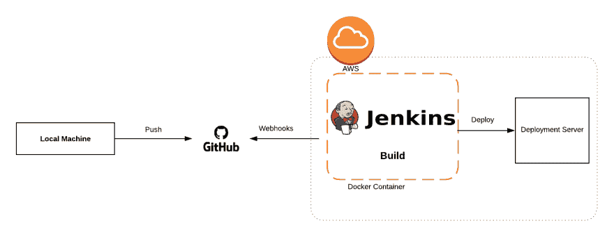

# CI/CD 初学者入门

> 原文：<https://dev.to/samsha1/getting-started-in-cicd-for-begineers-1lp8>

[](https://res.cloudinary.com/practicaldev/image/fetch/s--7eZwUk0o--/c_limit%2Cf_auto%2Cfl_progressive%2Cq_auto%2Cw_880/http://coyee.com/uploads/img/20170512/164319_7hbS.png)

### 什么是 CI/CD？

CI/CD 代表持续集成和持续部署。持续集成意味着持续构建您的应用程序。考虑这样一个场景，开发人员在源代码中做了一些更改。现在，持续集成必须能够获取源代码并准备构建。构建还包括编译和验证代码、代码审查、单元测试和集成测试，以及打包应用程序。

持续集成后，我们可以持续交付。到目前为止，您的产品已经准备好，经过测试，可以交付了。考虑一下，像 Jenkins 这样的持续集成工具部署到测试服务器中执行用户验收测试，一旦完成，它将被部署到生产服务器上进行发布。如果手动完成此步骤，则称之为连续交付，但如果自动完成，则称之为连续部署。

### 了解工作流程

首先，让我们在本地机器上有一个简单的 Hello world 项目，并初始化 git。完成后，将我们的代码推送到远程存储库。接下来，我们将编写简单的 Jenkins 作业，以便它将触发和部署我们的代码到开发服务器。我们将为 jenkins 和 dev 创建两个不同的 aws 实例。记住，我们将在 Docker 容器中运行 jenkins 应用程序，这样我们就不必进行手动安装。

[](https://res.cloudinary.com/practicaldev/image/fetch/s--CCCxukzN--/c_limit%2Cf_auto%2Cfl_progressive%2Cq_auto%2Cw_880/https://thepracticaldev.s3.amazonaws.com/i/apfhmeewq8612z6ecdac.png)

### 让我们把它带进生活

**本地机器内部**

步骤 1:让我们用 php 创建简单的 Hello World 项目。

步骤 2:初始化 git，提交并推送您的更改到远程存储库。

**GitHub 内部**

创建一个 webhook，以便每当代码被推送到指定的分支时，jenkins jobs 都会触发或查找更改。

进入设置->网页挂钩->添加网页挂钩。

**有效负载 URl**:URl 格式为＄JENKINS _ BASE _ URl/github-web hook/—例如:【https://ci.example.com/jenkins/github-webhook/】T2。

**内容类型**:应用/json

**秘钥**:github 可以访问 jenkins 的秘钥。

您希望哪个事件触发此 webhook？:取决于你喜欢的活动。我刚刚检查了推送事件，即每当有东西被推送到 github 主分支时，作业就会被触发。(对于具体的分支机构名称，您可以从 jenkins 处了解)。

更新 Webhooks。Github 里面就是这样。

**詹金斯实例内部**

步骤 1: ssh 到 aws Jenkins 实例

```
``` 
```

ssh -i

```
 Step 2: Run update your packages. 
```

sudo apt-get 更新

```
 Step 3: Install docker 
```

sudo apt-get install dock .我

```
 Step 4: Add Docker to your user group and login again after exit 
```

sudo user mod-ag Ubuntu 停靠器

```
 Step 5: Let's pull docker image for jenkins: 
```

码头工人拉詹金斯/詹金斯

```
 Step 6: Type 
```

docker 图像

```
 to see pulled image from jenkins/jenkins repository

Step 7: Run Docker image: 
```

docker run -d -p 8080:8080 -名称

```
 Step 8:Type 
```

docker ps

```
 to see running container.

Step 9: Once you setup jenkins inside docker. Try, accessing from browser

        ```
<instance public ip >:<external-port-number> 
```

注意:在访问之前，打开 aws 中的添加入站规则。选择安全组(启动向导)。点击编辑->添加规则，设置*自定义 tcp 规则*和 _ 外部端口范围(my case 8080)_ 还 http 规则然后保存

瞧啊。然后你可以运行 jenkins，安装推荐的插件(默认)。填写所需的凭据并设置您的第一个职务集！

步骤 1:创建自由式项目。

第 2 步:添加一些描述并给出 github 资源库的 url，jenkins 将从那里获取您的项目。

记住，要在 github 内部设置 webhook。进入*设置- > webhooks- >添加有效载荷 url* 即/github-webhook/

步骤 3:编写一些 shell 脚本，将您的代码部署到 dev-server 中。

为了建立 jenkins 和 dev 实例之间的连接，我们需要将 jenkins 公钥添加到 dev 授权密钥中。

在 jenkins 实例中，运行 *ssh-keygen* 来生成。公钥和复制公钥。ssh/ to dev。/ssh/authorized_keys。

```
instance = '13.232.89.159' 

ARCHIVE_FILENAME = cicd.zip

zip --symlinks -x *.git* -r $ARCHIVE_FILENAME . #compress all the files and create zip file

echo "--------Copying Files to remote dev server from jenkins ----------"

scp -o StrictHostKeyChecking=no index.tar.gz ubuntu@$instance:/home/ubuntu/

echo "--------Finished Copying----------"

echo "Entering to Dev Instance"

ssh -o StrictHostKeyChecking=no ubuntu@$instance '

  mv $ARCHIVE_FILENAME /var/www/html #move zip file from current directory to /var/www/html

  cd /var/www/html

  unzip $ARCHIVE_FILENAME

  rm -rf $ARCHIVE_FILENAME #remove the file once done

' 
```

一旦脚本部分完成，让我们保存并构建我们的工作。成功构建作业后，我们可以从浏览器访问部署服务器，并查看所做的更改。

这只是我们做的一个简单的例子，只是为了理解 CI/CD 的工作流程。

### 你真棒！