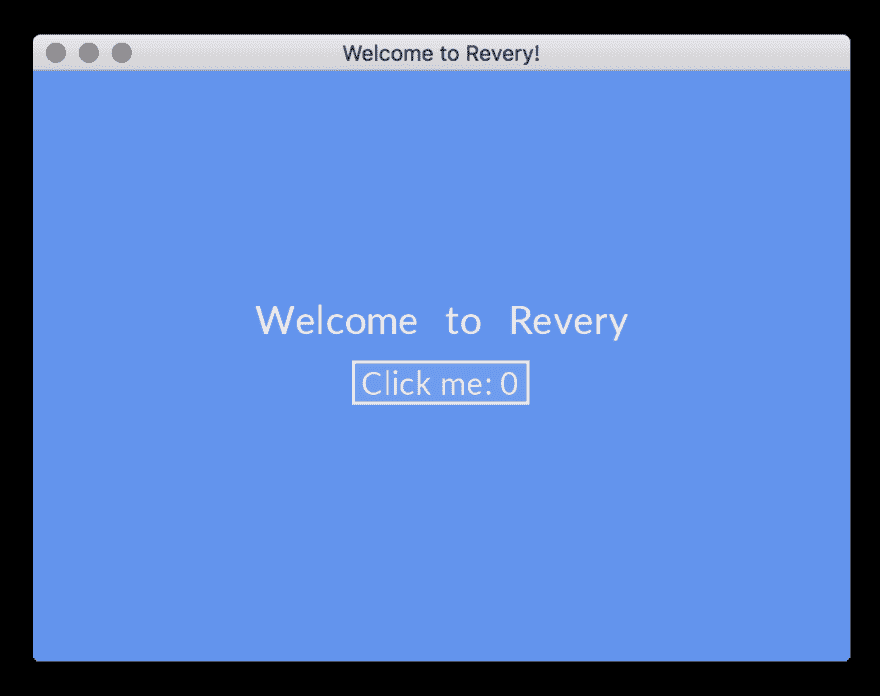

# 理性看待跨平台桌面应用

> 原文：<https://dev.to/kayis/revery---cross-platform-desktop-apps-with-reason-2efj>

*[封面图片由弗兰克·布朗拍摄，在 Flickr 上](https://www.flickr.com/photos/buckstar77/)*

目前，我正在研究我的下一个项目，一本关于创建软件 MVP 的书，经常出现的一个大需求是用一个代码库构建跨平台应用程序的能力。

虽然我认为 React-Native 是一个不错的选择，但是看看其他解决方案也是一个不错的主意。例如，Flutter 最近得到了很多宣传——一个用 Dart 编程语言构建跨平台应用程序的框架。

今天我想看看另一个有前途的方法:

 **## 什么

Revery 有点像超快的原生电子产品——捆绑了 React、Redux 和快速构建系统——一切就绪！

Revery 是一个用 Reason 编程语言构建的*(目前处于实验阶段)*跨平台桌面应用框架。

[原因](https://reasonml.github.io/)是一种新的 OCaml 语法，旨在让 JavaScript 开发者更容易理解；它还具有类似 JSX 的语法。虽然它主要用于编译 JavaScript，但通过一个叫做 [BuckleScript](https://bucklescript.github.io/) 的工具，它也可以编译成本地二进制文件。

Reason 提供了一个健全的类型系统，具有不可空的类型和模式匹配，这应该可以解决 JavaScript 代码库最臭名昭著的错误。

Revery 并不渲染原生的小部件，而是借助 GPU 加速渲染来渲染自己的小部件。

## 为什么

虽然电子无疑是目前构建桌面应用程序最快的方式，但它的代价是它的尺寸和一些性能问题。电子版带有一个完整的浏览器，允许开发者利用网络生态系统。

像 [React-Native](https://facebook.github.io/react-native/) 这样的框架有使用原生小部件的方法，这导致了更好的性能和更小的应用程序，这在移动设备上是一个巨大的胜利，但它也导致了不一致，因为 iOS 和 Android 在原生小部件甚至它们的行为上没有提供 100%的重叠。

那么为什么不扑呢？

我觉得主要原因是 Flutter 目前专注于移动开发。

Revery 将移动平台作为其路线图的目标，但它首先关注桌面平台。

## 如何

让我们看看如何让 Revery 的[示例项目](https://github.com/revery-ui/revery-quick-start)启动并运行。

首先，我们需要安装 [esy](https://esy.sh/) ，这是一个用于本机开发的包管理器。它是通过 [npm](https://npm.org/) 安装的。

```
$ npm install -g esy 
```

接下来，我们需要用 Github 中的 git 克隆示例项目，并打开该项目。

```
$ git clone git@github.com:revery-ui/revery-quick-start.git
$ cd revery-quick-start 
```

现在我们需要安装依赖项，并用 esy 编译所有东西。

```
$ esy install
$ esy build 
```

第一次构建会花一些时间，但之后，我们可以直接运行编译好的二进制文件。

```
$ _build/install/default/bin/App 
```

这将打开应用程序并显示一个带有文本和按钮的窗口。

[](https://res.cloudinary.com/practicaldev/image/fetch/s--3lUjokT8--/c_limit%2Cf_auto%2Cfl_progressive%2Cq_auto%2Cw_880/https://thepracticaldev.s3.amazonaws.com/i/vt8nvv7dzrzfw2ojaezq.png)

在`App.re`中，我们找到了源头，并可以随心所欲地改变它。

## 结论

我认为 Revery 是对跨平台框架前景的一个很好的补充，Reason/OCaml 当然是一种有趣的语言，它有许多很好的特性，可以解决我在日常 JavaScript 工作中遇到的问题。

Revery 借用 React 的概念这一事实让我特别感兴趣。**