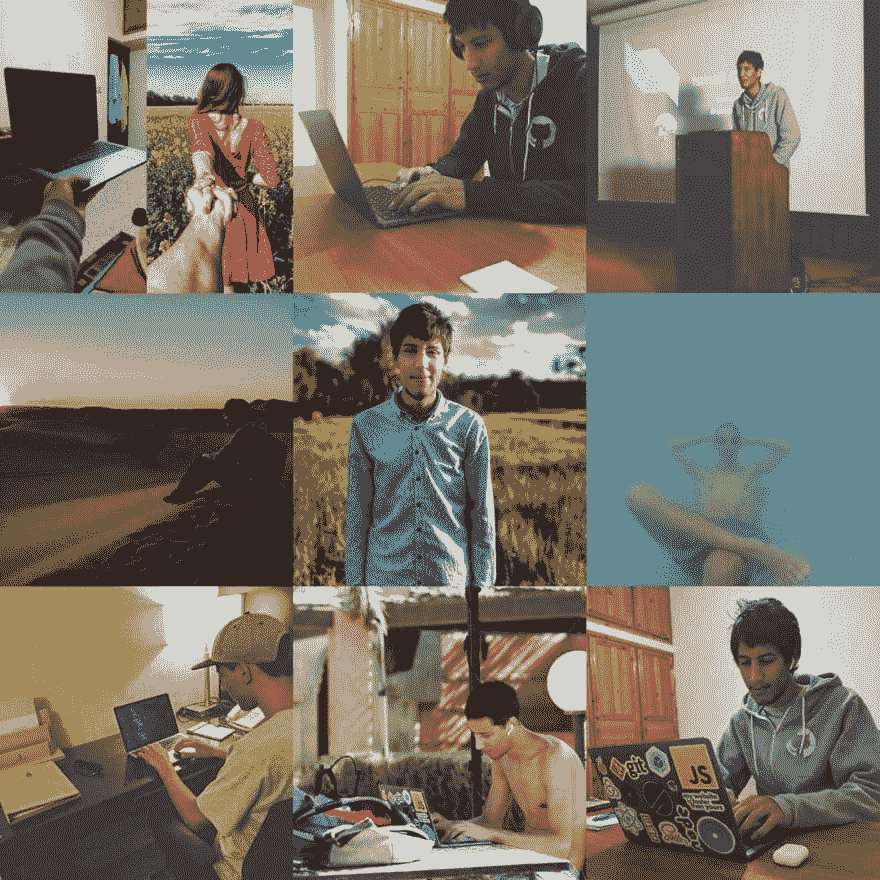

# 2018 年回顾

> 原文：<https://dev.to/smakosh/2018-year-review-mkb>

> 本文原载于[我的个人博客](https://smakosh.com/2018-year-review)。

到目前为止，2018 年对我来说是最有成效的一年，所以我决定在每个新年的开始写一篇文章，强调未来几年需要改进的几项成就。

所以，让我们先从我在 2018 年学到的东西开始吧:

*   开发人员:

    *   CSS 的核心概念，比如建立网格系统的不同方法…
    *   JavaScript 核心概念，如提升、静态类型、执行上下文…
    *   React，React-router-dom，Redux，Formik，Yep，Recompose，Thunk
    *   反应本地，反应导航
    *   哲基尔，鹈鹕，盖茨比
    *   SSR 和 SR/预渲染
    *   不同的设计模式、架构和边界元法…
    *   JS 中的 CSS，特别是像 CSS 模块和样式组件这样的库
    *   特快，猫鼬
    *   火垒，Netlify，Heroku
    *   搜索引擎优化技术&网络爬虫如何工作
    *   斯拉夫语(p)
*   生活:

    *   我们基于许多先前的变量做出决定
    *   我是与我互动最多的环境的结果
    *   真实的社交生活比网络生活更重要
    *   与学习不同，人类可以继续学习
    *   分享我所知道的，为我的问题寻求更多的答案，这让我更加好奇，也让生活变得有趣
    *   到目前为止，我的 LCE 生活框架运作良好，它代表着“学习、创造和赚取”
    *   唯物主义是一个我们需要尽快解决的大问题
    *   让自己总是忙碌也让生活变得有趣
    *   不参加体育活动真的对我的健康有害
    *   睡眠不足有副作用
    *   我每时每刻做出的每一个决定都会影响到别人的决定
*   设计:

    *   延迟加载图像提高了 UX
    *   咏叹调，a11y & i18n
    *   加载微调器和空状态骨架
    *   极简 ui
    *   表单 UX

让我们来看看我创造的东西&创造是我的 LCE 生活框架的第二步:

*   将这个博客从 php/mysql 应用程序迁移并开源到 Gatsby 站点
*   与我在 [Obytes](https://obytes.com) 的同事一起建造 [Barmej](https://barmej.com)

*   [清洁](https://dev.to/smakosh/from-failure-to-launch---hajj-hackathon-424d):

    *   一个政府跟踪垃圾桶的平台，以节省时间和燃料，同时从装满的垃圾桶中收集垃圾。
    *   React app: React，Redux，Sass
    *   节点 API: Express，Mongoose，Passport…
    *   3 天建成
*   [人工智能标签](https://play.google.com/store/apps/details?id=com.aihashtags)

    *   从你的图片中提取精确的标签
    *   内置:Adobe XD，React Native，ClarifAi API
    *   不到 8 小时就建成了
*   [Beaf](http://beafapp.com)

    *   决策的社区平台
    *   登陆页面:盖茨比，风格-组件…
    *   React 应用程序:React，Redux，Styled-components…
    *   节点 API: Express，mongose…
    *   第一次迭代是在不到 24 小时的时间里在 Twitch 上进行的直播
*   通过构建一个[源代码插件](https://github.com/smakosh/gatsby-source-dribbble) &为盖茨比做出了贡献，在我的 [GitHub 个人资料](https://github.com/smakosh)中有几个可用的启动程序

最后但同样重要的是，今年我获得了许多好东西:

*   通过对盖茨比的贡献，他们运送了一些免费的超赞礼品
*   完成了 [Hacktoberfest](https://hacktoberfest.digitalocean.com/) 挑战赛，作为数字海洋的奖励，我还获得了一些[免费劲爆礼品](https://www.instagram.com/p/BsIdPO-BE1u/)
*   通过赢得[免费代码营在线黑客马拉松](https://medium.freecodecamp.org/winners-from-the-2018-freecodecamp-jamstack-hackathon-at-github-2a39bd1db878)的二等奖，我&我的团队获得了一些亚马逊礼品卡&现金奖励

今年最让我骄傲的成绩是 GitHub 上的 2343 次投稿，期待 2019 年贡献更多。

就是这样，伙计们！，快速回顾我在 2018 年学到、创造和获得的东西。

> 当我在一月底前想起其他事情时，我会继续编辑这篇文章