# 用 Flask、Postman 和 PyTest 构建 Restful API 第 2 部分(阅读时间:10 分钟)

> 原文：<https://dev.to/steelwolf180/building-restful-api-with-flask-postman--pytest---part-2-read-time-10-mins-1d6d>

[](https://res.cloudinary.com/practicaldev/image/fetch/s--51ku6ud6--/c_limit%2Cf_auto%2Cfl_progressive%2Cq_auto%2Cw_880/https://thepracticaldev.s3.amazonaws.com/i/bacbj6v0sysiwfk8tapo.jpg)

## 简介

今天，我们将讨论如何在 Postman 中创建模拟端点。使用第 3 部分中的**烧瓶**和 **pytest** 来帮助**费用管理器**项目的 API 端点的设计和原型制作。

对于本系列的新手，您可以前往[第 1 部分](https://www.maxongzb.com/building-restful-api-with-flask-postman-and-pytest-part-1-read-time-6-mins/)了解本系列用于在 Flask 中创建 API 端点的工具和库的解释。

鼓励你在每个**教程**章节之间**跳**。我已经包含了这个[邮递员集合](////assets.ctfassets.net/ly2f59p4unnn/2EN1ftCDhWC04I220Q6yoi/e72a40e14bc311c5652051d65ee06027/Expenses_Manager.postman_collection.json)，让你开始玩模拟端点。

## 工具

*   [邮递员](https://www.getpostman.com/downloads/)

## 项目说明

**费用管理器**必须具有 API 端点的以下特性:

*   **显示余额**
*   **调整平衡**
*   **显示交易列表**
*   **显示单笔交易明细**
*   **增加交易**
*   **更新具体交易明细**
*   **删除交易**

## 为什么创建模拟 API 而不是构建 API？

这样做的原因是为了帮助开发端点的**原型**过程。

通过创建原型，你获得了如何创建端点的视角，并且**看到了**它在最终产品中的样子。

## 利用你的原型来获得理解&共同点

通过使用原型，你可以**传达**你的理解，并在开始开发实际产品之前获得反馈以做出改变。

## 打破前端依赖&后端依赖

通过在 **postman** 中创建模拟端点，您打破了前端开发人员在 API 方面可能遇到的相互依赖问题。

让 API 端点 24/7 全天候运行来测试您的前端 UI 或您在快速移动时构建的 API 总是有问题。

幸运的是，随着 Postman 中模拟端点的创建，以更快的速度进行协作变得更加容易。

## 创建邮递员集合

在开始创建模拟端点之前，您必须注册一个 postman 帐户。

一旦创建了你的新帐户，在你的操作系统中下载邮差应用程序。
**创建**一个新的邮差集合叫做**费用经理**。postman **集合**是在 postman 中存储 API 请求的地方。

[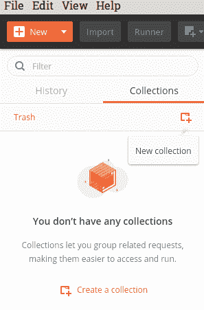](//images.ctfassets.net/ly2f59p4unnn/5OW2dUDdEQ4msMSiqwWk6g/d0b77a498ef854cd7c86f688ad816f4f/Mock_server1.png)

[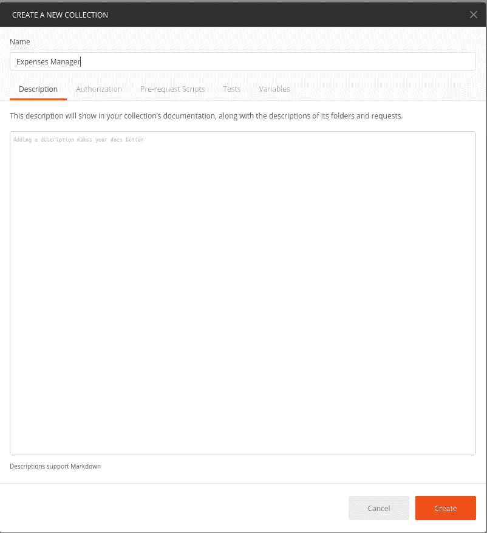](//images.ctfassets.net/ly2f59p4unnn/23Ga1G8vBCIQqYUey4UCOm/8e7ba23c2ba00cc1d343423f729e868e/Mock_server2.png)

## 在 Postman 中创建模拟服务器

现在，在你新创建的邮差收藏中，点击**>**图标，选择**模仿**标签。

将会有一个按钮显示**创建一个模拟服务器**点击该按钮创建一个模拟服务器，如下图所示。

[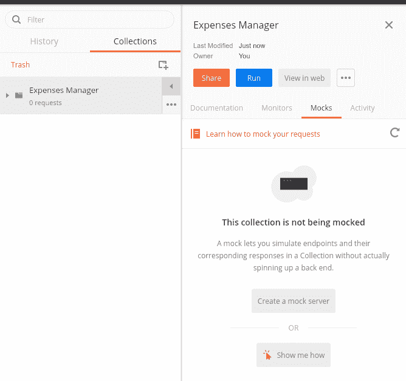](//images.ctfassets.net/ly2f59p4unnn/18BnhUVtMS2sCygwwEWyg2/2b5eb23312bbcb26aa3e3cc986502375/Mock_server3.png)

选择默认设置，点击**创建**按钮，如下图所示。

[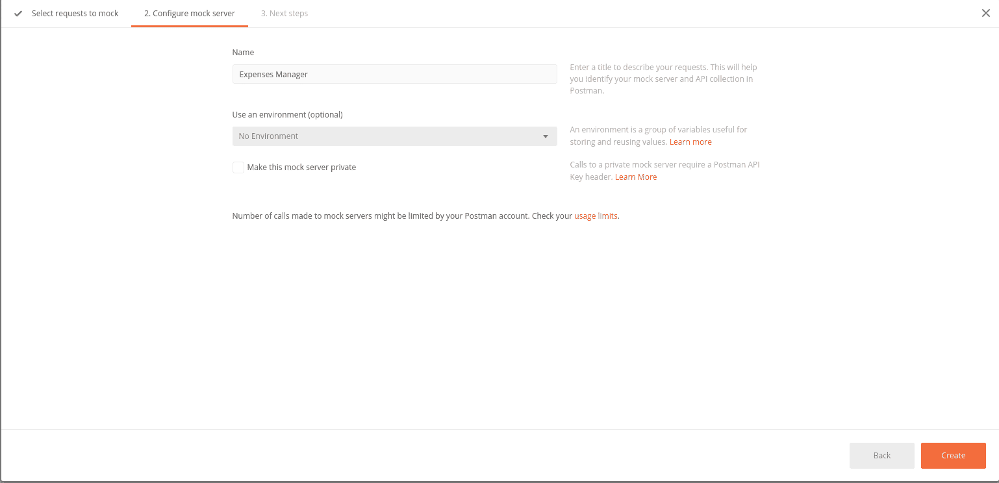](//images.ctfassets.net/ly2f59p4unnn/wyfE3VGT16EOsCgoWAuKU/d9f52dc2720081a35095c507007f7768/Mock_server4.png)

使用 postman 集合的模拟服务器 URL，您需要启用 **Expenses Manager** 环境来使用模拟服务器。

[](//images.ctfassets.net/ly2f59p4unnn/4VmXKzNEDuI6SOmoqK2csq/2fe71d88ecef7d9f94326f46c229b4a0/Mock_server5.png)

### 启用邮递员环境

要启用邮递员，请转到您的右上角带有**眼睛**的图标旁边。

单击名为**无环境**的下拉框。选择**费用经理**环境。

[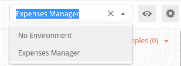](//images.ctfassets.net/ly2f59p4unnn/5DW1uXxzVuUA8EAQ0iaksm/fd873d6631f30535acc909b556d2f5b2/Mock_server11.png)

选择**眼睛**图标，它会显示本地环境变量 **url** 下模拟服务器的链接。

该变量允许您创建 API 点，而无需替换每个请求的 URL，从而节省了时间。

[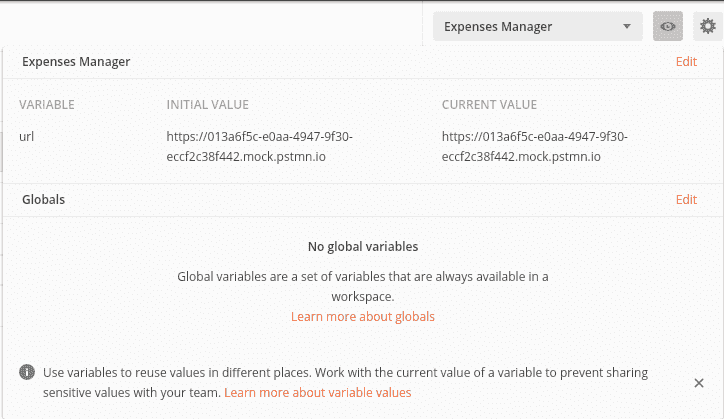](//images.ctfassets.net/ly2f59p4unnn/3OeBjRybUkuic0gQOgsgce/e0f1d5b73f5e45ede5bbcb2b2c3c3ca0/Mock_server12.png)

## 创建新请求

现在我们将着手处理你在邮递员上的第一个请求。选择您的“费用管理器”集合，然后单击“...”箭头按钮底部的按钮。

点击按钮后，会显示一个选项列表，然后点击**添加请求**，如下图所示。

[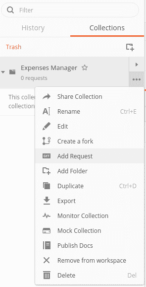](//images.ctfassets.net/ly2f59p4unnn/6M86IsEi2sQoqswqSgYQkS/a4e5017efb96320c9a51a4ac4406bd07/Mock_server6.png)

从这里输入新请求的名称 **Get List of Transactions** 并保存到 expenses manager 集合中。

[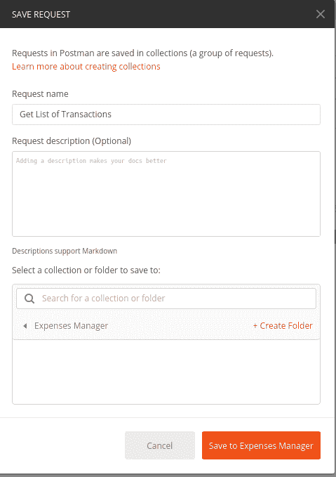](//images.ctfassets.net/ly2f59p4unnn/2eLGBzhWcwKWIquWSauQiK/d3b00b8a39c964334bcbce131192b2e8/Mock_server7.png)

[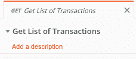](//images.ctfassets.net/ly2f59p4unnn/4GadCymwnY0yqeWkya0Qk8/57ef6a9ac5debffea1196ff8e315182c/Mock_server8.png)

### 编辑请求的描述

让我们为请求添加描述，点击**箭头**图标，然后点击**编辑**图标，如下所示。

该描述将成为自动创建的文档的一部分。因此，添加它来解释 API 做什么是有用的。

```
API Description: Get the list of transactions in the expenses manager 
```

Enter fullscreen mode Exit fullscreen mode

[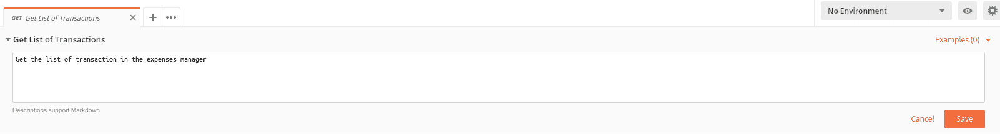](//images.ctfassets.net/ly2f59p4unnn/2RCA3MqLeM2ci8aCoua44y/25e9eaf72ad86ca0bd748dfc654f46ae/Mock_server9.png)

## Postman 中 API 请求列表

在 RESTful API 中，有一堆针对不同用例的 **HTTP** 方法。

您可以通过点击请求中的 **GET** 方法的箭头按钮来获得方法列表。

[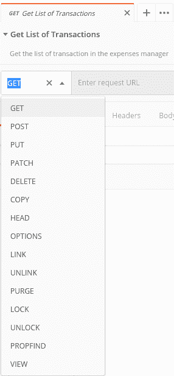](//images.ctfassets.net/ly2f59p4unnn/2qpd0sqxHqOMiQQmgk0KmU/7e907575a07a2bb750bfbaeb10646f9e/Mock_server10.png)

### API 请求方法的类型

这里是您将用于 expanses manager 项目或您将创建的未来 API 的 **HTTP** 方法。

它们遵循与典型数据库的 **CRUD** 函数相似的结构。

它们如下:

*   **GET** -显示记录列表或特定记录。
*   **POST**——它创造了一个记录。
*   **PUT** -更新 API 中的一个现有记录或多个记录。除此之外，它可以创建新的记录，因此您需要捕捉任何不更新现有记录的 PUT 操作。
*   **删除** -删除现有记录。

### 编辑获取交易请求列表

现在转到**交易请求列表**并输入以下 URL。

```
{{url}}/transactions/ 
```

Enter fullscreen mode Exit fullscreen mode

[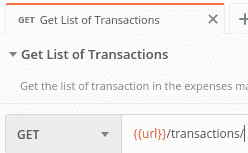](//images.ctfassets.net/ly2f59p4unnn/2ddWvNQDYAI4eU6Koq2aAC/3503ffb1d9ae77996465f4940a97b563/Mock_server13.png)

`{{url}}`

代表模拟服务器的 URL。

## 复制 API 请求

复制图中所示的下列请求。

*   **获取个人交易** - **获取**
*   **创建新的交易** - **过账**
*   **更新单笔交易** - **投放**
*   **删除单笔交易** - **删除**
*   **获取当前余额** - **获取**
*   **更新当前余额** - **放**

[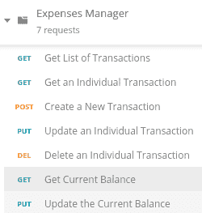](//images.ctfassets.net/ly2f59p4unnn/4Hyx4ENfOoiauyuQQI68wY/bdbd98d9e1720c6e206cd6607fb200e4/Mock_server14.png)

## 创建示例响应

一个示例响应是每当您发送 HTTP 请求时的模拟响应。

选择 **Get List of Transactions** 请求，并添加一个新的示例响应。

[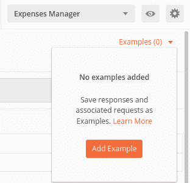](//images.ctfassets.net/ly2f59p4unnn/27T0oTYkwsWMKMyuC46iOa/591ae44211a7d0774a3c33be617ab487/Mock_server15.png)

一旦您创建了一个新的示例，您将看到如下所示的示例响应消息。

[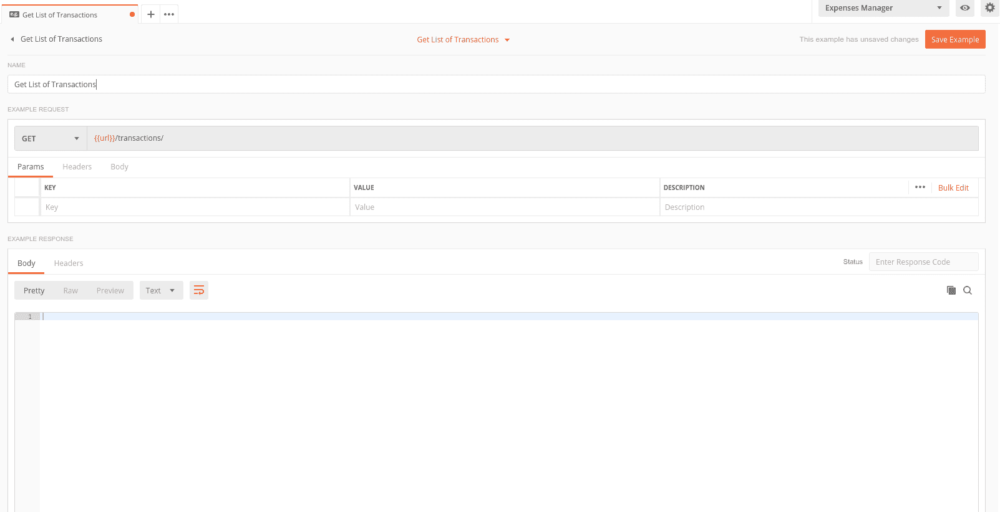](//images.ctfassets.net/ly2f59p4unnn/3ODb28EKDCoqoqoiCwk2kG/88c962d265de8e04149fa6cf71346f11/Mock_server16.png)

将名称替换为**成功响应**，并输入如下所示的响应正文。

```
{
    "balance": 200,
    "transactions": [
        {
            "id": 1,
            "amount": "60",
            "description": "New jeans",
            "type": "expense",
            "inital_balance": 300,
            "current_balance": 240,
            "time": "2019-01-12 09:00:00"
        },
        {
            "id": 2,
            "amount": "40",
            "description": "Lunch at a restaurant",
            "type": "expense",
            "inital_balance": 240,
            "current_balance": 200,
            "time": "2019-01-12 12:00:00"
        },
        {
            "id": 3,
            "amount": "10",
            "description": "Tips",
            "type": "income",
            "inital_balance": 200,
            "current_balance": 210,
            "time": "2019-01-12 16:00:00"
        },
        {
            "id": 4,
            "amount": "10",
            "description": "Weekly bus pass",
            "type": "expense",
            "inital_balance": 210,
            "current_balance": 200,
            "time": "2019-01-12 18:00:00"
        }
    ]
} 
```

Enter fullscreen mode Exit fullscreen mode

[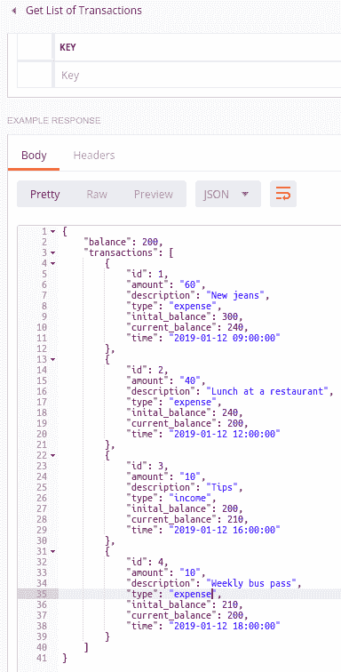](//images.ctfassets.net/ly2f59p4unnn/EC7lYEW0veCWEWMWmWsuM/c6bae7cf28f1b1d94da8a30f95407c8b/Mock_server17.png)

### 添加状态码

状态代码用于标识对服务器的 HTTP 请求是否成功。最常见的 HTTP 状态代码是 404，当网站没有网页时会显示该代码。

在**状态**下拉框中，您可以选择示例响应的状态代码，在本例中为 **200** 。

[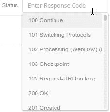](//images.ctfassets.net/ly2f59p4unnn/yKmGq9dsOcuycWC0EgWkm/c996b4152127bf87d5cfda3211c8aa57/Mock_server18.png)

[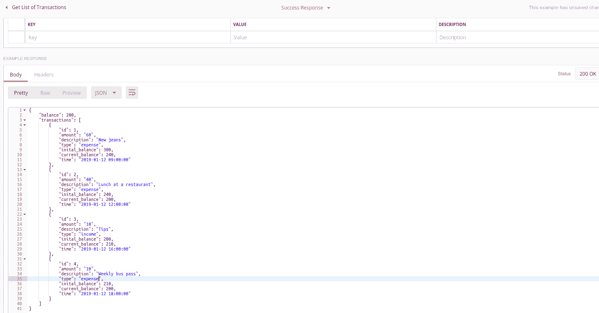](//images.ctfassets.net/ly2f59p4unnn/32bcaIa7b2Si4ieCOwSkk4/f711a31a23d9862c3ae7b87efb94e7a0/Mock_server19.png)

现在，当您点击您的**获取交易列表**请求上的**发送**按钮时。

[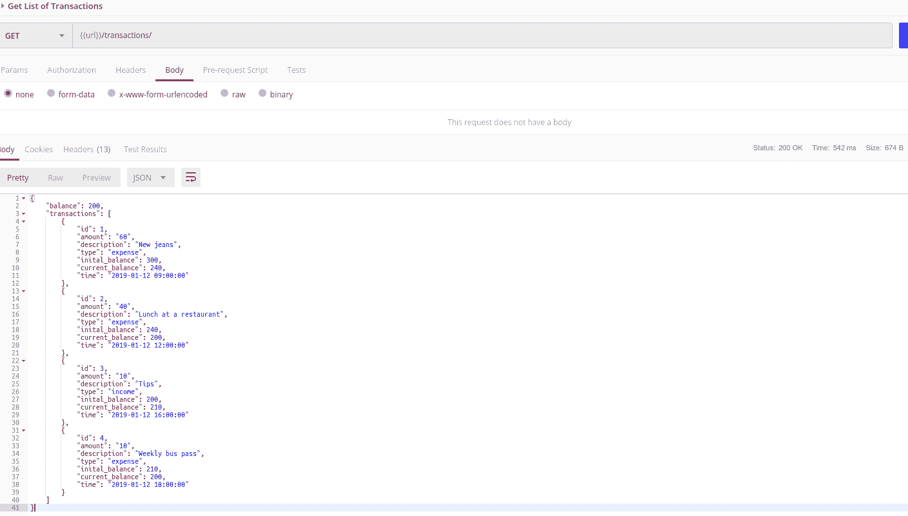](//images.ctfassets.net/ly2f59p4unnn/owGdnA4DpmiicymAuUe4E/057d8f572552ad0242365a6f08afede3/Mock_server20.png)

您将看到您之前创建的**示例响应**。

[](https://i.giphy.com/media/5IMcyqKbkg0O4/giphy.gif)

**恭喜**，您已经创建了您的第一个模拟端点！！！

现在，请为 expenses manager 项目创建剩余的模拟端点，并自己进行测试。

我为**拓展经理**准备了**邮差**系列。如果你不想玩模拟端点，不要担心，我不会告诉任何人。

[Expanses Manager 邮递员集合](https://assets.ctfassets.net/ly2f59p4unnn/2EN1ftCDhWC04I220Q6yoi/e72a40e14bc311c5652051d65ee06027/Expenses_Manager.postman_collection.json)

## 结论

我希望用你在 postman 中创建模拟端点的新技能。它可以极大地帮助您减少前端和您构建的 API 之间的依赖性。

最后，您还记得您添加了 API 请求的**描述**吗？

嗯，所有的 Postman 集合都附带了 **API 文档**页面，其中显示了每个 API 的所有 **API 请求**和**示例响应**。

拥有优秀的 API 文档是采用 API 的关键之一，无论是内部、外部还是公共用例。

所以，邮差，你有没有花一点时间来创作这些文档呢？

## 链接

*   [更好的 Restful API 的 10 个最佳实践](https://blog.mwaysolutions.com/2014/06/05/10-best-practices-for-better-restful-api/)
*   [模拟服务器入门](https://www.youtube.com/watch?v=pAD11I3k9q0)
*   [发送您的第一个请求](https://learning.getpostman.com/docs/postman/launching_postman/sending_the_first_request)
*   [创作你的第一个系列](https://learning.getpostman.com/docs/postman/launching_postman/creating_the_first_collection)
*   [模拟服务器简介](https://learning.getpostman.com/docs/postman/mock_servers/intro_to_mock_servers)
*   [用例子嘲讽](https://learning.getpostman.com/docs/postman/mock_servers/mocking_with_examples/)

如果你喜欢我的文章，要么注册 [Max 的每周简讯](https://mailchi.mp/a1fd1bd1de4a/devto)或者你可以**关注**来获取我在 **Dev** 上的文章的最新更新

这篇文章最初发表在 max 的博客上，题为[用 Flask 构建 Restful API，Postman & PyTest - Part 2(阅读时间:10 分钟)](https://www.maxongzb.com/building-restful-api-with-flask-postman-and-pytest-part-2-read-time-10-mins/)，图片来自[照片由 José Alejandro Cuffia 在 Unsplash 上拍摄](https://unsplash.com/photos/_4815u_ACqQ)