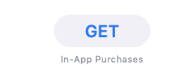

# 第 12 天:Swift macOS 密码管理器，适用于讨厌云的人

> 原文：<https://dev.to/swlkr/day-12-swift-macos-password-manager-for-people-who-hate-the-cloud-1pmn>

[<——第 11 天去这里](https://dev.to/swlkr/day-11-making-a-swift-macos-password-manager-for-people-who-hate-the-cloud-2fln)

📅2019 年 1 月 12 日
🚀距离发布还有 18 天
🔥11 天连胜
💰4.99 美元的价格
🤑0 美元收入
📈0 客户
⌚️花费了 8.5 小时
💻19 个文件被更改，1068 个插入(+)，170 个删除(-)
🏁今天的目标:**生成强密码；UI 改进**

上午 9:14
好了，我已经准备好咖啡、笔记本电脑和 xcode，让我们从这里开始吧。我做的第一件事是打开应用程序，找到自己的方向，看看哪里需要改进。我可以永远这样做；看到需要改进的东西，永远不要发布，这就是为什么有一个发布日期并对工作时间和收入保持诚实是件好事。回头看看每天的更新，看看发生了什么总是好的。

上午 9:21
我放弃了编码，决定在 mac 应用商店输入“密码管理器”。就定价而言，这是一个疯狂的地方。最贵的一款售价 14.99 美元，它看起来并不比其他几款做得更多，在设计方面也没有任何优势。最便宜的是免费的，虽然从技术上来说是正确的，但大多数都在“获取”按钮下面用非常小的字体写着“应用内购买”

## 价格下降多半是假的

所以这种不太有用的东西价格下降的现象有点让人难过。这种向免费增值和最近的免费增值+月订阅/应用内购买的转变是对免费试用情况的一种攻击。我可能应该早点做这种研究，但我很高兴我现在已经做了，这样我就可以调整我的策略，尽量不要像这里的其他人一样。

如果让我看看是什么让这些家喻户晓的名字与失败者区分开来，那就是营销和一个“使命”，或许是一个“故事”。这些东西当然是为了运送更多的产品而制造的，至少在一段时间内肯定是有效的。

*   1password 最著名的密码管理器因其内容营销而闻名，最近与 troy hunt/havebienpwned 合作，选择同步模式和易于记忆的名称
*   Lastpass 因有一个可怕的 UX 而闻名，被黑客攻击，不给你如何同步密码的选项，因为它是作为一个网站而不是一个应用程序开始的
*   总体而言，Dashlane 似乎更好，但市场占有率似乎更低
*   Bitwarden 也是一个竞争者，虽然我不知道 HN 圈之外的人是否知道这一点，但主要区别在于它是开源的

他们都有一个共同点，那就是关注云同步和订阅定价，这两者我都不喜欢。

## 离群索居

那么，假设我能在 18 天内把设计整理好，我该怎么做才能把自己和其他人区分开来，脱颖而出呢？我已经做了一些和其他人有些不同的事情:

*   swift/原生 macOS 应用即将启动，iOS 应用即将推出
*   没有电子或 javascript
*   开放源码
*   透明的收入数字+起源故事(我喜欢好的起源故事)
*   无订阅价格
*   一次性价格
*   没有云同步，只是 macOS 应用程序和即将推出的 iOS 应用程序之间的自动同步
*   没有浏览器扩展
*   高昂的前期价格让人们认为哇，这最好是惊人的

我也从 basecamp 的剧本中吸取了一页，目标是[击败竞争对手](https://basecamp.com/books/rework)，所以这是一个好的开始。我也非常了解我的目标市场，尽管我们是一群脾气暴躁的老男孩和女孩，他们大多讨厌软件，讨厌为软件付费。这可能对我有利，因为他们可以很容易地从开源回购中编译代码，任何不太懂技术的人喜欢这条消息或被他们的黑客朋友推荐，都可以花$美元下载它。

“口口相传”可能是最糟糕的营销策略，就像“产品质量”一样，但这就是我在营销旅程中的位置。我不喜欢广告，所以我不想花钱在人们脸上贴广告。我愿意相信优质 app 是自己卖的，但是我已经不像以前那么幼稚了，所以我必须想出更好的方案来打败 1password 这样的公司。我喜欢 [pinboard](https://pinboard.in) 以一种完全不同的价值主张有效地战胜了它最大的竞争对手 delicious:内向者的社交书签。有一些偶然事件对那个家伙有利，但当 delicious 步履蹒跚时，他仍然不得不继续前进，这是大多数风险投资推动的企业似乎做得很好的事情。类似于 pinboard，我对

## all your passwords(TM)官方营销策略

所以总结一下我把这个送到人们手中的策略:

*   诚实、预先一次性定价
*   专为苹果设备制造:mac 和 iPhone
*   开源，这样你就可以确保它不会把你所有的密码直接发给国家安全局
*   默认情况下脱机
*   局域网同步，没有服务器
*   每一笔交易都直接流向我、我的妻子和我的狗，没有投资者，没有邪恶的公司(当然，苹果除外)
*   iOS 应用也将是开源的，很可能也是免费的

好吧，结果是我今天没有写任何代码，但现在还很早，所以这可能会改变。