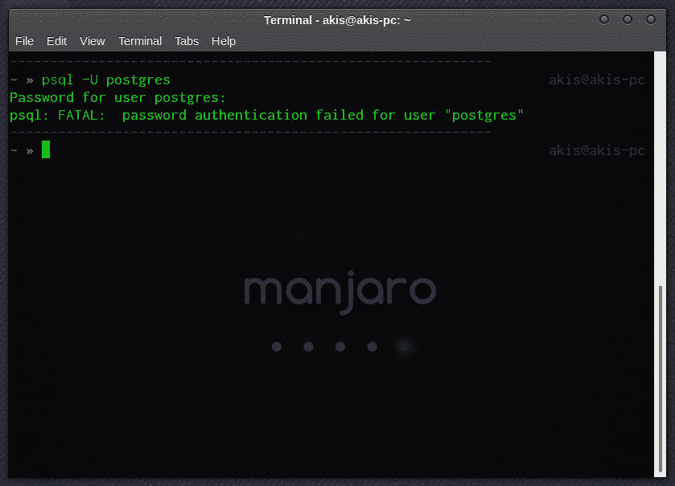
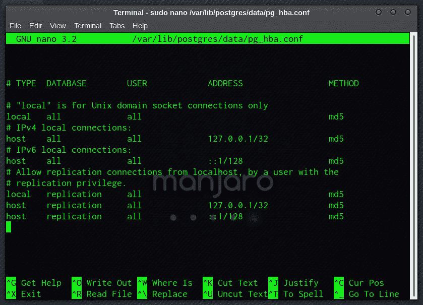
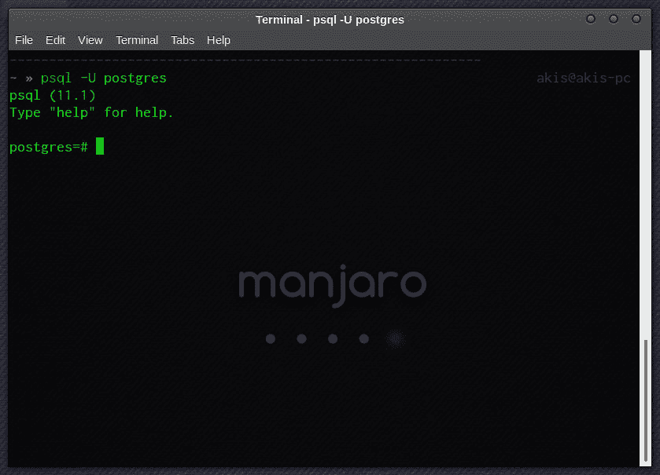
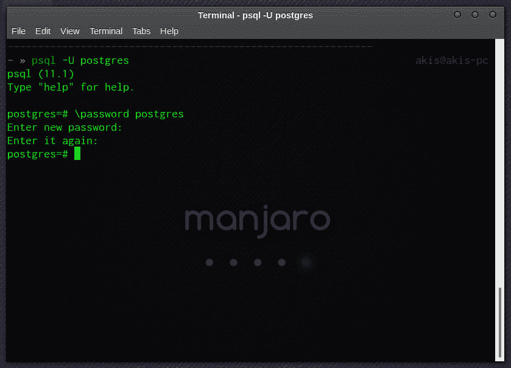
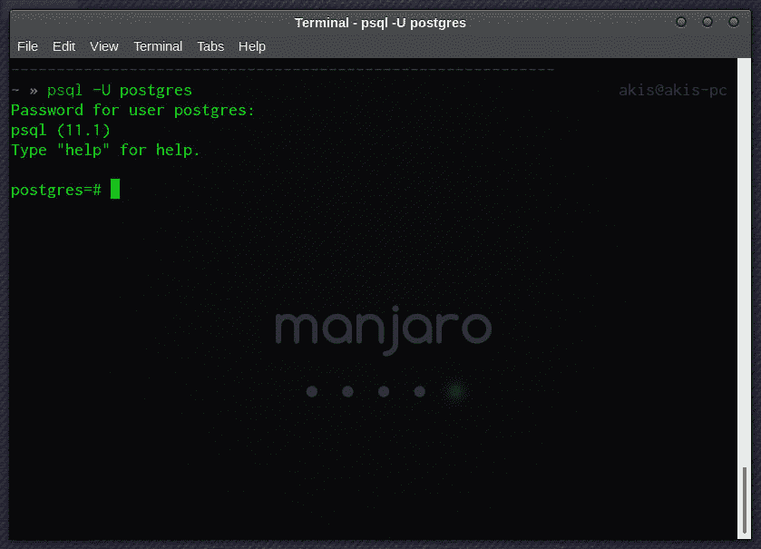

# 如何在 PostgreSQL 中重置忘记的密码

> 原文：<https://dev.to/theoklitosbam7/how-to-reset-your-forgotten-password-in-postgresql-4a7g>

## 意识到问题的那一刻

即使您的本地数据库服务器为每个用户提供一个密码，这也是一个很好的实践。PostgreSQL 的默认用户(也是管理员)是`postgres`。

访问我们数据库的标准方法是通过终端使用`psql`命令(我运行的是 [Manjaro Linux](https://manjaro.org/) )。所以，我们键入:

```
psql -U postgres 
```

Enter fullscreen mode Exit fullscreen mode

我们输入密码，然后收到信息

[](https://res.cloudinary.com/practicaldev/image/fetch/s--dAZxm1B8--/c_limit%2Cf_auto%2Cfl_progressive%2Cq_auto%2Cw_880/https://thepracticaldev.s3.amazonaws.com/i/tom079uyk6500equycf8.png)

## 不要慌！

首先要找到“PostgreSQL 客户端认证配置文件”，它的名字是`pg_hba.conf`。在 Manjaro，它位于路径`/var/lib/postgres/data/pg_hba.conf`中。请注意，它需要具有 root 权限。

```
sudo nano /var/lib/postgres/data/pg_hba.conf 
```

Enter fullscreen mode Exit fullscreen mode

[](https://res.cloudinary.com/practicaldev/image/fetch/s--hSprGU_s--/c_limit%2Cf_auto%2Cfl_progressive%2Cq_auto%2Cw_880/https://thepracticaldev.s3.amazonaws.com/i/zyf18jps8uev8r69pdnm.png)

我们将“本地”连接中的`md5`认证改为`trust`

```
local   all             all                                     trust 
```

Enter fullscreen mode Exit fullscreen mode

我们重启我们的服务器

```
sudo systemctl restart postgresql 
```

Enter fullscreen mode Exit fullscreen mode

现在 PostgreSQL 不再询问密码，我们被允许与用户`postgres`连接

[](https://res.cloudinary.com/practicaldev/image/fetch/s--FiRyjGzJ--/c_limit%2Cf_auto%2Cfl_progressive%2Cq_auto%2Cw_880/https://thepracticaldev.s3.amazonaws.com/i/ng888uq5914ne97cxsts.png)

下一步是重置密码

[](https://res.cloudinary.com/practicaldev/image/fetch/s--OYPPAV6h--/c_limit%2Cf_auto%2Cfl_progressive%2Cq_auto%2Cw_880/https://thepracticaldev.s3.amazonaws.com/i/rjxha9c0gucjsk8reprp.png)

我们退出`psql`，将`pg_hba.conf`恢复到之前的状态(`md5`认证)，然后重启服务器。我们可以使用用户`postgres`的新密码进行连接。

[](https://res.cloudinary.com/practicaldev/image/fetch/s--l9JvM4or--/c_limit%2Cf_auto%2Cfl_progressive%2Cq_auto%2Cw_880/https://thepracticaldev.s3.amazonaws.com/i/espqwgzst3yrwbtap4hu.png)

* * *

*最初发表于[https://www.codingnotebook.eu/postgresql-reset-password/](https://www.codingnotebook.eu/postgresql-reset-password/)T3】*