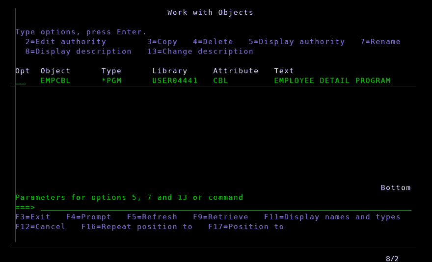
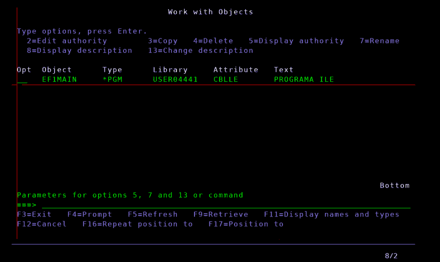
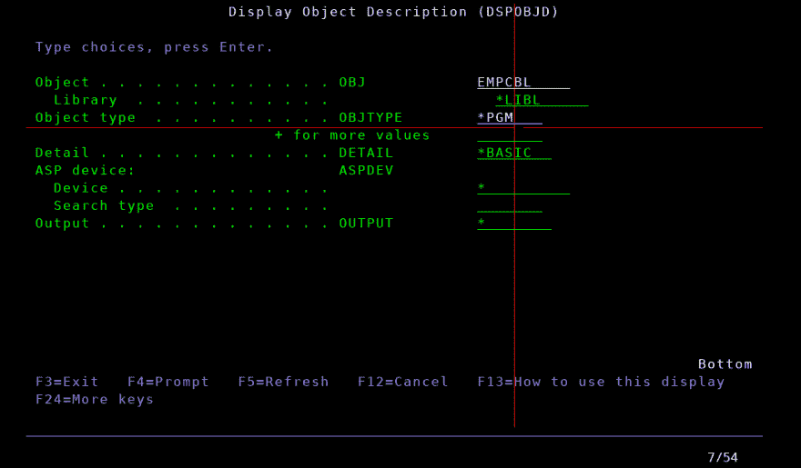
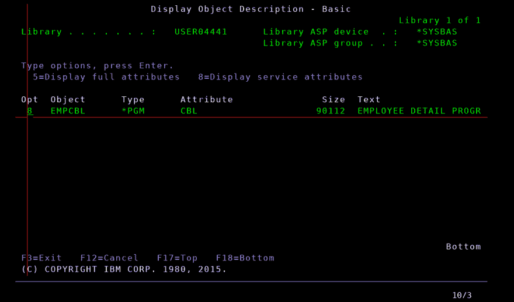
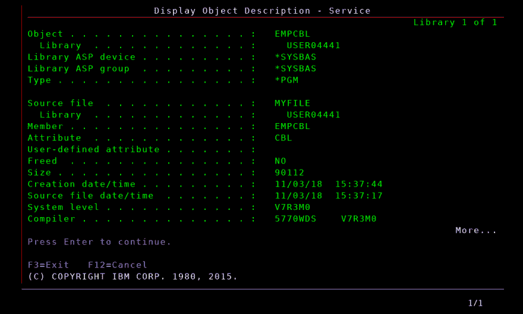
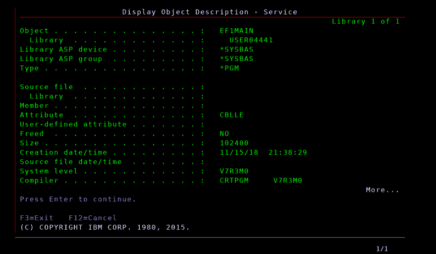
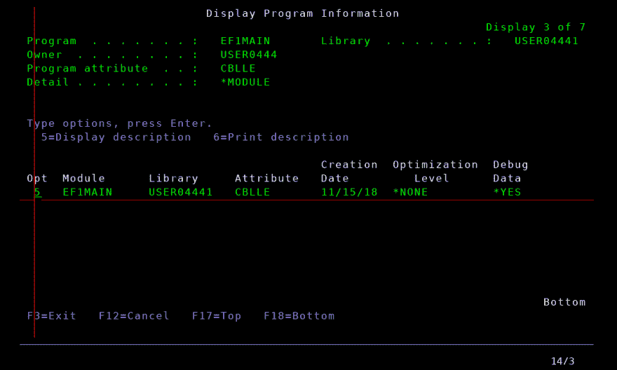
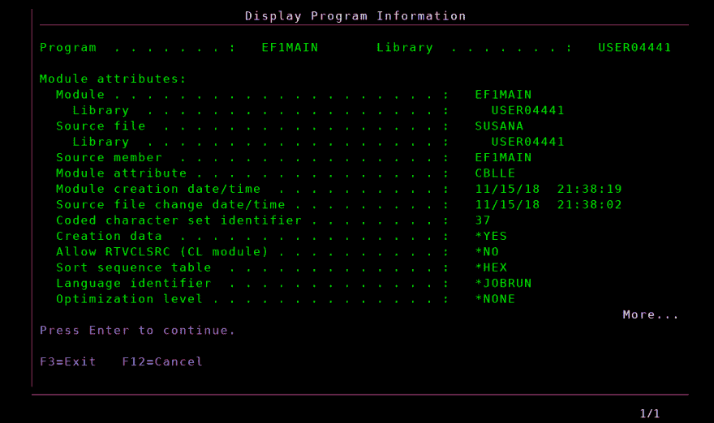

# 显示程序

> 原文：<https://dev.to/theoklitosbam7/dsppgm-display-program-3288>

## 有点百科全书式的介绍

IBM 的 iSeries 操作系统(以前称为 AS/400)是一个遗留的计算机系统，主要用于金融服务行业(银行、保险)。它支持许多编程语言的应用程序开发，但最著名的是 COBOL、RPG、CL。

1993 年 2 月，IBM 首次为 ILE C 引入了 ILE(集成语言环境), 1994 年 5 月 COBOL、RPG、CL 也加入了这个行列。ILE 是一个可以编译、绑定和运行多种语言代码的环境。

因此，我们可以看到具有 CBL 属性(对于 COBOL/400)和 CBLLE 属性(对于 ILE COBOL)的 PGM。

COBOL/400 是 IBM 为 AS/400 系统采用的标准 COBOL。它的不同之处在于报告和子文件的文件处理、指示器的使用以及 AS/400 特有的任何其他功能都包含在其中。

## 问题

作为开发人员，您经常需要找到编译 pgm 对象的源代码。有人告诉你:“试试 DSPOBJD(显示对象描述)命令”。我们开始吧！进入命令行，写`DSPOBJD`，按 **F4** 按钮，填写必填字段，按**进入**。

选择选项 **8** 并注意显示的信息。

瞧啊。源代码在库 **USER04441** 中，在源文件 **MYFILE** 中，在成员 **EMPCBL** 中。我们的问题解决了！现在让我们找到 **EF1MAIN** 的源代码。遵循相同的流程:

等等！这是怎么回事？我们的信息在哪里？我们必须记住 **EF1MAIN** 是一个 CBLLE 程序。当它被编译时，它并没有直接产生可执行对象，而是产生了一个中间的**模块**，并由此产生了 **PGM** 。

## 解

还有一个更通用的命令:`DSPPGM`(显示程序)。CBLLE 程序的显示程序信息有很多屏幕，所以我们必须按下**回车**，直到我们看到:

使用 **5** 选项，我们得到:

源代码在库 **USER04441** 中，在源文件 **SUSANA** 中，在成员 **EF1MAIN** 中。

现在，我们真正解决了我们的问题！

* * *

*最初发表于[https://www.codingnotebook.eu/dsppgm/](https://www.codingnotebook.eu/dsppgm/)T3】*