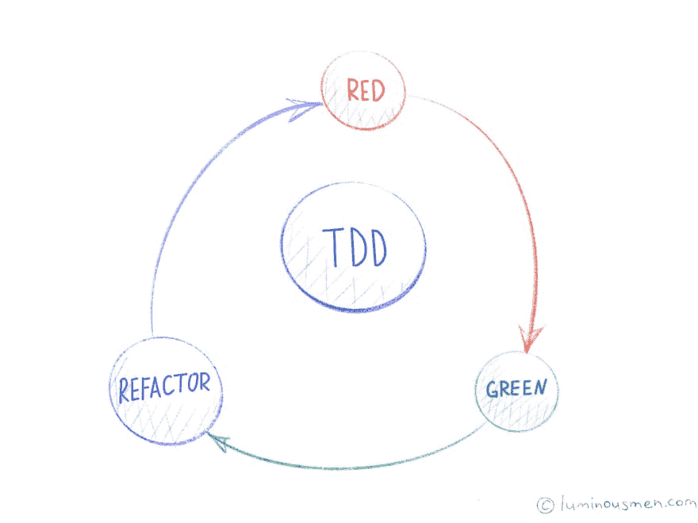

# 单元测试颂

> 原文：<https://dev.to/luminousmen/ode-to-unit-tests-3kia>

> 测试法则:你对软件行为的了解程度就是你对它进行准确测试的程度。
> ——《代码简洁性》

为了验证应用程序的正确性，我们使用不同种类的测试:一些测试检查小函数或类的逻辑，另一些测试检查从 UI 到数据库和外部服务的所有系统层。某些类型的测试可能介于调用应用程序 API 和为外部服务使用存根之间。测试元素的数量定义了测试的范围:元素越少，范围越小，元素越多，范围越大。测试范围越大，需要的计算资源就越多，运行测试所需的时间也就越多。此外，更大范围的测试更难维护，而且它们的反馈周期更长。
今天我们来谈谈单元测试，它位于测试金字塔的底部，反馈周期最短。

## 单元测试

那么，什么是单元测试呢？这是一个可以检查另一个代码是否按预期工作的代码。单元测试的重要品质之一如下:

*   它测试应用程序元素的功能-单元-类和功能；
*   它是由开发人员在编写代码时编写的；
*   无需设置额外的环境即可轻松运行；
*   它需要很少的运行时间；
*   它可以很容易地与 [CI](https://luminousmen.com/post/continuous-Integration-continuous-delivery) 集成，因为它不需要额外的环境。

好的单元测试遵循五条规则，这五条规则形成了缩写词 f . I . r . s . t .
**Fast**——测试应该是快速的。当测试运行缓慢时，您不希望频繁运行它们。如果你不经常运行它们，你就不能及早发现问题并轻松修复它们。你不会觉得清理代码是自由的。
**——测试不应该互相依赖。开发者应该能够以你喜欢的任何顺序运行测试(甚至是并行的)。当测试相互依赖时，第一个失败的测试会导致一连串的下游故障，使得诊断变得困难，并隐藏了下游的缺陷。[固体](https://luminousmen.com/post/what-are-the-best-engineering-principles)原则的单一责任原则(SRP)说，类应该是小的和单一目的的。这也可以应用到你的测试中。如果你的一个测试方法可能因为多种原因而失败，那么考虑把它分成单独的测试。
**–测试应该在任何环境下都是可重复的:在生产环境中，在 QA 环境中，甚至在开发人员的笔记本电脑上。测试结果在任何时间和任何地点都必须相同。
**自验证**–每次测试必须能够确定输出是否符合预期。他们要么通过，要么失败。您不必通读日志文件或比较不同的文件来查看测试是否通过。如果测试没有自我验证，那么失败可能会变得主观，运行测试可能需要长时间的人工评估。
**彻底/及时**——测试应该在适当的时候编写，并带有特性实现。事后测试要求开发人员重构工作代码，并付出额外的努力让测试满足这些首要原则。****

 ****## 为什么要检测？

一旦我们知道测试的是什么，下一个问题就是——为什么？简单的答案是因为单元测试帮助我们测试代码并发现缺陷。这是真的，但是有一个不太明显但更重要的原因:它们有助于保持实现的应用程序的可维护性——更快地添加新功能和修复错误。可维护性通常被描述为理解、改变和测试应用程序的能力。单元测试有助于所有这三个方面:

*   当单元测试是测试场景的实现时，它们有助于理解组件功能；
*   单元测试可以很快告诉你一个变化是否破坏了现有的功能；
*   使用单元测试的开发迫使开发人员设计更多可测试的组件(通常这意味着更好的代码)。反对单元测试最常见的理由是它们增加了开发时间。对于一个项目的最开始，当只有最初的一组特性被实现并且几乎每一段代码都是新写的时候，这是正确的。但是随着项目的进行，你会发现自己越来越频繁地重写旧代码。你将开始花时间试图理解旧代码是如何工作的，并确保你的改变没有破坏它。这正是单元测试可以帮助你的地方。是的，跳过单元测试可以让你在开始时开发得更快，但是如果应用程序要被使用，比如说，使用几年，在此过程中引入更多的特性，你必须保持应用程序的可维护性并编写单元测试。

## 代码覆盖率

代码覆盖率是一种度量，用于描述一个程序的源代码被一个特定的测试套件测试的程度。通常，具有高代码覆盖率的程序已经过更彻底的测试，并且比具有低代码覆盖率的程序包含错误的机会更低。但是仅仅是典型的，因为即使覆盖了 100%的代码，我们仍然对测试的质量一无所知。有些测试可以覆盖代码，但是没有用，没有必要的断言，或者只是设计得不好。这听起来违背直觉，但是知道哪个代码被发现更重要。未覆盖的代码意味着没有单元测试场景来验证代码是否按预期工作。它使代码覆盖更像是一个开发者工具，用于理解需要更多的测试场景，而不是一个用作持续集成质量检验的工具。就识别热点的最低代码覆盖率达成一致仍然是一个好主意，但是你不能盲目相信高代码覆盖率，我们应该关心单元测试的质量。

## TDD

先说 TDD 流程。在测试驱动的开发中，每个新特性都是从为它编写测试开始的。要编写一个测试，开发人员必须清楚地理解特性的规格和需求。这是测试驱动开发与在编写代码之后编写单元测试的区别:它让开发人员在编写代码之前关注测试场景——这是一个微妙但重要的区别。
第二步，我们运行所有的测试，看看新的测试是否失败。然后，我们编写代码。
下一步是编写一些通过测试的代码。在这个阶段编写的新代码并不完美，例如，可能以一种不优雅的方式通过测试。
此时，编写代码的唯一目的就是通过测试。程序员不得编写超出测试功能的代码。
接下来，我们进行测试。
如果所有的测试用例都通过了，程序员就可以确信新代码满足了测试需求，并且没有破坏或降低任何现有的特性。
如果没有通过，必须调整新代码，直到通过为止。对于这之后的步骤，我们重构代码。
如有必要，我们将重复这一过程，从另一个新的测试开始，然后重复这一循环以推进功能。
TDD 方法有一些局限性，例如，很难将其应用于大数据&数据科学项目，因为那些应用程序的数据驱动部分，它也很难应用于 GUI 或前端开发。但这是另一篇文章的主题。

## 结论

因此，总之，单元测试是一种强大的技术，它允许人们通过测试场景快速验证代码，加速长期开发，并保持代码处于可维护状态。

* * *

**感谢您的阅读！**

有什么问题吗？请在下面留下您的评论，开始精彩的讨论！

查看我的博客或来打个招呼👋在[推特](https://twitter.com/luminousmen)或订阅[我的电报频道](https://t.me/iamluminousmen)。
做好你的计划！****