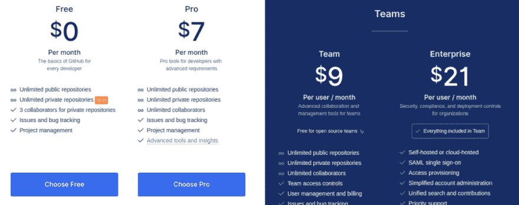

# 从 GitHub 获得免费的无限私有库

> 原文：<https://dev.to/xeroxism/get-free-unlimited-private-repositories-from-github-8mc>

GitHub [已经宣布](https://blog.github.com/2019-01-07-new-year-new-github/)它现在允许无限的私有存储库(简称“repos”)。对于那些不知道的人来说，GitHub 是一个在线代码托管平台，使用了名为 [git](https://dev.to/xeroxism/microsoft-acquiring-github-for-75-billion-dollars-5hj5-temp-slug-5020478) 的[开源](https://fossnaija.com/open-source-really-matter-control-not-code/)版本控制软件系统。存储在 GitHub 上的代码可以在任何一个单独的开发人员或一组开发人员身上进行修改和改进；并且对代码库所做的任何改变都被跟踪、存储并在必要时撤销。

在此之前，GitHub 已经向开发者提供了免费的仓库账户来存储他们的代码，但是这些仓库是默认公开的，也就是说，任何人都可以复制和使用。如果 GitHub 用户想把它们变成私有的，他们必须付费(大约每月 7 美元)。

多年来，许多开发人员(新手和老手都一样)被 GitHub 吸引，几乎就像它是默认的可用平台一样。一个原因是它有一个非常简单/直观的用户界面，在许多开发者和组织中很受欢迎。

但是，拥有私人回购已经成为许多 GitHub 用户多年来愿望清单中的一个非常重要的项目。也是吸引 git 用户到其他平台如 Gitbucket 的原因之一。

随着公告的发布，GitHub 现在包括私人回购。所以开发者现在可以在他们不想与公众分享的项目中使用它，而不用支付任何费用，也就是免费的！！！

不过有一个警告:私人回购只能允许最多三个合作者免费回购。免费(无限制)的公开回购将继续，尽管它也有无限的合作者。

这种发展是否是去年微软收购 GitHub 的结果，只有时间能证明。新的一年，新的 GitHub！

快乐的 Linux！

帖子[从 GitHub](https://fossnaija.com/github-free-repositories/) 获得免费的无限私有库最早出现在 [Foss Naija](https://fossnaija.com) 上。