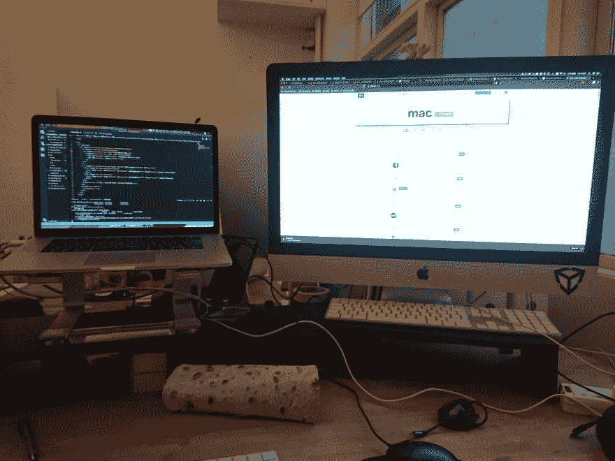

# iMac + Macbook 组合的两种协同方式

> 原文：<https://dev.to/bhison/two-ways-to-get-synergy-out-of-an-imac--macbook-combo-1f02>

让我们从房间里的大象开始——一台 iMac 加一台 Macbook 是颓废的，过分的，有点不必要的，我同意！我认为我的意图是在工作室使用 iMac，在其他地方使用笔记本电脑，但我有点厌倦了在晚上的黑客会议回来后重新安装我在 iMac 上使用的最新软件包。不管怎样，我通过各种方式拥有这些设备，实际上，过了一段时间后，我有点喜欢把它们作为一种设置。

给我这些东西时，我问自己的问题是——著名的苹果互操作性在哪里？需要移动设备和功能强大的设备肯定是一种经典的搭配吧？事实上，经常使用两台不同的 MAC 电脑的人几乎没有什么值得奖励的。我梦想着 MacOS 漫游配置文件的那一天——不仅仅是你的桌面在设备之间被镜像(这有点像 iCloud ),而是你所有的应用程序和应用程序设置以及你所有的文件、网站和主题...因此，虽然要达到苹果自己的神奇用户体验标准还有一段路要走，但你可以根据你的精确型号，做以下事情

### 1。在目标显示模式下，将 iMac 用作外接显示器

*   与 2009 年末至 2014 年年中的 iMacs 兼容

所以，我在一台不常用的机器上安装了这个大屏幕，在一台我一直使用的机器上安装了一个小屏幕。此外，几年前我见过我哥哥用他的 iMac 玩 Xbox，所以我知道这方面的东西是可能的。我很高兴地看到，我保管的 iMac 已经足够旧，可以被列入兼容性列表。出于某种原因，retina iMacs 没有目标显示模式选项。我在某处读到这是因为有一个问题，扩大低分辨率输出。不幸的是，这只是苹果慢慢剥离其产品有趣用途的又一个例子。

但是你很幸运，有一个兼容的设备！那么我们该怎么做呢？首先，你需要一根迷你 displayport 线缆。还有*不*我不是指迅雷电缆*是的*我花了很长时间试图让它工作，然后我意识到这些可能看起来一样，但由于某种原因功能不同。将这根电缆插入 iMac 的显示端口和 Macbook 的显示端口，然后点击 iMac 上的`Cmd + F2`。

请注意，较新的设备可以使用其 thunderbolt 端口进行显示，而较旧的设备有带小屏幕符号的专用端口。还要注意的是，这也适用于 Macbooks 以外的东西——如果你有一个 HDMI 到 mini displayport 适配器，你可以像使用电视一样使用 iMac 和音频等一切。如果您有任何问题，请点击查看[更多详情。](https://support.apple.com/en-us/HT204592)

### 2。将您的 iMac 用作 Time Machine 服务器

*   *在埃尔卡皮坦不起作用，*在高山上起作用，*可能*在高山上起作用我还没查过！**

 *关于两台机器之间的另一个可比较的区别——一台一直放在我工作室的桌子上，另一台放在我的包里，放在我的餐桌上，通常更多的时候是在野外。我的 iMac 是安全的，而我的 Macbook 却不是。谢天谢地，有一种方法可以利用这一点。只要你的 Macbook 和 iMac 在同一个网络上，你就可以把它们无线备份到你的 iMac 上，这样你就知道，如果你在火车上喝醉了，又被抢劫了，你可以安全地保存你所有的文件。

一旦你知道这是可能的，那么设置起来就相对简单了。它只需要设置您的 iMac，以便它可以用作时间机器目标[【文章】](https://support.apple.com/en-gb/HT202784#mac)，然后在设置时间机器[【文章】](https://support.apple.com/en-gb/HT201250)时选择该机器作为您的目标。

在现实中，无线数据传输的速度意味着需要相当长的时间来进行初始备份，所以我使用了以太网电缆。幸运的是，Time Machine 的工作方式有点像 git，因为它跟踪实际的变化，而不是为每次备份存储整个磁盘映像。这实际上是我第一次认真使用时间机器，不得不说我印象深刻。终于可以正确备份我每天做的所有事情了，这种感觉真好。

设置这些有问题吗？或者你有其他聪明的方法来使用这个价格过高的豪华组合吗？请在评论中告诉我。*