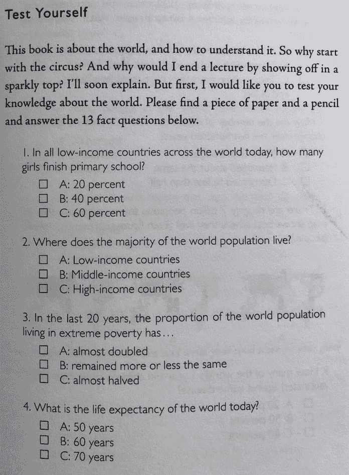
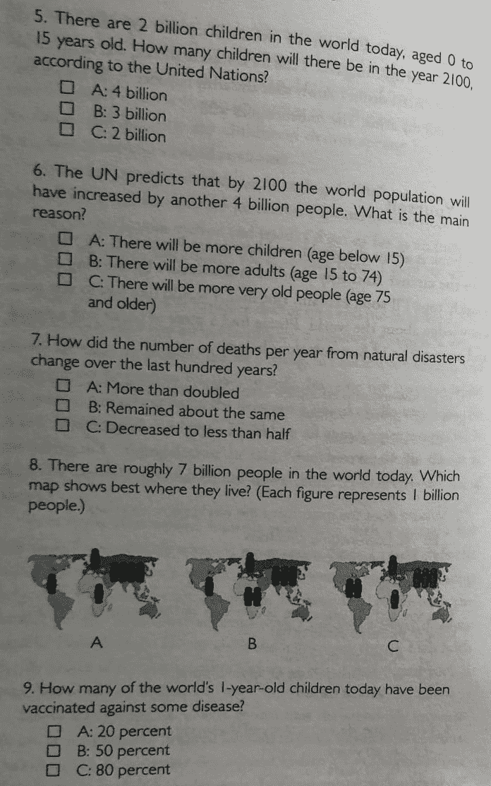
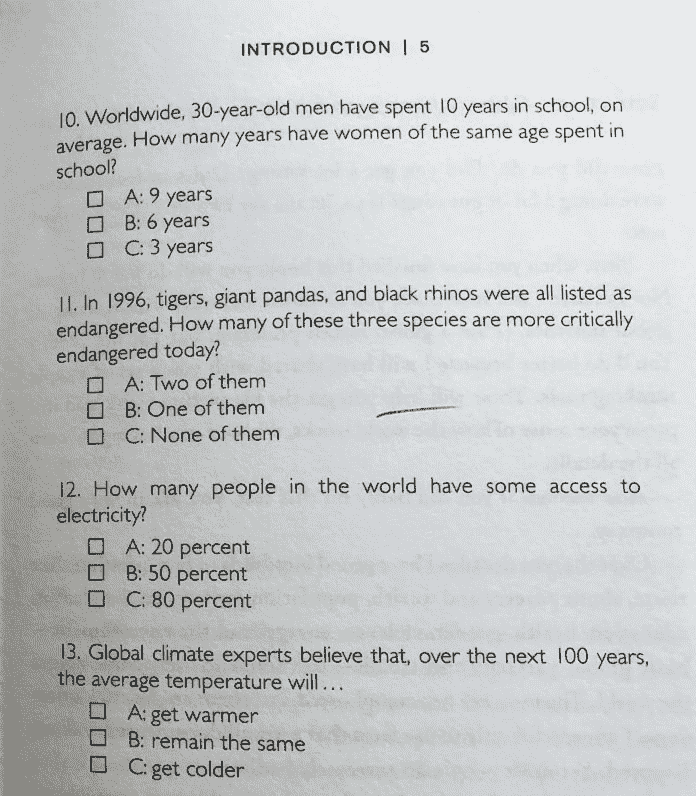
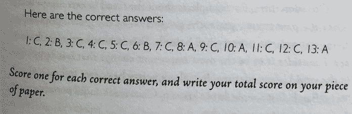

# 真实性——书评

> 原文：<https://dev.to/greenido/factfulness-book-review-52ie>

这是我在 2018 年期间读过的最好的书之一。

汉斯·罗斯林是一位伟大的作家(也是一位演说家)，他用非常清晰的方式表达了自己的想法。打开这本书最重要的事情之一，是他一开始给你的测试。它向你证明，你对我们生活的世界知之甚少。它非常清楚地阐明了这一点。

不信？

自己尝试一下:

<figure> 

<figcaption>
</figcaption>

</figure>

…现在向下滚动并检查您的结果…

one

Two

three

four

five

six

seven

eight

nine

Ten

去吧，但请诚实。

你能答对多少个问题？

我从书中获得的两个主要观点是汉斯提出的新框架:[四个收入群体](https://www.gatesnotes.com/Books/Factfulness#incomegroups)和阻止我们看清世界本来面目的十种本能。他在这本书的大部分时间里展示了不同的本能，从恐惧本能(=对可怕事物的更多关注)到规模本能(独立的数字往往看起来比实际更令人印象深刻)到差距本能(大多数人处于两个极端之间)。对于每一个问题，他都提供了关于如何克服我们先天偏见的实用建议。

我强烈推荐这本书。如果你想领略他的智慧和清晰的解释，这里是他的一个 Ted 演讲: