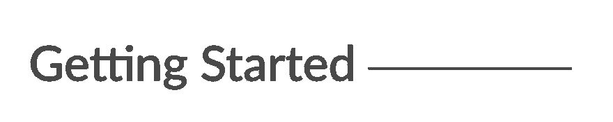
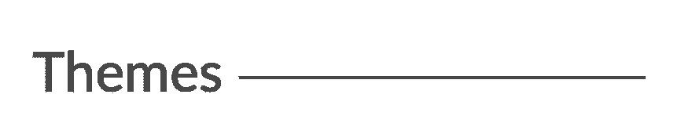
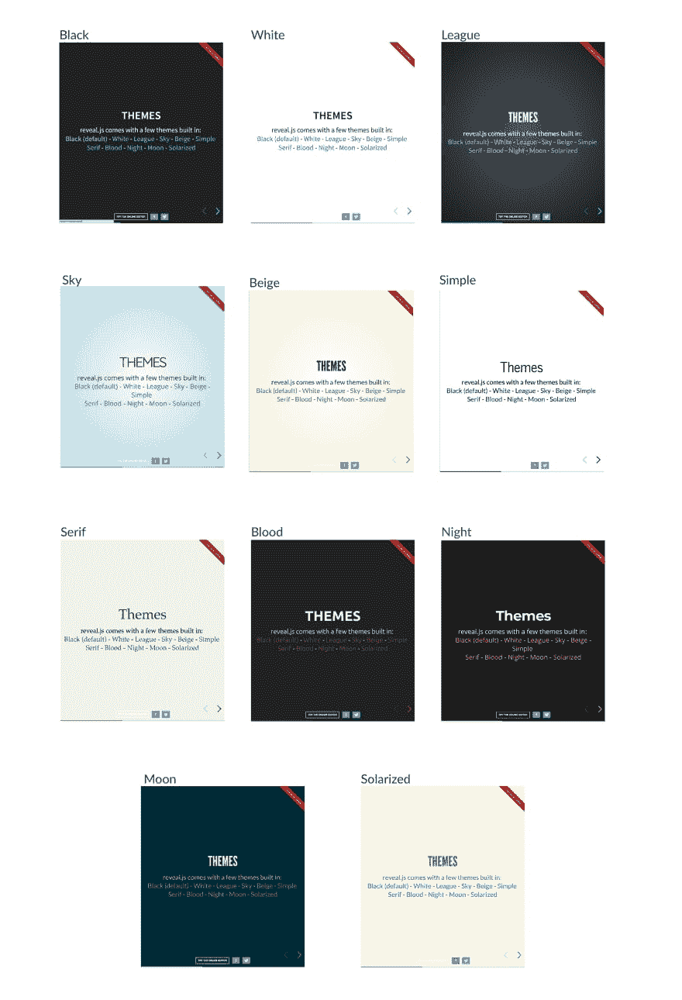
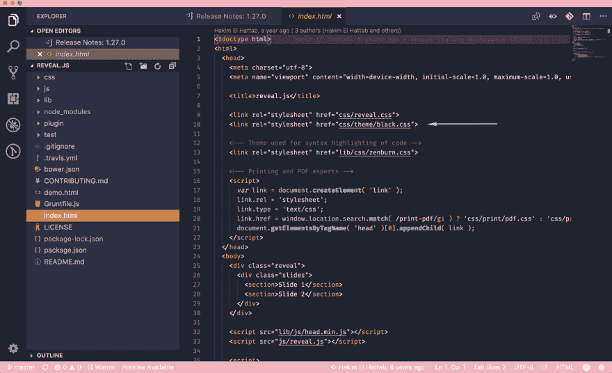
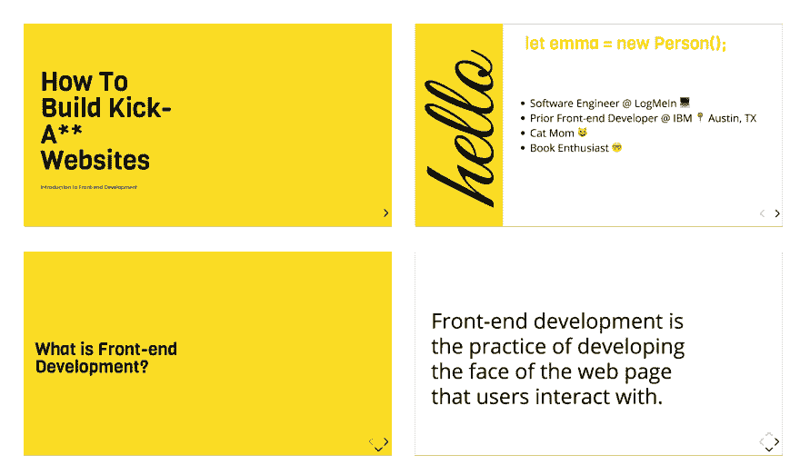
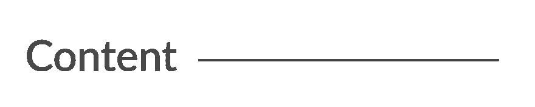

# 如何使用 HTML、CSS 和 JavaScript 构建吸引人的演示文稿

> 原文：<https://dev.to/emmabostian/how-to-build-a-captivating-presentation-using-html-css--javascript-nno>

构建漂亮的演示文稿很难。通常你会被 Keynote 或 PowerPoint 所困，而这些模板又极其有限和普通。不再是了。

今天，我们将学习如何使用 HTML、CSS 和 JavaScript 创建令人惊叹的动画演示。

如果你是 web 开发的初学者，不要担心！本教程将很容易跟上。所以让我们直接滑进去吧！

[](https://res.cloudinary.com/practicaldev/image/fetch/s--GJFEWvrW--/c_limit%2Cf_auto%2Cfl_progressive%2Cq_auto%2Cw_880/https://cdn-images-1.medium.com/max/2000/1%2ACN43a2YgQ82c5Fl1wIoZ2A.png)

我们将使用一个名为 [Reveal.js](https://revealjs.com/#/) 的非常棒的框架。它为创建有趣和可定制的演示提供了强大的功能。

1.  前往 [Reveal.js](https://github.com/hakimel/reveal.js) 存储库并克隆该项目(您也可以将其分支到您的 GitHub 名称空间)。

[](https://res.cloudinary.com/practicaldev/image/fetch/s--eIkZwy1E--/c_limit%2Cf_auto%2Cfl_progressive%2Cq_auto%2Cw_880/https://cdn-images-1.medium.com/max/1600/1%2AS_ZYbkd7Y6j1_Lj1RE0sWg.png)

1.  将目录更改为新克隆的文件夹，并运行 npm install 来下载软件包依赖项。然后运行`npm start`运行项目。

[](https://res.cloudinary.com/practicaldev/image/fetch/s--dBhgxySs--/c_limit%2Cf_auto%2Cfl_progressive%2Cq_auto%2Cw_880/https://cdn-images-1.medium.com/max/1600/1%2APw39d6yELnp3yckd8UBAfQ.png)

`index.html`文件保存了幻灯片的所有标记。这是使用 Reveal.js 的缺点之一；所有内容都将放在这个 HTML 文件中。

[](https://res.cloudinary.com/practicaldev/image/fetch/s--MMsHmqQQ--/c_limit%2Cf_auto%2Cfl_progressive%2Cq_auto%2Cw_880/https://cdn-images-1.medium.com/max/2000/1%2Am53gA3UQzLjzYBGFlaNtDQ.png)

# 内置主题

Reveal 包括 11 个内置主题供您选择:

[](https://res.cloudinary.com/practicaldev/image/fetch/s--ya-MPBcA--/c_limit%2Cf_auto%2Cfl_progressive%2Cq_auto%2Cw_880/https://cdn-images-1.medium.com/max/2600/1%2Aap5v9NJodgzByZEJzMCGfA.jpeg)

# 改变主题

1.  打开`index.html`
2.  更改 CSS 导入以反映您想要使用的主题

[](https://res.cloudinary.com/practicaldev/image/fetch/s--HdxITDZG--/c_limit%2Cf_auto%2Cfl_progressive%2Cq_auto%2Cw_880/https://cdn-images-1.medium.com/max/2000/1%2AmAPjCb73GiiiJUHEnRInOQ.png)

主题文件包括:

*   `beige.css`
*   `black.css`
*   `blood.css`
*   `league.css`
*   `moon.css`
*   `night.css`
*   `serif.css`
*   `simple.css`
*   `sky.css`
*   `solarized.css`
*   `white.css`

# 自定义主题

创建自定义主题非常容易。今天，我将使用我演讲中的自定义主题，名为[“如何建立一个超级网站:前端开发介绍”](https://emmawedekind.github.io/how-to-become-a-web-developer/)

这是我的自定义幻灯片的样子:

[](https://res.cloudinary.com/practicaldev/image/fetch/s--kw7dJ4H4--/c_limit%2Cf_auto%2Cfl_progressive%2Cq_auto%2Cw_880/https://cdn-images-1.medium.com/max/2000/1%2AihTBdnMw9G83aD1hj45__w.png)

### 创建自定义主题

1.  在 ide 中打开`css/theme/src`。这保存了每个主题的所有 Sass 文件(`.scss`)。这些文件将使用 Grunt(一个 JavaScript 任务运行器)传输到 CSS。如果你更喜欢写 CSS，那就在 css/theme 中创建 CSS 文件。
2.  创建一个新的`.scss`文件。我会叫我的`custom.scss`。你可能需要停止你的本地主机并运行`npm run build`来将你的 Sass 代码转换成 CSS。
3.  在`index.html`文件中，将`<head>`标签中的 CSS 主题导入改为使用新创建的样式表的名称。分机将是`.css`，而不是`.scss`。
4.  接下来，我为所有我想使用的不同样式创建了变量。你可以在谷歌字体上找到自定义字体。字体下载完成后，请务必将字体 URL 添加到`index.html`文件中。

以下是我选择使用的变量:

*   Title Font: [Viga](https://fonts.google.com/specimen/Viga)
*   内容字体:[打开 Sans](https://fonts.google.com/specimen/Open+Sans)
*   代码字体:[快递员新增](https://fonts.google.com/?query=Courier+New)
*   草书字体:[大振](https://fonts.google.com/specimen/Great+Vibes)
*   黄色:`#F9DC24`

1.  向自定义 Sass 文件添加一个`.reveal`类。这将包装所有的样式，以确保我们的自定义主题覆盖任何默认值。然后，添加您的自定义样式！

*不幸的是，由于时间限制，我承认我在 CSS 中使用了相当多的`!important`覆盖。这是可怕的做法，我不推荐。`reveal.css`文件有非常具体的 CSS 样式，所以如果我有更多的时间，我应该回去确保我的类名更加具体，这样我就可以删除`!importants`。*

### 混音&设置

Reveal.js 还带有混音和设置，您可以在自定义主题中利用它们。

要使用混音和设置，只需将文件导入你的自定义主题:

```
@import "../template/mixins";
@import "../template/settings"; 
```

Enter fullscreen mode Exit fullscreen mode

你可以使用垂直渐变、水平渐变或径向渐变混合来创建一个整洁的视觉效果。

你所要做的就是传入所需的参数(颜色值),瞧，你得到了一个渐变！

**设置**
在设置文件中，你会发现有用的变量，如标题大小、默认字体和颜色等等！

[](https://res.cloudinary.com/practicaldev/image/fetch/s--_h2b8jED--/c_limit%2Cf_auto%2Cfl_progressive%2Cq_auto%2Cw_880/https://cdn-images-1.medium.com/max/2000/1%2AlK72ePLIQbehCt0BLgidTg.png)

# 元素

添加新内容的结构为:

`.reveal > .slides > section`

`<section>`元素代表一张幻灯片。根据您的内容需要，添加任意多个部分。

### 垂直幻灯片

要创建垂直幻灯片，只需嵌套节。

# 转场

有几种不同的幻灯片过渡供您选择:

*   没有人
*   乏味的
*   幻灯片
*   凸面的
*   凹面
*   一款云视频会议软件

要使用它们，在包含您的幻灯片数据的`<section>`中添加一个`data-transition="{name}"`。

# 片段

片段对于突出幻灯片上的特定信息非常有用。这里有一个例子。

要使用片段，向元素添加一个`class="fragment {type-of-fragment}"`。

片段的类型可以是:

*   生长
*   收缩
*   消失
*   渐强
*   淡入然后淡出
*   淡入然后半淡出
*   高亮-当前-蓝色
*   突出显示-红色
*   高亮-绿色
*   突出显示-蓝色

此外，您还可以向元素添加索引，以指示它们应突出显示或显示的顺序。您可以使用`data-fragment-index={index}`属性来表示这一点。

reveal.js 有更多的特性，您可以利用它们来构建一个漂亮的演示文稿，但这些是让我开始的主要内容。

要了解如何格式化幻灯片的更多信息，请查看 [reveal.js 教程](https://revealjs.com/#/10)。
我演讲的所有代码都可以在 GitHub 上看到。随便偷我的主题！