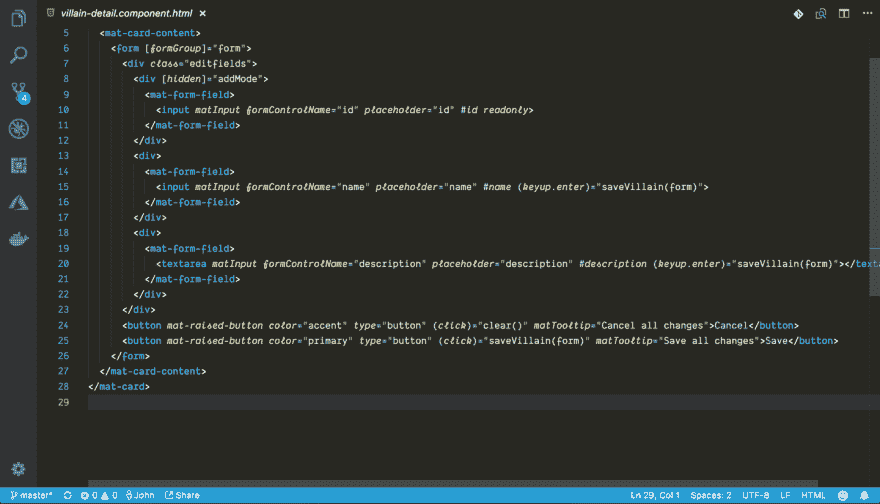
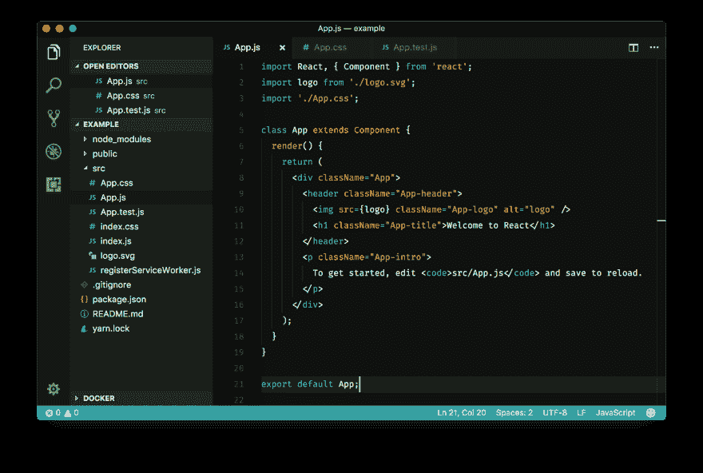
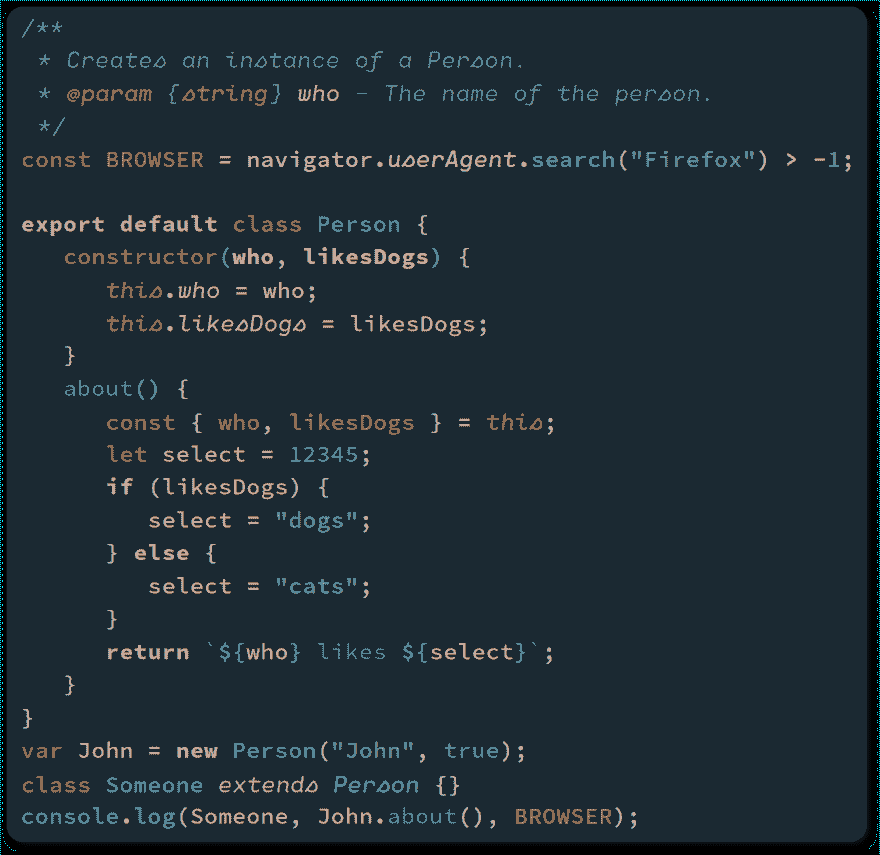
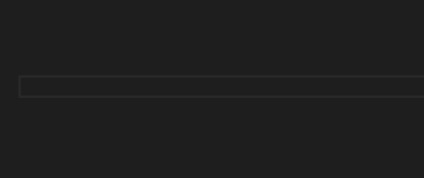

# Visual Studio 代码的五大主题

> 原文：<https://dev.to/kasuken/top-5-themes-for-visual-studio-code-2994>

我的编辑器选择是 Visual Studio 代码，因为它是第一个测试版。我喜欢个性化编辑器中的一切，Visual Studio 代码在这方面非常完美。

这里我将展示我最喜欢的 5 个 Visual Studio 代码主题。

# [夜猫子](https://marketplace.visualstudio.com/items?itemName=sdras.night-owl)

一个最好的主题为 Visual Studio 代码(和其他编辑器！！！).这是我目前的工作主题。

# [冬天来了](https://marketplace.visualstudio.com/items?itemName=johnpapa.winteriscoming)

由微软的约翰爸爸开发，我喜欢它。

# [深浅不一的紫色](https://marketplace.visualstudio.com/items?itemName=ahmadawais.shades-of-purple)

有据可查的专业主题。厉害！

# [雨霞](https://marketplace.visualstudio.com/items?itemName=daylerees.rainglow)

很多颜色主题！！！试试看！

# [夜啼](https://marketplace.visualstudio.com/items?itemName=liviuschera.noctis)

我第二喜欢的主题，仅次于夜猫子。在漫长的一天工作之后，这是放松眼睛的最佳方式。

## 加

### [电源模式](https://marketplace.visualstudio.com/items?itemName=hoovercj.vscode-power-mode)

这不是一个真正的主题，但我喜欢在与客户进行演示时的这种效果。:)