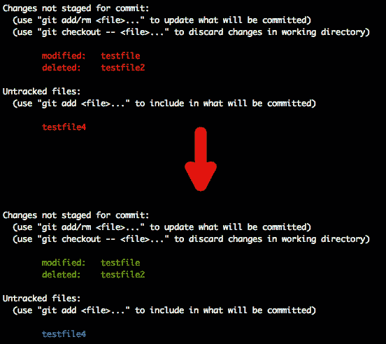
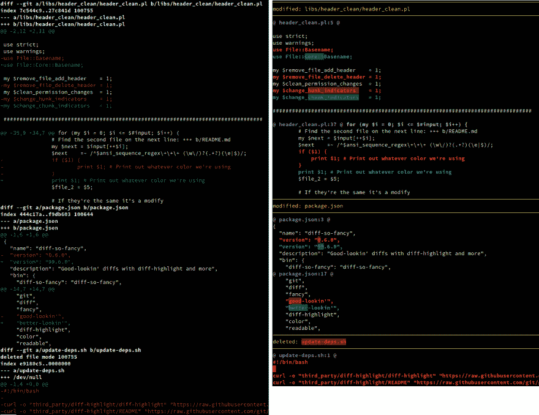

# 正在配置 git

> 原文：<https://dev.to/switowski/configuring-git-2409>

Git 是一个非常神奇的工具。它不会强迫你以特定的方式使用它。如果您想从一个简单的工作流开始，在那里您编写一些代码并将其添加到主分支——这很好。您学习了一些命令:`commit`、`checkout`、`push`、`pull`、`status`和`diff`，您已经准备好了。稍后，您可能决定开始与某人在代码上合作，因此您引入了分支和拉请求的概念。然后有一天你在 GitHub 上发布了你的软件的第一个官方版本，所以你了解了标签。使用 git 越多，你发现的高级话题就越多:`blaming`、`bisecting`、`rewriting history`(又名*、*)、`reflog`、`submodules`、`hooks`等等。

当您开始深入研究 git 时，首先会遇到的是`.gitconfig`文件——git 的配置文件。在创建第一个提交之前，git 会要求您配置您的姓名和电子邮件。它甚至会告诉你怎么做:

```
 git config --global user.email "you@example.com"
  git config --global user.name "Your Name" 
```

Enter fullscreen mode Exit fullscreen mode

一旦您运行这两个命令，它们将会出现在您主目录的`.gitconfig`文件中。

和每一个工具一样，花一些时间来弄清楚如何配置它是值得的。您将了解一些您可能不知道存在的特性，并且您将能够配置该工具以您最喜欢的方式工作。

所以，让我们来看看您可能会在`.gitconfig`文件中找到什么。如果你喜欢某些东西，可以随意复制代码(你可以在这里找到我的`.gitconfig`文件)。

## 【别名】

别名大概是`.gitconfig`最大的部分。在您掌握 git 的过程中，您将会添加越来越多的工具。Git 别名就像它们听起来的那样——它们允许您通过不同的名称调用特定的函数。将许多 git 命令的别名改为一个 1-2 个字母的快捷键是很常见的做法，例如:

```
[alias]
    amend = commit --amend
    amendf = commit --amend --no-edit
    br = branch
    ci = commit
    co = checkout
    cp = cherry-pick
    d = diff
    ds = diff --staged
    l = log
    lg = log --graph --all --format=format:'%C(bold blue)%h%C(reset) - %C(bold green)(%ar)%C(reset) %C(white)%s%C(reset) %C(bold white)— %an%C(reset)%C(bold yellow)%d%C(reset)' --abbrev-commit --date=relative
    lp = log --pretty=oneline
    sa = stash apply
    sh = show
    ss = stash save
    st = status 
```

Enter fullscreen mode Exit fullscreen mode

我喜欢按字母顺序排列我的别名。否则，我注意到我在整个文件中创建了副本。同样，不，我没有自己写`lg`的公式；).我从某个地方复制粘贴了它，但是您应该检查一下——它为您提供了一个很好的、简洁的图表，显示了存储库是如何随着时间的推移而发展的。

## 【颜色】

```
[color]
    ui = auto

[color "branch"]
    current = yellow reverse
    local = yellow
    remote = green

[color "status"]
    added = yellow
    changed = green
    untracked = cyan

[color "diff"]
    meta = yellow
    frag = magenta bold
    commit = yellow bold
    old = red bold
    new = green bold
    whitespace = red reverse

[color "diff-highlight"]
    oldNormal = red bold
    oldHighlight = red bold 52
    newNormal = green bold
    newHighlight = green bold 22 
```

Enter fullscreen mode Exit fullscreen mode

`ui = auto`是 UI 的默认设置——当输出直接到达终端时，它会对输出进行着色，但是当输出被重定向到管道或文件时，它会忽略颜色控制代码。

`branch`和`status`部分通过以下方式改变`git branch`和`git status`命令的输出颜色:

[](https://res.cloudinary.com/practicaldev/image/fetch/s--CCqpVBGv--/c_limit%2Cf_auto%2Cfl_progressive%2Cq_auto%2Cw_880/https://switowski.com/assets/img/posts/post_2019-01-11-git-config_git_branch.jpg)

[](https://res.cloudinary.com/practicaldev/image/fetch/s--mxp54xdt--/c_limit%2Cf_auto%2Cfl_progressive%2Cq_auto%2Cw_880/https://switowski.com/assets/img/posts/post_2019-01-11-git-config_git_status.jpg)

`diff`和`diff-highlight`设置将在`git diff`命令中使用的颜色。对于*差异*，我使用的是[差异如此奇特](https://github.com/so-fancy/diff-so-fancy)工具。它非常容易设置，并为`git diff`输出提供了一个新的外观，所以请务必检查它。下面是它的屏幕截图:

[](https://res.cloudinary.com/practicaldev/image/fetch/s---MSOxmw3--/c_limit%2Cf_auto%2Cfl_progressive%2Cq_auto%2Cw_880/https://switowski.com/assets/img/posts/post_2019-01-11-git-config_diff-so-fancy.png)

## 【核心】

```
[core]
    editor = vim
    excludesfile = ~/.gitignore
    pager = diff-so-fancy | less --tabs=4 -RFX
    # Configure Git on OS X to properly handle line endings
    autocrlf = input 
```

Enter fullscreen mode Exit fullscreen mode

核心部分包含与 git 相关的各种不同的设置。以下是我正在使用的一些:

*   `editor = vim`设置您想要使用哪个编辑器来编辑提交消息(如果未设置该值，git 将首先尝试从环境变量`VISUAL`或`EDITOR`中读取您正在使用的编辑器，如果失败，将返回到`vi`)。我不使用 Vim 进行编码，但对于这样的快速编辑，我更喜欢它而不是 Sublime 或 VS 代码。
*   `excludesfile = ~/.gitignore`允许您指定全局`.gitignore`文件。每个 git 存储库可以包含一个`.gitignore`文件，该文件指定您想要从版本控制中排除哪些文件。不过，通常情况下，这些文件中的一些对于每个 git 存储库都是相同的(例如，macOS 上的`.DS_Store`，或者当你是 Python 开发人员时的`*.pyc`，所以与其一遍又一遍地编写它们，不如创建一个全局`.gitignore`文件。
*   `pager = diff-so-fancy | less --tabs=4 -RFX`指定您想要使用哪个工具来显示`git log`、`git diff`和`git show`命令的输出。默认情况下，git 将使用`less`。我正在使用[与众不同的](https://github.com/so-fancy/diff-so-fancy)。
*   由于 Windows 使用的行尾与 Unix 和 MacOS 不同，如果来自不同操作系统的人提交到同一个存储库，可能会造成一点混乱。因为我在 MacOS 上工作，所以我把这个选项设置为`input`。这里有一个很棒的[解释如何根据你使用的操作系统设置](https://help.github.com/articles/dealing-with-line-endings/#platform-mac) (TLDR: `autocrlf = input`在 MacOS 和 Linux 上，`autocrlf = true`在 Windows 上)。

## 【凭证】

```
[credential]
    helper = cache --timeout=28800 # 8 hours 
```

Enter fullscreen mode Exit fullscreen mode

您将使用的一些远程存储库受密码保护。配置的`credential`部分将指定您希望如何将凭证存储到这些存储库中。默认情况下，git 根本不存储凭证，所以每次尝试连接时都会提示您输入用户名和密码。如果您想存储凭证以备将来使用，您可以使用`store`选项将它们保存在一个文件中(它将使用您的凭证创建一个纯文本文件),或者使用`cache`选项将它们存储在内存中。根据您使用的操作系统，还有其他选项(MacOS 的`osxkeychain`或 Windows 的 *Git 凭证管理器*)。我决定使用*存储在内存中*选项。凭证的默认超时是 15 分钟，但我决定将其增加到 8 小时，所以我在一天开始时输入一次，当它们过期时，通常是我应该回家的标志；).

## 【推送】

```
[push]
    default = current 
```

Enter fullscreen mode Exit fullscreen mode

有时，我会忘记在`git push`命令中包含分支的名称，这可能会导致意想不到的行为(例如，我正在处理一个 *dev* 分支，但是不小心，我正在推动 *master* 分支)。如果你像我一样经常使用`git push --force`,这可能会特别成问题。为了防止这种错误，我设置了推送命令的`default = current`选项。现在，如果我忘记包含分支的名称，git 将尝试推送至同名的分支。如果在远程存储库中找不到同名的分支，它将创建一个。

## 结论

这是一个很长的列表，但是如果你至少在你的`.gitconfig`文件中应用了其中的一些设置，你会惊讶于 git 看起来有多好，使用它时你会变得多有效率。如果你想了解更多信息，我有两个建议:

*   列出所有可用设置的 git-config 文档页面。
*   [搜索 git config . dot files](https://www.google.com/search?q=gitconfig+dotfiles)，你会发现大量其他开发者正在使用的现有`.gitconfig`文件。列表上的第一项是拥有超过 20，000 颗恒星的知识库，所以我相信你会找到很多有用的想法。